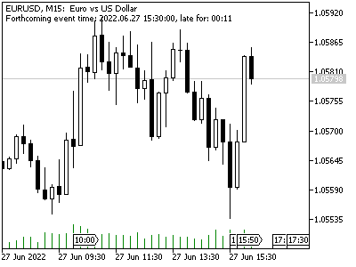

# Reading event records by ID

Knowing the events schedule for the near future, traders can adjust their robots accordingly. There are no functions or events in the calendar API ("events" in the sense of functions for processing new financial information like OnCalendar, by analogy with OnTick) to automatically track news releases. The algorithm must do this itself at any chosen frequency. In particular, you can find out the identifier of the desired event using one of the previously discussed functions (for example, CalendarValueHistoryByEvent, CalendarValueHistory) and then call CalendarValueById to get the current state of the fields in the MqlCalendarValue structure.

bool CalendarValueById(ulong id, MqlCalendarValue &value)

The function fills the structure passed by reference with current information about a specific event.

The result of the function denotes a sign of success (true) or error (false).

Let's create a simple bufferless indicator CalendarRecordById.mq5, which will find in the future the nearest event with the type of "financial indicator" (i.e., a numerical indicator) and will poll its status on timer. When the news is published, the data will change (the "actual" value of the indicator will become known), and the indicator will display an alert.

The frequency of polling the calendar is set in the input variable.

```
input uint TimerSeconds = 5;

```

We run the timer in OnInit.

```
void OnInit()
{
   EventSetTimer(TimerSeconds);
}

```

For the convenient output to the event description log, we use the MqlCalendarRecord structure which we already know from the example with the script [CalendarForDates.mq5](/en/book/advanced/calendar/calendar_records_by_country_currency).

To store the initial state of news information, we describe the track structure.

```
MqlCalendarValue track;

```

When the structure is empty (and there is "0" in the field id), the program must query the upcoming events and find among them the closest one with the CALENDAR_TYPE_INDICATOR type and for which the current value is not yet known.

```
void OnTimer()
{
   if(!track.id)
   {
      MqlCalendarValue values[];
      if(PRTF(CalendarValueHistory(values, TimeCurrent(), TimeCurrent() + DAY_LONG * 3)))
      {
         for(int i = 0; i < ArraySize(values); ++i)
         {
            MqlCalendarEvent event;
            CalendarEventById(values[i].event_id, event);
            if(event.type == CALENDAR_TYPE_INDICATOR && !values[i].HasActualValue())
            {
               track = values[i];
               PrintFormat("Started monitoring %lld", track.id);
               StructPrint(MqlCalendarRecord(track), ARRAYPRINT_HEADER);
               return;
            }
         }
      }
   }
   ...

```

The found event is copied to track and output to the log. After that, every call to OnTimer comes down to getting updated information about the event into the update structure, which is transferred to CalendarValueById with the track.id identifier. Next, the original and new structures are compared using the auxiliary function StructCompare (based on StructToCharArray and ArrayCompare, see the complete source code). Any difference causes a new state to be printed (the forecast may have changed), and if the current value appears, the timer stops. To start waiting for the next news, this indicator needs to be reinitialized: this one is for demonstration, and to control the situation according to the list of news, we will later develop a more practical filter class.

```
   else
   {
      MqlCalendarValue update;
      if(CalendarValueById(track.id, update))
      {
         if(fabs(StructCompare(track, update)) == 1)
         {
            Alert(StringFormat("News %lld changed", track.id));
            PrintFormat("New state of %lld", track.id);
            StructPrint(MqlCalendarRecord(update), ARRAYPRINT_HEADER);
            if(update.HasActualValue())
            {
               Print("Timer stopped");
               EventKillTimer();
            }
            else
            {
               track = update;
            }
         }
      }
      
      if(TimeCurrent() <= track.time)
      {
         Comment("Forthcoming event time: ", track.time,
            ", remaining: ", Timing::stringify((uint)(track.time - TimeCurrent())));
      }
      else
      {
         Comment("Forthcoming event time: ", track.time,
            ", late for: ", Timing::stringify((uint)(TimeCurrent() - track.time)));
      }
   }
}

```

While waiting for the event, the indicator displays a comment with the expected time of the news release and how much time is left before it (or what is the delay).



Comment about waiting or being late for the next news

It is important to note that the news may come out a little earlier or a little later than the scheduled date. This creates some problems when testing news strategies on history, since the time of updating calendar entries in the terminal and through the MQL5 API is not provided. We will try to partially solve this problem in the next section.

Here are fragments of the log output produced by the indicator with a gap:

```
CalendarValueHistory(values,TimeCurrent(),TimeCurrent()+(60*60*24)*3)=186 / ok
Started monitoring 156045
  [id] [event_id]              [time]            [period] [revision] »
156045  840020013 2022.06.27 15:30:00 2022.05.01 00:00:00          0 »
»       [actual_value] [prev_value] [revised_prev_value] [forecast_value] [impact_type] »
» -9223372036854775808       400000 -9223372036854775808                0             0 »
» [importance]                     [name] [currency] [code] [actual] [previous] [revised] [forecast]
» "Medium"     "Durable Goods Orders m/m" "USD"      "US"        nan    0.40000       nan    0.00000
...
Alert: News 156045 changed
New state of 156045
  [id] [event_id]              [time]            [period] [revision] »
156045  840020013 2022.06.27 15:30:00 2022.05.01 00:00:00          0 »
» [actual_value] [prev_value] [revised_prev_value] [forecast_value] [impact_type] »
»         700000       400000 -9223372036854775808                0             1 »
» [importance]                     [name] [currency] [code] [actual] [previous] [revised] [forecast]
» "Medium"     "Durable Goods Orders m/m" "USD"      "US"    0.70000    0.40000       nan    0.00000
Timer stopped
 

```

The updated news has the actual_value value.

In order not to wait too long during the test, it is advisable to run this indicator during the working hours of the main markets, when the density of news releases is high.

The CalendarValueById function is not the only one, and probably not the most flexible, with which you can monitor changes in the calendar. We will look at a couple of other approaches in the following sections.
