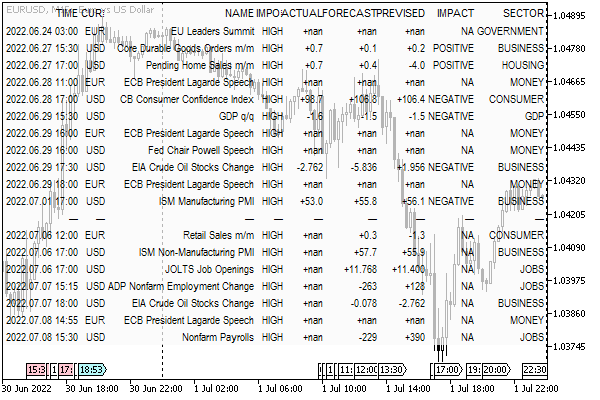

# Filtering events by multiple conditions

As we know from the previous sections of this chapter, the MQL5 API allows you to request calendar events based on several conditions:

- by countries (CalendarValueHistory, CalendarValueLast)
- by frequencies (CalendarValueHistory, CalendarValueLast)
- by event type IDs (CalendarValueHistoryByEvent, CalendarValueLastByEvent)
- by time range (CalendarValueHistory, CalendarValueHistoryByEvent)
- by changes since the previous calendar poll (CalendarValueLast, CalendarValueLastByEvent)
- by ID of specific news (CalendarValueById)

This can be summarized as the following table of functions (of all CalendarValue functions, only CalendarValueById for getting one specific value is missing here).

| Conditions | Time range | Last changes |
| --- | --- | --- |
| Countries | CalendarValueHistory | CalendarValueLast |
| Currencies | CalendarValueHistory | CalendarValueLast |
| Events | CalendarValueHistoryByEvent | CalendarValueLastByEvent |

Such a toolkit covers main, but not all, popular calendar analysis scenarios. Therefore, in practice, it is often necessary to implement custom filtering mechanisms in MQL5, including, in particular, event requests by:

- several countries
- several currencies
- several types of events
- values of arbitrary properties of events (importance, sector of the economy, reporting period, type, presence of a forecast, estimated impact on the rate, substring in the name of the event, etc.)

To solve these problems, we have created the CalendarFilter class (CalendarFilter.mqh).

Due to the specifics of the built-in API functions, some of the news attributes are given higher priority than the rest. This includes country, currency, and date range. They can be specified in the class constructor, and then the corresponding property cannot be dynamically changed in the filter conditions.

This is because the filter class will subsequently be extended with the news caching capabilities to enable reading from the tester, and the initial conditions of the constructor actually define the caching context within which further filtering is possible. For example, if we specify the country code "EU" when creating an object, then obviously it makes no sense to request news about the USA or Brazil through it. It is similar to the date range: specifying it in the constructor will make it impossible to receive news outside the range.

We can also create an object without initial conditions (because all constructor parameters are optional), and then it will be able to cache and filter news across the entire calendar database (as of the moment of saving).

In addition, since countries and currencies are now almost uniquely displayed (with the exception of the European Union and EUR), they are passed to the constructor through a single parameter context: if you specify a string with the length of 2 characters, the country code (or a combination of countries) is implied, and if the length is 3 characters, the currency code is implied. For the codes "EU" and "EUR", the euro area is a subset of "EU" (within countries with formal treaties). In special cases, where non-euro area EU countries are of interest, they can also be described by "EU" context. If necessary, narrower conditions for news on the currencies of these countries (BGN, HUF, DKK, ISK, PLN, RON, HRK, CZK, SEK) can be added to the filter dynamically using methods that we will present later. However, due to exotics, there are no guarantees that such news will get into the calendar.

Let's start studying the class.

```
class CalendarFilter
{
protected:
   // initial (optional) conditions set in the constructor, invariants
   string context;    // country and currency
   datetime from, to; // date range
   bool fixedDates;   // if 'from'/'to' are passed in the constructor, they cannot be changed
   
   // dedicated selectors (countries/currencies/event type identifiers)
   string country[], currency[];
   ulong ids[];
   
   MqlCalendarValue values[]; // filtered results
   
   virtual void init()
   {
      fixedDates = from != 0 || to != 0;
      if(StringLen(context) == 3)
      {
         PUSH(currency, context);
      }
      else
      {
         // even if context is NULL, we take it to poll the entire calendar base
         PUSH(country, context);
      }
   }
   ...
public:
   CalendarFilter(const string _context = NULL,
      const datetime _from = 0, const datetime _to = 0):
      context(_context), from(_from), to(_to)
   {
      init();
   }
   ...

```

Two arrays are allocated for countries and currencies: country and currency. If they are not filled from context during object creation, then the MQL program will be able to add conditions for several countries or currencies in order to perform a combined news query on them.

To store conditions on all other news attributes, the selectors array is described in the CalendarFilter object, with the second dimension equal to 3. We can say that this is a kind of table in which each row has 3 columns.

```
   long selectors[][3];   // [0] - property, [1] - value, [2] - condition

```

At the 0th index, the news property identifiers will be located. Since the attributes are spread across three base tables (MqlCalendarCountry, MqlCalendarEvent, MqlCalendarValue) they are described using the elements of the generalized enumeration ENUM_CALENDAR_PROPERTY (CalendarDefines.mqh).

```
enum ENUM_CALENDAR_PROPERTY
{                                      // +/- means support for field filtering
   CALENDAR_PROPERTY_COUNTRY_ID,       // -ulong
   CALENDAR_PROPERTY_COUNTRY_NAME,     // -string
   CALENDAR_PROPERTY_COUNTRY_CODE,     // +string (2 characters)
   CALENDAR_PROPERTY_COUNTRY_CURRENCY, // +string (3 characters)
   CALENDAR_PROPERTY_COUNTRY_GLYPH,    // -string (1 characters)
   CALENDAR_PROPERTY_COUNTRY_URL,      // -string
   
   CALENDAR_PROPERTY_EVENT_ID,         // +ulong (event type ID)
   CALENDAR_PROPERTY_EVENT_TYPE,       // +ENUM_CALENDAR_EVENT_TYPE
   CALENDAR_PROPERTY_EVENT_SECTOR,     // +ENUM_CALENDAR_EVENT_SECTOR
   CALENDAR_PROPERTY_EVENT_FREQUENCY,  // +ENUM_CALENDAR_EVENT_FREQUENCY
   CALENDAR_PROPERTY_EVENT_TIMEMODE,   // +ENUM_CALENDAR_EVENT_TIMEMODE
   CALENDAR_PROPERTY_EVENT_UNIT,       // +ENUM_CALENDAR_EVENT_UNIT
   CALENDAR_PROPERTY_EVENT_IMPORTANCE, // +ENUM_CALENDAR_EVENT_IMPORTANCE
   CALENDAR_PROPERTY_EVENT_MULTIPLIER, // +ENUM_CALENDAR_EVENT_MULTIPLIER
   CALENDAR_PROPERTY_EVENT_DIGITS,     // -uint
   CALENDAR_PROPERTY_EVENT_SOURCE,     // +string ("http[s]://")
   CALENDAR_PROPERTY_EVENT_CODE,       // -string
   CALENDAR_PROPERTY_EVENT_NAME,       // +string (4+ characters or wildcard '*')
   
   CALENDAR_PROPERTY_RECORD_ID,        // -ulong
   CALENDAR_PROPERTY_RECORD_TIME,      // +datetime
   CALENDAR_PROPERTY_RECORD_PERIOD,    // +datetime (like long)
   CALENDAR_PROPERTY_RECORD_REVISION,  // +int
   CALENDAR_PROPERTY_RECORD_ACTUAL,    // +long
   CALENDAR_PROPERTY_RECORD_PREVIOUS,  // +long
   CALENDAR_PROPERTY_RECORD_REVISED,   // +long
   CALENDAR_PROPERTY_RECORD_FORECAST,  // +long
   CALENDAR_PROPERTY_RECORD_IMPACT,    // +ENUM_CALENDAR_EVENT_IMPACT
   
   CALENDAR_PROPERTY_RECORD_PREVISED,  // +non-standard (previous or revised if any)
   
   CALENDAR_PROPERTY_CHANGE_ID,        // -ulong (reserved)
};

```

Index 1 will store values for comparison with them in the conditions for selecting news records. For example, if you want to set a filter by sector of the economy, then we write CALENDAR_PROPERTY_EVENT_SECTOR in selectors[i][0] and one of the values of the standard enumeration ENUM_CALENDAR_EVENT_SECTOR in selectors[i][1].

Finally, the last column (under the 2nd index) is reserved for the operation of comparing the selector value with the attribute value in the news: all supported operations are summarized in the IS enumeration.

```
enum IS
{
   EQUAL,
   NOT_EQUAL,
   GREATER,
   LESS,
   OR_EQUAL,
   ...
};

```

We saw a similar approach in [TradeFilter.mqh](/en/book/automation/experts/experts_order_filter). Thus, we will be able to arrange conditions not only for equality of values but also for inequality or more/less relations. For example, it is easy to imagine a filter on the CALENDAR_PROPERTY_EVENT_IMPORTANCE field, which should be GREATER than CALENDAR_IMPORTANCE_LOW (this is an element of the standard ENUM_CALENDAR_EVENT_IMPORTANCE enumeration), which means a selection of news of medium and high importance.

The next enumeration defined specifically for the calendar is ENUM_CALENDAR_SCOPE. Since calendar filtering is often associated with time spans, the most requested ones are listed here.

```
#define DAY_LONG     (60 * 60 * 24)
#define WEEK_LONG    (DAY_LONG * 7)
#define MONTH_LONG   (DAY_LONG * 30)
#define QUARTER_LONG (MONTH_LONG * 3)
#define YEAR_LONG    (MONTH_LONG * 12)
   
enum ENUM_CALENDAR_SCOPE
{
   SCOPE_DAY = DAY_LONG,         // Day
   SCOPE_WEEK = WEEK_LONG,       // Week
   SCOPE_MONTH = MONTH_LONG,     // Month
   SCOPE_QUARTER = QUARTER_LONG, // Quarter
   SCOPE_YEAR = YEAR_LONG,       // Year
};

```

All enumerations are placed in a separate header file CalendarDefines.mqh.

But let's go back to the class CalendarFilter. The type of the selectors array is long, which is suitable for storing values of almost all involved types: enumerations, dates and times, identifiers, integers, and even economic indicators values because they are stored in the calendar in the form of long numbers (in millionths of real values). However, what to do with string properties?

This problem is solved by using the array of strings stringCache, to which all the lines mentioned in the filter conditions will be added.

```
class CalendarFilter
{
protected:
   ...
   string stringCache[];  // cache of all rows in 'selectors'
   ...

```

Then, instead of the string value in selectors[i][1], we can easily save the index of an element in the stringCache array.

To populate the selectors array with filter conditions, there are several let methods provided, in particular, for enumerations:

```
class CalendarFilter
{
...
public:
   // all fields of enum types are processed here
   template<typename E>
   CalendarFilter *let(const E e, const IS c = EQUAL)
   {
      const int n = EXPAND(selectors);
      selectors[n][0] = resolve(e); // by type E, returning the element ENUM_CALENDAR_PROPERTY
      selectors[n][1] = e;
      selectors[n][2] = c;
      return &this;
   }
   ...

```

For actual values of indicators:

```
   // the following fields are processed here:
   // CALENDAR_PROPERTY_RECORD_ACTUAL, CALENDAR_PROPERTY_RECORD_PREVIOUS,
   // CALENDAR_PROPERTY_RECORD_REVISED, CALENDAR_PROPERTY_RECORD_FORECAST,
   // and CALENDAR_PROPERTY_RECORD_PERIOD (as long)
   CalendarFilter *let(const long value, const ENUM_CALENDAR_PROPERTY property, const IS c = EQUAL)
   {
      const int n = EXPAND(selectors);
      selectors[n][0] = property;
      selectors[n][1] = value;
      selectors[n][2] = c;
      return &this;
   }
   ...

```

And for strings:

```
   // conditions for all string properties can be found here (abbreviated)
   CalendarFilter *let(const string find, const IS c = EQUAL)
   {
      const int wildcard = (StringFind(find, "*") + 1) * 10;
      switch(StringLen(find) + wildcard)
      {
      case 2:
         // if the initial context is different from the country, we can supplement it with the country,
         // otherwise the filter is ignored
         if(StringLen(context) != 2)
         {
            if(ArraySize(country) == 1 && StringLen(country[0]) == 0)
            {
               country[0] = find; // narrow down "all countries" to one (may add more)
            }
            else
            {
               PUSH(country, find);
            }
         }
         break;
      case 3:
         // we can set a filter for a currency only if it was not in the initial context
         if(StringLen(context) != 3)
         {
            PUSH(currency, find);
         }
         break;
      default:
         {
            const int n = EXPAND(selectors);
            PUSH(stringCache, find);
            if(StringFind(find, "http://") == 0 || StringFind(find, "https://") == 0)
            {
               selectors[n][0] = CALENDAR_PROPERTY_EVENT_SOURCE;
            }
            else
            {
               selectors[n][0] = CALENDAR_PROPERTY_EVENT_NAME;
            }
            selectors[n][1] = ArraySize(stringCache) - 1;
            selectors[n][2] = c;
            break;
         }
      }
      
      return &this;
   }

```

In the method overload for strings, note that 2 or 3-character long strings (if they are without the template asterisk '*', which is a replacement for an arbitrary sequence of characters) fall into the arrays of countries and symbols, respectively, and all other strings are treated as fragments of the name or news source, and both of these fields involve stringCache and selectors.

In a special way, the class also supports filtering by type (identifier) of events.

```
protected:
   ulong ids[];           // filtered event types
   ...
public:
   CalendarFilter *let(const ulong event)
   {
      PUSH(ids, event);
      return &this;
   }
   ...

```

Thus, the number of priority filters (which are processed outside the selectors array) includes not only countries, currencies, and date ranges, but also event type identifiers. Such a constructive decision is due to the fact that these parameters can be passed to certain calendar API functions as input. We get all other news attributes as output field values in arrays of structures (MqlCalendarValue, MqlCalendarEvent, MqlCalendarCountry). It is by them that we will perform additional filtering, according to the rules in the selectors array.

All let methods return a pointer to an object, which allows their calls to be chained. For example, like this:

```
CalendarFilter f;
f.let(CALENDAR_IMPORTANCE_LOW, GREATER) // important and moderately important news
  .let(CALENDAR_TIMEMODE_DATETIME) // only events with exact time
  .let("DE").let("FR") // a couple of countries, or, to choose from...
  .let("USD").let("GBP") // ...a couple of currencies (but both conditions won't work at once)
  .let(TimeCurrent() - MONTH_LONG, TimeCurrent() + WEEK_LONG) // date range "around" the current time
  .let(LONG_MIN, CALENDAR_PROPERTY_RECORD_FORECAST, NOT_EQUAL) // there is a forecast
  .let("farm"); // full text search by news titles

```

Country and currency conditions can, in theory, be combined. However, please note that multiple values can only be set for either countries or currencies but not both. One of these two aspects of the context (either of the two) in the current implementation supports only one or none of the values (i.e., no filter on it). For example, if the currency EUR is selected, it is possible to narrow the search context for news only in Germany and France (country codes "DE" and "FR"). As a result, ECB and Eurostat news will be discarded, as well as, specifically, Italy and Spain news. However, the indication of EUR in this case is redundant since there are no other currencies in Germany and France.

Since the class uses built-in functions in which the parameters country and currency are applied to the news using the logical AND operation, check the consistency of the filter conditions.

After the calling code sets up the filtering conditions, it is necessary to select news based on them. This is what the public method select does (given with simplifications).

```
public:
   bool select(MqlCalendarValue &result[])
   {
      int count = 0;
      ArrayFree(result);
      if(ArraySize(ids)) // identifiers of event types
      {
         for(int i = 0; i < ArraySize(ids); ++i)
         {
            MqlCalendarValue temp[];
            if(PRTF(CalendarValueHistoryByEvent(ids[i], temp, from, to)))
            {
               ArrayCopy(result, temp, ArraySize(result));
               ++count;
            }
         }
      }
      else
      {
         // several countries or currencies, choose whichever is more as a basis,
         // only the first element from the smaller array is used
         if(ArraySize(country) > ArraySize(currency))
         {
            const string c = ArraySize(currency) > 0 ? currency[0] : NULL;
            for(int i = 0; i < ArraySize(country); ++i)
            {
               MqlCalendarValue temp[];
               if(PRTF(CalendarValueHistory(temp, from, to, country[i], c)))
               {
                  ArrayCopy(result, temp, ArraySize(result));
                  ++count;
               }
            }
         }
         else
         {
            const string c = ArraySize(country) > 0 ? country[0] : NULL;
            for(int i = 0; i < ArraySize(currency); ++i)
            {
               MqlCalendarValue temp[];
               if(PRTF(CalendarValueHistory(temp, from, to, c, currency[i])))
               {
                  ArrayCopy(result, temp, ArraySize(result));
                  ++count;
               }
            }
         }
      }
      
      if(ArraySize(result) > 0)
      {
         filter(result);
      }
      
      if(count > 1 && ArraySize(result) > 1)
      {
         SORT_STRUCT(MqlCalendarValue, result, time);
      }
      
      return ArraySize(result) > 0;
   }

```

Depending on which of the priority attribute arrays are filled, the method calls different API functions to poll the calendar:

- If the ids array is filled, CalendarValueHistoryByEvent is called in a loop for all identifiers
- If the country array is filled and it's larger than the array of currencies, call CalendarValueHistory and loop through the countries
- If the currency array is filled and it is greater than or equal to the size of the array of countries, call CalendarValueHistory and loop through the currencies

Each function call populates a temporary array of structures MqlCalendarValue temp[], which is sequentially accumulated in the result parameter array. After writing all relevant news into it according to the main conditions (dates, countries, currencies, identifiers), if any, an auxiliary method filter comes into play, which filters the array based on the conditions in selectors. At the end of the select method, the news items are sorted in chronological order, which can be broken by combining the results of multiple queries of "calendar" functions. Sorting is implemented using the SORT_STRUCT macro, which was discussed in the section [Comparing, sorting, and searching in arrays](/en/book/common/arrays/arrays_compare_sort_search).

For each element of the news array, the filter method calls the worker method match, which returns a boolean indicator of whether the news matches the filter conditions. If not, the element is removed from the array.

```
protected:
   void filter(MqlCalendarValue &result[])
   {
      for(int i = ArraySize(result) - 1; i >= 0; --i)
      {
         if(!match(result[i]))
         {
            ArrayRemove(result, i, 1);
         }
      }
   }
   ...

```

Finally, the match method analyzes our selectors array and compares it with the fields of the passed structure MqlCalendarValue. Here the code is provided in an abbreviated form.

```
 bool match(const MqlCalendarValue &v)
   {
      MqlCalendarEvent event;
      if(!CalendarEventById(v.event_id, event)) return false;
      
      // loop through all filter conditions, except for countries, currencies, dates, IDs,
      // which have already been previously used when calling Calendar functions
      for(int j = 0; j < ArrayRange(selectors, 0); ++j)
      {
         long field = 0;
         string text = NULL;
         
         // get the field value from the news or its description
         switch((int)selectors[j][0])
         {
         case CALENDAR_PROPERTY_EVENT_TYPE:
            field = event.type;
            break;
         case CALENDAR_PROPERTY_EVENT_SECTOR:
            field = event.sector;
            break;
         case CALENDAR_PROPERTY_EVENT_TIMEMODE:
            field = event.time_mode;
            break;
         case CALENDAR_PROPERTY_EVENT_IMPORTANCE:
            field = event.importance;
            break;
         case CALENDAR_PROPERTY_EVENT_SOURCE:
            text = event.source_url;
            break;
         case CALENDAR_PROPERTY_EVENT_NAME:
            text = event.name;
            break;
         case CALENDAR_PROPERTY_RECORD_IMPACT:
            field = v.impact_type;
            break;
         case CALENDAR_PROPERTY_RECORD_ACTUAL:
            field = v.actual_value;
            break;
         case CALENDAR_PROPERTY_RECORD_PREVIOUS:
            field = v.prev_value;
            break;
         case CALENDAR_PROPERTY_RECORD_REVISED:
            field = v.revised_prev_value;
            break;
         case CALENDAR_PROPERTY_RECORD_PREVISED: // previous or revised (if any)
            field = v.revised_prev_value != LONG_MIN ? v.revised_prev_value : v.prev_value;
            break;
         case CALENDAR_PROPERTY_RECORD_FORECAST:
            field = v.forecast_value;
            break;
         ...
         }
         
         // compare value with filter condition
         if(text == NULL) // numeric fields
         {
            switch((IS)selectors[j][2])
            {
            case EQUAL:
               if(!equal(field, selectors[j][1])) return false;
               break;
            case NOT_EQUAL:
               if(equal(field, selectors[j][1])) return false;
               break;
            case GREATER:
               if(!greater(field, selectors[j][1])) return false;
               break;
            case LESS:
               if(greater(field, selectors[j][1])) return false;
               break;
            }
         }
         else // string fields
         {
            const string find = stringCache[(int)selectors[j][1]];
            switch((IS)selectors[j][2])
            {
            case EQUAL:
               if(!equal(text, find)) return false;
               break;
            case NOT_EQUAL:
               if(equal(text, find)) return false;
               break;
            case GREATER:
               if(!greater(text, find)) return false;
               break;
            case LESS:
               if(greater(text, find)) return false;
               break;
            }
         }
      }
      
      return true;
   }

```

The equal and greater methods almost completely copy those used in our previous developments with filter classes.

On this, the filtering problem is generally solved, i.e., the MQL program can use the object CalendarFilter in the following way:

```
CalendarFilter f;
f.let()... // a series of calls to the let method to set filtering conditions
MqlCalendarValue records[]; 
if(f.select(records))
{
   ArrayPrint(records);
}

```

In fact, the select method can do something else important that we left for an independent elective study.

First, in the resulting list of news, it is desirable to somehow insert a separator (delimiter) between the past and the future, so that the eye can catch on to it. In theory, this feature is extremely important for calendars, but for some reason, it is not available in the MetaTrader 5 user interface and on the mql5.com website. Our implementation is able to insert an empty structure between the past and the future, which we should visually display (which we will deal with below).

Second, the size of the resulting array can be quite large (especially at the first stages of selecting settings), and therefore the select method additionally provides the ability to limit the size of the array (limit). This is done by removing the elements furthest from the current time.

So, the full method prototype looks like this:

```
bool select(MqlCalendarValue &result[],
   const bool delimiter = false, const int limit = -1);

```

By default, no delimiter is inserted and the array is not truncated.

A couple of paragraphs above, we mentioned an additional subtask of filtering which is the visualization of the resulting array. The CalendarFilter class has a special method format, which turns the passed array of structures MqlCalendarValue &data[] into an array of human-readable strings string &result[]. The code of the method can be found in the attached file CalendarFilter.mqh.

```
bool format(const MqlCalendarValue &data[],
   const ENUM_CALENDAR_PROPERTY &props[], string &result[],
   const bool padding = false, const bool header = false);

```

The fields of the MqlCalendarValue that we want to display are specified in the props array. Recall that the ENUM_CALENDAR_PROPERTY enumeration contains fields from all three dependent calendar structures so that an MQL program can automatically display not only economic indicators from a specific event record but also its name, characteristics, country, or currency code. All this is implemented by the format method.

Each row in the output result array contains a text representation of the value of one of the fields (number, description, enumeration element). The size of the result array is equal to the product of the number of structures at the input (in data) and the number of displayed fields (in props). The optional parameter header allows you to add a row with the names of fields (columns) to the beginning of the output array. The padding parameter controls the generation of additional spaces in the text so that it is convenient to display the table in a monospaced font (for example, in a magazine).

The CalendarFilter class has another important public method: update.

```
bool update(MqlCalendarValue &result[]);

```

Its structure almost completely repeats select. However, instead of calling the CalendarValueHistoryByEvent and CalendarValueHistory functions, the method calls CalendarValueLastByEvent and CalendarValueLast. The purpose of the method is obvious: it queries the calendar for recent changes that match the filtering conditions. But for its operation, it requires an ID of changes. Such a field is indeed defined in the class: the first time it is filled inside the select method.

```
class CalendarFilter
{
protected:
   ...
   ulong change;
   ...
public:
   bool select(MqlCalendarValue &result[],
      const bool delimiter = false, const int limit = -1)
   {
      ...
      change = 0;
      MqlCalendarValue dummy[];
      CalendarValueLast(change, dummy);
      ...
   }

```

Some nuances of the CalendarFilter class are still "behind the scenes", but we will address some of them in the following sections.

Let's test the filter in action: first in a simple script CalendarFilterPrint.mq5 and then in a more practical indicator CalendarMonitor.mq5.

In the input parameters of the script, you can set the context (country code or currency), time range, and string for full-text search by event names, as well as limit the size of the resulting news table.

```
input string Context; // Context (country - 2 characters, currency - 3 characters, empty - no filter)
input ENUM_CALENDAR_SCOPE Scope = SCOPE_MONTH;
input string Text = "farm";
input int Limit = -1;

```

Given the parameters, a global filter object is created.

```
CalendarFilter f(Context, TimeCurrent() - Scope, TimeCurrent() + Scope);

```

Then, in OnStart, we configure a couple of additional constant conditions (medium and high importance of events) and the presence of a forecast (the field is not equal to LONG_MIN), as well as pass and a search string to the object.

```
void OnStart()
{
   f.let(CALENDAR_IMPORTANCE_LOW, GREATER)
      .let(LONG_MIN, CALENDAR_PROPERTY_RECORD_FORECAST, NOT_EQUAL)
      .let(Text); // with '*' replacement support
      // NB: strings with the character length of 2 or 3 without '*' will be treated
      // as a country or currency code, respectively

```

Next, the select method is called and the resulting array of MqlCalendarValue structures is formatted into a table with 9 columns using the format method.

```
 MqlCalendarValue records[];
   // apply the filter conditions and get the result
   if(f.select(records, true, Limit))
   {
      static const ENUM_CALENDAR_PROPERTY props[] =
      {
         CALENDAR_PROPERTY_RECORD_TIME,
         CALENDAR_PROPERTY_COUNTRY_CURRENCY,
         CALENDAR_PROPERTY_EVENT_NAME,
         CALENDAR_PROPERTY_EVENT_IMPORTANCE,
         CALENDAR_PROPERTY_RECORD_ACTUAL,
         CALENDAR_PROPERTY_RECORD_FORECAST,
         CALENDAR_PROPERTY_RECORD_PREVISED,
         CALENDAR_PROPERTY_RECORD_IMPACT,
         CALENDAR_PROPERTY_EVENT_SECTOR,
      };
      static const int p = ArraySize(props);
      
      // output the formatted result
      string result[];
      if(f.format(records, props, result, true, true))
      {
         for(int i = 0; i < ArraySize(result) / p; ++i)
         {
            Print(SubArrayCombine(result, " | ", i * p, p));
         }
      }
   }
}

```

The cells of the table are joined into rows and output to the log.

With the default settings (i.e., for all countries and currencies, with the "farm" part in the name of events of medium and high importance), you can get something like this schedule.

```
Selecting calendar records...
country[i]= / ok
calendarValueHistory(temp,from,to,country[i],c)=2372 / ok
Filtering 2372 records
Got 9 records
            TIME | CUR⁞ |                          NAME | IMPORTAN⁞ | ACTU⁞ | FORE⁞ | PREV⁞ |   IMPACT | SECT⁞
2022.06.02 15:15 |  USD | ADP Nonfarm Employment Change |      HIGH |  +128 |  -225 |  +202 | POSITIVE |  JOBS
2022.06.02 15:30 |  USD |      Nonfarm Productivity q/q |  MODERATE |  -7.3 |  -7.5 |  -7.5 | POSITIVE |  JOBS
2022.06.03 15:30 |  USD |              Nonfarm Payrolls |      HIGH |  +390 |   -19 |  +436 | POSITIVE |  JOBS
2022.06.03 15:30 |  USD |      Private Nonfarm Payrolls |  MODERATE |  +333 |    +8 |  +405 | POSITIVE |  JOBS
2022.06.09 08:30 |  EUR |          Nonfarm Payrolls q/q |  MODERATE |  +0.3 |  +0.3 |  +0.3 |       NA |  JOBS
               – |    – |                             – |         – |     – |     – |     – |        – |     –
2022.07.07 15:15 |  USD | ADP Nonfarm Employment Change |      HIGH |  +nan |  -263 |  +128 |       NA |  JOBS
2022.07.08 15:30 |  USD |              Nonfarm Payrolls |      HIGH |  +nan |  -229 |  +390 |       NA |  JOBS
2022.07.08 15:30 |  USD |      Private Nonfarm Payrolls |  MODERATE |  +nan |   +51 |  +333 |       NA |  JOBS
 

```

Now let's take a look at the indicator CalendarMonitor.mq5. Its purpose is to display the current selection of events on the chart to the user in accordance with the specified filters. To visualize the table, we will use the already familiar scoreboard class (Tableau.mqh, see section [Margin calculation for a future order](/en/book/automation/experts/experts_ordercalcmargin)). The indicator has no buffers and charts.

The input parameters allow you to set the range of the time window (scope), as well as the global context for the object CalendarFilter, which is either the currency or country code in Context (empty by default, i.e. without restrictions) or using a boolean flag UseChartCurrencies. It is enabled by default, and it is recommended to use it in order to automatically receive news of those currencies that make up the working tool of the chart.

```
input string Context; // Context (country - 2 chars, currency - 3 chars, empty - all)
input ENUM_CALENDAR_SCOPE Scope = SCOPE_WEEK;
input bool UseChartCurrencies = true;

```

Additional filters can be applied for event type, sector, and severity.

```
input ENUM_CALENDAR_EVENT_TYPE_EXT Type = TYPE_ANY;
input ENUM_CALENDAR_EVENT_SECTOR_EXT Sector = SECTOR_ANY;
input ENUM_CALENDAR_EVENT_IMPORTANCE_EXT Importance = IMPORTANCE_MODERATE; // Importance (at least)

```

Importance sets the lower limit of the selection, not the exact match. Thus, the default value of IMPORTANCE_MODERATE will capture not only moderate but also high importance.

An attentive reader will notice that unknown enumerations are used here: ENUM_CALENDAR_EVENT_TYPE_EXT, ENUM_CALENDAR_EVENT_SECTOR_EXT, ENUM_CALENDAR_EVENT_IMPORTANCE_EXT. They are in the already mentioned file CalendarDefines.mqh, and they coincide (almost one-to-one) with similar built-in enumerations. The only difference is that they have added an element meaning "any" value. We need to describe such enumerations in order to simplify the input of conditions: now the filter for each field is configured using a drop-down list where you can select either one of the values or turn off the filter. If it weren't for the added enumeration element, we would have to enter a logical "on/off" flag into the interface for each field.

In addition, the input parameters allow you to query events by the presence of actual, forecast, and previous indicators in them, as well as by searching for a text string (Text).

```
input string Text;
input ENUM_CALENDAR_HAS_VALUE HasActual = HAS_ANY;
input ENUM_CALENDAR_HAS_VALUE HasForecast = HAS_ANY;
input ENUM_CALENDAR_HAS_VALUE HasPrevious = HAS_ANY;
input ENUM_CALENDAR_HAS_VALUE HasRevised = HAS_ANY;
input int Limit = 30;

```

Objects CalendarFilter and tableau are described at the global level.

```
CalendarFilter f(Context);
AutoPtr<Tableau> t;

```

Please note that the filter is created once, while the table is represented by an autoselector and will be recreated dynamically depending on the size of the received data.

Filter settings are made in OnInit via consecutive calls of let methods according to the input parameters.

```
int OnInit()
{
   if(!f.isLoaded()) return INIT_FAILED;
   
   if(UseChartCurrencies)
   {
      const string base = SymbolInfoString(_Symbol, SYMBOL_CURRENCY_BASE);
      const string profit = SymbolInfoString(_Symbol, SYMBOL_CURRENCY_PROFIT);
      f.let(base);
      if(base != profit)
      {
         f.let(profit);
      }
   }
   
   if(Type != TYPE_ANY)
   {
      f.let((ENUM_CALENDAR_EVENT_TYPE)Type);
   }
   
   if(Sector != SECTOR_ANY)
   {
      f.let((ENUM_CALENDAR_EVENT_SECTOR)Sector);
   }
   
   if(Importance != IMPORTANCE_ANY)
   {
      f.let((ENUM_CALENDAR_EVENT_IMPORTANCE)(Importance - 1), GREATER);
   }
   
   if(StringLen(Text))
   {
      f.let(Text);
   }
   
   if(HasActual != HAS_ANY)
   {
      f.let(LONG_MIN, CALENDAR_PROPERTY_RECORD_ACTUAL,
         HasActual == HAS_SET ? NOT_EQUAL : EQUAL);
   }
   ...
   
   EventSetTimer(1);
   
   return INIT_SUCCEEDED;
}

```

At the end, a second timer starts. All work is implemented in OnTimer.

```
void OnTimer()
{
   static const ENUM_CALENDAR_PROPERTY props[] = // table columns
   {
      CALENDAR_PROPERTY_RECORD_TIME,
      CALENDAR_PROPERTY_COUNTRY_CURRENCY,
      CALENDAR_PROPERTY_EVENT_NAME,
      CALENDAR_PROPERTY_EVENT_IMPORTANCE,
      CALENDAR_PROPERTY_RECORD_ACTUAL,
      CALENDAR_PROPERTY_RECORD_FORECAST,
      CALENDAR_PROPERTY_RECORD_PREVISED,
      CALENDAR_PROPERTY_RECORD_IMPACT,
      CALENDAR_PROPERTY_EVENT_SECTOR,
   };
   static const int p = ArraySize(props);
   
   MqlCalendarValue records[];
   
almost one to one   f.let(TimeCurrent() - Scope, TimeCurrent() + Scope); // shift the time window every time
   
   const ulong trackID = f.getChangeID();
   if(trackID) // if the state has already been removed, check for changes
   {
      if(f.update(records)) // request changes by filters
      {
         // if there are changes, notify the user
         string result[];
         f.format(records, props, result);
         for(int i = 0; i < ArraySize(result) / p; ++i)
         {
            Alert(SubArrayCombine(result, " | ", i * p, p));
         }
      // "fall through" further to update the table
      }
      else if(trackID == f.getChangeID())
      {
         return; // calendar without changes
      }
   }
   
   // request a complete set of news by filters
   f.select(records, true, Limit);
 
   // display the news table on the chart
   string result[];
   f.format(records, props, result, true, true);
   
   if(t[] == NULL || t[].getRows() != ArraySize(records) + 1)
   {
      t = new Tableau("CALT", ArraySize(records) + 1, p,
         TBL_CELL_HEIGHT_AUTO, TBL_CELL_WIDTH_AUTO,
         Corner, Margins, FontSize, FontName, FontName + " Bold",
         TBL_FLAG_ROW_0_HEADER,
         BackgroundColor, BackgroundTransparency);
   }
   const string hints[] = {};
   t[].fill(result, hints);
}

```

If we run the indicator on the EURUSD chart with default settings, we can get the following picture.



Filtered and formatted set of news on the chart
