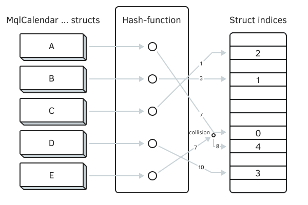
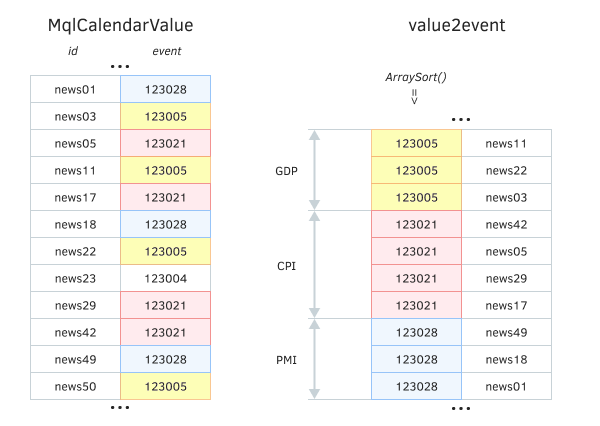
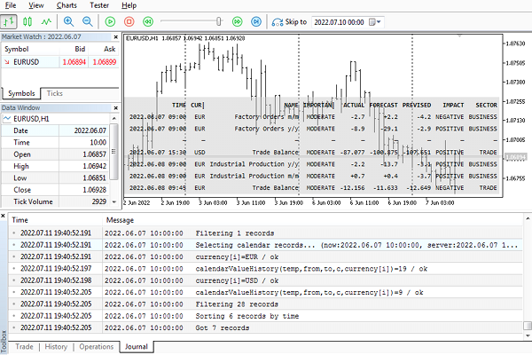

# Transferring calendar database to tester

The calendar is available for MQL programs only online, and therefore testing news trading strategies poses some difficulties. One of the solutions is to independently create a certain image of the calendar, that is, the cache, and then use it inside the tester. Cache storage technologies can be different, such as files or an embedded [SQLite](/en/book/advanced/sqlite) database. In this section, we will show an implementation using a file.

In any case, when using the calendar cache, remember that it corresponds to a specific point in time X. In all "old" events (financial reports) that happened before X, actual values are already set, and in later ones (in "future", relative to X) there are no actual values, and will not be until a new, more recent copy of the cache appears. In other words, it makes no sense to test indicators and Expert Advisors to the right of X. As for those to the left of X, you should avoid looking ahead, that is, do not read the current indicators until the time of publication of each specific news.

Attention! When requesting calendar data in the terminal, the time of all events is reported taking into account the current time zone of the server, including a possible correction for "daylight saving" time (as a rule, this means increasing the timestamps by 1 hour). This synchronizes news releases with online quote times. However, past clock changes (half a year, a year ago, or more) are displayed only in quotes, but not in calendar events. The entire calendar database is read through MQL5 according to the server's current time zone. Because of this, any created calendar archive will contain the correct timestamps for those events that occurred with the same DST mode (on or off) that was active at the time of storing. For events in "opposite" half-years, it is required to independently make an adjustment for an hour after reading the archive. In the examples below, this situation is omitted.

Let's call the cache class CalendarCache and put it in a file named CalendarCache.mqh. We will need to save all 3 tables of the calendar base in the file (MqlCalendarCountry, MqlCalendarEvent, MqlCalendarValue). MQL5 provides functions FileWriteArray and FileReadArray (see [Writing and reading arrays](/en/book/common/files/files_arrays)) that can directly write and read arrays of simple structures to files. However, 2 out of 3 structures in our case are not simple, because they have string fields. Therefore, we need a mechanism for separately storing strings, similar to the one we already used in the CalendarFilter class (there was an array of strings stringCache, and the index of the desired string from this array was indicated in the filters).

In order to avoid missing strings from different "calendar" structures in one "dictionary", we will prepare a template class StringRef: the type parameter T will be any of MqlCalendar structures. This will give us a separate string cache for countries, and a separate string cache for event types.

```
template<typename T>
struct StringRef
{
   static string cache[];
   int index;
   StringRef(): index(-1) { }
   
   void operator=(const string s)
   {
      if(index == -1)
      {
         PUSH(cache, s);
         index = ArraySize(cache) - 1;
      }
      else
      {
         cache[index] = s;
      }
   }
   
   string operator[](int x = 0) const
   {
      if(index != -1)
      {
         return cache[index];
      }
      return NULL;
   }
   
   static bool save(const int handle)
   {
      FileWriteInteger(handle, ArraySize(cache));
      for(int i = 0; i < ArraySize(cache); ++i)
      {
         FileWriteInteger(handle, StringLen(cache[i]));
         FileWriteString(handle, cache[i]);
      }
      return true;
   }
   
   static bool load(const int handle)
   {
      const int n = FileReadInteger(handle);
      for(int i = 0; i < n; ++i)
      {
         PUSH(cache, FileReadString(handle, FileReadInteger(handle)));
      }
      return true;
   }
};
   
template<typename T>
static string StringRef::cache[];

```

The strings are stored in the cache array by using operator=, and extracted from it using operator[] (with a dummy index that is always omitted). Each object stores only the index of the string in the array. The cache array is declared static, so it will accumulate all string fields of one T structure. Those who wish can change the method of caching in such a way that each field of the structure has its own array, but this is not important for us.

Writing an array to a file and reading from a file are performed by a pair of static methods save and load: both take a file handle as a parameter.

Taking into account the StringRef class, let's describe structures that duplicate the standard calendar structures which use StringRef objects instead of string fields. For example, for MqlCalendarCountry we get MqlCalendarCountryRef. Standard and modified structures are copied into each other in a similar way by overloaded operators '=' and '[]'.

```
   struct MqlCalendarCountryRef
   {
      ulong id;
      StringRef<MqlCalendarCountry> name;
      StringRef<MqlCalendarCountry> code;
      StringRef<MqlCalendarCountry> currency;
      StringRef<MqlCalendarCountry> currency_symbol;
      StringRef<MqlCalendarCountry> url_name;
      
      void operator=(const MqlCalendarCountry &c)
      {
         id = c.id;
         name = c.name;
         code = c.code;
         currency = c.currency;
         currency_symbol = c.currency_symbol;
         url_name = c.url_name;
      }
      
      MqlCalendarCountry operator[](int x = 0) const
      {
         MqlCalendarCountry r;
         r.id = id;
         r.name = name[];
         r.code = code[];
         r.currency = currency[];
         r.currency_symbol = currency_symbol[];
         r.url_name = url_name[];
         return r;
      }
   };

```

Note that the assignment operators of the first method have the overload '=' from StringRef, due to which all the lines fall into the array StringRef<MqlCalendarCountry>::cache. In the second method, the '[]' operator calls invisibly get the address of the string and return from StringRef directly the string stored at that address in the cache array.

The MqlCalendarEventRef structure is defined in a similar way, but only 3 fields in it (source_url, event_code, name) require replacing type string by StringRef<MqlCalendarEvent>. The MqlCalendarValue structure does not require such transformations, since there are no string fields in it.

This concludes the preparatory stages, and you can proceed to the main cache class CalendarCache.

From general considerations, as well as for compatibility with the already developed CalendarFilter class, let's describe the fields in the cache that specify the context (country or currency), the range of dates for stored events, and the moment of cache generation (time X, variable t).

```
class CalendarCache
{
   string context;
   datetime from, to;
   datetime t;
   ...
   
public:
   CalendarCache(const string _context = NULL,
      const datetime _from = 0, const datetime _to = 0):
      context(_context), from(_from), to(_to), t(0)
   {
      ...
   }

```

Actually, it does not make much sense to set restrictions when creating a cache from a calendar. A full cache is probably more practical since its size is not critical as it is about two dozens of megabytes till the middle of 2022 (this include historical data from 2007 with events planned until 2024). However, restrictions can be useful for demo programs with artificially reduced functionality.

It is obvious that arrays of calendar structures should be provided in the cache to store all the data.

```
   MqlCalendarValue values[];
   MqlCalendarEvent events[];
   MqlCalendarCountry countries[];
   ...

```

Initially, they are filled from the calendar database by the update method.

```
   bool update()
   {
      string country = NULL, currency = NULL;
      if(StringLen(context) == 3)
      {
         currency = context;
      }
      else if(StringLen(context) == 2)
      {
         country = context;
      }
      
      Print("Reading online calendar base...");
      
      if(!PRTF(CalendarValueHistory(values, from, to, country, currency))
         || (currency != NULL ?
            !PRTF(CalendarEventByCurrency(currency, events)) :
            !PRTF(CalendarEventByCountry(country, events)))
         || !PRTF(CalendarCountries(countries)))
      {
         // object is not ready, t = 0
      }
      else
      {
         t = TimeTradeServer();
      }
      return (bool)t;
   }

```

The t field is a sign of cache health, with the time of filling arrays.

The filled cache object can be written to a file using the save method. At the beginning of the file, there is a header CALENDAR_CACHE_HEADER — this is the string "MQL5 Calendar Cache\r\nv.1.0\r\n", which allows you to make sure that the format is correct when reading. Next, the method saves the context, from, to, and t variables, as well as the values array, "as is". Before the array itself, we write down its size in order to restore it when reading.

```
   bool save(string filename = NULL)
   {
      if(!t) return false;
      
      MqlDateTime mdt;
      TimeToStruct(t, mdt);
      if(filename == NULL) filename = "calendar-" +
         StringFormat("%04d-%02d-%02d-%02d-%02d.cal",
         mdt.year, mdt.mon, mdt.day, mdt.hour, mdt.min);
      int handle = PRTF(FileOpen(filename, FILE_WRITE | FILE_BIN));
      if(handle == INVALID_HANDLE) return false;
      
      FileWriteString(handle, CALENDAR_CACHE_HEADER);
      FileWriteString(handle, context, 4);
      FileWriteLong(handle, from);
      FileWriteLong(handle, to);
      FileWriteLong(handle, t);
      FileWriteInteger(handle, ArraySize(values));
      FileWriteArray(handle, values);
      ...

```

With arrays events and countries come our wrapper structures with the "Ref" suffix. The helper method store converts the events array into an array of simple structures erefs, in which strings are replaced by numbers in the dictionary of strings StringRef<MqlCalendarEvent>. Such simple structures can already be written to a file in the usual way, but for their subsequent reading, it is also necessary to save all the lines of the dictionary (calling StringRef<MqlCalendarEvent> ::save(handle)). Country structures are converted and saved to file in the same way.

```
      MqlCalendarEventRef erefs[];
      store(erefs, events);
      FileWriteInteger(handle, ArraySize(erefs));
      FileWriteArray(handle, erefs);
      StringRef<MqlCalendarEvent>::save(handle);
      
      MqlCalendarCountryRef crefs[];
      store(crefs, countries);
      FileWriteInteger(handle, ArraySize(crefs));
      FileWriteArray(handle, crefs);
      StringRef<MqlCalendarCountry>::save(handle);
      
      FileClose(handle);
      return true;
   }

```

The aforementioned store method is quite simple: in it, in a loop over the elements, an overloaded assignment operator is executed in the MqlCalendarEventRef or MqlCalendarCountryRef structures.

```
   template<typename T1,typename T2>
   void static store(T1 &array[], T2 &origin[])
   {
      ArrayResize(array, ArraySize(origin));
      for(int i = 0; i < ArraySize(origin); ++i)
      {
         array[i] = origin[i];
      }
   }

```

To load the received file into the cache object, a mirror method load is written. It reads data from the file into variables and arrays in the same order, simultaneously performing reverse transformations of string fields for event types and countries.

```
   bool load(const string filename)
   {
      Print("Loading calendar cache ", filename);
      t = 0;
      int handle = PRTF(FileOpen(filename, FILE_READ | FILE_BIN));
      if(handle == INVALID_HANDLE) return false;
      
      const string header = FileReadString(handle, StringLen(CALENDAR_CACHE_HEADER));
      if(header != CALENDAR_CACHE_HEADER) return false; // not our format
      
      context = FileReadString(handle, 4);
      if(!StringLen(context)) context = NULL;
      from = (datetime)FileReadLong(handle);
      to = (datetime)FileReadLong(handle);
      t = (datetime)FileReadLong(handle);
      Print("Calendar cache interval: ", from, "-", to);
      Print("Calendar cache saved at: ", t);
      int n = FileReadInteger(handle);
      FileReadArray(handle, values, 0, n);
      
      MqlCalendarEventRef erefs[];
      n = FileReadInteger(handle);
      FileReadArray(handle, erefs, 0, n);
      StringRef<MqlCalendarEvent>::load(handle);
      restore(events, erefs);
      
      MqlCalendarCountryRef crefs[];
      n = FileReadInteger(handle);
      FileReadArray(handle, crefs, 0, n);
      StringRef<MqlCalendarCountry>::load(handle);
      restore(countries, crefs);
      
      FileClose(handle);
      ... // something else will be here
   }

```

Helper method restore uses the overload of the '[]' operator in a loop over elements in the MqlCalendarEventRef or MqlCalendarCountryRef structures to get the line itself by line number and assign it to a standard MqlCalendarEvent or MqlCalendarCountry structure.

```
   template<typename T1,typename T2>
   void static restore(T1 &array[], T2 &origin[])
   {
      ArrayResize(array, ArraySize(origin));
      for(int i = 0; i < ArraySize(origin); ++i)
      {
         array[i] = origin[i][];
      }
   }

```

At this stage, we already could write a simple test indicator based on the CalendarCache class, run it on an online chart, and save it to a file with the calendar cache. Then the file could be loaded from the copy of the indicator in the tester, and the full set of events could be received. However, this is not enough for practical developments.

The fact is that for quick access to data, it is required to provide indexing, a well-known concept in programming, which we will touch on later, in the chapter on databases. In theory, we could use the built-in SQLite engine to store the cache, and then we would get indexes "for free", but more on that later.

The point of indexing is easy to understand if we imagine how to effectively implement analogs of standard calendar functions in our cache. For example, the event ID is passed in the CalendarValueById function. Direct enumeration of records in the array values would be very time-consuming. Therefore, it is required to supplement the array with some "data structure" that would allow us to optimize the search. "Data structure" is in quotation marks, because it is not about the meaning of the programming language (struct), but in general about the architecture of data construction. It can consist of different parts and be based on different organizational principles. Of course, the extra data will require memory, but exchanging memory for speed is a common approach in programming.

The simplest solution for indexing is a separate two-dimensional array, sorted in ascending order so that it can be quickly searched using the [ArrayBsearch](/en/book/common/arrays/arrays_compare_sort_search) function. Two elements are enough for the second dimension: values with indices [i][0], by which sorting is performed, contain identifiers, and values [i][1] contain the ordinal positions in the array of structures.

Another frequently used concept is hashing which is a transformation of the initial values into some keys (hashes, integers) in such a way that it provides the minimum number of collisions (matches of keys for different initial data). The fundamental property of keys is a close to uniform random distribution of their values, due to which they can be used as indexes in pre-allocated arrays. Computing a hash function for a single element of the original data is a fast process that actually yields the address of the element itself. For example, the well-known hash map data structures follow this principle.

If the two original values do get the same hash (although this is rare), they are lined up in a list for their key, and a sequential search will be performed within the list. However, since the hash functions are chosen so that the number of matches is small, the search usually hits the target as soon as the hash is computed.

For demonstration, we will use both approaches in the CalendarCache class: hashing and binary search.

The MetaTrader 5 package includes a set of classes for creating hash maps (MQL5/Include/Generic/HashMap.mqh), but we will manage with our own simpler implementation, in which only the principle of using the hash function remains.



Scheme for indexing data by hashing

In our case, it is enough to hash only the identifiers of the calendar objects. The hashing function that we choose will have to convert the identifier to an index inside a special array: the position of the identifier in the array of "calendar" structures will be stored in a cell with this index. For countries, types of events, and specific news, it is allocated according to its own array.

```
   int id4country[];
   int id4event[];
   int id4value[];

```

Their elements will store the sequence number of the entry in the relevant array (countries, events, values).

For each of the "redirect" arrays, at least 2 times more elements should be allocated than the number of corresponding structures in the database (and in the cache) of the calendar. Due to this redundancy, we minimize the number of hash collisions. It is believed that the greatest efficiency is achieved when choosing a size equal to a prime number. Therefore, the class has a static method size2prime which returns the recommended size of the array of hash "baskets" (one of id4 -arrays) according to the number of elements in the source data.

```
   static int size2prime(const int size)
   {
      static int primes[] =
      {
        17, 53, 97, 193, 389,
        769, 1543, 3079, 6151,
        12289, 24593, 49157, 98317,
        196613, 393241, 786433, 1572869,
        3145739, 6291469, 12582917, 25165843,
        50331653, 100663319, 201326611, 402653189,
        805306457, 1610612741
      };
      
      const int pmax = ArraySize(primes);
      for(int p = 0; p < pmax; ++p)
      {
         if(primes[p] >= 2 * size)
         {
            return primes[p];
         }
      }
      return size;
   }

```

The whole process of calendar hashing is described in the hash method. Let's look at its beginning using the example of an array of structures countries, and the other two arrays are treated similarly.

So we get the recommended "plain" index size id4country from the size of the countries array by calling size2prime. Initially, the index array is filled with the value -1, that is, all its elements are free. Further in the loop through the countries, it is necessary to calculate the hash for each next country identifier and using it find a free index in the id4country array. This is the job for the helper method place.

```
   bool hash()
   {
      Print("Hashing calendar...");
      ...
      const int c = PRTF(ArraySize(countries));
      PRTF(ArrayResize(id4country, size2prime(c)));
      ArrayInitialize(id4country, -1);
      
      for(int i = 0; i < c; ++i)
      {
         if(place(countries[i].id, i, id4country) == -1)
         {
            return false; // failure
         }
      }
      ...
      return true; // success
   }

```

The hash function inside place is the expression (MathSwap(id) ^ 0xEFCDAB8967452301) % n, where id is our identifier, and n is the size of the index array. Thus, the result of calculations is always reduced to a valid index inside array[]. The principle of choosing a hash function is a separate topic that is beyond the scope of the book.

```
   int place(const ulong id, const int index, int &array[])
   {
      const int n = ArraySize(array);
      int p = (int)((MathSwap(id) ^ 0xEFCDAB8967452301) % n); // hash function
      int attempt = 0;
      while(array[p] != -1)
      {
         if(++attempt > n / 10) // number of collisions - no more than 1/10 of the number
         {
            return -1; // error writing to index array
         }
         p = (p + attempt) % n;
      }
      array[p] = index;
      return p;
   }

```

If the cell at the p positionin the index array is not occupied (equal to -1), we immediately write the location address of the calendar structure to the element [p]. If the cell is already occupied, we try to select the next one using the formula p = (p + attempt) % n, where attempt is a counter of attempts (this is our camouflaged version of the list of elements with a matched hash). If the number of failed attempts reaches one-tenth of the original data, indexing will fail, but this is practically impossible with our oversized index array size and the known nature of the hashed data (unique identifiers).

As a result of hashing the array of structures, we get a filled index array (there are free spaces in it, but this is how it is intended), through which we can find the location of the corresponding structure in the array of structures by the identifier of the calendar element. This is done by the find method which is opposite in meaning to place.

```
   template<typename S>
   int find(const ulong id, const int &array[], const S &structs[])
   {
      const int n = ArraySize(array);
      if(!n) return false;
      int p = (int)((MathSwap(id) ^ 0xEFCDAB8967452301) % n); // hash function
      int attempt = 0;
      while(structs[array[p]].id != id)
      {
         if(++attempt > n / 10)
         {
            return -1; // error extracting from index array
         }
         p = (p + attempt) % n;
      }
      return array[p];
   }

```

Let's show how it is used in practice. The standard calendar functions include CalendarCountryById and CalendarEventById. When you need to test an MQL program in the tester, it will not be able to directly access them, but it will be able to load the calendar cache into the CalendarCache object and therefore it should have similar methods.

```
   bool calendarCountryById(ulong country_id, MqlCalendarCountry &cnt)
   {
      const int index = find(country_id, id4country, countries);
      if(index == -1) return false;
      
      cnt = countries[index];
      return true;
   }
   
   bool calendarEventById(ulong event_id, MqlCalendarEvent &event)
   {
      const int index = find(event_id, id4event, events);
      if(index == -1) return false;
      
      event = events[index];
      return true;
   }

```

They use the find method and index arrays id4country and id4event.

But these are not the most desired features of the calendar. Much more often, an MQL program with a news strategy needs functions CalendarValueHistory, CalendarValueHistoryByEvent, CalendarValueLast, or CalendarValueLastByEvent. They provide quick access to calendar entries by time, country, or currency.

So, the CalendarCache class should provide similar methods. Here we will use the second method of "indexing" — through a binary search in a sorted array.

To implement the above methods, let's add 4 more two-dimensional arrays to the class to establish a correspondence between news and event type, news and country, news, and currency, as well as news and the time of its publication.

```
   ulong value2event[][2];    // [0] - event_id, [1] - value_id
   ulong value2country[][2];  // [0] - country_id, [1] - value_id
   ulong value2currency[][2]; // [0] - currency ushort[4]<->long, [1] - value_id
   ulong value2time[][2];     // [0] - time, [1] - value_id

```

In the first element of each row, i.e., under the indices [i][0] an event ID, country, currency or time, respectively, will be recorded. In the second element of the series, under indices [i][1] IDs of specific news will be placed. After filling all the arrays once, they are sorted using [ArraySort](/en/book/common/arrays/arrays_compare_sort_search) on values [i][0]. Then we can search by ID, for example, by event_id, for all such news in the value2event array: the [ArrayBsearch](/en/book/common/arrays/arrays_compare_sort_search) function will return the number of the first matching element, followed by others with the same event_id until a distinct identifier is encountered. The order in the second "column" is not defined (can be any).



Quick search for related structures based on sorting

This operation of mutual binding of structures of different types is carried out in the bind method. The size of each "binding" array is the same as the size of the news array. Going through all the news in a loop, we use ready-made index arrays and the find method for fast addressing.

```
   bool bind()
   {
      Print("Binding calendar tables...");
      const int n = ArraySize(values);
      ArrayResize(value2event, n);
      ArrayResize(value2country, n);
      ArrayResize(value2currency, n);
      ArrayResize(value2time, n);
      for(int i = 0; i < n; ++i)
      {
         value2event[i][0] = values[i].event_id;
         value2event[i][1] = values[i].id;
         
         const int e = find(values[i].event_id, id4event, events);
         if(e == -1) return false;
         
         value2country[i][0] = events[e].country_id;
         value2country[i][1] = values[i].id;
         
         const int c = find(events[e].country_id, id4country, countries);
         if(c == -1) return false;
         
         value2currency[i][0] = currencyId(countries[c].currency);
         value2currency[i][1] = values[i].id;
         
         value2time[i][0] = values[i].time;
         value2time[i][1] = values[i].id;
      }
      ArraySort(value2event);
      ArraySort(value2country);
      ArraySort(value2currency);
      ArraySort(value2time);
      return true;
   }

```

In the case of currencies, a special number obtained from the string using the currencyId function is taken as an identifier.

```
   static ulong currencyId(const string s)
   {
      union CRNC4
      {
         ushort word[4];
         ulong ul;
      } v;
      StringToShortArray(s, v.word);
      return v.ul;
   }

```

Now we can finally present the entire constructor of the CalendarCache class.

```
   CalendarCache(const string _context = NULL,
      const datetime _from = 0, const datetime _to = 0):
      context(_context), from(_from), to(_to), t(0), eventId(0)
   {
      if(from > to) // label that context is a filename
      {
         load(_context);
      }
      else
      {
         if(!update() || !hash() || !bind())
         {
            t = 0;
         }
      }
   }

```

When launched on an online chart, the created object with default parameters will collect all calendar information (update), index it (hash), and link the tables (bind). If something goes wrong at any of the stages, the error sign will be 0 in the variable t. If successful, the value from the function TimeTradeServer will remain there (remember, it is placed inside update). Such a ready-to-use object can be exported to a file using the save method described above.

When launched in the tester, the object should be created with a special combination of parameters from and to (from > to) — in this case, the program will consider the context string a filename and will load the calendar state from it. The easiest way to do it is this:

```
CalendarCache calca("filename.cal", true);

```

Inside the method load we will also call hash and bind to bring the object into a working state.

```
   bool load(const string filename)
   {
      ... // reading the file was shown earlier
      const bool result = hash() && bind();
      if(!result) t = 0;
      return result;
   }

```

Using the CalendarValueLast function as an example, we show an equivalent implementation of the calendarValueLast method (with exactly the same prototype). The cache will use the current "server" time as a change identifier, in the absence of an open software API for reading the online calendar change table. Hypothetically, we could use the information about the change IDs saved by the [CalendarChangeSaver.mq5](/en/book/advanced/calendar/calendar_change_last) service, but this approach requires a long-term collection of statistics before testing can begin. Therefore, the "server" time generated by the tester is accepted as a fairly adequate replacement.

When the MQL program requests changes for the first time with a null identifier, we simply return the value from TimeTradeServer.

```
   int calendarValueLast(ulong &change, MqlCalendarValue &result[],
      const string code = NULL, const string currency = NULL)
   {
      if(!change)
      {
         change = TimeTradeServer();
         return 0;
      }
      ...

```

If the change identifier is already non-zero, we continue the main branch of the algorithm.

Depending on the contents of the code and currency parameters, we find the identifiers of the country and currency. By default, it is 0, which means it searches for all changes.

```
      ulong country_id = 0;
      ulong currency_id = currency != NULL ? currencyId(currency) : 0;
      
      if(code != NULL)
      {
         for(int i = 0; i < ArraySize(countries); ++i)
         {
            if(countries[i].code == code)
            {
               country_id = countries[i].id;
               break;
            }
         }
      }
      ...

```

Further along, using the transmitted time count change as the beginning of the search, we find all the news in value2time up to the new, current value TimeTradeServer. Inside the loop, we use the find method to look for the index of the corresponding MqlCalendarValue structure in the values array and, if necessary, compare the country and currency of the associated event type with the desired ones. All news items that meet the criteria are written to the result output array.

```
      const ulong past = change;
      const int index = ArrayBsearch(value2time, past);
      if(index < 0 || index >= ArrayRange(value2time, 0)) return 0;
      
      int i = index;
      while(value2time[i][0] <= (ulong)past && i < ArrayRange(value2time, 0)) ++i;
      
      if(i >= ArrayRange(value2time, 0)) return 0;
      
      for(int j = i; j < ArrayRange(value2time, 0)
         && value2time[j][0] <= (ulong)TimeTradeServer(); ++j)
      {
         const int p = find(value2time[j][1], id4value, values);
         if(p != -1)
         {
            change = TimeTradeServer();
            if(country_id != 0 || currency_id != 0)
            {
               const int q = find(values[p].event_id, id4event, events);
               if(country_id != 0 && country_id != events[q].country_id) continue;
               if(currency_id != 0)
               {
                  const int m = find(events[q].country_id, id4country, countries);
                  if(countries[m].currency != currency) continue;
               }
            }
            
            PUSH(result, values[p]);
         }
      }
      
      return ArraySize(result);
   }

```

Methods calendarValueHistory, calendarValueHistoryByEvent, and calendarValueLastByEvent are implemented according to a similar principle (the latter actually delegates all the work to the method calendarValueLast discussed earlier). The complete source code can be found in the attached file CalendarCache.mqh.

Based on the cache class, it is logical to create a derived class CalendarFilter, which, when processing requests, would access the cache instead of the calendar.

The finished solution is in the file CalendarFilterCached.mqh. Due to the fact that the cache API was designed on the basis of the standard API, the integration is reduced to only forwarding filter calls to the cache object (autopointer cache).

```
class CalendarFilterCached: public CalendarFilter
{
protected:
   AutoPtr<CalendarCache> cache;
   
   virtual bool calendarCountryById(ulong country_id, MqlCalendarCountry &cnt) override
   {
      return cache[].calendarCountryById(country_id, cnt);
   }
   
   virtual bool calendarEventById(ulong event_id, MqlCalendarEvent &event) override
   {
      return cache[].calendarEventById(event_id, event);
   }
   
   virtual int calendarValueHistoryByEvent(ulong event_id, MqlCalendarValue &temp[],
      datetime _from, datetime _to = 0) override
   {
      return cache[].calendarValueHistoryByEvent(event_id, temp, _from, _to);
   }
   
   virtual int calendarValueHistory(MqlCalendarValue &temp[],
      datetime _from, datetime _to = 0,
      const string _code = NULL, const string _coin = NULL) override
   {
      return cache[].calendarValueHistory(temp, _from, _to, _code, _coin);
   }
   
   virtual int calendarValueLast(ulong &_change, MqlCalendarValue &result[],
      const string _code = NULL, const string _coin = NULL) override
   {
      return cache[].calendarValueLast(_change, result, _code, _coin);
   }
   
   virtual int calendarValueLastByEvent(ulong event_id, ulong &_change,
      MqlCalendarValue &result[]) override
   {
      return cache[].calendarValueLastByEvent(event_id, _change, result);
   }
   
public:   
   CalendarFilterCached(CalendarCache *_cache): cache(_cache),
      CalendarFilter(_cache.getContext(), _cache.getFrom(), _cache.getTo())
   {
   }
   
   virtual bool isLoaded() const override
   {
 // readiness is determined by the cache
      return cache[].isLoaded();
   }
};

```

To test the calendar in the tester, let's create a new version of the indicator CalendarMonitor.mq5 – CalendarMonitorCached.mq5.

The main differences are as follows.

We assume that some cache file will be created or already created under the name "xyz.cal" (in the folder MQL5/Files) and therefore connect it to the MQL program with the directive [tester_file](/en/book/automation/tester/tester_directives).

```
#property tester_file "xyz.cal"

```

This directive ensures the transfer of the cache to any agents, including distributed ones (which, however, is more relevant for Expert Advisors, rather than an indicator). A cache file with this (or another name) can be created using a new input variable CalendarCacheFile. If the user changes the default name to something else, then to work in the tester, you will need to correct the directive (requires recompilation!), or transfer the file to the shared folder of terminals (this feature is supported in the cache class, but "left behind the scenes"), however, such a file is no longer available to remote agents.

```
input string CalendarCacheFile = "xyz.cal";

```

The CalendarFilter object is now described as an autopointer, because depending on where the indicator is run, it can use the original class CalendarFilter as well as the derived class CalendarFilterCached.

```
AutoPtr<CalendarFilter> fptr;
AutoPtr<CalendarCache> cache;

```

At the beginning of OnInit, there is a new fragment that is responsible for generating the cache and reading it.

```
int OnInit()
{
   cache = new CalendarCache(CalendarCacheFile, true);
   if(cache[].isLoaded())
   {
      fptr = new CalendarFilterCached(cache[]);
   }
   else
   {
      if(MQLInfoInteger(MQL_TESTER))
      {
         Print("Can't run in the tester without calendar cache file");
         return INIT_FAILED;
      }
      else
      if(StringLen(CalendarCacheFile))
      {
         Alert("Calendar cache not found, trying to create '" + CalendarCacheFile + "'");
         cache = new CalendarCache();
         if(cache[].save(CalendarCacheFile))
         {
            Alert("File saved. Re-run indicator in online chart or in the tester");
         }
         else
         {
            Alert("Error: ", _LastError);
         }
         ChartIndicatorDelete(0, 0, MQLInfoString(MQL_PROGRAM_NAME));
         return INIT_PARAMETERS_INCORRECT;
      }
      Alert("Currently working in online mode (no cache)");
      fptr = new CalendarFilter(Context);
   }
   CalendarFilter *f = fptr[];
   ... // continued without changes

```

If the cache file has been read, we will get the finished object CalendarCache, which is passed to the CalendarFilterCached constructor. Otherwise, the program checks whether it is running in the tester or online. The absence of a cache in the tester is a fatal case. On a regular chart, the program creates a new object based on the built-in calendar data and saves it in the cache under the specified name. But if the file name is made empty, the indicator will work exactly as the original one — directly with the calendar.

Let's run the indicator on the EURUSD chart. The user will be warned that the specified file was not found and an attempt was made to save it. Provided that the calendar is enabled in the terminal settings, we should get approximately the following lines in the log. Below is a version with detailed diagnostic information. The details can be disabled by commenting out the directive in the source code #define LOGGING.

```
Loading calendar cache xyz.cal
FileOpen(filename,FILE_READ|FILE_BIN|flags)=-1 / CANNOT_OPEN_FILE(5004)
Alert: Calendar cache not found, trying to create 'xyz.cal'
Reading online calendar base...
CalendarValueHistory(values,from,to,country,currency)=157173 / ok
CalendarEventByCountry(country,events)=1493 / ok
CalendarCountries(countries)=23 / ok
Hashing calendar...
ArraySize(countries)=23 / ok
ArrayResize(id4country,size2prime(c))=53 / ok
Total collisions: 9, worse:3, average: 2.25 in 4
ArraySize(events)=1493 / ok
ArrayResize(id4event,size2prime(e))=3079 / ok
Total collisions: 495, worse:7, average: 1.43478 in 345
ArraySize(values)=157173 / ok
ArrayResize(id4value,size2prime(v))=393241 / ok
Total collisions: 3511, worse:1, average: 1.0 in 3511
Binding calendar tables...
FileOpen(filename,FILE_WRITE|FILE_BIN|flags)=1 / ok
Alert: File saved. Re-run indicator in online chart or in the tester

```

Now we can choose the indicator CalendarMonitorCached.mq5 in the tester and see in dynamics, based on history, how the news table changes.



News indicator with calendar cache in the tester

The presence of the calendar cache allows you to test trading strategies on the news. We will show this in the next section.
