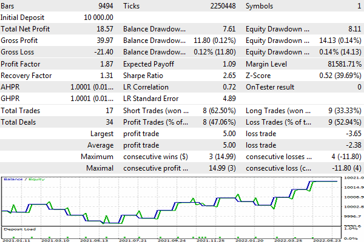

# Calendar trading

There are many news trading strategies: with market or pending orders, with analysis of financial indicators (the direction of price movement), and without it (volatility capture). In addition, it is useful to insert an anti-news filter into many other trading systems. It is difficult to optimize and debug all such programs since the MQL5 calendar is not available in the tester. However, with the help of the cache developed in the previous section, we can rectify the situation.

Let's try to create an Expert Advisor that will enter the market upon news releases, in accordance with the assessment of their impact on the price. The cache file "xyz.cal" has just been created using the indicator CalendarMonitorCached.mq5.

Recall that the image of the calendar in the cache always corresponds to the moment of saving and requires caution when reading: for later events, actual indicators are unknown, and more distant events may not exist at all. You should regularly update the calendar cache file before the next optimization or testing.   

   

If necessary, also take into account the DST time settings during the year: if the DST mode of events is different from the DST at the time the calendar archive was saved, you will need to shift the time back or forward by 1 hour. You can avoid these difficulties by choosing a broker without DST or by building a strategy on timeframes greater than H1.

The Expert Advisor CalendarTrading.mq5 will only trade the news events that:

- refer to the working symbol of the chart
- have the type of financial indicator (that is, quantitative)
- high importance
- just received the current value of the indicator

The latter is important because for indicators that have forecast and actual values, the system sets the value of the field impact_type accordingly: it will serve as a trading signal (indicate the direction of entering the market).

The exact time of the release of the news, as a rule, does not coincide with the planned time entered in the field MqlCalendarValue::time. The calendar does not record this time, and it is not available in the cache. In this regard, the accuracy of testing news strategies may suffer. If you want to bring analysis and decision-making closer to an online process, accumulate news release statistics using a service such as [CalendarChangeSaver.mq5](/en/book/advanced/calendar/calendar_change_last) and embed it in the cache.

By default, trading is carried out with a minimum lot, with take profit and stop loss levels set at a specified distance in points. All this is reflected in the input parameters.

```
input double Volume;               // Volume (0 = minimal lot)
input int Distance2SLTP = 500;     // Distance to SL/TP in points (0 = no)
input uint MultiplePositions = 25;

```

For hedging accounts, we allow the simultaneous existence of several positions, the default is 25. This is the recommended testing environment because it allows you to independently evaluate the profitability of parallel trading on news of different types (each position is created independently and does not lead to closing positions on other news). On the other hand, maintaining only one position automatically levels out conflicting signals of different news.

Optionally, the Expert Advisor supports filters for the news type identifier and text for searching by title.

```
sinput ulong EventID;
sinput string Text;

```

This can be useful for future research on specific news.

At the global level, object pointers are described by analytical processing of news and position tracking.

```
AutoPtr<CalendarFilter> fptr;
AutoPtr<CalendarCache> cache;
AutoPtr<TrailingStop> trailing[];

```

The mode of operation and the currency pair of the current working symbol are stored in the corresponding variables. To simplify the example, it is assumed to be used on Forex (on other markets, you will get trading in one currency — the quote currency of the ticker).

```
const bool Hedging =
   AccountInfoInteger(ACCOUNT_MARGIN_MODE) == ACCOUNT_MARGIN_MODE_RETAIL_HEDGING;
const string Base = SymbolInfoString(_Symbol, SYMBOL_CURRENCY_BASE);
const string Profit = SymbolInfoString(_Symbol, SYMBOL_CURRENCY_PROFIT);

```

In the OnInit handler, we load the calendar cache and configure the filters as described above. The absence of cache is allowed on the online chart: then the Expert Advisor works in combat mode, directly with the calendar. In the tester, the absence of a cache file will prevent the Expert Advisor from starting.

```
int OnInit()
{
   cache = new CalendarCache("xyz.cal", true);
   if(cache[].isLoaded())
   {
      fptr = new CalendarFilterCached(cache[]);
   }
   else
   {
      if(!MQLInfoInteger(MQL_TESTER))
      {
         Print("Calendar cache file not found, fall back to online mode");
         fptr = new CalendarFilter();
      }
      else
      {
         Print("Can't proceed in the tester without calendar cache file");
         return INIT_FAILED;
      }
   }
   CalendarFilter *f = fptr[];
   
   if(!f.isLoaded()) return INIT_FAILED;
   
   // if a specific type of event is set, we look only at it
   if(EventID > 0) f.let(EventID);
   else
   {
      // otherwise follow the news on the currencies of the current symbol
      f.let(Base);
      if(Base != Profit)
      {
         f.let(Profit);
      }
      
      // financial indicators, high importance, actual value
      f.let(CALENDAR_TYPE_INDICATOR);
      f.let(LONG_MIN, CALENDAR_PROPERTY_RECORD_FORECAST, NOT_EQUAL);
      f.let(CALENDAR_IMPORTANCE_HIGH);
   
      if(StringLen(Text)) f.let(Text);
   }
   
   f.describe();
   
   if(Distance2SLTP)
   {
      ArrayResize(trailing, Hedging && MultiplePositions ? MultiplePositions : 1);
   }
   // check the news filter and start trading on it by a second timer
   EventSetTimer(1);
   return INIT_SUCCEEDED;
}

```

In the OnTimer handler, we request changes to the news according to the configured filters.

```
void OnTimer()
{
   CalendarFilter *f = fptr[];
   MqlCalendarValue records[];
   
   f.let(TimeTradeServer() - SCOPE_DAY, TimeTradeServer() + SCOPE_DAY);
   
   if(f.update(records)) // find changes that undergo filtering
   {
      // output properties of changed news to the log
      static const ENUM_CALENDAR_PROPERTY props[] =
      {
         CALENDAR_PROPERTY_RECORD_TIME,
         CALENDAR_PROPERTY_COUNTRY_CURRENCY,
         CALENDAR_PROPERTY_COUNTRY_CODE,
         CALENDAR_PROPERTY_EVENT_NAME,
         CALENDAR_PROPERTY_EVENT_IMPORTANCE,
         CALENDAR_PROPERTY_RECORD_ACTUAL,
         CALENDAR_PROPERTY_RECORD_FORECAST,
         CALENDAR_PROPERTY_RECORD_PREVISED,
         CALENDAR_PROPERTY_RECORD_IMPACT,
      };
      static const int p = ArraySize(props);
      string result[];
      f.format(records, props, result);
      for(int i = 0; i < ArraySize(result) / p; ++i)
      {
         Print(SubArrayCombine(result, " | ", i * p, p));
      }
      ...

```

When suitable changes are detected, they are logged as follows (a fragment of the real log is below), indicating the time, currency, country, name, current and forecast values, previous value, and theoretical interpretation of the signal:

```
...
Filtering 5 records
2021.02.16 13:00 | EUR | EU | Employment Change q/q | HIGH | +0.3 | -0.4 | +1.0 | POSITIVE
2021.02.16 13:00 | EUR | EU | GDP q/q | HIGH | -0.6 | -0.7 | -0.7 | POSITIVE
instant buy 0.01 EURUSD at 1.21638 sl: 1.21138 tp: 1.22138 (1.21637 / 1.21638 / 1.21637)
deal #64 buy 0.01 EURUSD at 1.21638 done (based on order #64)
...
Filtering 3 records
2021.07.06 12:05 | EUR | DE | ZEW Economic Sentiment Indicator | HIGH | +63.3 | +84.1 | +79.8 | NEGATIVE
instant sell 0.01 EURUSD at 1.18473 sl: 1.18973 tp: 1.17973 (1.18473 / 1.18474 / 1.18473)
deal #265 sell 0.01 EURUSD at 1.18473 done (based on order #265)
...

```

The potential impact of the news on the price should be calculated based on in-field evaluation impact_type. It is important to note here that we have two currencies: base and quote. When the news has a positive effect on the base currency, the rate is expected to rise, and if it is negative, the rate will fall. For the quote currency, the opposite is true: a positive effect should increase the price of the second currency in the pair, which means a decrease in the exchange rate, while a negative one leads to its increase. This normalized direction of price movement is calculated in the following fragment using the sign variable.

```
      static const int impacts[3] = {0, +1, -1};
      int impact = 0;
      string about = "";
      ulong lasteventid = 0;
      for(int i = 0; i < ArraySize(records); ++i)
      {
         int sign = result[i * p + 1] == Profit ? -1 : +1;
         impact += sign * impacts[records[i].impact_type];
         about += StringFormat("%+lld ", sign * (long)records[i].event_id);
         lasteventid = records[i].event_id;
      }
      
      if(impact == 0) return; // no signal
      ...

```

Often several news releases appear at the same time, so it is necessary to accumulate ratings for all of them. This is done in the variable impact. Since our strategy only filters the news of single, highest importance, all single signals from them are simply summed up, without weight coefficients. The about string variable is used to prepare the text for the comment on the upcoming deal: the identifiers of the events that caused the deal will be mentioned there.

If the robot is launched on a netting account or the maximum allowed number of positions has been reached, we will close one.

```
      PositionFilter positions;
      ulong tickets[];
      positions.let(POSITION_SYMBOL, _Symbol).select(tickets);
      const int n = ArraySize(tickets);
      
      if(n >= (int)(Hedging ? MultiplePositions : 1))
      {
         MqlTradeRequestSync position;
         position.close(_Symbol) && position.completed();
      }
      ...

```

Now you can open a new position on a signal. An event identifier is set as a "magic" number, which will allow us to later analyze the financial performance of trading in the context of different types of news.

```
      MqlTradeRequestSync request;
      request.magic = lasteventid;
      request.comment = about;
      const double ask = SymbolInfoDouble(_Symbol, SYMBOL_ASK);
      const double bid = SymbolInfoDouble(_Symbol, SYMBOL_BID);
      const double point = SymbolInfoDouble(_Symbol, SYMBOL_POINT);
      ulong ticket = 0;
      
      if(impact > 0)
      {
         ticket = request.buy(Lot, 0,
            Distance2SLTP ? ask - point * Distance2SLTP : 0,
            Distance2SLTP ? ask + point * Distance2SLTP : 0);
      }
      else if(impact < 0)
      {
         ticket = request.sell(Lot, 0,
            Distance2SLTP ? bid + point * Distance2SLTP : 0,
            Distance2SLTP ? bid - point * Distance2SLTP : 0);
      }
      
      if(ticket && request.completed() && Distance2SLTP)
      {
         for(int i = 0; i < ArraySize(trailing); ++i)
         {
            if(trailing[i][] == NULL) // looking for a free slot for the position tracking object
            {
               trailing[i] = new TrailingStop(ticket, Distance2SLTP, Distance2SLTP / 50);
               break;
            }
         }
      }
   }
}

```

We move stop-losses for all positions upon the arrival of ticks.

```
void OnTick()
{
   for(int i = 0; i < ArraySize(trailing); ++i)
   {
      if(trailing[i][])
      {
         if(!trailing[i][].trail()) // position was closed
         {
            trailing[i] = NULL; // release object and slot
         }
      }
   }
}

```

Now comes the most interesting point. Thanks to the tester, it becomes possible to analyze the success of the news strategy not only in general but also broken down by specific news. The corresponding block is implemented in our OnTester handler. Data collection is performed using the deal filter. Having received from it the trades array of tuples, which reports on the profit, swap, commission, and magic number of each trade, we accumulate the results in three objects of MapArray: they calculate separately profits, losses, and the number of trades for each magic number.

```
double OnTester()
{
   Print("Trade profits by calendar events:");
   HistorySelect(0, LONG_MAX);
   DealFilter filter;
   int props[] = {DEAL_PROFIT, DEAL_SWAP, DEAL_COMMISSION, DEAL_MAGIC};
   filter.let(DEAL_TYPE, (1 << DEAL_TYPE_BUY) | (1 << DEAL_TYPE_SELL), IS::OR_BITWISE)
      .let(DEAL_ENTRY, (1 << DEAL_ENTRY_OUT) | (1 << DEAL_ENTRY_INOUT) | (1 << DEAL_ENTRY_OUT_BY),
      IS::OR_BITWISE);
   Tuple4<double, double, double, ulong> trades[];
   MapArray<ulong,double> profits;
   MapArray<ulong,double> losses;
   MapArray<ulong,int> counts;
   if(filter.select(props, trades))
   {
      for(int i = 0; i < ArraySize(trades); ++i)
      {
         counts.inc((ulong)trades[i]._4);
         const double payout = trades[i]._1 + trades[i]._2 + trades[i]._3;
         if(payout >= 0)
         {
            profits.inc((ulong)trades[i]._4, payout);
            losses.inc((ulong)trades[i]._4, 0);
         }
         else
         {
            profits.inc((ulong)trades[i]._4, 0);
            losses.inc((ulong)trades[i]._4, payout);
         }
      }
      ...

```

As a result, we get a table that displays statistics for each type of event line by line: its identifier, country, currency, total profit or loss, number of trades (number of news), profit factor, and event name.

```
      for(int i = 0; i < profits.getSize(); ++i)
      {
         MqlCalendarEvent event;
         MqlCalendarCountry country;
         const ulong keyId = profits.getKey(i);
         if(cache[].calendarEventById(keyId, event)
            && cache[].calendarCountryById(event.country_id, country))
         {
            PrintFormat("%lld %s %s %+.2f [%d] (PF:%.2f) %s",
               event.id, country.code, country.currency,
               profits[keyId] + losses[keyId], counts[keyId],
               profits[keyId] / (losses[keyId] != 0 ? -losses[keyId] : DBL_MIN),
               event.name);
         }
         else
         {
            Print("undefined ", DoubleToString(profits.getValue(i), 2));
         }
      }
   }
   return 0;
}

```

To test the idea, let's run the Expert Advisor for the period from the beginning of 2021 (to the middle of 2022) on the EURUSD pair. Below is a snippet of a log with a printout from OnTester.

```
Trade profits by calendar events:
840040001 US USD -21.81 [17] (PF:0.53) ISM Manufacturing PMI
840190001 US USD -10.95 [17] (PF:0.69) ADP Nonfarm Employment Change
840200001 US USD -67.09 [78] (PF:0.60) EIA Crude Oil Stocks Change
999030003 EU EUR +14.13 [19] (PF:1.46) Retail Sales m/m
840040003 US USD -17.12 [18] (PF:0.59) ISM Non-Manufacturing PMI
840030016 US USD -1.20 [19] (PF:0.97) Nonfarm Payrolls
840030021 US USD +5.25 [14] (PF:1.21) JOLTS Job Openings
840020010 US USD -14.63 [17] (PF:0.63) Retail Sales m/m
276070001 DE EUR -22.71 [17] (PF:0.47) ZEW Economic Sentiment Indicator
840020005 US USD +10.76 [18] (PF:1.37) Building Permits
840120001 US USD -20.78 [17] (PF:0.49) Existing Home Sales
276030003 DE EUR +18.57 [17] (PF:1.87) Ifo Business Climate
840180002 US USD -3.22 [14] (PF:0.89) CB Consumer Confidence Index
840020014 US USD -8.74 [16] (PF:0.74) Core Durable Goods Orders m/m
840020008 US USD -14.54 [16] (PF:0.63) New Home Sales
250010005 FR EUR +0.66 [10] (PF:1.03) GDP q/q
840010007 US USD +0.99 [15] (PF:1.04) GDP q/q
840120003 US USD +4.53 [18] (PF:1.15) Pending Home Sales m/m
276010008 DE EUR -0.72 [10] (PF:0.97) GDP q/q
999030016 EU EUR -14.04 [14] (PF:0.59) GDP q/q
999030001 EU EUR +1.30 [2] (PF:1.35) Employment Change q/q

```

The results are not very impressive. Still, news trading is full of subjectivity. First, theoretical assessments of the impact of the actual value of the news on the course may differ from the emotional expectations of the crowd or additional information background (remaining outside the calendar and not quantifiable). Second, we have already mentioned the inaccuracy in the actual value publication time. Third, our strategy is implemented in the simplest form, without analyzing the preliminary price movement (when there was probably a leak and the news was "played out" earlier).

Overall, this test found that traders' favorite Nonfarm Payrolls or GDP reports do not guarantee success, at least not with our default settings. Further, it is required, in the usual manner, to analyze individual transactions, find out what went wrong, select parameters, and improve the algorithm, in particular, add a time adjustment module for switching DST in the server time zone.

At the same time, the technique itself works fine, and we can just try to choose the most successful news to begin with. For example, let's take news 276030003 (Ifo Business Climate). By setting it into EventID, we will receive the following report, coinciding with our calculated indicators.



Report on trading in the tester based on Ifo Business Climate news

You can also try trading on a group of similar events. In particular, to respond only to GDP news (of different countries), enter the string "*GDP*" in the Text variable. The asterisks are added because, without them, a 3-character string will be treated as a currency by the filter class. Strings of any length other than 2 (country code) or 3 (currency code) can be specified as is, for example, "farm", "Nonfarm", "Sales" — they will be searched by the filter as substrings of names, case-sensitive.
