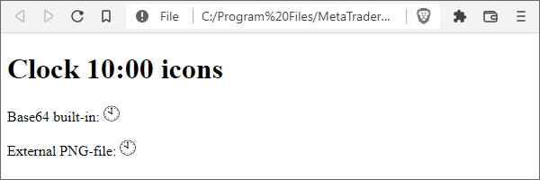

# Overview of available information transformation methods

Information protection can be implemented for different purposes and therefore use different methods. In particular, it may be necessary to completely hide the essence of information from an outside observer or to ensure its transmission, while guaranteeing an unchanged state, but the information itself remains available. In the first case, we are talking about encryption, and the second case refers to a digital fingerprint (hash). Thus, encryption and hashing are reduced to processing the original data into a new representation using, if necessary, additional parameters.

Both encryption and hashing come in many varieties.

The most general gradation divides encryption into public-key (asymmetric) and private-key (symmetric) encryption.

An asymmetric scheme implies the presence of 2 keys — public and private — for each participant in the data exchange. Pairs of public and private keys are pre-generated using special algorithms. Each private key is known only to the owner. Everyone's public keys are known to everyone. Public keys will need to be exchanged in one way or another before the encrypted data can be transmitted. Next, the data provider uses its private key, known only to them, in conjunction with one or more public keys of the data recipients. Those, in turn, use their private keys and the sender's public key to decrypt.

A symmetric encryption scheme uses the same secret (private) key for both encryption and decryption.

MQL5 supports the out-of-the-box private key feature (symmetric). The built-in MQL5 tools do not provide an electronic signature that uses asymmetric encryption.

Primitive algorithms without keys stand out among the encryption methods. With their help users achieve conditional hiding of information or transformation of the information type. These include, for example, ROT13 (replacement of characters with a shift of their alphanumeric codes by 13, used, in particular, in the Windows registry) or Base64 (translation of binary files to text and vice versa, usually in web projects). Another popular data transformation task is data compression. This one also can be thought of in a sense as encryption, as the data becomes unreadable by a human or application program.

There are also a lot of hashing methods on offer. And CRC (Cyclic Redundancy Check) is perhaps the most famous and simple. Unlike encryption, which allows you to restore the original message from the encrypted one, hashing only creates a fingerprint (a characteristic set of bytes) based on the original information, in such a way that its unchanged state while it is subsequently recalculated guarantees (with a high probability) the invariance of the original information. Of course, this assumes that the information is available to all participants/users of the respective software system. It is impossible to recover information by hash. As a rule, the size of the hash (the number of bytes in it) is limited and standardized for each method, so that for a string of 80 characters long and for a file of 1 MB we will get a hash of the same size. An application of hashing that most users will find really useful is the hashing of passwords by sites and programs, i.e., the latter are stored at home and verified during login with the password hash, and not with the password in its original form.

It should be noted that we already encountered the term "hash" in the previous chapter: we used a hashing function to index economic calendar structures. That simple hash has a very weak degree of protection, which, in particular, is expressed in a high probability of collisions (coincidence of results for different data), which we specially processed in the algorithm. It is suitable for problems of uniform pseudo-random distribution of data over a limited number of "baskets". In contrast, industrial standards of hashing focus specifically on verifying the integrity of information and use much more complex calculation methods. But the length of the hash in this case is several tens of bytes and not a single number.

Information encryption and hashing methods available to MQL programs are collected in the ENUM_CRYPT_METHOD enumeration.

| Constant | Description |
| --- | --- |
| CRYPT_BASE64 | Base64 re-encoding |
| CRYPT_DES | DES encryption with a 56-bit (7-byte) key |
| CRYPT_AES128 | AES encryption with a 128-bit (16-byte) key |
| CRYPT_AES256 | AES encryption with a 256-bit (32-byte) key |
| CRYPT_HASH_MD5 | MD5 hash calculation (16 bytes) |
| CRYPT_HASH_SHA1 | SHA1 hash calculation (20 bytes) |
| CRYPT_HASH_SHA256 | SHA256 hash calculation (32 bytes) |
| CRYPT_ARCH_ZIP | Compression using the "deflate" method |

The specified enumeration is used in both cryptographic API functions − CryptEncode (encryption/hashing) and CryptDecode (decryption). They will be discussed in the following sections.

AES and DES encryption methods require, in addition to data, the encryption key — an array of bytes of a predefined length (it is indicated in brackets in the table). As already mentioned, the key must be kept secret and remain known only to the developer of the program or the owner of the information. The cryptographic strength of encryption, that is, the difficulty of selecting a key by an attacker's computer, directly depends on the size of the key: the larger it is, the more reliable the protection. Therefore, DES is considered obsolete and has been replaced in the financial sector by its improved version of Triple DES: it implies the successive applying of DES for three times with three different keys, which is easy to implement in MQL5. There is a popular version of Triple DES, which performs decryption at the second iteration instead of encryption with key number 2, that is, as it were, restores data to an intermediate, deliberately incorrect representation before the final, third round of DES. But Triple DES is also planned to be removed from industry standards after 2024.

At the same time, cryptographic strength should be commensurate with the lifetime of the secret (key and information). If a fast flow of secure messages is required, shorter keys that are updated regularly will provide better performance.

Of the hashing methods, the most modern is SHA256 (a subset of the SHA-2 standard). SHA1 and MD5 methods are considered insecure but are still widely used in order to be compatible with existing services. For hashing methods, the size of the resulting byte array with a digital fingerprint of the data is indicated in brackets. A key is not needed for hashing, but in many applications, the "salt" is attached to the hashed data — a secret component that makes it difficult for attackers to reproduce the required hashes (for example, when guessing a password).

The CRYPT_ARCH_ZIP element provides ZIP archiving and transmission/reception of data requests on the Internet (see [WebRequest](/en/book/advanced/network/network_http)).

Despite the fact that the name of the method includes ZIP, the compressed data is not equivalent to the usual ZIP archives, which, in addition to the "deflate" containers, always contain meta-data: special headers, a list of files, and their attributes. On the site mql5.com, in the articles and the source code library, you can find ready-made implementations of compressing files into a ZIP archive and extracting them from there. The compression and extraction are performed by the CryptEncode/CryptDecode functions, and all additional necessary ZIP format structures are described and filled in the MQL5 code.

The Base64 method is designed to convert binary data to text and back. Binary data generally contains many non-printable characters and is not supported by editing and input tools such as input variables in MQL program properties dialogs. Base64 can be useful, for example, when working with the popular JSON object data interchange text format.

Every 3 original bytes are encoded in Base64 with 4 characters, resulting in an increase of the data size by a third. The book is accompanied by test files that we will experiment with in the following examples, in particular, the web page MQL5/Files/MQL5Book/clock10.htm and the file used in it with the image of the clock MQL5/Files/MQL5Book/clock10.png. Already at this introductory stage, you can clearly see the possibilities and the difference in the internal representation of binary data and Base64 text, while maintaining an identical appearance.



Web page with embedded binary image and in Base64 format

The same image with a clock face is inserted into the page as an external file clock10.png, as well as its Base64 encoding in the img tag (in its src attribute: this is the "data URL"). Directly in the text of the web page itself, it looks like this (it is not necessary to wrap a long Base64 string across a width of 76 characters, but it is allowed by the standard and done here for publication):

```


```

Soon we will reproduce this sequence of characters using the CryptEncode function, but for now, just note that using a similar technique, we can generate HTML reports with embedded graphics from MQL5.
