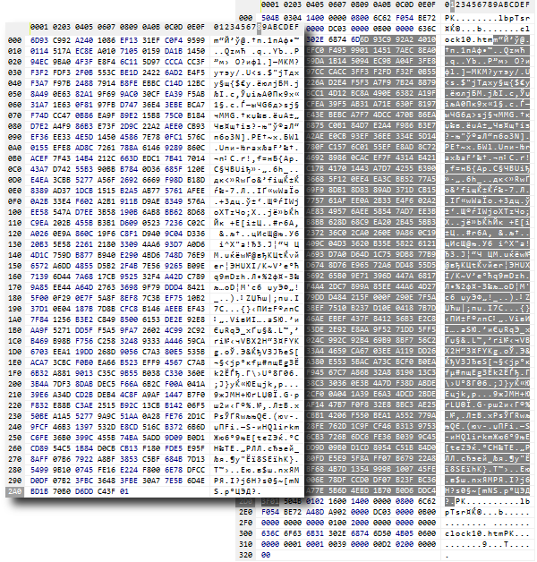

# Encryption, hashing, and data packaging: CryptEncode

The MQL5 function responsible for data encryption, hashing, and compression is CryptEncode. It transforms the data of the passed source array data to the destination array result by the specified method.

int CryptEncode(ENUM_CRYPT_METHOD method, const uchar &data[], const uchar &key[], uchar &result[])

Encryption methods also require passing a byte array key with a private (secret) key: its length depends on the specific method and is specified in the ENUM_CRYPT_METHOD method table in the previous section. If the size of the key array is larger, only the first bytes in the required quantity will still be used for the key.

A key is not needed for hashing or compression, but there is one caveat for CRYPT_ARCH_ZIP. The fact is that the implementation of the "deflate" algorithm built into the terminal adds several bytes to the resulting data to control the integrity: 2 initial bytes contain the settings of the "deflate" algorithm, and 4 bytes at the end contain the Adler32 checksum. Because of this feature, the resulting packed container differs from the one generated by ZIP archives for each individual element of the archive (the ZIP standard stores CRC32, which is similar in meaning, in its headers). Therefore, in order to be able to create and read compatible ZIP archives based on data packed by the CryptEncode function, MQL5 allows you to disable your own integrity check and the generation of extra bytes using a special value in the key array.

```
uchar key[] = {1, 0, 0, 0};
CryptEncode(CRYPT_ARCH_ZIP, data, key, result);

```

Any key with a length of at least 4 bytes can be used. The obtained result array can be enriched with a title according to the standard ZIP format (this question is out of the scope of the book) to create an archive accessible to other programs.

The function returns the number of bytes placed in the destination array or 0 on error. The error code, as usual, will be stored in _LastError.

Let's check the function performance using the script CryptEncode.mq5. It allows the user to enter text (Text) or specify a file (File) for processing. To use the file, you need to clear the Text field.

You can choose a specific Method or loop through all the methods at once to visually see and compare different results. For such a review loop, leave the default value _CRYPT_ALL in the Method parameter.

By the way, to introduce such functionality, we again needed to extend the standard enumeration (this time ENUM_CRYPT_METHOD), but since enumerations in MQL5 cannot be inherited as classes, a new enumeration ENUM_CRYPT_METHOD_EXT is actually declared here. An added bonus of this is that we have added friendlier names for the elements (in the comments, with hints that will be displayed in the settings dialog).

```
enum ENUM_CRYPT_METHOD_EXT
{
   _CRYPT_ALL = 0xFF,                      // Try All in a Loop
   _CRYPT_DES = CRYPT_DES,                 // DES    (key required, 7 bytes)
   _CRYPT_AES128 = CRYPT_AES128,           // AES128 (key required, 16 bytes)
   _CRYPT_AES256 = CRYPT_AES256,           // AES256 (key required, 32 bytes)
   _CRYPT_HASH_MD5 = CRYPT_HASH_MD5,       // MD5
   _CRYPT_HASH_SHA1 = CRYPT_HASH_SHA1,     // SHA1
   _CRYPT_HASH_SHA256 = CRYPT_HASH_SHA256, // SHA256
   _CRYPT_ARCH_ZIP = CRYPT_ARCH_ZIP,       // ZIP
   _CRYPT_BASE64 = CRYPT_BASE64,           // BASE64
};
   
input string Text = "Let's encrypt this message"; // Text (empty to process File)
input string File = "MQL5Book/clock10.htm"; // File (used only if Text is empty)
input ENUM_CRYPT_METHOD_EXT Method = _CRYPT_ALL;

```

By default, the Text parameter is filled with a message that is supposed to be encrypted. You can replace it with your own. If we clear Text, the program will process the file. At least one of the parameters (Text or File) should contain information.

Since encryption requires a key, the other two options allow you to enter it directly as text (although the key does not have to be text and can contain any binary data, but they are not supported in inputs) or generate the desired length, depending on the encryption method.

```
enum DUMMY_KEY_LENGTH
{
   DUMMY_KEY_0 = 0,   // 0 bytes (no key)
   DUMMY_KEY_7 = 7,   // 7 bytes (sufficient for DES)
   DUMMY_KEY_16 = 16, // 16 bytes (sufficient for AES128)
   DUMMY_KEY_32 = 32, // 32 bytes (sufficient for AES256)
   DUMMY_KEY_CUSTOM,  // use CustomKey
};
   
input DUMMY_KEY_LENGTH GenerateKey = DUMMY_KEY_CUSTOM; // GenerateKey (length, or from CustomKey)
input string CustomKey = "My top secret key is very strong";

```

Finally, there is an option DisableCRCinZIP to enable ZIP compatibility mode, which only affects the CRYPT_ARCH_ZIP method.

```
input bool DisableCRCinZIP = false;

```

To simplify checks of whether the method requires an encryption key or a hash is calculated (an irreversible one-way conversion), 2 macros are defined.

```
#define KEY_REQUIRED(C) ((C) == CRYPT_DES || (C) == CRYPT_AES128 || (C) == CRYPT_AES256)
#define IS_HASH(C) ((C) == CRYPT_HASH_MD5 || (C) == CRYPT_HASH_SHA1 || (C) == CRYPT_HASH_SHA256)

```

The beginning of OnStart contains a description of the required variables and arrays.

```
void OnStart()
{
   ENUM_CRYPT_METHOD method = 0;
   int methods[];           // here we will collect all the elements of ENUM_CRYPT_METHOD for looping over them
   uchar key[] = {};        // empty by default: suitable for hashing, zip, base64
   uchar zip[], opt[] = {1, 0, 0, 0}; // "options" for zip
   uchar data[], result[];  // initial data and result

```

According to GenerateKey settings, we get the key from the CustomKey field or just populate the key array with monotonically increasing integer values. In reality, the key should be a secret; non-trivial, arbitrarily chosen block of values.

```
   if(GenerateKey == DUMMY_KEY_CUSTOM)
   {
      if(StringLen(CustomKey))
      {
         PRTF(CustomKey);
         StringToCharArray(CustomKey, key, 0, -1, CP_UTF8);
         ArrayResize(key, ArraySize(key) - 1);
      }
   }
   else if(GenerateKey != DUMMY_KEY_0)
   {
      ArrayResize(key, GenerateKey);
      for(int i = 0; i < GenerateKey; ++i) key[i] = (uchar)i;
   }

```

Here and below, please note the use of ArrayResize after StringToCharArray. Be sure to reduce the array by 1 element, because in case the function StringToCharArray converts the string to an array of bytes, including the terminal 0, this can break the expected execution of the program. In particular, in this case, we will have an extra zero byte in the secret key, and if a program with a similar artifact is not used on the receiving side, then it will not be able to decrypt the message. Such extra zeros can also affect compatibility with data exchange protocols (if one or another integration of an MQL program with the "outside world" is performed).

Next, we log a raw representation of the resulting key in hexadecimal format: this is done by the ByteArrayPrint function which was used in the section [Writing and reading files in simplified mode](/en/book/common/files/files_save_load).

```
   if(ArraySize(key))
   {   
      Print("Key (bytes):");
      ByteArrayPrint(key);
   }
   else
   {
      Print("Key is not provided");
   }

```

Subject to the availability of Text or File, we populate the data array either with text characters or with file contents.

```
   if(StringLen(Text))
   {
      PRTF(Text);
      PRTF(StringToCharArray(Text, data, 0, -1, CP_UTF8));
      ArrayResize(data, ArraySize(data) - 1);
   }
   else if(StringLen(File))
   {
      PRTF(File);
      if(PRTF(FileLoad(File, data)) <= 0)
      {
         return; // error
      }
   }

```

Finally, we loop through all the methods or perform the transformation once with a specific method.

```
   const int n = (Method == _CRYPT_ALL) ?
      EnumToArray(method, methods, 0, UCHAR_MAX) : 1;
   ResetLastError();
   for(int i = 0; i < n; ++i)
   {
      method = (ENUM_CRYPT_METHOD)((Method == _CRYPT_ALL) ? methods[i] : Method);
      Print("- ", i, " ", EnumToString(method), ", key required: ",
         KEY_REQUIRED(method));
      
      if(method == CRYPT_ARCH_ZIP)
      {
         if(DisableCRCinZIP)
         {
            ArrayCopy(zip, opt); // array with additional option dynamic for ArraySwap
         }
         ArraySwap(key, zip); // change key to empty or option
      }
      
      if(PRTF(CryptEncode(method, data, key, result)))
      {
         if(StringLen(Text))
         {
            // code page Latin (Western) to unify the display for all users
            Print(CharArrayToString(result, 0, WHOLE_ARRAY, 1252));
            ByteArrayPrint(result);
            if(method != CRYPT_BASE64)
            {
               const uchar dummy[] = {};
               uchar readable[];
               if(PRTF(CryptEncode(CRYPT_BASE64, result, dummy, readable)))
               {
                  PrintFormat("Try to decode this with CryptDecode.mq5 (%s):",
                     EnumToString(method));
                  // to receive encoded data back for decoding
                  // via string input, apply Base64 over binary result
                  Print("base64:'" + CharArrayToString(readable, 0, WHOLE_ARRAY, 1252) + "'");
               }
            }
         }
         else
         {
            string parts[];
            const string filename = File + "." +
               parts[StringSplit(EnumToString(method), '_', parts) - 1];
            if(PRTF(FileSave(filename, result)))
            {
               Print("File saved: ", filename);
               if(IS_HASH(method))
               {
                  ByteArrayPrint(result, 1000, "");
               }
            }
         }
      }
   }
}

```

When we convert text, we log the result, but since it is almost always binary data, with the exception of the CRYPT_BASE64 method, their display will be complete gibberish (to say the truth, binary data should not be logged, but we do this for clarity). Non-printable symbols and symbols with codes greater than 128 are displayed differently on computers with different languages. Therefore, in order to unify the display of examples for all readers, when forming a line in CharArrayToString, we use an explicit code page (1252, Western European languages). True, the fonts used when publishing a book will most likely contribute to how certain characters will be displayed (the set of glyphs in fonts may be limited).

It is important to note that we control the choice of code page only in the display method, and the bytes in the result array do not change because of this (of course, the string obtained in this way should not be sent anywhere further; it is needed only for visualization to use the bytes of the result itself for data exchange).

However, it is still desirable for us to provide the user with some opportunity to save the encrypted result in order to decode it later. The simplest way is to re-transform the binary data using the CRYPT_BASE64 method.

In the case of file encoding, we simply save the result in a new file with a name in which the extension of the last word in the method name is added to the original one. For example, by applying CRYPT_HASH_MD5 to the file Example.txt, we will get the output file Example.txt.MD5 containing the MD5 hash of the source file. Please note that for the CRYPT_ARCH_ZIP method, we will get a file with a ZIP extension, but it is not a standard ZIP archive (due to the lack of headers with meta information and a table of contents).

Let's run the script with the default settings: they correspond to checking in the loop all methods for the text "Let's encrypt this message".

```
CustomKey=My top secret key is very strong / ok
Key (bytes):
[00] 4D | 79 | 20 | 74 | 6F | 70 | 20 | 73 | 65 | 63 | 72 | 65 | 74 | 20 | 6B | 65 | 
[16] 79 | 20 | 69 | 73 | 20 | 76 | 65 | 72 | 79 | 20 | 73 | 74 | 72 | 6F | 6E | 67 | 
Text=Let's encrypt this message / ok
StringToCharArray(Text,data,0,-1,CP_UTF8)=26 / ok
- 0 CRYPT_BASE64, key required: false
CryptEncode(method,data,key,result)=36 / ok
TGV0J3MgZW5jcnlwdCB0aGlzIG1lc3NhZ2U=
[00] 54 | 47 | 56 | 30 | 4A | 33 | 4D | 67 | 5A | 57 | 35 | 6A | 63 | 6E | 6C | 77 | 
[16] 64 | 43 | 42 | 30 | 61 | 47 | 6C | 7A | 49 | 47 | 31 | 6C | 63 | 33 | 4E | 68 | 
[32] 5A | 32 | 55 | 3D | 
- 1 CRYPT_AES128, key required: true
CryptEncode(method,data,key,result)=32 / ok
¯T* Ë[3hß Ã/-C }¬ŠÑØN¨®Ê† ‡Ñ
[00] 01 | 0B | AF | 54 | 2A | 12 | CB | 5B | 33 | 68 | DF | 0E | C3 | 2F | 2D | 43 | 
[16] 19 | 7D | AC | 8A | D1 | 8F | D8 | 4E | A8 | AE | CA | 81 | 86 | 06 | 87 | D1 | 
CryptEncode(CRYPT_BASE64,result,dummy,readable)=44 / ok
Try to decode this with CryptDecode.mq5 (CRYPT_AES128):
base64:'AQuvVCoSy1szaN8Owy8tQxl9rIrRj9hOqK7KgYYGh9E='
- 2 CRYPT_AES256, key required: true
CryptEncode(method,data,key,result)=32 / ok
ø‘UL»ÉsëDC‰ô  ¬.K)ŒýÁ LḠ+< !Dï
[00] F8 | 91 | 55 | 4C | BB | C9 | 73 | EB | 44 | 43 | 89 | F4 | 06 | 13 | AC | 2E | 
[16] 4B | 29 | 8C | FD | C1 | 11 | 4C | E1 | B8 | 05 | 2B | 3C | 14 | 21 | 44 | EF | 
CryptEncode(CRYPT_BASE64,result,dummy,readable)=44 / ok
Try to decode this with CryptDecode.mq5 (CRYPT_AES256):
base64:'+JFVTLvJc+tEQ4n0BhOsLkspjP3BEUzhuAUrPBQhRO8='
- 3 CRYPT_DES, key required: true
CryptEncode(method,data,key,result)=32 / ok
µ b &“#ÇÅ+ýº'¥ B8f¡rØ-Pè<6âì‚Ë£
[00] B5 | 06 | 9D | 62 | 11 | 26 | 93 | 23 | C7 | C5 | 2B | FD | BA | 27 | A5 | 10 | 
[16] 42 | 38 | 66 | A1 | 72 | D8 | 2D | 50 | E8 | 3C | 36 | E2 | EC | 82 | CB | A3 | 
CryptEncode(CRYPT_BASE64,result,dummy,readable)=44 / ok
Try to decode this with CryptDecode.mq5 (CRYPT_DES):
base64:'tQadYhEmkyPHxSv9uielEEI4ZqFy2C1Q6Dw24uyCy6M='
- 4 CRYPT_HASH_SHA1, key required: false
CryptEncode(method,data,key,result)=20 / ok
§ßö*©ºø
€|)bËbzÇ͠ۀ
[00] A7 | DF | F6 | 2A | A9 | BA | F8 | 0A | 80 | 7C | 29 | 62 | CB | 62 | 7A | C7 | 
[16] CD | 0E | DB | 80 | 
CryptEncode(CRYPT_BASE64,result,dummy,readable)=28 / ok
Try to decode this with CryptDecode.mq5 (CRYPT_HASH_SHA1):
base64:'p9/2Kqm6+AqAfCliy2J6x80O24A='
- 5 CRYPT_HASH_SHA256, key required: false
CryptEncode(method,data,key,result)=32 / ok
ÚZ2š€»”¾7 €… ñ—ÄÁ´˜¦“ome2r@¾ô®³”
[00] DA | 5A | 32 | 9A | 80 | BB | 94 | BE | 37 | 0C | 80 | 85 | 07 | F1 | 96 | C4 | 
[16] C1 | B4 | 98 | A6 | 93 | 6F | 6D | 65 | 32 | 72 | 40 | BE | F4 | AE | B3 | 94 | 
CryptEncode(CRYPT_BASE64,result,dummy,readable)=44 / ok
Try to decode this with CryptDecode.mq5 (CRYPT_HASH_SHA256):
base64:'2loymoC7lL43DICFB/GWxMG0mKaTb21lMnJAvvSus5Q='
- 6 CRYPT_HASH_MD5, key required: false
CryptEncode(method,data,key,result)=16 / ok
zIGT…  Fû;–3þèå
[00] 7A | 49 | 47 | 54 | 85 | 1B | 7F | 11 | 46 | FB | 3B | 97 | 33 | FE | E8 | E5 | 
CryptEncode(CRYPT_BASE64,result,dummy,readable)=24 / ok
Try to decode this with CryptDecode.mq5 (CRYPT_HASH_MD5):
base64:'eklHVIUbfxFG+zuXM/7o5Q=='
- 7 CRYPT_ARCH_ZIP, key required: false
CryptEncode(method,data,key,result)=34 / ok
x^óI-Q/VHÍK.ª,(Q(ÉÈ,VÈM-.NLO 
[00] 78 | 5E | F3 | 49 | 2D | 51 | 2F | 56 | 48 | CD | 4B | 2E | AA | 2C | 28 | 51 | 
[16] 28 | C9 | C8 | 2C | 56 | C8 | 4D | 2D | 2E | 4E | 4C | 4F | 05 | 00 | 80 | 07 | 
[32] 09 | C2 | 
CryptEncode(CRYPT_BASE64,result,dummy,readable)=48 / ok
Try to decode this with CryptDecode.mq5 (CRYPT_ARCH_ZIP):
base64:'eF7zSS1RL1ZIzUsuqiwoUSjJyCxWyE0tLk5MTwUAgAcJwg=='

```

The key in this case is of sufficient length for all three encryption methods, and other methods for which it is not needed simply ignore it. Therefore, all function calls have been completed successfully.

In the next section, we will learn how to decode encryptions and we can check if the CryptDecode function returns the original message. Please note this piece of the log.

The enabled DisableCRCinZIP option will reduce the result of the CRYPT_ARCH_ZIP method by a few overhead bytes.

```
- 7 CRYPT_ARCH_ZIP, key required: false
CryptEncode(method,data,key,result)=28 / ok
óI-Q/VHÍK.ª,(Q(ÉÈ,VÈM-.NLO 
[00] F3 | 49 | 2D | 51 | 2F | 56 | 48 | CD | 4B | 2E | AA | 2C | 28 | 51 | 28 | C9 | 
[16] C8 | 2C | 56 | C8 | 4D | 2D | 2E | 4E | 4C | 4F | 05 | 00 | 
CryptEncode(CRYPT_BASE64,result,dummy,readable)=40 / ok
Try to decode this with CryptDecode.mq5 (CRYPT_ARCH_ZIP):
base64:'80ktUS9WSM1LLqosKFEoycgsVshNLS5OTE8FAA=='

```

Now let's transfer the experiments on encoding to files. To do this, run the script again and erase the text from the Text field. As a result, the program will process the file MQL5Book/clock10.htm several times and will create several derived files with different extensions.

```
File=MQL5Book/clock10.htm / ok
FileLoad(File,data)=988 / ok
- 0 CRYPT_BASE64, key required: false
CryptEncode(method,data,key,result)=1320 / ok
FileSave(filename,result)=true / ok
File saved: MQL5Book/clock10.htm.BASE64
- 1 CRYPT_AES128, key required: true
CryptEncode(method,data,key,result)=992 / ok
FileSave(filename,result)=true / ok
File saved: MQL5Book/clock10.htm.AES128
- 2 CRYPT_AES256, key required: true
CryptEncode(method,data,key,result)=992 / ok
FileSave(filename,result)=true / ok
File saved: MQL5Book/clock10.htm.AES256
- 3 CRYPT_DES, key required: true
CryptEncode(method,data,key,result)=992 / ok
FileSave(filename,result)=true / ok
File saved: MQL5Book/clock10.htm.DES
- 4 CRYPT_HASH_SHA1, key required: false
CryptEncode(method,data,key,result)=20 / ok
FileSave(filename,result)=true / ok
File saved: MQL5Book/clock10.htm.SHA1
[00] 486ADFDD071CD23AB28E820B164D813A310B213F
- 5 CRYPT_HASH_SHA256, key required: false
CryptEncode(method,data,key,result)=32 / ok
FileSave(filename,result)=true / ok
File saved: MQL5Book/clock10.htm.SHA256
[00] 8990BBAC9C23B1F987952564EBCEF2078232D8C9D6F2CCC2A50784E8CDE044D0
- 6 CRYPT_HASH_MD5, key required: false
CryptEncode(method,data,key,result)=16 / ok
FileSave(filename,result)=true / ok
File saved: MQL5Book/clock10.htm.MD5
[00] 0CC4FBC899554BE0C0DBF5C18748C773
- 7 CRYPT_ARCH_ZIP, key required: false
CryptEncode(method,data,key,result)=687 / ok
FileSave(filename,result)=true / ok
File saved: MQL5Book/clock10.htm.ZIP

```

You can look inside all the files from the file manager and make sure that there is nothing left in common with the original content. Many file managers have commands or plugins to calculate hash sums so that they can be compared to MD5, SHA1, and SHA256 hex values printed out to the log.

If we try to encode a text or a file without providing a key of the correct length, we will get an INVALID_ARRAY(4006) error. For example, for a default text message, we select AES256 in the method parameter (requires a 32-byte key). Using the GenerateKey parameter, we order a key with a length of 16 bytes (or you can partially or completely remove the text from the CustomKey field, leaving GenerateKey default).

```
Key (bytes):
[00] 00 | 01 | 02 | 03 | 04 | 05 | 06 | 07 | 08 | 09 | 0A | 0B | 0C | 0D | 0E | 0F | 
Text=Let's encrypt this message / ok
StringToCharArray(Text,data,0,-1,CP_UTF8)=26 / ok
- 0 CRYPT_AES256, key required: true
CryptEncode(method,data,key,result)=0 / INVALID_ARRAY(4006)

```

You can also compress the same file (as we did with clock10.htm) using the CRYPT_ARCH_ZIP method or using a regular archiver. If you later look with a binary viewer utility (which is usually built into the file manager), then both results will show a common packed block, and the differences will be only in the meta-data framing it.



Comparison of a file compressed with the CRYPT_ARCH_ZIP method (left) and a standard ZIP archive with it (right)

It shows that the middle and main part of the archive is a sequence of bytes (highlighted in dark) identical to those produced by the CryptEncode function.

Finally, we will show how the Base64 text representation of a graphic file clock10.png was generated. To do this, clear the field Text and write MQL5Book/clock10.png in the File parameter. Choose Base64 in the drop-down list Method.

```
File=MQL5Book/clock10.png / ok
FileLoad(File,data)=457 / ok
- 0 CRYPT_BASE64, key required: false
CryptEncode(method,data,key,result)=612 / ok
FileSave(filename,result)=true / ok
File saved: MQL5Book/clock10.png.BASE64

```

The clock10.png.BASE64 file has been created as a result. Inside it, we will see the very line that is inserted in the web page code, in the img tag.

By the way, the "deflate" compression method is the basis for the PNG graphics format, so we can use CryptEncode to save resource bitmaps to PNG files. The header file PNG.mqh is included with the book, with minimal support for internal structures necessary to describe the image: it is suggested to experiment with its source code independently. Using PNG.mqh, we have written a simple script CryptPNG.mq5 which converts the resource from the "euro.bmp" file supplied with the terminal to the "my.png" file. Loading PNG files is not implemented.

```
#resource "\\Images\\euro.bmp"
   
#include <MQL5Book/PNG.mqh>
   
void OnStart()
{
   uchar null[];      // empty key for CRYPT_ARCH_ZIP
   uchar result[];    // receiving array
   uint data[];       // original pixels
   uchar bytes[];     // original bytes
   int width, height;
   PRTF(ResourceReadImage("::Images\\euro.bmp", data, width, height));
   
   ArrayResize(bytes, ArraySize(data) * 3 + width); // *3 for PNG_CTYPE_TRUECOLOR (RGB)
   ArrayInitialize(bytes, 0);
   int j = 0;
   for(int i = 0; i < ArraySize(data); ++i)
   {
      if(i % width == 0) bytes[j++] = 0; // each line is prepended with a filter mode byte
      const uint c = data[i];
      // bytes[j++] = (uchar)((c >> 24) & 0xFF); // alpha, for PNG_CTYPE_TRUECOLORALPHA (ARGB)
      bytes[j++] = (uchar)((c >> 16) & 0xFF);
      bytes[j++] = (uchar)((c >> 8) & 0xFF);
      bytes[j++] = (uchar)(c & 0xFF);
   }
   
   PRTF(CryptEncode(CRYPT_ARCH_ZIP, bytes, null, result));
   
   int h = PRTF(FileOpen("my.png", FILE_BIN | FILE_WRITE));
   
   PNG::Image image(width, height, result); // default PNG_CTYPE_TRUECOLOR (RGB)
   image.write(h);
   
   FileClose(h);
}

```
