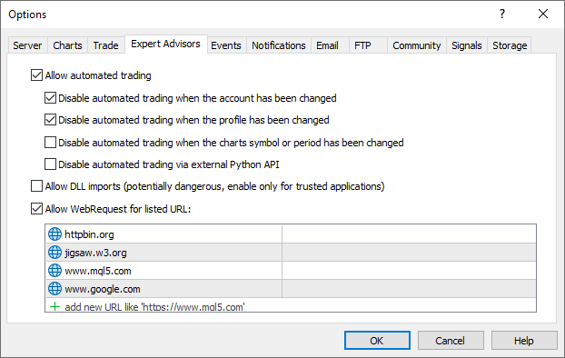

# Network functions

MQL programs can communicate with other computers on a distributed network or Internet servers using various protocols. The functions support operations with websites and services (HTTP/HTTPS), file transfer (FTP), email sending (SMTP), and push notifications.

Network functions can be divided into three groups:

- SendFTP, SendMail, and SendNotification are the most basic functions for sending files, e-mails, and mobile notifications.
- The WebRequest function is designed to work with web resources and allows you to easily send HTTP requests (including GET and POST).
- The set of Socket functions allows you to create a TCP connection (including a secure TLS connection) with a remote host via system sockets.

The sequence in which the groups are listed corresponds to the transition from high-level functions that offer ready-made mechanisms for interaction between the client and the server, to low-level ones that allow the implementation of an arbitrary application protocol according to the requirements of a particular public service (for example, a cryptocurrency exchange or a trading signal service). Of course, such an implementation requires a lot of effort.

For end-user safety, the list of allowed web addresses that an MQL program can connect to using Socket functions and WebRequest must be explicitly specified in the settings dialog on the Expert Advisors tab. Here you can specify domains, the full path to web pages (not only the site, but also other fragments of the URL, such as folders or a port number), or IP addresses. Below is a screenshot of the settings for some of the domains from the examples in this chapter.

Permissions to access network resources in the terminal settings

You cannot programmatically edit this list. If you try to access a network resource that is not in this list, the MQL program will receive an error and the request will be rejected.

It is important to note that all network functions provide only a client connection to a particular server, that is, it is impossible to organize a server using MQL5 to wait and process incoming requests. For this purpose, it will be necessary to integrate the terminal with an external program or an Internet service (for example, with a cloud one).
