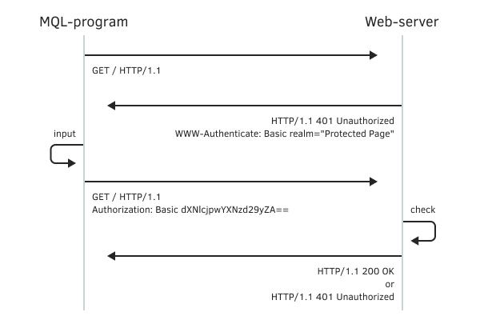
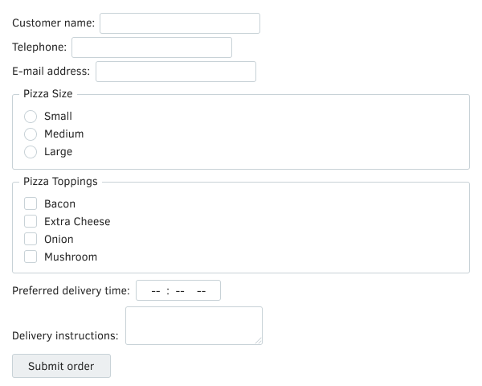

# Data exchange with a web server via HTTP/HTTPS

MQL5 allows you to integrate programs with web services and request data from the Internet. Data can be sent and received via HTTP/HTTPS protocols using the WebRequest function, which has two versions: for simplified and for advanced interaction with web servers.

int WebRequest(const string method, const string url, const string cookie, const string referer,  

   int timeout, const char &data[], int size, char &result[], string &response)

int WebRequest(const string method, const string url, const string headers, int timeout,  

   const char &data[], char &result[], string &response)

The main difference between the two functions is that the simplified version allows you to specify only two types of headers in the request: a cookie and a referer, i.e. the address from where the transition is made (there is no typo here — historically the word "referrer" is written in HTTP headers through one 'r'). The extended version takes a generic headers parameter to send an arbitrary set of headers. Request headers are of the form "name: value" and are joined by a line break "\r\n" if there is more than one.

If we assume that the cookie string must contain "name1=value1; name2=value2" and the referer link is equal to "google.com", then to call the second version of the function with the same effect as the first one, we need to add the following in the headers parameter: "Cookie: name1=value1; name2=value2\r\nReferer: google.com".

The method parameter specifies one of the protocol methods, "HEAD", "GET", or "POST". The address of the requested resource or service is passed in the url parameter. According to the HTTP specification, the length of a network resource identifier is limited to 2048 bytes, but at the time of writing the book, MQL5 had a limit of 1024 bytes.

The maximum duration of a request is determined by the timeout in milliseconds.

Both versions of the function transfer data from the data array to the server. The first option additionally requires specifying the size of this array in bytes (size).

To send simple requests with values of several variables, you can combine them into a string like "name1=value1&name2=value2&..." and add them to the GET request address, after the delimiter character '?' or put in the data array for a POST request using the "Content-Type: application/x-www-form-urlencoded" header. For more complex cases, such as uploading files, use a POST request and "Content-Type: multipart/form-data".

The receiving result array gets the server response body (if any). The server response headers are placed in the response string.

The function returns the HTTP response code of the server or -1 in case of a system error (for example, communication problems or parameter errors). The potential error codes that can appear in _LastError include:

- 5200 — ERR_WEBREQUEST_INVALID_ADDRESS — invalid URL
- 5201 — ERR_WEBREQUEST_CONNECT_FAILED — failed to connect to the specified URL
- 5202 — ERR_WEBREQUEST_TIMEOUT — the timeout for receiving a response from the server has been exceeded
- 5203 — ERR_WEBREQUEST_REQUEST_FAILED — any other error as a result of the request

Recall that even if the request was executed without errors at the MQL5 level, an application error may be contained in the HTTP response code of the server (for example, authorization is required, invalid data format, page not found, etc.). In this case, the result will be empty, and instructions for resolving the situation, as a rule, are clarified by analyzing the received response headers.

To use the WebRequest function, the server addresses should be added to the list of allowed URLs in the Expert Advisors tab in terminal settings. The server port is automatically selected based on the specified protocol: 80 for "http://" and 443 for "https://".

The fWebRequest unction is synchronous, i.e., it pauses program execution while waiting for a response from the server. In this regard, the function is not allowed to be called from indicators, since they work in common streams for each character. A delay in the execution of one indicator will stop updating all charts for this symbol.

When working in the strategy tester, the WebRequest function is not executed.

Let's start with a simple script WebRequestTest.mq5 that executes a single request. In the input parameters, we will provide a choice for the method (by default "GET"), the address of the test web page, additional headers (optional), and the timeout as well.

```
input string Method = "GET"; // Method (GET,POST)
input string Address = "https://httpbin.org/headers";
input string Headers;
input int Timeout = 5000;

```

The address is entered as in the browser line: all characters that are forbidden by the HTTP specification to be used directly in addresses (including local alphabet characters) are automatically "masked" by the WebRequest function before sending according to the urlencode algorithm (the browser does exactly the same, but we don't see it, since this view is intended to be passed over the network infrastructure, not to humans).

We will also add the DumpDataToFiles option: when it equals true, the script will save the server's response to a separate file since it can be quite large. Value false instructs to output data directly to the log.

```
input bool DumpDataToFiles = true;

```

We have to say right away that testing such scripts requires a server. Those interested can install a local web server, for example, node.js, but this requires self-preparation or installation of server-side scripts (in this case, connecting JavaScript modules). An easier way is to use public test web servers available on the Internet. You could use, for example, httpbin.org, httpbingo.org, webhook site, putsreq.com, www.mockable.io, or reqbin.com. They provide a different set of features. Choose or find the right one for you (convenient and understandable, or as flexible as possible).

In the Address parameter the default is the address of the endpoint of the server API httpbin.org. This dynamic "web page" returns the HTTP headers of its request (in JSON format) to the client. Thus, we will be able to see in our program what exactly came to the web server from the terminal.

Don't forget to add the "httpbin.org" domain to the allowed list in the terminal settings.

The JSON text format is the de facto standard for web services. Ready-made implementations of classes for parsing JSON can be found on the mql5.com site, but for now, we'll just show the JSON "as is".

In the OnStart handler, we call WebRequest with the given parameters and process the result if the error code is non-negative. Server response headers (response) are always logged.

```
void OnStart()
{
   uchar data[], result[];
   string response;
   
   int code = PRTF(WebRequest(Method, Address, Headers, Timeout, data, result, response));
   if(code > -1)
   {
      Print(response);
      if(ArraySize(result) > 0)
      {
         PrintFormat("Got data: %d bytes", ArraySize(result));
         if(DumpDataToFiles)
         {
            string parts[];
            URL::parse(Address, parts);
            
            const string filename = parts[URL_HOST] +
               (StringLen(parts[URL_PATH]) > 1 ? parts[URL_PATH] : "/_index_.htm");
            Print("Saving ", filename);
            PRTF(FileSave(filename, result));
         }
         else
         {
            Print(CharArrayToString(result, 0, 80, CP_UTF8));
         }
      }
   }
}

```

To form the file name, we use the URL helper class from the header file URL.mqh (which will not be fully described here). Method URL::parse parses the passed string into URL components according to the specification as the general form of the URL is always "protocol://domain.com:port/path?query#hash"; note that many fragments are optional. The results are placed in the receiving array, the indexes in which correspond to specific parts of the URL and are described in the URL_PARTS enumeration:

```
enum URL_PARTS
{
   URL_COMPLETE,   // full address
   URL_SCHEME,     // protocol
   URL_USER,       // username/password (deprecated, not supported)
   URL_HOST,       // server
   URL_PORT,       // port number
   URL_PATH,       // path/directories
   URL_QUERY,      // query string after '?'
   URL_FRAGMENT,   // fragment after '#' (not highlighted)
   URL_ENUM_LENGTH
};

```

Thus, when the received data should be written to a file, the script creates it in a folder named after the server (parts[URL_HOST]) and so on, preserving the path hierarchy in the URL (parts[URL_PATH]): in the simplest case, this will simply be the name of the "endpoint". When the home page of a site is requested (the path contains only a slash '/'), the file is named "_index_.htm".

Let's try to run the script with default parameters, remembering to allow this server in the terminal settings first. In the log, we will see the following lines (HTTP headers of the server response and a message about the successful saving of the file):

```
WebRequest(Method,Address,Headers,Timeout,data,result,response)=200 / ok
Date: Fri, 22 Jul 2022 08:45:03 GMT
Content-Type: application/json
Content-Length: 291
Connection: keep-alive
Server: gunicorn/19.9.0
Access-Control-Allow-Origin: *
Access-Control-Allow-Credentials: true
   
Got data: 291 bytes
Saving httpbin.org/headers
FileSave(filename,result)=true / ok

```

The httpbin.org/headers file contains the headers of our request as seen by the server (the server added the JSON formatting itself when answering us).

```
{
  "headers":
  {
    "Accept": "*/*", 
    "Accept-Encoding": "gzip, deflate", 
    "Accept-Language": "ru,en", 
    "Host": "httpbin.org", 
    "User-Agent": "MetaTrader 5 Terminal/5.3333 (Windows NT 10.0; Win64; x64)", 
    "X-Amzn-Trace-Id": "Root=1-62da638f-2554..." // <- this is added by the reverse proxy server
  }
}

```

Thus, the terminal reports that it is ready to accept data of any type, with support for compression by specific methods and a list of preferred languages. In addition, it appears in the User-Agent field as MetaTrader 5. The latter may be undesirable when working with some sites that are optimized to work exclusively with browsers. Then we can specify a fictitious name in the headers input parameter, for example, "User-Agent: Mozilla/5.0 (Windows NT 10.0) AppleWebKit/537.36 (KHTML, like Gecko) Chrome/103.0.0.0 Safari/537.36".

Some of the test sites listed above allow you to organize a temporary test environment on the server with a random name for your personal experiment: to do this, you need to go to the site from a browser and get a unique link that usually works for 24 hours. Then you will be able to use this link as an address for requests from MQL5 and monitor the behavior of requests directly from the browser. There you can also configure server responses, in particular, attempt submitting forms.

Let's make this example slightly more difficult. The server may require additional actions from the client to fulfill the request, in particular, authorize, perform a "redirect" (go to a different address), reduce the frequency of requests, etc. All such "signals" are denoted by special HTTP codes returned by the WebRequest function. For example, codes 301 and 302 mean redirect for different reasons, and WebRequest executes it internally automatically, re-requesting the page at the address specified by the server (therefore, redirect codes never end up in the MQL program code). The 401 code requires the client to provide a username and password, and here the entire responsibility lies with us. There are many ways to send this data. A new script WebRequestAuth.mq5 demonstrates the handling of two authorization options that the server requests using HTTP response headers: "WWW-Authenticate: Basic" or "WWW-Authenticate: Digest". In headers it might look like this:

```
WWW-Authenticate:Basic realm="DemoBasicAuth"

```

Or like this:

```
WWW-Authenticate:Digest realm="DemoDigestAuth",qop="auth", »
»  nonce="cuFAuHbb5UDvtFGkZEb2mNxjqEG/DjDr",opaque="fyNjGC4x8Zgt830PpzbXRvoqExsZeQSDZj"

```

The first of them is the simplest and most unsafe, and therefore is practically not used: it is given in the book because of how easy it is to learn it at the first stage. The bottom line of its work is to generate the following HTTP request in response to a server request by adding a special header:

```
Authorization: Basic dXNlcjpwYXNzd29yZA==

```

Here, the "Basic" keyword is followed by the Base64-encoded string "user:password" with the actual username and password, and the ':' character is inserted hereinafter "as is" as a linking block. More clearly, the interaction process is shown in the image.



Simple authorization scheme on a web server

The authorization scheme Digest is considered more advanced. In this case, the server provides some additional information in its response:

- realms — the name of the site (site area) where the entry is made
- qop — a variation of the Digest method (we will only consider "auth")
- nonce — a random string that will be used to generate authorization data
- opaque — a random string that we will pass back "as is" in our headers
- algorithm — an optional name of the hashing algorithm, MD5 is assumed by default

For authorization, you need to perform the following steps:

1. Generate your own random string cnonce
2. Initialize or increment your request counter nc
3. Calculate hash1 = MD5(user:realm:password)
4. Calculate hash2 = MD5(method:uri), here uri is the path and name of the page
5. Calculate response = MD5(hash1:nonce:nc:cnonce:qop:hash2)

After that, the client can repeat the request to the server, adding a line like this to its headers:

```
Authorization: Digest username="user",realm="realm",nonce="...", »
»  uri="/path/to/page",qop=auth,nc=00000001,cnonce="...",response="...",opaque="..."

```

Since the server has the same information as the client, it will be able to repeat the calculations and check the hashes match.

Let's add variables to the script parameters to enter the username and password. By default, the Address parameter includes the address of the digest-auth endpoint, which can request authorization with parameters qop ("auth"), login ("test"), and password ("pass"). This is all optional in the endpoint path (you can test other methods and user credentials, like so: "https://httpbin.org/digest-auth/auth-int/mql5client/mql5password").

```
const string Method = "GET";
input string Address = "https://httpbin.org/digest-auth/auth/test/pass";
input string Headers = "User-Agent: noname";
input int Timeout = 5000;
input string User = "test";
input string Password = "pass";
input bool DumpDataToFiles = true;

```

We specified a dummy browser name in the Headers parameter to demonstrate the feature.

In the OnStart function, we add the processing of HTTP code 401. If a username and password are not provided, we will not be able to continue.

```
void OnStart()
{
   string parts[];
   URL::parse(Address, parts);
   uchar data[], result[];
   string response;
   int code = PRTF(WebRequest(Method, Address, Headers, Timeout, data, result, response));
   Print(response);
   if(code == 401)
   {
      if(StringLen(User) == 0 || StringLen(Password) == 0)
      {
         Print("Credentials required");
         return;
      }
      ...

```

The next step is to analyze the headers received from the server. For convenience, we have written the HttpHeader class (HttpHeader.mqh). The full text is passed to its constructor, as well as the element separator (in this case, the newline character '\n') and the character used between the name and value within each element (in this case, the colon ':'). During its creation, the object "parses" the text, and then the elements are made available through the overloaded operator [], with the type of its argument being a string. As a result, we can check for an authorization requirement by the name "WWW-Authenticate". If such an element exists in the text and is equal to "Basic", we form the response header "Authorization: Basic" with the login and password encoded in Base64.

```
      code = -1;
      HttpHeader header(response, '\n', ':');
      const string auth = header["WWW-Authenticate"];
      if(StringFind(auth, "Basic ") == 0)
      {
         string Header = Headers;
         if(StringLen(Header) > 0) Header += "\r\n";
         Header += "Authorization: Basic ";
         Header += HttpHeader::hash(User + ":" + Password, CRYPT_BASE64);
         PRTF(Header);
         code = PRTF(WebRequest(Method, Address, Header, Timeout, data, result, response));
         Print(response);
      }
      ...

```

For Digest authorization, everything is a little more complicated, following the algorithm outlined above.

```
      else if(StringFind(auth, "Digest ") == 0)
      {
         HttpHeader params(StringSubstr(auth, 7), ',', '=');
         string realm = HttpHeader::unquote(params["realm"]);
         if(realm != NULL)
         {
            string qop = HttpHeader::unquote(params["qop"]);
            if(qop == "auth")
            {
               string h1 = HttpHeader::hash(User + ":" + realm + ":" + Password);
               string h2 = HttpHeader::hash(Method + ":" + parts[URL_PATH]);
               string nonce = HttpHeader::unquote(params["nonce"]);
               string counter = StringFormat("%08x", 1);
               string cnonce = StringFormat("%08x", MathRand());
               string h3 = HttpHeader::hash(h1 + ":" + nonce + ":" + counter + ":" +
                  cnonce + ":" + qop + ":" + h2);
               
               string Header = Headers;
               if(StringLen(Header) > 0) Header += "\r\n";
               Header += "Authorization: Digest ";
               Header += "username=\"" + User + "\",";
               Header += "realm=\"" + realm + "\",";
               Header += "nonce=\"" + nonce + "\",";
               Header += "uri=\"" + parts[URL_PATH] + "\",";
               Header += "qop=" + qop + ",";
               Header += "nc=" + counter + ",";
               Header += "cnonce=\"" + cnonce + "\",";
               Header += "response=\"" + h3 + "\",";
               Header += "opaque=" + params["opaque"] + "";
               PRTF(Header);
               code = PRTF(WebRequest(Method, Address, Header, Timeout, data, result, response));
               Print(response);
            }
         }
      }

```

Static method HttpHeader::hash gets a string with a hexadecimal hash representation (default MD5) for all required compound strings. Based on this data, the header is formed for the next WebRequest call. The static HttpHeader::unquote method removes the enclosing quotes.

The rest of the script remained unchanged. A repeated HTTP request may succeed, and then we will get the content of the secure page, or authorization will be denied, and the server will write something like "Access denied".

Since the default parameters contain the correct values ("/digest-auth/auth/test/pass" corresponds to the user "test" and the password "pass"), we should get the following result of running the script (all main steps and data are logged).

```
WebRequest(Method,Address,Headers,Timeout,data,result,response)=401 / ok
Date: Fri, 22 Jul 2022 10:45:56 GMT
Content-Type: text/html; charset=utf-8
Content-Length: 0
Connection: keep-alive
Server: gunicorn/19.9.0
WWW-Authenticate: Digest realm="me@kennethreitz.com" »
»  nonce="87d28b529a7a8797f6c3b81845400370", qop="auth",
»  opaque="4cb97ad7ea915a6d24cf1ccbf6feeaba", algorithm=MD5, stale=FALSE
...

```

The first WebRequest call has ended with code 401, and among the response headers is an authorization request ("WWW-Authenticate") with the required parameters. Based on them, we calculated the correct answer and prepared headers for a new request.

```
Header=User-Agent: noname
Authorization: Digest username="test",realm="me@kennethreitz.com" »
»  nonce="87d28b529a7a8797f6c3b81845400370",uri="/digest-auth/auth/test/pass",
»  qop=auth,nc=00000001,cnonce="00001c74",
»  response="c09e52bca9cc90caf9a707d046b567b2",opaque="4cb97ad7ea915a6d24cf1ccbf6feeaba" / ok
...

```

The second request returns 200 and a payload that we write to the file.

```
WebRequest(Method,Address,Header,Timeout,data,result,response)=200 / ok
Date: Fri, 22 Jul 2022 10:45:56 GMT
Content-Type: application/json
Content-Length: 47
Connection: keep-alive
Server: gunicorn/19.9.0
...
Got data: 47 bytes
Saving httpbin.org/digest-auth/auth/test/pass
FileSave(filename,result)=true / ok

```

Inside the file MQL5/Files/httpbin.org/digest-auth/auth/test/pass you can find the "web page", or rather the status of successful authorization in JSON format.

```
{
  "authenticated": true, 
  "user": "test"
}

```

If you specify an incorrect password when running the script, we will receive an empty response from the server, and the file will not be written.

Using WebRequest, we automatically enter the field of distributed software systems, in which the correct operation depends not only on our client MQL code but also on the server (not to mention intermediate links, like a proxy). Therefore, you need to be prepared for the occurrence of other people's mistakes. In particular, at the time of writing the book in the implementation of the digest-auth endpoint on httpbin.org there was a problem: the username entered in the request did not participate in the authorization check, and therefore any login leads to successful authorization if the correct password is specified. Still, to check our script, use other services, for example, something like httpbingo.org/digest-auth/auth/test/pass. You can also configure the script to the address jigsaw.w3.org/HTTP/Digest/ — it expects login/password "guest"/"guest".

In practice, most sites implement authorization using forms embedded directly in web pages: inside the HTML code, they are essentially the form container tag with a set of input fields, which are filled in by the user and sent to the server using the POST method. In this regard, it makes sense to analyze the example of submitting a form. However, before getting into this in detail, it is desirable to highlight one more technique.

The thing is that the interaction between the client and the server is usually accompanied by a change in the state of both the client and the server. Using the example of authorization, this can be understood most clearly, since before authorization the user was unknown to the system, and after that, the system already knows the login and can apply the preferred settings for the site (for example, language, color, forum display method), and also allow access to those pages where unauthorized visitors cannot get into (the server stops such attempts by returning HTTP status 403, Forbidden).

Support and synchronization of the consistent state of the client and server parts of a distributed web application is provided using the cookies mechanism which implies named variables and their values in HTTP headers. The term goes back to "fortune cookies" because cookies also contain small messages invisible to the user.

Either side, server and client, can add cookie to the HTTP header. The server does this with a line like:

```
Set-Cookie: name=value; ⌠Domain=domain; Path=path; Expires=date; Max-Age=number_of_seconds ...⌡ᵒᵖᵗ

```

Only the name and value are required and the rest of the attributes are optional: here are the main ones − Domain, Path, Expires, and Max age, but in real situations, there are more of them.

Having received such a header (or several headers), the client must remember the name and value of the variable and send them to the server in all requests that address to the corresponding Domain and Path inside this domain until the expiration date (Expires or Max-Age).

In an outgoing HTTP request from a client, cookies are passed as a string:

```
Cookie: name⁽№⁾=value⁽№⁾ ⌠; name⁽ⁱ⁾=value⁽ⁱ⁾ ...⌡ᵒᵖᵗ

```

Here, separated by a semicolon and a space, all name=value pairs are listed; they are set by the server and known to this client, matched with the current request by the domain and path, and not expired.

The server and client exchange all the necessary cookies with each HTTP request, which is why this architectural style of distributed systems is called REST (Representational State Transfer). For example, after a user successfully logs in to the server, the latter sets (via the "Set-Cookie:" header) a special "cookie" with the user's identifier, after which the web browser (or, in our case, a terminal with an MQL program) will send it in subsequent requests (by adding the appropriate line to the "Cookie:" header).

The WebRequest function silently does all this work for us: collects cookies from incoming headers and adds appropriate cookies to outgoing HTTP requests.

Cookies are stored by the terminal and between sessions, according to their settings. To check this, it is enough to request a web page twice from a site using cookies.

Attention, cookies are stored in relation to the site and therefore are imperceptibly substituted in the outgoing headers of all MQL programs that use WebRequest for the same site.

To simplify sequential requests, it makes sense to formalize popular actions in a special class HTTPRequest (HTTPRequest.mqh). We will store common HTTP headers in it, which are likely to be needed for all requests (for example, supported languages, instructions for proxies, etc.). In addition, such a setting as timeout is also common. Both settings are passed to the object's constructor.

```
class HTTPRequest: public HttpCookie
{
protected:
   string common_headers;
   int timeout;
   
public:
   HTTPRequest(const string h, const int t = 5000):
      common_headers(h), timeout(t) { }
   ...

```

By default, the timeout is set to 5 seconds. The main, in a sense, universal method of the class is request.

```
   int request(const string method, const string address,
      string headers, const uchar &data[], uchar &result[], string &response)
   {
      if(headers == NULL) headers = common_headers;
      
      ArrayResize(result, 0);
      response = NULL;
      Print(">>> Request:\n", method + " " + address + "\n" + headers);
      
      const int code = PRTF(WebRequest(method, address, headers, timeout, data, result, response));
      Print("<<< Response:\n", response);
      return code;
   }
};

```

Let's describe a couple more methods for queries of specific types.

GET requests use only headers and the body of the document (the term payload is often used) is empty.

```
   int GET(const string address, uchar &result[], string &response,
      const string custom_headers = NULL)
   {
      uchar nodata[];
      return request("GET", address, custom_headers, nodata, result, response);
   }

```

In POST requests, there is usually a payload.

```
   int POST(const string address, const uchar &payload[],
      uchar &result[], string &response, const string custom_headers = NULL)
   {
      return request("POST", address, custom_headers, payload, result, response);
   }

```

Forms can be sent in different formats. The simplest one is "application/x-www-form-urlencoded". It implies that the payload will be a string (maybe a very long one, since the specifications do not impose restrictions, and it all depends on the settings of the web servers). For such forms, we will provide a more convenient overload of the POST method with the payload string parameter.

```
   int POST(const string address, const string payload,
      uchar &result[], string &response, const string custom_headers = NULL)
   {
      uchar bytes[];
      const int n = StringToCharArray(payload, bytes, 0, -1, CP_UTF8);
      ArrayResize(bytes, n - 1); // remove terminal zero
      return request("POST", address, custom_headers, bytes, result, response);
   }

```

Let's write a simple script to test our client web engine WebRequestCookie.mq5. Its task will be to request the same web page twice: the first time the server will most likely offer to set its cookies, and then they will be automatically substituted in the second request. In the input parameters, specify the address of the page for the test: let it be the mql5.com website. We will also simulate the default headers by the corrected "User-Agent" string.

```
input string Address = "https://www.mql5.com";
input string Headers = "User-Agent: Mozilla/5.0 (Windows NT 10.0) Chrome/103.0.0.0"; // Headers (use '|' as separator, if many specified)

```

In the main function of the script, we describe the HTTPRequest object and execute two GET requests in a loop.

Attention! This test works under the assumption that MQL programs have not yet visited the www.mql5.com site and have not received cookies from it. After running the script once, the cookies will remain in the terminal cache, and it will become impossible to reproduce the example: on both iterations of the loop, we will get the same log entries.   

   

Don't forget to add the "www.mql5.com" domain to the allowed list in the terminal settings.

```
void OnStart()
{
   uchar result[];
   string response;
   HTTPRequest http(Headers);
   
   for(int i = 0; i < 2; ++i)
   {
      if(http.GET(Address, result, response) > -1)
      {
         if(ArraySize(result) > 0)
         {
            PrintFormat("Got data: %d bytes", ArraySize(result));
            if(i == 0) // show the beginning of the document only the first time
            {
               const string s = CharArrayToString(result, 0, 160, CP_UTF8);
               int j = -1, k = -1;
               while((j = StringFind(s, "\r\n", j + 1)) != -1) k = j;
               Print(StringSubstr(s, 0, k));
            }
         }
      }
   }
}

```

The first iteration of the loop will generate the following log entries (with abbreviations):

```
>>> Request:
GET https://www.mql5.com
User-Agent: Mozilla/5.0 (Windows NT 10.0) Chrome/103.0.0.0
WebRequest(method,address,headers,timeout,data,result,response)=200 / ok
<<< Response:
Server: nginx
Date: Sun, 24 Jul 2022 19:04:35 GMT
Content-Type: text/html; charset=utf-8
Transfer-Encoding: chunked
Connection: keep-alive
Cache-Control: no-cache,no-store
Content-Encoding: gzip
Expires: -1
Pragma: no-cache
Set-Cookie: sid=CfDJ8O2AwC...Ne2yP5QXpPKA2; domain=.mql5.com; path=/; samesite=lax; httponly
Vary: Accept-Encoding
Strict-Transport-Security: max-age=31536000; includeSubDomains; preload
Content-Security-Policy: default-src 'self'; script-src 'self' ... 
Generate-Time: 2823
Agent-Type: desktop-ru-en
X-Cache-Status: MISS
Got data: 184396 bytes
   
<!DOCTYPE html>
<html lang="ru">
<head>
  <meta http-equiv="X-UA-Compatible" content="IE=edge" />

```

We received one new cookie with the name sid. To verify its effectiveness, you change to viewing the second part of the log, for the second iteration of the loop.

```
>>> Request:
GET https://www.mql5.com
User-Agent: Mozilla/5.0 (Windows NT 10.0) Chrome/103.0.0.0
WebRequest(method,address,headers,timeout,data,result,response)=200 / ok
<<< Response:
Server: nginx
Date: Sun, 24 Jul 2022 19:04:36 GMT
Content-Type: text/html; charset=utf-8
Transfer-Encoding: chunked
Connection: keep-alive
Cache-Control: no-cache, no-store, must-revalidate, no-transform
Content-Encoding: gzip
Expires: -1
Pragma: no-cache
Vary: Accept-Encoding
Strict-Transport-Security: max-age=31536000; includeSubDomains; preload
Content-Security-Policy: default-src 'self'; script-src 'self' ... 
Generate-Time: 2950
Agent-Type: desktop-ru-en
X-Cache-Status: MISS

```

Unfortunately, here we do not see the full outgoing headers formed inside WebRequest, but the instance of the cookie being sent to the server using the "Cookie:" header is proven by the fact that the server in its second response no longer asks to set it.

In theory, this cookie simply identifies the visitor (as most sites do) but does not signify their authorization. Therefore, let's return to the exercise of submitting the form in a general way, meaning in the future the private task of entering a login and password.

Recall that to submit the form, we can use the POST method with a string parameter payload. The principle of preparing data according to the "x-www-form-urlencoded" standard is that named variables and their values are written in one continuous line (somewhat similar to cookies).

```
name⁽№⁾=value⁽№⁾[&name⁽ⁱ⁾=value⁽ⁱ⁾...]ᵒᵖᵗ

```

The name and value are connected with the sign '=', and the pairs are joined using the ampersand character '&'. The value may be missing. For example,

```
Name=John&Age=33&Education=&Address=

```

It is important to note that from a technical point of view, this string must be converted according to the algorithm before sending urlencode (this is where the name of the format comes from), however, WebRequest does this transformation for us.

The variable names are determined by the web form (the contents of the tag form in a web page) or web application logic - in any case, the web server must be able to interpret the names and values. Therefore, to get acquainted with the technology, we need a test server with a form.

The test form is available at https://httpbin.org/forms/post. It is a dialog for ordering pizza.



Test web form

Its internal structure and behavior are described by the following HTML code. In it, we are primarily interested in input tags, which set the variables expected by the server. In addition, attention should be paid to the action attribute in the form tag, since it defines the address to which the POST request should be sent, and in this case, it is "/post", which together with the domain gives the string "httpbin.org/post". This is what we will use in the MQL program.

```
<!DOCTYPE html>
<html>
  <body>
  <form method="post" action="/post">
    <p><label>Customer name: <input name="custname"></label></p>
    <p><label>Telephone: <input type=tel name="custtel"></label></p>
    <p><label>E-mail address: <input type=email name="custemail"></label></p>
    <fieldset>
      <legend> Pizza Size </legend>
      <p><label> <input type=radio name=size value="small"> Small </label></p>
      <p><label> <input type=radio name=size value="medium"> Medium </label></p>
      <p><label> <input type=radio name=size value="large"> Large </label></p>
    </fieldset>
    <fieldset>
      <legend> Pizza Toppings </legend>
      <p><label> <input type=checkbox name="topping" value="bacon"> Bacon </label></p>
      <p><label> <input type=checkbox name="topping" value="cheese"> Extra Cheese </label></p>
      <p><label> <input type=checkbox name="topping" value="onion"> Onion </label></p>
      <p><label> <input type=checkbox name="topping" value="mushroom"> Mushroom </label></p>
    </fieldset>
    <p><label>Preferred delivery time: <input type=time min="11:00" max="21:00" step="900" name="delivery"></label></p>
    <p><label>Delivery instructions: <textarea name="comments"></textarea></label></p>
    <p><button>Submit order</button></p>
  </form>
  </body>
</html>

```

In the WebRequestForm.mq5 script, we have prepared similar input variables to be specified by the user before being sent to the server.

```
input string Address = "https://httpbin.org/post";
   
input string Customer = "custname=Vincent Silver";
input string Telephone = "custtel=123-123-123";
input string Email = "custemail=email@address.org";
input string PizzaSize = "size=small"; // PizzaSize (small,medium,large)
input string PizzaTopping = "topping=bacon"; // PizzaTopping (bacon,cheese,onion,mushroom)
input string DeliveryTime = "delivery=";
input string Comments = "comments=";

```

The already set strings are shown only for one-click testing: you can replace them with your own, but note that inside each string only the value to the right of '=' should be edited, and the name to the left of '=' should be kept (unknown names will be ignored by the server) .

In the OnStart function, we describe the HTTP header "Content-Type:" and prepare a concatenated string with all variables.

```
void OnStart()
{
   uchar result[];
   string response;
   string header = "Content-Type: application/x-www-form-urlencoded";
   string form_fields;
   StringConcatenate(form_fields,
      Customer, "&",
      Telephone, "&",
      Email, "&",
      PizzaSize, "&",
      PizzaTopping, "&",
      DeliveryTime, "&",
      Comments);
   HTTPRequest http;
   if(http.POST(Address, form_fields, result, response) > -1)
   {
      if(ArraySize(result) > 0)
      {
         PrintFormat("Got data: %d bytes", ArraySize(result));
         // NB: UTF-8 is implied for many content-types,
 // but some may be different, analyze the response headers
         Print(CharArrayToString(result, 0, WHOLE_ARRAY, CP_UTF8));
      }
   }
}

```

Then we execute the POST method and log the server response. Here is an example result.

```
>>> Request:
POST https://httpbin.org/post
Content-Type: application/x-www-form-urlencoded
WebRequest(method,address,headers,timeout,data,result,response)=200 / ok
<<< Response:
Date: Mon, 25 Jul 2022 08:41:41 GMT
Content-Type: application/json
Content-Length: 780
Connection: keep-alive
Server: gunicorn/19.9.0
Access-Control-Allow-Origin: *
Access-Control-Allow-Credentials: true
   
Got data: 721 bytes
{
  "args": {}, 
  "data": "", 
  "files": {}, 
  "form": {
    "comments": "", 
    "custemail": "email@address.org", 
    "custname": "Vincent Silver", 
    "custtel": "123-123-123", 
    "delivery": "", 
    "size": "small", 
    "topping": "bacon"
  }, 
  "headers": {
    "Accept": "*/*", 
    "Accept-Encoding": "gzip, deflate", 
    "Accept-Language": "ru,en", 
    "Content-Length": "127", 
    "Content-Type": "application/x-www-form-urlencoded", 
    "Host": "httpbin.org", 
    "User-Agent": "MetaTrader 5 Terminal/5.3333 (Windows NT 10.0; x64)", 
    "X-Amzn-Trace-Id": "Root=1-62de5745-25bd1d823a9609f01cff04ad"
  }, 
  "json": null, 
  "url": "https://httpbin.org/post"
}

```

The test server acknowledges receipt of the data as a JSON copy. In practice, the server, of course, will not return the data itself, but simply will report a success status and possibly redirect to another web page that the data had an effect on (for example, show the order number).

With the help of such POST requests, but of smaller size, authorization is usually performed as well. But to say the truth, most web services deliberately overcomplicate this process for security purposes and require you to first calculate several hash sums from the user's details. Specially developed public APIs usually have descriptions of all necessary algorithms in the documentation. But this is not always the case. In particular, we will not be able to log in using WebRequest on mql5.com because the site does not have an open programming interface.

When sending requests to web services, always adhere to the rule about not exceeding the frequency of requests: usually, each service specifies its own limits, and violation of them will lead to the subsequent blocking of your client program, account, or IP address.
