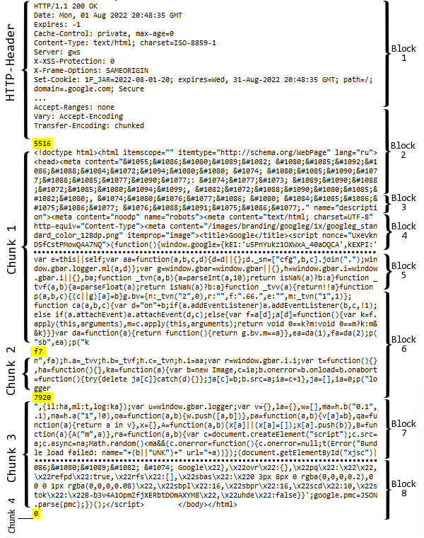

# Reading and writing data over a secure socket connection

A secure connection has its own set of data exchange functions between the client and the server. The names and concept of operation of the functions almost coincide with the previously considered functions [SocketRead](/en/book/advanced/network/network_socket_send_read) and [SocketSend](/en/book/advanced/network/network_socket_send_read).

int SocketTlsRead(int socket, uchar &buffer[], uint maxlen)

The SocketTlsRead function reads data from a secure TLS connection opened on the specified socket. The data gets into the buffer array passed by reference. If it is dynamic, its size will be increased according to the amount of data but no more than INT_MAX (2147483647) bytes.

The maxlen parameter specifies the number of decrypted bytes to be received (their number is always less than the amount of "raw" encrypted data coming into the socket's internal buffer). Data that does not fit in the array remains in the socket and can be received by the next SocketTlsRead call.

The function is executed until it receives the specified amount of data or until the timeout specified in [SocketTimeouts](/en/book/advanced/network/network_socket_timeouts) occurs.

In case of success, the function returns the number of bytes read; in case of error, it returns -1, while code 5273 (ERR_NETSOCKET_IO_ERROR) is written in _LastError. The presence of an error indicates that the connection was terminated.

int SocketTlsReadAvailable(int socket, uchar &buffer[], const uint maxlen)

The SocketTlsReadAvailable function reads all available decrypted data from a secure TLS connection but no more maxlen bytes. Unlike SocketTlsRead, SocketTlsReadAvailable does not wait for the mandatory presence of a given amount of data and immediately returns only what is present. Thus, if the internal buffer of the socket is "empty" (nothing has been received from the server yet, it has already been read or has not yet formed a block ready for decryption), the function will return 0 and nothing will be recorded in the receiving array buffer. This is a regular situation.

The value of maxlen must be between 1 and INT_MAX (2147483647).

int SocketTlsSend(int socket, const uchar &buffer[], uint bufferlen)

The SocketTlsSend function sends data from the buffer array over a secure connection opened on the specified socket. The principle of operation is the same as that of the previously described function [SocketSend](/en/book/advanced/network/network_socket_send_read), while the only difference is in the type of connection.

Let's create a new script SocketReadWriteHTTPS.mq5 based on the previously considered SocketReadWriteHTTP.mq5 and add flexibility in terms of choosing an HTTP method (GET by default, not HEAD), setting a timeout, and supporting secure connections. The default port is 443.

```
input string Method = "GET"; // Method (HEAD,GET)
input string Server = "www.google.com";
input uint Port = 443;
input uint Timeout = 5000;

```

The default server is [www.google.com](http://www.google.com). Do not forget to add it (and any other server that you enter) to the list of allowed ones in the terminal settings.

To determine whether the connection is secure or not, we will use the [SocketTlsCertificate](/en/book/advanced/network/network_socket_tls_handshake_cert) function: if it is successful, then the server has provided a certificate and TLS mode is active. If the function returns false and throws the error code NETSOCKET_NO_CERTIFICATE(5275), this means we are using a normal connection but the error can be ignored and reset since we are satisfied with an unsecured connection.

```
void OnStart()
{
   PRTF(Server);
   PRTF(Port);
   const int socket = PRTF(SocketCreate());
   if(socket == INVALID_HANDLE) return;
   SocketTimeouts(socket, Timeout, Timeout);
   if(PRTF(SocketConnect(socket, Server, Port, Timeout)))
   {
      string subject, issuer, serial, thumbprint; 
      datetime expiration;
      bool TLS = false;
      if(PRTF(SocketTlsCertificate(socket, subject, issuer, serial, thumbprint, expiration)))
      {
         PRTF(subject);
         PRTF(issuer);
         PRTF(serial);
         PRTF(thumbprint);
         PRTF(expiration);
         TLS = true;
      }
      ...

```

The rest of the OnStart function is implemented according to the previous plan: send a request using the HTTPSend function and accept the answer using HTTPRecv. But this time, we additionally pass the TLS flag to these functions, and they must be implemented slightly differently.

```
      if(PRTF(HTTPSend(socket, StringFormat("%s / HTTP/1.1\r\nHost: %s\r\n"
         "User-Agent: MetaTrader 5\r\n\r\n", Method, Server), TLS)))
      {
         string response;
         if(PRTF(HTTPRecv(socket, response, Timeout, TLS)))
         {
            Print("Got ", StringLen(response), " bytes");
            // for large documents, we will save to a file
            if(StringLen(response) > 1000)
            {
               int h = FileOpen(Server + ".htm", FILE_WRITE | FILE_TXT | FILE_ANSI, 0, CP_UTF8);
               FileWriteString(h, response);
               FileClose(h);
            }
            else
            {
               Print(response);
            }
         }
      }

```

From the example with HTTPSend, you can see that depending on the TLS flag, we use either SocketTlsSend or SocketSend.

```
bool HTTPSend(int socket, const string request, const bool TLS)
{ 
   char req[];
   int len = StringToCharArray(request, req, 0, WHOLE_ARRAY, CP_UTF8) - 1;
   if(len < 0) return false;
   return (TLS ? SocketTlsSend(socket, req, len) : SocketSend(socket, req, len)) == len;
}

```

Things are a bit more complicated with HTTPRecv. Since we provide the ability to download the entire page (not just the headers), we need some way to know if we have received all the data. Even after the entire document has been transmitted, the socket is usually left open to optimize future intended requests. But our program will not know if the transmission stopped normally, or maybe there was a temporary "congestion" somewhere in the network infrastructure (such relaxed, intermittent page loading can sometimes be observed in browsers). Or vice versa, in the event of a connection failure, we may wrongly believe that we have received the entire document.

The fact is that sockets themselves act only as a means of communication between programs and work with abstract blocks of data: they do not know the type of data, their meaning, and their logical conclusion. All these issues are handled by application protocols like HTTP. Therefore, we will need to delve into the specifications and implement the checks ourselves.

```
bool HTTPRecv(int socket, string &result, const uint timeout, const bool TLS)
{
   uchar response[]; // accumulate the data as a whole (headers + body of the web document)
   uchar block[];    // separate read block
   int len;          // current block size (signed integer for error flag -1)
   int lastLF = -1;  // position of the last line feed found LF(Line-Feed)
   int body = 0;     // offset where document body starts
   int size = 0;     // document size according to title
   result = "";      // set an empty result at the beginning
   int chunk_size = 0, chunk_start = 0, chunk_n = 1;
   const static string content_length = "Content-Length:";
   const static string crlf = "\r\n";
   const static int crlf_length = 2;
   ...

```

The simplest method for determining the size of the received data is based on analyzing the "Content-Length:" header. Here we need three variables: lastLF, size, and content_length. This header is not always present though, and we deal with "chunks" — variables chunk_size, chunk_start, crlf, and crlf_length are introduced to detect them.

To demonstrate various techniques for receiving data, we use in this example a "non-blocking" function SocketTlsReadAvailable. However, there is no similar function for an insecure connection, and therefore we have to write it ourselves (a little later). The general scheme of the algorithm is simple: it is a loop with attempts to receive new data blocks of 1024 (or less) bytes in size. If we manage to read something, we accumulate it in the response array. If the socket's input buffer is empty, the functions will return 0 and we pause a little. Finally, if an error or timeout occurs, the loop will break.

```
   uint start = GetTickCount();
   do 
   {
      ResetLastError();
      if((len = (TLS ? SocketTlsReadAvailable(socket, block, 1024) :
         SocketReadAvailable(socket, block, 1024))) > 0)
      {
         const int n = ArraySize(response);
         ArrayCopy(response, block, n); // put all the blocks together
         ...
         // main operation here
      }
      else
      {
         if(len == 0) Sleep(10); // wait a bit for the arrival of a portion of data
      }
   } 
   while(GetTickCount() - start < timeout && !IsStopped() && !_LastError);
   ...

```

First of all, you need to wait for the completion of the HTTP header in the input data stream. As we have already seen from the previous example, headers are separated from the document by a double newline, i.e., by the character sequence "\r\n\r\n". It is easy to detect by two '\n' (LF) symbols located one after the other.

The result of the search will be the offset in bytes from the beginning of the data, where the header ends and the document begins. We will store it in the body variable.

```
         if(body == 0) // look for the completion of the headers until we find it
         {
            for(int i = n; i < ArraySize(response); ++i)
            {
               if(response[i] == '\n') // LF
               {
                  if(lastLF == i - crlf_length) // found sequence "\r\n\r\n"
                  {
                     body = i + 1;
                     string headers = CharArrayToString(response, 0, i);
                     Print("* HTTP-header found, header size: ", body);
                     Print(headers);
                     const int p = StringFind(headers, content_length);
                     if(p > -1)
                     {
                        size = (int)StringToInteger(StringSubstr(headers,
                           p + StringLen(content_length)));
                        Print("* ", content_length, size);
                     }
                     ...
                     break; // header/body boundary found
                  }
                  lastLF = i;
               }
            }
         }
         
         if(size == ArraySize(response) - body) // entire document
         {
            Print("* Complete document");
            break;
         }
         ...

```

This immediately searches for the "Content-Length:" header and extracts the size from it. The filled size variable makes it possible to write an additional conditional statement to exit the data-receiving loop when the entire document has been received.

Some servers give the content in parts called "chunks". In such cases, the "Transfer-Encoding: chunked" line is present in the HTTP header, and the "Content-Length:" line is missing. Each chunk begins with a hexadecimal number indicating the size of the chunk, followed by a newline and the specified number of data bytes. The chunk ends with another newline. The last chunk that marks the end of the document has a zero size.

Please note that the division into such segments is performed by the server, based on its own, current "preferences" for optimizing sending, and has nothing to do with blocks (packets) of data into which information is divided at the socket level for transmission over the network. In other words, chunks tend to be arbitrarily fragmented and the boundary between network packets can even occur between digits in a chunk size.

Schematically, this can be depicted as follows (on the left are chunks of the document, and on the right are data blocks from the socket buffer).



Fragmentation of a web document during transmission at the HTTP and TCP levels

In our algorithm, packages get  into the block array at each iteration, but it makes no sense to analyze them one by one, and all the main work goes with the common response array.

So, if the HTTP header is completely received but the string "Content-Length:" is not found in it, we go to the algorithm branch with the "Transfer-Encoding: chunked" mode. By the current position of body in the response array (immediately after completion of the HTTP headers), the string fragment is selected and converted to a number assuming the hexadecimal format: this is done by the helper function HexStringToInteger (see the attached source code). If there really is a number, we write it to chunk_size, mark the position as the beginning of the "chunk" in chunk_start, and remove bytes with the number and framing newlines from response.

```
                  ...
                  if(lastLF == i - crlf_length) // found sequence "\r\n\r\n"
                  {
                     body = i + 1;
                     ...
                     const int p = StringFind(headers, content_length);
                     if(p > -1)
                     {
                        size = (int)StringToInteger(StringSubstr(headers,
                           p + StringLen(content_length)));
                        Print("* ", content_length, size);
                     }
                     else
                     {
                        size = -1; // server did not provide document length
                        // try to find chunks and the size of the first one
                        if(StringFind(headers, "Transfer-Encoding: chunked") > 0)
                        {
                           // chunk syntax:
                           // <hex-size>\r\n<content>\r\n...
                           const string preview = CharArrayToString(response, body, 20);
                           chunk_size = HexStringToInteger(preview);
                           if(chunk_size > 0)
                           {
                              const int d = StringFind(preview, crlf) + crlf_length;
                              chunk_start = body;
                              Print("Chunk: ", chunk_size, " start at ", chunk_start, " -", d);
                              ArrayRemove(response, body, d);
                           }
                        }
                     }
                     break; // header/body boundary found
                  }
                  lastLF = i;
                  ...

```

Now, to check the completeness of the document, you need to analyze not only the size variable (which, as we have seen, can actually be disabled by assigning -1 in the absence of "Content-Length:") but also new variables for chunks: chunk_start and chunk_size. The scheme of action is the same as after the HTTP headers: by offset in the response array, where the previous chunk ended, we isolate the size of the next "chunk". We continue the process until we find a chunk of size zero.

```
         ...
         if(size == ArraySize(response) - body) // entire document
         {
            Print("* Complete document");
            break;
         }
         else if(chunk_size > 0 && ArraySize(response) - chunk_start >= chunk_size)
         {
            Print("* ", chunk_n, " chunk done: ", chunk_size, " total: ", ArraySize(response));
            const int p = chunk_start + chunk_size;
            const string preview = CharArrayToString(response, p, 20);
            if(StringLen(preview) > crlf_length              // there is '\r\n...\r\n' ?
               && StringFind(preview, crlf, crlf_length) > crlf_length)
            {
               chunk_size = HexStringToInteger(preview, crlf_length);
               if(chunk_size > 0)
               {                              // twice '\r\n': before and after chunk size
                  int d = StringFind(preview, crlf, crlf_length) + crlf_length;
                  chunk_start = p;
                  Print("Chunk: ", chunk_size, " start at ", chunk_start, " -", d);
                  ArrayRemove(response, chunk_start, d);
                  ++chunk_n;
               }
               else
               {
                  Print("* Final chunk");
                  ArrayRemove(response, p, 5); // "\r\n0\r\n"
                  break;
               }
            } // otherwise wait for more data
         }

```

Thus, we provided an exit from the loop based on the results of the analysis of the incoming stream in two different ways (in addition to exiting by timeout and by error). At the regular end of the loop, we convert that part of the array into the response string, which starts from the body position and contains the whole document. Otherwise, we simply return everything that we managed to get, along with the headers, for "analysis".

```
bool HTTPRecv(int socket, string &result, const uint timeout, const bool TLS)
{
   ...
   do 
   {
      ResetLastError();
      if((len = (TLS ? SocketTlsReadAvailable(socket, block, 1024) :
         SocketReadAvailable(socket, block, 1024))) > 0)
      {
         ... // main operation here - discussed above
      }
      else
      {
         if(len == 0) Sleep(10); // wait a bit for the arrival of a portion of data
      }
   } 
   while(GetTickCount() - start < timeout && !IsStopped() && !_LastError);
      
   if(_LastError) PRTF(_LastError);
   
   if(ArraySize(response) > 0)
   {
      if(body != 0)
      {
         // TODO: Desirable to check 'Content-Type:' for 'charset=UTF-8'
         result = CharArrayToString(response, body, WHOLE_ARRAY, CP_UTF8);
      }
      else
      {
         // to analyze wrong cases, return incomplete headers as is
         result = CharArrayToString(response);
      }
   }
   
   return StringLen(result) > 0;
}

```

The only remaining function is SocketReadAvailable which is the analog of SocketTlsReadAvailable for unsecured connections.

```
int SocketReadAvailable(int socket, uchar &block[], const uint maxlen = INT_MAX)
{
   ArrayResize(block, 0);
   const uint len = SocketIsReadable(socket);
   if(len > 0)
      return SocketRead(socket, block, fmin(len, maxlen), 10);
   return 0;
}

```

The script is ready for work.

It took us quite a bit of effort to implement a simple web page request using sockets. This serves as a demonstration of how much of a chore is usually hidden in the support of network protocols at a low level. Of course, in the case of HTTP, it is easier and more correct for us to use the built-in implementation of WebRequest, but it does not include all the features of HTTP (moreover, we touched on HTTP 1.1 in passing, but there is also HTTP / 2), and the number of other application protocols is huge. Therefore, Socket functions are required to integrate them in MetaTrader 5.

Let's run SocketReadWriteHTTPS.mq5 with default settings.

```
Server=www.google.com / ok
Port=443 / ok
SocketCreate()=1 / ok
SocketConnect(socket,Server,Port,Timeout)=true / ok
SocketTlsCertificate(socket,subject,issuer,serial,thumbprint,expiration)=true / ok
subject=CN=www.google.com / ok
issuer=C=US, O=Google Trust Services LLC, CN=GTS CA 1C3 / ok
serial=00c9c57583d70aa05d12161cde9ee32578 / ok
thumbprint=1EEE9A574CC92773EF948B50E79703F1B55556BF / ok
expiration=2022.10.03 08:25:10 / ok
HTTPSend(socket,StringFormat(%s / HTTP/1.1
Host: %s
,Method,Server),TLS)=true / ok
* HTTP-header found, header size: 1080
HTTP/1.1 200 OK
Date: Mon, 01 Aug 2022 20:48:35 GMT
Expires: -1
Cache-Control: private, max-age=0
Content-Type: text/html; charset=ISO-8859-1
Server: gws
X-XSS-Protection: 0
X-Frame-Options: SAMEORIGIN
Set-Cookie: 1P_JAR=2022-08-01-20; expires=Wed, 31-Aug-2022 20:48:35 GMT;
   path=/; domain=.google.com; Secure
...
Accept-Ranges: none
Vary: Accept-Encoding
Transfer-Encoding: chunked
Chunk: 22172 start at 1080 -6
* 1 chunk done: 22172 total: 24081
Chunk: 30824 start at 23252 -8
* 2 chunk done: 30824 total: 54083
* Final chunk
HTTPRecv(socket,response,Timeout,TLS)=true / ok
Got 52998 bytes

```

As we can see, the document is transferred in chunks and has been saved to a temporary file (you can find it in MQL5/Files/www.mql5.com.htm).

Let's now run the script for the site "www.mql5.com" and port 80. From the previous section, we know that the site in this case issues a redirect to its protected version but this "redirect" is not empty: it has a stub document, and now we can get it in full. What matters to us here is that the "Content-Length:" header is used correctly in this case.

```
Server=www.mql5.com / ok
Port=80 / ok
SocketCreate()=1 / ok
SocketConnect(socket,Server,Port,Timeout)=true / ok
HTTPSend(socket,StringFormat(%s / HTTP/1.1
Host: %s
,Method,Server),TLS)=true / NETSOCKET_NO_CERTIFICATE(5275)
* HTTP-header found, header size: 291
HTTP/1.1 301 Moved Permanently
Server: nginx
Date: Sun, 31 Jul 2022 19:28:57 GMT
Content-Type: text/html
Content-Length: 162
Connection: keep-alive
Location: https://www.mql5.com/
Strict-Transport-Security: max-age=31536000; includeSubDomains; preload
X-Frame-Options: SAMEORIGIN
* Content-Length:162
* Complete document
HTTPRecv(socket,response,Timeout,TLS)=true / ok
<html>
<head><title>301 Moved Permanently</title></head>
<body>
<center><h1>301 Moved Permanently</h1></center>
<hr><center>nginx</center>
</body>
</html>
 

```

Another, large example of the use of sockets in practice, we will consider in the chapter [Projects](/en/book/advanced/project).
