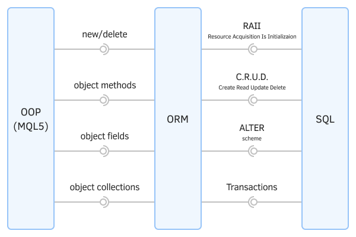

# OOP (MQL5) and SQL integration: ORM concept

The use of a database in an MQL program implies that the algorithm is divided into 2 parts: the control part is written in MQL5, and the execution part is written in SQL. As a result, the source code may start to look like a patchwork and require attention to maintain consistency. To avoid this, object-oriented languages have developed the concept of Object-Relational Mapping (ORM), i.e., mapping of objects to relational table records and vice versa.

The essence of the approach is to encapsulate all actions in the SQL language in classes/structures of a special layer. As a result, the application part of the program can be written in a pure OOP language (for example, MQL5), without being distracted by the nuances of SQL.

In the presence of a full-fledged ORM implementation (in the form of a "black box" with a set of all commands), an application developer generally has the opportunity not to learn SQL.

In addition, ORM allows you to "imperceptibly" change the "engine" of the DBMS if necessary. This is not particularly relevant for MQL5, because only the SQLite database is built into it, but some developers prefer to use full-fledged DBMS and connect them to MetaTrader 5 using import of [DLLs](/en/book/advanced/libraries/libraries_dll).

The use of objects with constructors and destructors is very useful when we need to automatically acquire and release resources. We have covered this concept (RAII, Resource Acquisition Is Initialization) in the section [File descriptor management](/en/book/common/files/files_handles), however, as we will see later, work with the database is also based on the allocation and release of different types of descriptors.

The following picture schematically depicts the interaction of different software layers when integrating OOP and SQL in the form of an ORM.

ORM, Object-Relational Mapping

As a bonus, an object "wrapper" (not just a database-specific ORM) will automate data preparation and transformation, as well as check for correctness in order to prevent some errors.

In the following sections, as we walk through the built-in functions for working with the base, we will implement the examples, gradually building our own simple ORM layer. Due to some specifics of MQL5, our classes will not be able to provide universalism that covers 100% of tasks but will be useful for many projects.
