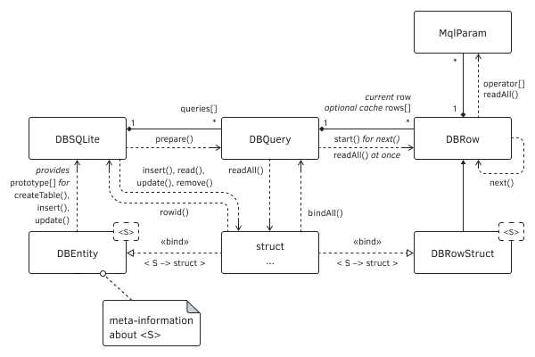

# Examples of CRUD operations in SQLite via ORM objects

We have studied all the functions required for the implementation of the complete lifecycle of information in the database, that is CRUD (Create, Read, Update, Delete). But before proceeding to practice, we need to complete the ORM layer.

From the previous few sections, it is already clear that the unit of work with the database is a record: it can be a record in a database table or an element in the results of a query. To read a single record at the ORM level, let's introduce the DBRow class. Each record is generated by an SQL query, so its handle is passed to the constructor.

As we know, a record can consist of several columns, the number and types of which allow us to find [DatabaseColumn ](/en/book/advanced/sqlite/sqlite_columns)[functions](/en/book/advanced/sqlite/sqlite_columns). To expose this information to an MQL program using DBRow, we reserved the relevant variables: columns and an array of structures DBRowColumn (the last one contains three fields for storing the name, type, and size of the column).

In addition, DBRow objects may, if necessary, cache in themselves the values obtained from the database. For this purpose, the data array of type [MqlParam](/en/book/applications/indicators_use/indicators_indicatorcreate) is used. Since we do not know in advance what type of values will be in a particular column, we use MqlParam as a kind of universal type Variant available in other programming environments.

```
class DBRow
{
protected:
   const int query; 
   int columns;
   DBRowColumn info[];
   MqlParam data[];
   const bool cache;
   int cursor;
   ...
public:
   DBRow(const int q, const bool c = false):
      query(q), cache(c), columns(0), cursor(-1)
   {
   }
   
   int length() const
   {
      return columns;
   }
   ...
};

```

The cursor variable tracks the current record number from the query results. Until the request is completed, cursor equals -1.

The virtual method DBread is responsible for executing the query; it calls DatabaseRead.

```
protected:
   virtual bool DBread()
   {
      return PRTF(DatabaseRead(query));
   }

```

We will see later why we needed a virtual method. The public method next, which uses DBread, provides "scrolling" through the result records and looks like this.

```
public:
   virtual bool next()
   {
      ...
      const bool success = DBread();
      if(success)
      {
         if(cursor == -1)
         {
            columns = DatabaseColumnsCount(query);
            ArrayResize(info, columns);
            if(cache) ArrayResize(data, columns);
            for(int i = 0; i < columns; ++i)
            {
               DatabaseColumnName(query, i, info[i].name);
               info[i].type = DatabaseColumnType(query, i);
               info[i].size = DatabaseColumnSize(query, i);
               if(cache) data[i] = this[i]; // overload operator[](int)
            }
         }
         ++cursor;
      }
      return success;
   }

```

If the query is accessed for the first time, we allocate memory and read the column information. If caching was requested, we additionally populate the data array. To do this, the overloaded operator '[]' is called for each column. In it, depending on the type of value, we call the appropriate DatabaseColumn function and put the resulting value in one or another field of the MqlParam structure.

```
   virtual MqlParam operator[](const int i = 0) const
   {
      MqlParam param = {};
      if(i < 0 || i >= columns) return param;
      if(ArraySize(data) > 0 && cursor != -1) // if there is a cache, return from it
      {
         return data[i];
      }
      switch(info[i].type)
      {
      case DATABASE_FIELD_TYPE_INTEGER:
         switch(info[i].size)
         {
         case 1:
            param.type = TYPE_CHAR;
            break;
         case 2:
            param.type = TYPE_SHORT;
            break;
         case 4:
            param.type = TYPE_INT;
            break;
         case 8:
         default:
            param.type = TYPE_LONG;
            break;
         }
         DatabaseColumnLong(query, i, param.integer_value);
         break;
      case DATABASE_FIELD_TYPE_FLOAT:
         param.type = info[i].size == 4 ? TYPE_FLOAT : TYPE_DOUBLE;
         DatabaseColumnDouble(query, i, param.double_value);
         break;
      case DATABASE_FIELD_TYPE_TEXT:
         param.type = TYPE_STRING;
         DatabaseColumnText(query, i, param.string_value);
         break;
      case DATABASE_FIELD_TYPE_BLOB: // return base64 only for information we can't
         {                           // return binary data in MqlParam - exact 
            uchar blob[];            // representation of binary fields is given by getBlob 
            DatabaseColumnBlob(query, i, blob);
            uchar key[], text[];
            if(CryptEncode(CRYPT_BASE64, blob, key, text))
            {
               param.string_value = CharArrayToString(text);
            }
         }
         param.type = TYPE_BLOB;
         break;
      case DATABASE_FIELD_TYPE_NULL:
         param.type = TYPE_NULL;
         break;
      }
      return param;
   }

```

The getBlob method is provided to fully read binary data from BLOB fields (use type uchar as S to get a byte array if there is no more specific information about the content format).

```
   template<typename S>
   int getBlob(const int i, S &object[])
   {
      ...
      return DatabaseColumnBlob(query, i, object);
   }

```

For the described methods, the process of executing a query and reading its results can be represented by the following pseudo-code (it leaves behind the scenes the existing DBSQLite and DBQuery classes, but we will bring them all together soon):

```
int query = ...
DBRow *row = new DBRow(query);
while(row.next())
{
   for(int i = 0; i < row.length(); ++i)
   {
      StructPrint(row[i]); // print the i-th column as an MqlParam structure
   }
}

```

It is not elegant to explicitly write a loop through the columns every time, so the class provides a method for obtaining the values of all fields of the record.

```
   void readAll(MqlParam &params[]) const
   {
      ArrayResize(params, columns);
      for(int i = 0; i < columns; ++i)
      {
         params[i] = this[i];
      }
   }

```

Also, the class received for convenience overloads of the operator '[]' and the getBlob method for reading fields by their names instead of indexes. For example,

```
class DBRow
{
   ...
public:
   int name2index(const string name) const
   {
      for(int i = 0; i < columns; ++i)
      {
         if(name == info[i].name) return i;
      }
      Print("Wrong column name: ", name);
      SetUserError(3);
      return -1;
   }
   
   MqlParam operator[](const string name) const
   {
      const int i = name2index(name);
      if(i != -1) return this[i]; // operator()[int] overload
      static MqlParam param = {};
      return param;
   }
   ...
};

```

This way you can access selected columns.

```
int query = ...
DBRow *row = new DBRow(query);
for(int i = 1; row.next(); )
{
   Print(i++, " ", row["trades"], " ", row["profit"], " ", row["drawdown"]);
}

```

But still getting the elements of the record individually, as a MqlParam array, can not be called a truly OOP approach. It would be preferable to read the entire database table record into an object, an application structure. Recall that the MQL5 API provides a suitable function: DatabaseReadBind. This is where we get the advantage of the ability to describe a derived class DBRow and override its virtual method DBRead.

This class of DBRowStruct is a template and expects as parameter S one of the simple structures allowed to be bound in DatabaseReadBind.

```
template<typename S>
class DBRowStruct: public DBRow
{
protected:
   S object;
   
   virtual bool DBread() override
   {
      // NB: inherited structures and nested structures are not allowed;
      // count of structure fields should not exceed count of columns in table/query
      return PRTF(DatabaseReadBind(query, object));
   }
   
public:
   DBRowStruct(const int q, const bool c = false): DBRow(q, c)
   {
   }
   
   S get() const
   {
      return object;
   }
};

```

With a derived class, we can get objects from the base almost seamlessly.

```
int query = ...
DBRowStruct<MyStruct> *row = new DBRowStruct<MyStruct>(query);
MyStruct structs[];
while(row.next())
{
   PUSH(structs, row.get());
}

```

Now it's time to turn the pseudo-code into working code by linking DBRow/DBRowStruct with DBQuery. In DBQuery, we add an autopointer to the DBRow object, which will contain data about the current record from the results of the query (if it was executed). Using an autopointer frees the calling code from worrying about freeing DBRow objects: they are deleted either with DBQuery or when re-created due to query restart (if required). The initialization of the DBRow or DBRowStruct object is completed by a template method start.

```
class DBQuery
{
protected:
   ...
   AutoPtr<DBRow> row;    // current entry
public:
   DBQuery(const int owner, const string s): db(owner), sql(s),
      handle(PRTF(DatabasePrepare(db, sql)))
   {
      row = NULL;
   }
   
   template<typename S>
   DBRow *start()
   {
      DatabaseReset(handle);
      row = typename(S) == "DBValue" ? new DBRow(handle) : new DBRowStruct<S>(handle);
      return row[];
   }

```

The DBValue type is a dummy structure that is needed only to instruct the program to create the underlying DBRow object, without violating the compilability of the line with the DatabaseReadBind call.

With the start method, all of the above pseudo-code fragments become working due to the following preparation of the request:

```
DBSQLite db("MQL5Book/DB/Example1");                            // open base
DBQuery *query = db.prepare("PRAGMA table_xinfo('Struct')");    // prepare the request
DBRowStruct<DBTableColumn> *row = query.start<DBTableColumn>(); // get object cursor 
DBTableColumn columns[];                                        // receiving array of objects
while(row.next())             // loop while there are records in the query result
{
   PUSH(columns, row.get());  // getting an object from the current record
}
ArrayPrint(columns);

```

This example reads meta-information about the configuration of a particular table from the database (we created it in the example DBcreateTableFromStruct.mq5 in the section [Executing queries without MQL5 data binding](/en/book/advanced/sqlite/sqlite_simple_queries)): each column is described by a separate record with several fields (SQLite standard), which is formalized in the structure DBTableColumn.

```
struct DBTableColumn
{
   int cid;              // identifier (serial number)
   string name;          // name
   string type;          // type
   bool not_null;        // attribute NOT NULL (yes/no)
   string default_value; // default value
   bool primary_key;     // PRIMARY KEY sign (yes/no)
};

```

To save the user from having to write a loop every time with the translation of results records into structure objects, the DBQuery class provides a template method readAll that populates a referenced array of structures with information from the query results. A similar readAll method fills an array of pointers to DBRow objects (this is more suitable for receiving the results of synthetic queries with columns from different tables).

In a quartet of operations, the CRUD method DBRowStruct::get is responsible for the letter R (Read). To make the reading of an object more functionally complete, we will support point recovery of an object from the database by its identifier.

The vast majority of tables in SQLite databases have a primary key rowid (unless the developer for one reason or another used the "WITHOUT ROWID" option in the description), so the new read method will take a key value as a parameter. By default, the name of the table is assumed to be equal to the type of the receiving structure but can be changed to an alternative one through the table parameter. Considering that such a request is a one-time request and should return one record, it makes sense to place the read method directly to the class DBSQLite and manage short-lived objects DBQuery and DBRowStruct<S> inside.

```
class DBSQLite
{
   ...
public:
   template<typename S>
   bool read(const long rowid, S &s, const string table = NULL,
      const string column = "rowid")
   {
      const static string query = "SELECT * FROM '%s' WHERE %s=%ld;";
      const string sql = StringFormat(query,
         StringLen(table) ? table : typename(S), column, rowid);
      PRTF(sql);
      DBQuery q(handle, sql);
      if(!q.isValid()) return false;
      DBRowStruct<S> *r = q.start<S>();
      if(r.next())
      {
         s = r.get();
         return true;
      }
      return false;
   }
};

```

The main work is done by the SQL query "SELECT * FROM '%s' WHERE %s=%ld;", which returns a record with all fields from the specified table by matching the rowid key.

Now you can create a specific object from the database like this (it is assumed that the identifier of interest to us must be stored somewhere).

```
   DBSQLite db("MQL5Book/DB/Example1");
   long rowid = ... // ill in the identifier
   Struct s; 
   if(db.read(rowid, s))
      StructPrint(s);

```

Finally, in some complex cases where maximum flexibility in querying is required (for example, a combination of several tables, usually a SELECT with a JOIN, or nested queries), we still have to allow an explicit SQL command to get a selection, although this violates the ORM principle. This possibility is opened by the method DBSQLite::prepare, which we have already presented in the context of the [management of prepared queries](/en/book/advanced/sqlite/sqlite_reset).

We have considered all the main ways of reading.

However, we don't have anything to read from the database yet, because we skipped the step of adding records.

Let's try to implement object creation (C). Recall that in our object concept, structure types semi-automatically define database tables (using DB_FIELD macros). For example, the Struct structure allowed the creation of a "Struct" table in the database with a set of columns corresponding to the fields of the structure. We provided this with a template method createTable in the DBSQLite class. Now, by analogy, you need to write a template method insert, which would add a record to this table.

An object of a structure is passed to the method, for the type of which the filled DBEntity<S>::prototype <S> array must exist (it is filled with macros). Thanks to this array, we can form a list of parameters (more precisely, their substitutes '?n'): this is done by the static method qlist. However, the preparation of the query is still half a battle. In the code below, we will need to bind the input data based on the properties of the object.

A "RETURNING rowid" statement has been added to the "INSERT" command, so when the query succeeds, we expect a single result row with one value: new rowid.

```
class DBSQLite
{
   ...
public:
   template<typename S>
   long insert(S &object, const string table = NULL)
   {
      const static string query = "INSERT INTO '%s' VALUES(%s) RETURNING rowid;";
      const int n = ArrayRange(DBEntity<S>::prototype, 0);
      const string sql = StringFormat(query,
         StringLen(table) ? table : typename(S), qlist(n));
      PRTF(sql);
      DBQuery q(handle, sql);
      if(!q.isValid()) return 0;
      DBRow *r = q.start<DBValue>();
      if(object.bindAll(q))
      {
         if(r.next()) // the result should be one record with one new rowid value
         {
            return object.rowid(r[0].integer_value);
         }
      }
      return 0;
   }
   
   static string qlist(const int n)
   {
      string result = "?1";
      for(int i = 1; i < n; ++i)
      {
         result += StringFormat(",?%d", (i + 1));
      }
      return result;
   }
};

```

The source code of the insert method has one point to which special attention should be paid. To bind values to query parameters, we call the object.bindAll(q) method. This means that in the application structure that you want to integrate with the base, you need to implement such a method that provides all member variables for the engine.

In addition, to identify objects, it is assumed that there is a field with a primary key, and only the object "knows" what this field is. So, the structure has the rowid method, which serves a dual action: first, it transfers the record identifier assigned in the database to the object, and second, it allows finding out this identifier from the object, if it has already been assigned earlier.

The DBSQLite::update (U) method for changing a record is similar in many ways to insert, and therefore it is proposed to familiarize yourself with it. Its basis is the SQL query "UPDATE '%s' SET (%s)=(%s) WHERE rowid=%ld;", which is supposed to pass all the fields of the structure (bindAll() object) and key (rowid() object).

Finally, we mention that the point deletion (D) of a record by an object is implemented in the method DBSQLite::remove (word delete is an MQL5 operator).

Let's show all methods in an example script DBfillTableFromStructArray.mq5, where the Struct new structure is defined.

We will make several values of commonly used types as fields of the structure.

```
struct Struct
{
   long id;
   string name;
   double number;
   datetime timestamp;
   string image;
   ...
};

```

In the string field image, the calling code will specify the name of the graphic resource or the name of the file, and at the time of binding to the database, the corresponding binary data will be copied as a BLOB. Subsequently, when we read data from the database into Struct objects, the binary data will end up in the image string but, of course, with distortions (because the line will break on the first null byte). To accurately extract BLOBs from the database, you will need to call the method DBRow::getBlob (based on DatabaseColumnBlob).

Creating meta-information about fields of the Struct structure provides the following macros. Based on them, an MQL program can automatically create a table in the database for Struct objects, as well as initiate the binding of the data passed to the queries based on the properties of the objects (this binding should not be confused with the reverse binding for obtaining query results, i.e. DatabaseReadBind).

```
DB_FIELD_C1(Struct, long, id, DB_CONSTRAINT::PRIMARY_KEY);
DB_FIELD(Struct, string, name);
DB_FIELD(Struct, double, number);
DB_FIELD_C1(Struct, datetime, timestamp, DB_CONSTRAINT::CURRENT_TIMESTAMP);
DB_FIELD(Struct, blob, image);

```

To fill a small test array of structures, the script has input variables: they specify a trio of currencies whose quotes will fall into the number field. We have also embedded two standard images into the script in order to test the work with BLOBs: they will "go" to the image field. The timestamp field will be automatically populated by our ORM classes with the current insertion or modification timestamp of the record. The primary key in the id field will have to be populated by SQLite itself.

```
#resource "\\Images\\euro.bmp"
#resource "\\Images\\dollar.bmp"
   
input string Database = "MQL5Book/DB/Example2";
input string EURUSD = "EURUSD";
input string USDCNH = "USDCNH";
input string USDJPY = "USDJPY";

```

Since the values for the input query variables (those same '?n') are bound, ultimately, using the functions DatabaseBind or DatabaseBindArray under the numbers, our bindAll structure in the method should establish a correspondence between the numbers and their fields: a simple numbering is assumed in the order of declaration.

```
struct Struct
{
   ...
   bool bindAll(DBQuery &q) const
   {
      uint pixels[] = {};
      uint w, h;
      if(StringLen(image))                // load binary data
      {
         if(StringFind(image, "::") == 0) // this is a resource
         {
            ResourceReadImage(image, pixels, w, h);
            // debug/test example (not BMP, no header)
            FileSave(StringSubstr(image, 2) + ".raw", pixels);
         }
         else                             // it's a file
         {
            const string res = "::" + image;
            ResourceCreate(res, image);
            ResourceReadImage(res, pixels, w, h);
            ResourceFree(res);
         }
      }
      // when id = NULL, the base will assign a new rowid
      return (id == 0 ? q.bindNull(0) : q.bind(0, id))
         && q.bind(1, name)
         && q.bind(2, number)
         // && q.bind(3, timestamp) // this field will be autofilled CURRENT_TIMESTAMP
         && q.bindBlob(4, pixels);
   }
   ...
};

```

Method rowid is very simple.

```
struct Struct
{
   ...
   long rowid(const long setter = 0)
   {
      if(setter) id = setter;
      return id;
   }
};

```

Having defined the structure, we describe a test array of 4 elements. Only 2 of them have attached images. All objects have zero identifiers because they are not yet in the database.

```
Struct demo[] =
{
   {0, "dollar", 1.0, 0, "::Images\\dollar.bmp"},
   {0, "euro", SymbolInfoDouble(EURUSD, SYMBOL_ASK), 0, "::Images\\euro.bmp"},
   {0, "yuan", 1.0 / SymbolInfoDouble(USDCNH, SYMBOL_BID), 0, NULL},
   {0, "yen", 1.0 / SymbolInfoDouble(USDJPY, SYMBOL_BID), 0, NULL},
};

```

In the main OnStart function, we create or open a database (by default MQL5Book/DB/Example2.sqlite). Just in case, we try to delete the "Struct" table in order to ensure reproducibility of the results and debugging when the script is repeated, then we will create a table for the Struct structure.

```
void OnStart()
{
   DBSQLite db(Database);
   if(!PRTF(db.isOpen())) return;
   PRTF(db.deleteTable(typename(Struct)));
   if(!PRTF(db.createTable<Struct>(true))) return;
   ...

```

Instead of adding objects one at a time, we use a loop:

```
 // -> this option (set aside)
   for(int i = 0; i < ArraySize(demo); ++i)
   {
      PRTF(db.insert(demo[i])); // get a new rowid on each call
   }

```

In this loop, we will use an alternative implementation of the insert method, which takes an array of objects as input at once and processes them in a single request, which is more efficient (but the general ditch of the method is the previously considered insert method for one object).

```
   db.insert(demo);  // new rowids are placed in objects
   ArrayPrint(demo);
   ...

```

Now let's try to select records from the database according to some conditions, for example, those that do not have an image assigned. To do this, let's prepare an SQL query wrapped in the DBQuery object, and then we get its results in two ways: through binding to Struct structures or via the instances of the generic class DBRow.

```
   DBQuery *query = db.prepare(StringFormat("SELECT * FROM %s WHERE image IS NULL",
      typename(Struct)));
   
   // approach 1: application type of the Struct structure
   Struct result[];
   PRTF(query.readAll(result));
   ArrayPrint(result);
   
   query.reset(); // reset the query to try again
   
   // approach 2: generic DBRow record container with MqlParam values
   DBRow *rows[];
   query.readAll(rows); // get DBRow objects with cached values
   for(int i = 0; i < ArraySize(rows); ++i)
   {
      Print(i);
      MqlParam fields[];
      rows[i].readAll(fields);
      ArrayPrint(fields);
   }
   ...

```

Both options should give the same result, albeit presented differently (see the log below).

Next, our script pauses for 1 second so that we can notice the changes in the timestamps of the next entries that we will change.

```
   Print("Pause...");
   Sleep(1000);
   ...

```

To objects in the result[] array, we assign the "yuan.bmp" image located in the folder next to the script. Then we update the objects in the database.

```
   for(int i = 0; i < ArraySize(result); ++i)
   {
      result[i].image = "yuan.bmp";
      db.update(result[i]);
   }
   ...

```

After running the script, you can make sure that all four records have BLOBs in the database navigator built into MetaEditor, as well as the difference in timestamps for the first two and the last two records.

Let's demonstrate the extraction of binary data. We will first see how a BLOB is mapped to the image string field (binary data is not for the log, we only do this for demonstration purposes).

```
   const long id1 = 1;
   Struct s;
   if(db.read(id1, s))
   {
      Print("Length of string with Blob: ", StringLen(s.image));
      Print(s.image);
   }
   ...

```

Then we read the entire data with getBlob (total length is greater than the line above).

```
   DBRow *r;
   if(db.read(id1, r, "Struct"))
   {
      uchar bytes[];
      Print("Actual size of Blob: ", r.getBlob("image", bytes));
      FileSave("temp.bmp.raw", bytes); // not BMP, no header
   }

```

We need to get the temp.bmp.raw file, identical to MQL5/Files/Images/dollar.bmp.raw, which is created in the method Struct::bindAll for debugging purposes. Thus, it is easy to verify the exact correspondence of written and read binary data.

Note that since we are storing the resource's binary content in the database, it is not a BMP source file: resources produce [color normalization](/en/book/advanced/resources/resources_resourcecreate) and store a headerless array of pixels with meta-information about the image.

While running, the script generates a detailed log. In particular, the creation of a database and a table is marked with the following lines.

```
db.isOpen()=true / ok
db.deleteTable(typename(Struct))=true / ok
sql=CREATE TABLE IF NOT EXISTS Struct (id INTEGER PRIMARY KEY,
name TEXT ,
number REAL ,
timestamp INTEGER CURRENT_TIMESTAMP,
image BLOB ); / ok
db.createTable<Struct>(true)=true / ok

```

The SQL query for inserting an array of objects is prepared once and then executed many times with pre-binding different data (only one iteration is shown here). The number of DatabaseBind function calls matches the '?n' variables in the query ('?4' is automatically replaced by our classes with the SQL STRFTIME('%s') function call to get the current UTC timestamp).

```
sql=INSERT INTO 'Struct' VALUES(?1,?2,?3,STRFTIME('%s'),?5) RETURNING rowid; / ok
DatabasePrepare(db,sql)=131073 / ok
DatabaseBindArray(handle,index,value)=true / ok
DatabaseBind(handle,index,value)=true / ok
DatabaseBind(handle,index,value)=true / ok
DatabaseBindArray(handle,index,value)=true / ok
DatabaseRead(query)=true / ok
...

```

Next, an array of structures with already assigned primary keys rowid is output to the log in the first column.

```
    [id]   [name] [number]         [timestamp]               [image]
[0]    1 "dollar"  1.00000 1970.01.01 00:00:00 "::Images\dollar.bmp"
[1]    2 "euro"    1.00402 1970.01.01 00:00:00 "::Images\euro.bmp"  
[2]    3 "yuan"    0.14635 1970.01.01 00:00:00 null                 
[3]    4 "yen"     0.00731 1970.01.01 00:00:00 null

```

Selecting records without images gives the following result (we execute this query twice with different methods: the first time we fill the array of Struct structures, and the second is the DBRow array, from which for each field we get the "value" in the form of MqlParam).

```
DatabasePrepare(db,sql)=196609 / ok
DatabaseReadBind(query,object)=true / ok
DatabaseReadBind(query,object)=true / ok
DatabaseReadBind(query,object)=false / DATABASE_NO_MORE_DATA(5126)
query.readAll(result)=true / ok
    [id] [name] [number]         [timestamp] [image]
[0]    3 "yuan"  0.14635 2022.08.20 13:14:38 null   
[1]    4 "yen"   0.00731 2022.08.20 13:14:38 null   
DatabaseRead(query)=true / ok
DatabaseRead(query)=true / ok
DatabaseRead(query)=false / DATABASE_NO_MORE_DATA(5126)
0
    [type] [integer_value] [double_value] [string_value]
[0]      4               3        0.00000 null          
[1]     14               0        0.00000 "yuan"        
[2]     13               0        0.14635 null          
[3]     10      1661001278        0.00000 null          
[4]      0               0        0.00000 null          
1
    [type] [integer_value] [double_value] [string_value]
[0]      4               4        0.00000 null          
[1]     14               0        0.00000 "yen"         
[2]     13               0        0.00731 null          
[3]     10      1661001278        0.00000 null          
[4]      0               0        0.00000 null          
...

```

The second part of the script updates a couple of found records without images and adds BLOBs to them.

```
Pause...
sql=UPDATE 'Struct' SET (id,name,number,timestamp,image)=
   (?1,?2,?3,STRFTIME('%s'),?5) WHERE rowid=3; / ok
DatabasePrepare(db,sql)=262145 / ok
DatabaseBind(handle,index,value)=true / ok
DatabaseBind(handle,index,value)=true / ok
DatabaseBind(handle,index,value)=true / ok
DatabaseBindArray(handle,index,value)=true / ok
DatabaseRead(handle)=false / DATABASE_NO_MORE_DATA(5126)
sql=UPDATE 'Struct' SET (id,name,number,timestamp,image)=
   (?1,?2,?3,STRFTIME('%s'),?5) WHERE rowid=4; / ok
DatabasePrepare(db,sql)=327681 / ok
DatabaseBind(handle,index,value)=true / ok
DatabaseBind(handle,index,value)=true / ok
DatabaseBind(handle,index,value)=true / ok
DatabaseBindArray(handle,index,value)=true / ok
DatabaseRead(handle)=false / DATABASE_NO_MORE_DATA(5126)
...

```

Finally, when getting binary data in two ways — incompatible, via the image string field as a result of reading the entire DatabaseReadBind object (this is only done to visualize the sequence of bytes in the log) and compatible, via DatabaseRead and DatabaseColumnBlob — we get different results: of course, the second method is correct: the length and contents of the BLOB in 4096 bytes are restored.

```
sql=SELECT * FROM 'Struct' WHERE rowid=1; / ok
DatabasePrepare(db,sql)=393217 / ok
DatabaseReadBind(query,object)=true / ok
Length of string with Blob: 922
ʭ7?ʭ7?ʭ7?ʭ7?ʭ7?ʭ7?ɬ7?ȫ6?ũ6?Ĩ5???5?¦5?Ĩ5?ƪ6?ȫ6?Ȭ7?ɬ7?ɬ7?ʭ7?ʭ7?ʭ7?ʭ7?ʭ7?ʭ7?ʭ7?ʭ7?ʭ7?ʭ7?ʭ7??҉??֒??ٛ...
sql=SELECT * FROM 'Struct' WHERE rowid=1; / ok
DatabasePrepare(db,sql)=458753 / ok
DatabaseRead(query)=true / ok
Actual size of Blob: 4096

```

Summarizing the intermediate result of developing our own ORM wrapper, we present a generalized scheme of its classes.



ORM Class Diagram (MQL5<->SQL)
