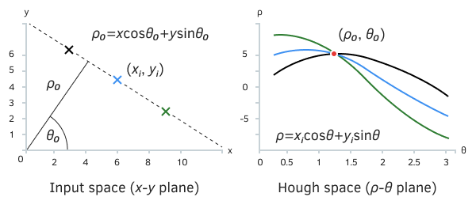
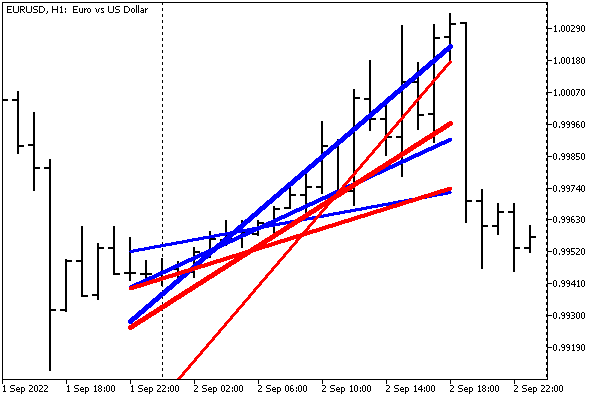

# Classes and templates in MQL5 libraries

Although the export and import of classes and templates are generally prohibited, the developer can get around these restrictions by moving the description of the abstract base interfaces into the library header file and passing pointers. Let's illustrate this concept with an example of a library that performs a Hough transform of an image.

The Hough transform is an algorithm for extracting features of an image by comparing it with some formal model (formula) described by a set of parameters.

The simplest Hough transform is the selection of straight lines on the image by converting them to polar coordinates. With this processing, sequences of "filled" pixels, arranged more or less in a row, form peaks in the space of polar coordinates at the intersection of a specific angle ("theta") of the inclination of the straight line and its shift ("ro") relative to the center of coordinates.



Hough transform for straight lines

Each of the three colored dots on the left (original) image leaves a trail in polar coordinate space (right) because an infinite number of straight lines can be drawn through a point at different angles and perpendiculars to the center. Each trace fragment is "marked" only once, with the exception of the red mark: at this point, all three traces intersect and give the maximum response (3). Indeed, as we can see in the original image, there is a straight line that goes through all three points. Thus, the two parameters of the line are revealed by the maximum in polar coordinates.

We can use this Hough transform on price charts to highlight alternative support and resistance lines. If such lines are usually drawn at individual extremes and, in fact, perform an analysis of outliers, then the Hough transform lines can take into account all High or all Low prices, or even the distribution of tick volumes within bars. All this allows you to get a more reasonable estimate of the levels.

Let's start with the header file LibHoughTransform.mqh. Since some abstract image supplies the initial data for analysis, let's define the HoughImage interface template.

```
template<typename T>
interface HoughImage
{
   virtual int getWidth() const;
   virtual int getHeight() const;
   virtual T get(int x, int y) const;
};

```

All you need to know about the image when processing it is its dimensions and the content of each pixel, which, for reasons of generality, is represented by the parametric type T. It is clear that in the simplest case, it can be int or double.

Calling analytical image processing is a little more complicated. In the library, we need to describe the class, the objects of which will be returned from a special factory function (in the form of pointers). It is this function that should be exported from the library. Suppose, it is like this:

```
template<typename T>
class HoughTransformDraft
{
public:
   virtual int transform(const HoughImage<T> &image, double &result[],
      const int elements = 8) = 0;
};
   
HoughTransformDraft<?> *createHoughTransform() export { ... } // Problem - template!

```

However, template types and template functions cannot be exported. Therefore, we will make an intermediate non-template class HoughTransform, in which we will add a template method for the image parameter. Unfortunately, template methods cannot be virtual, and therefore we will manually dispatch calls inside the method (using dynamic_cast), redirecting processing to a derived class with a virtual method.

```
class HoughTransform
{
public:
   template<typename T>
   int transform(const HoughImage<T> &image, double &result[],
      const int elements = 8)
   {
      HoughTransformConcrete<T> *ptr = dynamic_cast<HoughTransformConcrete<T> *>(&this);
      if(ptr) return ptr.extract(image, result, elements);
      return 0;
   }
};
   
template<typename T>
class HoughTransformConcrete: public HoughTransform
{
public:
   virtual int extract(const HoughImage<T> &image, double &result[],
      const int elements = 8) = 0;
};

```

The internal implementation of the class HoughTransformConcrete will be written into the library file MQL5/Libraries/MQL5Book/LibHoughTransform.mq5.

```
#property library
   
#include <MQL5Book/LibHoughTransform.mqh>
   
template<typename T>
class LinearHoughTransform: public HoughTransformConcrete<T>
{
protected:
   int size;
   
public:
   LinearHoughTransform(const int quants): size(quants) { }
   ...

```

Since we are going to recalculate image points into space in new, polar, coordinates, a certain size should be allocated for the task. Here we are talking about a discrete Hough transform since we consider the original image as a discrete set of points (pixels), and we will accumulate the values of angles with perpendiculars in cells (quanta). For simplicity, we will focus on the variant with a square space, where the number of readings both in the angle and in the distance to the center is equal. This parameter is passed to the class constructor.

```
template<typename T>
class LinearHoughTransform: public HoughTransformConcrete<T>
{
protected:
   int size;
   Plain2DArray<T> data;
   Plain2DArray<double> trigonometric;
   
   void init()
   {
      data.allocate(size, size);
      trigonometric.allocate(2, size);
      double t, d = M_PI / size;
      int i;
      for(i = 0, t = 0; i < size; i++, t += d)
      {
         trigonometric.set(0, i, MathCos(t));
         trigonometric.set(1, i, MathSin(t));
      }
   }
   
public:
   LinearHoughTransform(const int quants): size(quants)
   {
      init();
   }
   ...

```

To calculate the "footprint" statistics left by "filled" pixels in the transformed size space with dimensions size by size, we describe the data array. The helper template class Plain2DArray (with type parameter T) allows the emulation of a two-dimensional array of arbitrary sizes. The same class but with a parameter of type double is applied to the trigonometric table of pre-calculated values of sines and cosines of angles. We will need the table to quickly map pixels to a new space.

The method for detecting the parameters of the most prominent straight lines is called extract. It takes an image as input and must fill the output result array with found pairs of parameters of straight lines. In the following equation:

```
y = a * x + b

```

the parameter a (slope, "theta") will be written to even numbers of the result array, and the b parameter (indent, "ro") will be written to odd numbers of the array. For example, the first, most noticeable straight line after the completion of the method is described by the expression:

```
y = result[0] * x + result[1];

```

For the second line, the indexes will increase to 2 and 3, respectively, and so on, up to the maximum number of lines requested (lines). The result array size is equal to twice the number of lines.

```
template<typename T>
class LinearHoughTransform: public HoughTransformConcrete<T>
{
   ...
   virtual int extract(const HoughImage<T> &image, double &result[],
      const int lines = 8) override
   {
      ArrayResize(result, lines * 2);
      ArrayInitialize(result, 0);
      data.zero();
   
      const int w = image.getWidth();
      const int h = image.getHeight();
      const double d = M_PI / size;     // 180 / 36 = 5 degrees, for example
      const double rstep = MathSqrt(w * w + h * h) / size;
      ...

```

Nested loops over image pixels are organized in the straight line search block. For each "filled" (non-zero) point, a loop through tilts is performed, and the corresponding pairs of polar coordinates are marked in the transformed space. In this case, we simply call the method to increase the contents of the cell by the value returned by the pixel: data.inc((int)r, i, v), but depending on the application and type T, it may require more complex processing.

```
      double r, t;
      int i;
      for(int x = 0; x < w; x++)
      {
         for(int y = 0; y < h; y++)
         {
            T v = image.get(x, y);
            if(v == (T)0) continue;
   
            for(i = 0, t = 0; i < size; i++, t += d) // t < Math.PI
            {
               r = (x * trigonometric.get(0, i) + y * trigonometric.get(1, i));
               r = MathRound(r / rstep); // range [-range, +range]
               r += size; // [0, +2size]
               r /= 2;
   
               if((int)r < 0) r = 0;
               if((int)r >= size) r = size - 1;
               if(i < 0) i = 0;
               if(i >= size) i = size - 1;
   
               data.inc((int)r, i, v);
            }
         }
      }
      ...

```

In the second part of the method, the search for maximums in the new space is performed and the output array result is filled.

```
      for(i = 0; i < lines; i++)
      {
         int x, y;
         if(!findMax(x, y))
         {
            return i;
         }
   
         double a = 0, b = 0;
         if(MathSin(y * d) != 0)
         {
            a = -1.0 * MathCos(y * d) / MathSin(y * d);
            b = (x * 2 - size) * rstep / MathSin(y * d);
         }
         if(fabs(a) < DBL_EPSILON && fabs(b) < DBL_EPSILON)
         {
            i--;
            continue;
         }
         result[i * 2 + 0] = a;
         result[i * 2 + 1] = b;
      }
   
      return i;
   }

```

The findMax helper method (see the source code) writes the coordinates of the maximum value in the new space to x and y variables, additionally overwriting the neighborhood of this place so as not to find it again and again.

The LinearHoughTransform class is ready, and we can write an exportable factory function to spawn objects.

```
HoughTransform *createHoughTransform(const int quants,
   const ENUM_DATATYPE type = TYPE_INT) export
{
   switch(type)
   {
   case TYPE_INT:
      return new LinearHoughTransform<int>(quants);
   case TYPE_DOUBLE:
      return new LinearHoughTransform<double>(quants);
   ...
   }
   return NULL;
}

```

Because templates are not allowed for export, we use the ENUM_DATATYPE enumeration in the second parameter to vary the data type during conversion and in the original image representation.

To test the export/import of structures, we also described a structure with meta-information about the transformation in a given version of the library and exported a function that returns such a structure.

```
struct HoughInfo
{
   const int dimension; // number of parameters in the model formula
   const string about;  // verbal description
   HoughInfo(const int n, const string s): dimension(n), about(s) { }
   HoughInfo(const HoughInfo &other): dimension(other.dimension), about(other.about) { }
};
   
HoughInfo getHoughInfo() export
{
   return HoughInfo(2, "Line: y = a * x + b; a = p[0]; b = p[1];");
}

```

Various modifications of the Hough transforms can reveal not only straight lines but also other constructions that correspond to a given analytical formula (for example, circles). Such modifications will reveal a different number of parameters and carry a different meaning. Having a self-documenting function can make it easier to integrate libraries (especially when there are a lot of them; note that our header file contains only general information related to any library that implements this Hough transform interface, and not just for straight lines).

Of course, this example of exporting a class with a single public method is somewhat arbitrary because it would be possible to export the transformation function directly. However, in practice, classes tend to contain more functionality. In particular, it is easy to add to our class the adjustment of the sensitivity of the algorithm, the storage of exemplary patterns from lines for detecting signals checked on history, and so on.

Let's use the library in an indicator that calculates support and resistance lines by High and Low prices on a given number of bars. Thanks to the Hough transform and the programming interface, the library allows you to display several of the most important such lines.

The source code of the indicator is in the file MQL5/Indicators/MQL5Book/p7/LibHoughChannel.mq5. It also includes the header file LibHoughTransform.mqh, where we added the import directive.

```
#import "MQL5Book/LibHoughTransform.ex5"
HoughTransform *createHoughTransform(const int quants,
   const ENUM_DATATYPE type = TYPE_INT);
HoughInfo getHoughInfo();
#import

```

In the analyzed image, we denote by pixels the position of specific price types (OHLC) in quotes. To implement the image, we need to describe the HoughQuotes class derived from Hough Image<int>.

We will provide for "painting" pixels in several ways: inside the body of the candles, inside the full range of the candles, as well as directly in the highs and lows. All this is formalized in the PRICE_LINE enumeration. For now, the indicator will use only HighHigh and LowLow, but this can be taken out in the settings.

```
class HoughQuotes: public HoughImage<int>
{
public:
   enum PRICE_LINE
   {
      HighLow = 0,   // Bar Range |High..Low|
      OpenClose = 1, // Bar Body |Open..Close|
      LowLow = 2,    // Bar Lows
      HighHigh = 3,  // Bar Highs
   };
   ...

```

In the constructor parameters and internal variables, we specify the range of bars for analysis. The number of bars size determines the horizontal size of the image. For simplicity, we will use the same number of readings vertically. Therefore, the price discretization step (step) is equal to the actual range of prices (pp) for size bars divided by size. For the variable base, we calculate the lower limit of prices that are subject to consideration in the indicated bars. This variable will be needed to bind the construction of lines based on the found parameters of the Hough transform.

```
protected:
   int size;
   int offset;
   int step;
   double base;
   PRICE_LINE type;
   
public:
   HoughQuotes(int startbar, int barcount, PRICE_LINE price)
   {
      offset = startbar;
      size = barcount;
      type = price;
      int hh = iHighest(NULL, 0, MODE_HIGH, size, startbar);
      int ll = iLowest(NULL, 0, MODE_LOW, size, startbar);
      int pp = (int)((iHigh(NULL, 0, hh) - iLow(NULL, 0, ll)) / _Point);
      step = pp / size;
      base = iLow(NULL, 0, ll);
   }
   ...

```

Recall that the HoughImage interface requires the implementation of 3 methods: getWidth, getHeight, and get. The first two are easy.

```
   virtual int getWidth() const override
   {
      return size;
   }
   
   virtual int getHeight() const override
   {
      return size;
   }

```

The get method for getting "pixels" based on quotes returns 1 if the specified point falls within the bar or cell range, according to the selected calculation method from PRICE_LINE. Otherwise, 0 is returned. This method can be significantly improved by evaluating fractals, consistently increasing extremes, or "round" prices with a higher weight (pixel fat).

```
   virtual int get(int x, int y) const override
   {
      if(offset + x >= iBars(NULL, 0)) return 0;
   
      const double price = convert(y);
      if(type == HighLow)
      {
         if(price >= iLow(NULL, 0, offset + x) && price <= iHigh(NULL, 0, offset + x))
         {
            return 1;
         }
      }
      else if(type == OpenClose)
      {
         if(price >= fmin(iOpen(NULL, 0, offset + x), iClose(NULL, 0, offset + x))
         && price <= fmax(iOpen(NULL, 0, offset + x), iClose(NULL, 0, offset + x)))
         {
            return 1;
         }
      }
      else if(type == LowLow)
      {
         if(iLow(NULL, 0, offset + x) >= price - step * _Point / 2
         && iLow(NULL, 0, offset + x) <= price + step * _Point / 2)
         {
            return 1;
         }
      }
      else if(type == HighHigh)
      {
         if(iHigh(NULL, 0, offset + x) >= price - step * _Point / 2
         && iHigh(NULL, 0, offset + x) <= price + step * _Point / 2)
         {
            return 1;
         }
      }
      return 0;
   }

```

The helper method convert provides recalculation from pixel y coordinates to price values.

```
   double convert(const double y) const
   {
      return base + y * step * _Point;
   }
};

```

Now everything is ready for writing the technical part of the indicator. First of all, let's declare three input variables to select the fragment to be analyzed, and the number of lines. All lines will be identified by a common prefix.

```
input int BarOffset = 0;
input int BarCount = 21;
input int MaxLines = 3;
   
const string Prefix = "HoughChannel-";

```

The object that provides the transformation service will be described as global: this is where the factory function createHoughTransform is called from the library.

```
HoughTransform *ht = createHoughTransform(BarCount);

```

In the OnInit function, we just log the description of the library using the second imported function getHoughInfo.

```
int OnInit()
{
   HoughInfo info = getHoughInfo();
   Print(info.dimension, " per ", info.about);
   return INIT_SUCCEEDED;
}

```

We will perform the calculation in OnCalculate once, at the opening of the bar.

```
int OnCalculate(const int rates_total,
                const int prev_calculated,
                const int begin,
                const double &price[])
{
   static datetime now = 0;
   if(now != iTime(NULL, 0, 0))
   {
      ... // see the next block
      now = iTime(NULL, 0, 0);
   }
   return rates_total;
}

```

The transformation calculation itself is run twice on a pair of images (highs and lows) formed by different types of prices. In this case, the work is sequentially performed by the same object ht. If the detection of straight lines was successful, we display them on the chart using the function DrawLine. Because the lines are listed in the results array in descending order of importance, the lines are assigned a decreasing weight.

```
      HoughQuotes highs(BarOffset, BarCount, HoughQuotes::HighHigh);
      HoughQuotes lows(BarOffset, BarCount, HoughQuotes::LowLow);
      static double result[];
      int n;
      n = ht.transform(highs, result, fmin(MaxLines, 5));
      if(n)
      {
         for(int i = 0; i < n; ++i)
         {
            DrawLine(highs, Prefix + "Highs-" + (string)i,
               result[i * 2 + 0], result[i * 2 + 1], clrBlue, 5 - i);
         }
      }
      n = ht.transform(lows, result, fmin(MaxLines, 5));
      if(n)
      {
         for(int i = 0; i < n; ++i)
         {
            DrawLine(lows, Prefix + "Lows-" + (string)i,
               result[i * 2 + 0], result[i * 2 + 1], clrRed, 5 - i);
         }
      }

```

The DrawLine function is based on trend graphic objects (OBJ_TREND, see the source code).

When deinitializing the indicator, we delete the lines and the analytical object.

```
void OnDeinit(const int)
{
   AutoPtr<HoughTransform> destructor(ht);
   ObjectsDeleteAll(0, Prefix);
}

```

Before testing a new development, do not forget to compile both the library and the indicator.

Running the indicator with default settings gives something like this.



Indicator with main lines for High/Low prices based on the Hough transform library

In our case, the test was successful. But what if you need to debug the library? There are no built-in tools for this, so the following trick can be used. The library source test is conditionally compiled into a debug version of the product, and the product is tested against the built library. Let's consider the example of our indicator.

Let's provide the LIB_HOUGH_IMPL_DEBUG macro to enable the integration of the library source directly into the indicator. The macro should be placed before including the header file.

```
#define LIB_HOUGH_IMPL_DEBUG
#include <MQL5Book/LibHoughTransform.mqh>

```

In the header file itself, we will overlay the import block from the binary standalone copy of the library with preprocessor conditional compilation instructions. When the macro is enabled, another branch will run, with the #include statement.

```
#ifdef LIB_HOUGH_IMPL_DEBUG
#include "../../Libraries/MQL5Book/LibHoughTransform.mq5"
#else
#import "MQL5Book/LibHoughTransform.ex5"
HoughTransform *createHoughTransform(const int quants,
   const ENUM_DATATYPE type = TYPE_INT);
HoughInfo getHoughInfo();
#import
#endif

```

In the library source file LibHoughTransform.mq5, inside the getHoughInfo function, we add output to the log of information about the compilation method, depending on whether the macro is enabled or disabled.

```
HoughInfo getHoughInfo() export
{
#ifdef LIB_HOUGH_IMPL_DEBUG
   Print("inline library (debug)");
#else
   Print("standalone library (production)");
#endif
   return HoughInfo(2, "Line: y = a * x + b; a = p[0]; b = p[1];");
}

```

If in the indicator code, in the file LibHoughChannel.mq5  you uncomment the instruction #define LIB_HOUGH_IMPL_DEBUG, you can test the step-by-step image analysis.
