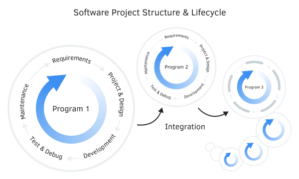

# Projects

Software products, as a rule, are developed within the standard life cycle:

- Collection and addition of requirements
- Design
- Development
- Testing
- Exploitation

As a result of constant improvement and expansion of functionality, it usually becomes necessary to systematize source files, resources, and third-party libraries (here we mean not only binary format libraries but, in a more general sense, any set of files, for example, headers). Even more, individual programs are integrated into a common product that embodies an applied idea.

Structure and life cycle of the project

For example, when developing a trading robot, it is often necessary to connect ready-made or custom indicators, the use of external machine learning algorithms implies writing a script for exporting quote data and a script for re-importing trained models, and programs related to data exchange via the Internet (for example, trading signals) may require web server and its settings in other programming languages, at least for debugging and testing, if not for deploying a public service.

The whole complex of several interrelated products, together with their "dependencies" (which means the used resources and libraries, written independently or taken from third-party sources), form a software project.

When a program exceeds a certain size, its convenient and effective development is difficult without special project management tools. This fully applies to programs based on MQL5, since many traders use complex trading systems.

MetaEditor supports the concept of projects similar to other software packages. Currently, this functionality is at the beginning of its development, and by the time the book is released, it will probably change.

When working with projects in MQL5, keep in mind that the term "project" in the platform is used for two different entities:

- Local project in the form of an mqproj file
- Folders in MQL5 cloud storage

A local project allows you to systematize and gather together all the information about source codes, resources, and settings needed to build a particular MQL program. Such a project is only on your computer and can refer to files from different folders.

The file with the extension mqproj has a widely used, universal, JSON (JavaScript Object Notation) text format. It is convenient, simple, and well-suited for describing data of any subject area: all information is grouped into objects or arrays with named properties, with support for values of different types. All this makes JSON conceptually very close to OOP languages; also it comes from object-oriented JavaScript, as you can easily guess from the name.

Cloud storage operates on the basis of a version control system and collective work on software called SVN (Subversion). Here, a project is a top-level folder inside the local directory MQL5/Shared Projects, to which another folder is assigned, having the same name but located on the MQL5 Storage server. Within a project folder, you can organize a hierarchy of subfolders. As the name suggests, network projects can be shared with other developers and generally made public (the content can be downloaded by anyone registered on mql5.com).

The system provides on-demand synchronization (using special user commands) between the folder image in the cloud and on the local drive, and vice versa. You can both "pull" other people's project changes to your computer, and "push" your edits to the cloud. Both the full folder image and selective files can be synchronized, including, of course, mq5 files, mqh header files, multimedia, settings (set files), as well as mqproj files. For more information about cloud storage, read the documentation of MetaEditor and SVN systems.

It is important to note that the existence of an mqproj file does not imply the creation of any cloud project on its basis, just as the creation of a shared folder does not oblige you to use an mqproj project.

At the time of this writing, an mqproj file can only describe the structure of one program, not several. However, since such a requirement is common when developing complex projects, this functionality will probably be added to MetaEditor in the future.

In this chapter, we will describe the main functions for creating and organizing mqproj projects and give a series of examples.
