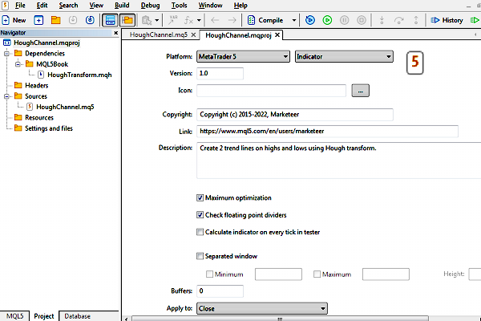

# General rules for working with local projects

A local project (mqproj file) can be created from the MetaEditor main menu or from the Navigator context menu using commands New project or New project from source file. In the latter case, the file must first be selected in Navigator or chosen in the Open dialog. As a result, the specified mq5 file will be included in the project immediately. The first of the mentioned commands launches the MQL Wizard, in which you should select the program type or an empty project option (source files can be added to it later). The type of an MQL program for a project is chosen following the usual steps of the Wizard.

The project contains several logical sections which resemble a tree (hierarchy) with all the components. They are displayed in the left panel of Navigator, in a separate tab Project.



Navigator and indicator project properties

Immediately after creating the project or later by double-clicking on the root of the tree, a panel for setting the MQL program properties opens in the right part of the window. The set of properties varies depending on the type of program.

Most of the properties correspond to #property directives in the source code. These properties take precedence: if you specify them in both the project and the source code, the values from the project will be used.

Some developers may like to set properties interactively in a dialog rather than hardcoded in source code. Also, you can use the same mq5 file in different projects and build versions of an MQL program with different settings (without changing the source code).

Some properties are only available in a project. These include, for example, enabling/disabling compilation optimizations and built-in divide-by-zero checks.

During project compilation, the system automatically analyzes dependencies, that is, the included header files, resources, and so on. Dependencies appear in different branches of the project hierarchy. In particular, header files from the standard MQL5/Include folders included in the #include directives using angle brackets (<filename>), fall into Dependencies, and custom header files included with double quotes (#include "filename") fall into the Headers section.

Additionally, the user can add files to the project that are related to the finished software product and may be required for its normal operation or demonstration (for example, files with trained neural network models) but are not directly embedded in the source code. For these purposes, you can use the Settings and Files branch. Its context menu contains commands for adding a single file or an entire directory to the project.

In particular, we will further consider examples of projects that will include not only client MQL programs but also the server part.

Commands New file and New folder add a new element to the folder with the project file: such elements are always searched relative to the project itself (in the mqproj file they are marked with the relative_to_project property equal to true, see further).

Commands Add an existing file and Add an existing folder select one or more elements from the existing directory structure inside the MQL5 folder, and these elements inside the mqproj file are referenced relative to the root MQL5 (the relative_to_project property equals false).

The relative_to_project property is just one of the few defined by the MetaTrader 5 developers to represent a project in JSON format. Recall that as a result of editing the project (hierarchy and properties), an mqproj-file of the JSON format is formed.

Here is what that file looks like for the project in the image above.

```
{
  "platform"    :"mt5",
  "program_type":"indicator",
  "copyright"   :"Copyright (c) 2015-2022, Marketeer",
  "link"        :"https:\/\/www.mql5.com\/en\/users\/marketeer",
  "version"     :"1.0",
  "description" :"Create 2 trend lines on highs and lows using Hough transform.",
  "optimize"    :"1",
  "fpzerocheck" :"1",
  "tester_no_cache":"0",
  "tester_everytick_calculate":"0",
  "unicode_character_set":"0",
  "static_libraries":"0",
  
  "indicator":
  {
    "window":"0"
  },
  
  "files":
  [
    {
      "path":"HoughChannel.mq5",
      "compile":true,
      "relative_to_project":true
    },
    {
      "path":"MQL5\\Include\\MQL5Book\\HoughTransform.mqh",
      "compile":false,
      "relative_to_project":false
    }
  ]
}

```

We will talk about the technical features of the JSON format in more detail in the following sections as we will apply it in our demo projects.

It is important to note that all files referenced by the project are not stored inside the mqproj file, and therefore copying to a new location or moving only the project file to another computer will not restore it. To be able to migrate a project, set up a shared project for it and upload all the contents of the project to the cloud. However, this may require a reorganization of the local file system structure, as all components must be inside the shared project folder, while the mqproj format does not require this.
