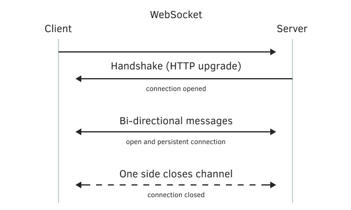

# Theoretical foundations of the WebSockets protocol

The WebSocket protocol is built on top of TCP/IP network connections, which are characterized by an IP address (or a domain name that replaces it) and a port number. The HTTP/HTTPS protocol, with which we have already practiced in the chapter on [network functions](/en/book/advanced/network), works based on the same principle. There, the standard port numbers were 80 (for insecure connections) and 443 (for secure connections). There is no dedicated port number for WebSocket, so web service providers can choose any available number. All of our examples will use port 9000.

When specifying URLs as WebSocket protocol prefixes, we use ws (for non-secure connections) and wss (for secure connections).

The WebSocket format is more efficient in terms of data transfer than HTTP as it uses much less control data.

The initial connection establishment for a WebSocket service completely repeats an HTTP/HTTPS web page request: you need to send a GET request with specially prepared headers. A feature of these headers is the presence of lines:

```
Connection: Upgrade
Upgrade: websocket

```

as well as some additional lines that report the version of the WebSocket protocol and special randomly generated strings. The keys involved in the "handshaking" procedure between the client and the server.

```
Sec-WebSocket-Key: ...
Sec-WebSocket-Version: 13

```

In practice, the "handshake" implies that the server checks the availability of those options that the client requested, and in response with standard HTTP headers confirms the switch to WebSocket mode or rejects it. The simplest reason for rejection can be if you are trying to connect via WebSockets to a simple web server where the WebSocket server is not provided or the required version is not supported.

The current version of the WebSockets protocol is known under the symbolic name Hybi and number 13. An earlier and simpler version called Hixie may be useful for backward compatibility. In what follows, we will only use Hybi, although a Hixie implementation is also included.

A successful connection is indicated by the following HTTP headers in the server response:

```
HTTP/1.1 101 Switching Protocols
Upgrade: websocket
Connection: Upgrade
Sec-WebSocket-Accept: ...

```

The Sec-WebSocket-Accept field here is calculated and populated by the server based on the Sec-WebSocket-Key to confirm compliance with the protocol. All this is regulated by the specification [RFC6455](https://www.rfc-editor.org/rfc/rfc6455) and will be supported in our MQL programs as well.

For clarity, the procedure is shown in the following image:



Interaction between client and server via WebSocket protocol

After establishing a WebSocket connection, the client and server can exchange information packed into special blocks: frames and messages. A message may consist of one or more frames. The frame size, according to the specification, is limited to an astronomical number of 263 bytes (9223372036854775807 ~ 9.22 exabytes!), but specific implementations may of course have more mundane limits since this theoretical limit does not seem practical for sending in one packet.

At any time, the client or server can terminate the connection, having previously "politely said goodbye" (see below) or by simply closing the network socket.

Frames can be of different types as specified in their header (4 to 16 bytes long) that comes at the beginning of each frame. For reference, let's list the operational codes (they are present in the first byte of the header) and the purpose of frames of different types.

- 0 — continuation frame (inherits the properties of the previous frame);
- 1 — frame with text information;
- 2 — frame with binary information;
- 8 — frame request to close and confirmation of closing the connection (sent for "polite farewell");
- 9 — ping frame, can be periodically sent by either side to make sure the connection is physically saved;
- 10 — pong frame, sent in response to a ping frame.

The last frame in a message is marked with a special bit in the header. Of course, when a message consists of one frame, it is also the last one. The length of the payload is also passed in the header.
