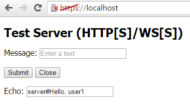
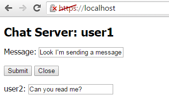

# Server component of web services based on the WebSocket protocol

To organize a common server component of all projects, we will create a separate folder Web inside MQL5/Experts/MQL5Book/p7/. Ideally, it would be convenient to place Web as a subfolder into Shared Projects. The fact is that MQL5/Shared Projects is available in the standard distribution of MetaTrader 5 and reserved for cloud storage projects. Therefore, later, by using the functionality of shared projects, it would be possible to upload all the files of our projects to the server (not only web files but also MQL programs).

Later, when we create an mqproj file with MQL5 client programs, we will add all the files in this folder to the project section Settings and Files, since all these files form an integral part of the project — the server part.

Since a separate directory has been allocated for the project server, it is necessary to ensure the possibility of importing modules from nodejs in this directory. By default, nodejs looks for modules in the /node_modules subfolder of the current directory, and we will run the server from the project. Therefore, being in the folder where we will place the web files of the project, run the command:

```
mklink /j node_modules {drive:/path/to/folder/nodejs}/node_modules

```

As a result, a "symbolic" directory link called node_modules will appear, pointing to the original folder of the same name in the installed nodejs.

The easiest way to check the functionality of WebSockets is the echo service. Its model of operation is to return any received message back to the sender. Let's consider how it would be possible to organize such a service in a minimal configuration. An example is included in the file wsintro.js.

First of all, we connect the package (module) ws, which provides WebSocket functionality for nodejs and which we installed along with the web server.

```
// JavaScript
const WebSocket = require('ws');

```

The require function works similarly to the #include directive in MQL5, but additionally returns a module object with the API of all files in the ws package. Thanks to this, we can call the methods and properties of the WebSocket object. In this case, we need to create a WebSocket server on port 9000.

```
// JavaScript
const port = 9000;
const wss = new WebSocket.Server({ port: port });

```

Here we see the usual MQL5 constructor call by the new operator, but an unnamed object (structure) is passed as a parameter, in which, as in a map, a set of named properties and their values can be stored. In this case, only one property port is used, and its value is set equal to the (more precisely, a constant) port variable described above. Basically, we can pass the port number (and other settings) on the command line when running the script.

The server object gets into the wss variable. On success, we signal to the command line window that the server is running (waiting for connections).

```
// JavaScript
console.log('listening on port: ' + port);

```

The console.log call is similar to the usual Print in MQL5. Also note that strings in JavaScript can be enclosed not only in double quotes but also in single quotes, and even in backticks `this is a ${template}text`, which adds some useful features.

Next, for the wss object, we assign a "connection" event handler, which refers to the connection of a new client. Obviously, the list of supported object events is defined by the developers of the package, in this case, the package ws that we use. All this is reflected in the documentation.

The handler is bound by the on method, which specifies the name of the event and the handler itself.

```
// JavaScript
wss.on('connection', function(channel)
{
   ...
});

```

The handler is an unnamed (anonymous) function defined directly in the place where a reference parameter is expected for the callback code to be executed on a new connection. The function is made anonymous because it is used only here, and JavaScript allows such simplifications in the syntax. The function has only one parameter which is the object of the new connection. We are free to choose the name for the parameter ourselves, and in this case, it is channel.

Inside the handler, another handler should be set for the "message" event related to the arrival of a new message in a specific channel.

```
// JavaScript
   channel.on('message', function(message)
   {
      console.log('message: ' + message);
      channel.send('echo: ' + message);
   });
   ...

```

It also uses an anonymous function with a single parameter, the received message object. We print it to the console log for debugging. But the most important thing happens in the second line: by calling channel.send, we send a response message to the client.

To complete the picture, let's add our own welcome message to the "connection" handler. When complete, it looks like this:

```
// JavaScript
wss.on('connection', function(channel)
{
   channel.on('message', function(message)
   {
      console.log('message: ' + message);
      channel.send('echo: ' + message);
   });
   console.log('new client connected!');
   channel.send('connected!');
});

```

It's important to understand that while binding the "message" handler is higher in the code than sending the "hello", the message handler will be called later, and only if the client sends a message.

We have reviewed a script outline for organizing an echo service. However, it would be good to test it. This can be done in the most efficient way by using a regular browser, but this will require complicating the script slightly: turning it into the smallest possible web server that returns a web page with the smallest possible WebSocket client.

Echo service and test web page

The echo server script that we will now look at is in the file wsecho.js. One of the main points is that it is desirable to support not only open protocols on the server http/ws but also protected protocols https/wss. This possibility will be provided in all our examples (including clients based on MQL5), but for this, you need to perform some actions on the server.

You should start with a couple of files containing encryption keys and certificates. The files are usually obtained from authorized sources, i.e. certifying centers, but for informational purposes, you can generate the files yourself. Of course, they cannot be used on public servers, and pages with such certificates will cause warnings in any browser (the page icon to the left of the address bar is highlighted in red).

The description of the device of certificates and the process of generating them on their own is beyond the scope of the book, but two ready-made files are included in the book: MQL5Book.crt and MQL5Book.key (there are other extensions) with a limited duration. These files must be passed to the constructor of the web server object in order for the server to work over the HTTPS protocol.

We will pass the name of the certificate files in the script launch command line. For example, like this:

```
node wsecho.js MQL5Book

```

If you run the script without an additional parameter, the server will work using the HTTP protocol.

```
node wsecho.js

```

Inside the script, command line arguments are available through the built-in object process.argv, and the first two arguments always contain, respectively, the name of the server node.exe and the name of the script to run (in this case, wsecho.js), so we discard them by the splice method.

```
// JavaScript
const args = process.argv.slice(2);
const secure = args.length > 0 ? 'https' : 'http';

```

Depending on the presence of the certificate name, the secure variable gets the name of the package that should be loaded next to create the server: https or http. In total, we have 3 dependencies in the code:

```
// JavaScript
const fs = require('fs');
const http1 = require(secure);
const WebSocket = require('ws');

```

We already know all about the ws package; the https and http packages provide a web server implementation, and the built-in fs package provides work with the file system.

Web server settings are formatted as the options object. Here we see how the name of the certificate from the command line is substituted in strings with slash quotes using the expression ${args[0]}. Then the corresponding pair of files is read by the method fs.readFileSync.

```
// JavaScript
const options = args.length > 0 ?
{
   key : fs.readFileSync(`${args[0]}.key`),
   cert : fs.readFileSync(`${args[0]}.crt`)
} : null;

```

The web server is created by calling the createServer method, to which we pass the options object and an anonymous function — an HTTP request handler. The handler has two parameters: the req object with an HTTP request and the res object with which we should send the response (HTTP headers and web page).

```
// JavaScript
http1.createServer(options, function (req, res)
{
   console.log(req.method, req.url);
   console.log(req.headers);
   
   if(req.url == '/') req.url = "index.htm";
   
   fs.readFile('./' + req.url, (err, data) =>
   {
      if(!err)
      {
         var dotoffset = req.url.lastIndexOf('.');
         var mimetype = dotoffset == -1 ? 'text/plain' :
         {
            '.htm' : 'text/html',
            '.html' : 'text/html',
            '.css' : 'text/css',
            '.js' : 'text/javascript'
         }[ req.url.substr(dotoffset) ];
         res.setHeader('Content-Type',
            mimetype == undefined ? 'text/plain' : mimetype);
         res.end(data);
      }
      else
      {
         console.log('File not fount: ' + req.url);
         res.writeHead(404, "Not Found");
         res.end();
      }
  });
}).listen(secure == 'https' ? 443 : 80);

```

The main index page (and the only one) is index.htm (to be written now). In addition, the handler can send js and css files, which will be useful to us in the future. Depending on whether protected mode is enabled, the server is started by calling the method listen on standard ports 443 or 80 (change to others if these are already taken on your computer).

To accept connections on port 9000 for web sockets, we need to deploy another web server instance with the same options. But in this case, the server is there for the sole purpose of handling an HTTP request to "upgrade" the connection up to the Web Sockets protocol.

```
// JavaScript
const server = new http1.createServer(options).listen(9000);
server.on('upgrade', function(req, socket, head)
{
   console.log(req.headers); // TODO: we can add authorization!
});

```

Here, in the "upgrade" event handler, we accept any connections that have already passed the handshake and print the headers to the log, but potentially we could request user authorization if we were doing a closed (paid) service.

Finally, we create a WebSocket server object, as in the previous introductory example, with the only difference being that a ready-made web server is passed to the constructor. All connecting clients are counted and welcomed by sequence number.

```
// JavaScript
var count = 0;
   
const wsServer = new WebSocket.Server({ server });
wsServer.on('connection', function onConnect(client)
{
   console.log('New user:', ++count);
   client.id = count; 
   client.send('server#Hello, user' + count);
   
   client.on('message', function(message)
   {
      console.log('%d : %s', client.id, message);
      client.send('user' + client.id + '#' + message);
   });
   
   client.on('close', function()
   {
      console.log('User disconnected:', client.id);
   });
});

```

For all events, including connection, disconnection, and message, debug information is displayed in the console.

Well, the web server with web socket server support is ready. Now we need to create a client web page index.htm for it.

```
<!DOCTYPE html>
<html>
  <head>
  <title>Test Server (HTTP[S]/WS[S])</title>
  </head>
  <body>
    <div>
      <h1>Test Server (HTTP[S]/WS[S])</h1>
      <p><label>
         Message: <input id="message" name="message" placeholder="Enter a text">
      </label></p>
      <p><button>Submit</button> <button>Close</button></p>
      <p><label>
         Echo: <input id="echo" name="echo" placeholder="Text from server">
      </label></p>
    </div>
  </body>
  <script src="wsecho_client.js"></script>
</html>

```

The page is a form with a single input field and a button for sending a message.



Echo service web page on WebSocket

The page uses the wsecho_client.js script, which provides websocket client response. In browsers, web sockets are built in as "native" JavaScript objects, so you don't need to connect anything external: just call the constructor web socket with the desired protocol and port number.

```
// JavaScript
const proto = window.location.protocol.startsWith('http') ?
              window.location.protocol.replace('http', 'ws') : 'ws:';
const ws = new WebSocket(proto + '//' + window.location.hostname + ':9000');

```

The URL is formed from the address of the current web page (window.location.hostname), so the web socket connection is made to the same server.

Next, the ws object allows you to react to events and send messages. In the browser, the open connection event is called "open"; it is connected via the onopen property. The same syntx, slightly different from the server implementation, is also used for the new message arrival event — the handler for it is assigned to the onmessage property.

```
// JavaScript
ws.onopen = function()
{
   console.log('Connected');
};
   
ws.onmessage = function(message)
{
   console.log('Message: %s', message.data);
   document.getElementById('echo').value = message.data; 
};

```

The text of the incoming message is displayed in the form element with the id "echo". Note that the message event object (handler parameter) is not the message which is available in the data property. This is an implementation feature in JavaScript.

The reaction to the form buttons is assigned using the addEventListener method for each of the two button tag objects. Here we see another way of describing an anonymous function in JavaScript: parentheses with an argument list that can be empty, and the body of the function after the arrow can be (arguments) => { ... }.

```
// JavaScript
const button = document.querySelectorAll('button'); // request all buttons
// button "Submit"  
button[0].addEventListener('click', (event) =>
{
   const x = document.getElementById('message').value;
   if(x) ws.send(x);
});
// button "close"
button[1].addEventListener('click', (event) =>
{
   ws.close();
   document.getElementById('echo').value = 'disconnected';
   Array.from(document.getElementsByTagName('button')).forEach((e) =>
   {
      e.disabled = true;
   });
});

```

To send messages, we call the ws.send method, and to close the connection we call the ws.close method.

This completes the development of the first example of client-server scripts for demonstrating the echo service. You can run wsecho.js using one of the commands shown earlier, and then open in your browser the page at http://localhost or https://localhost (depending on server settings). After the form appears on the screen, try chatting with the server and make sure the service is running.

Gradually complicating this example, we will pave the way for the web service for copying trading signals. But the next step will be a chat service, the principle of which is similar to the service of trading signals: messages from one user are transmitted to other users.

Chat service and test web page

The new server script is called wschat.js, and it repeats a lot from wsecho.js. Let's list the main differences. In the web server HTTP request handler, change the initial page from index.htm to wschat.htm.

```
// JavaScript
http1.createServer(options, function (req, res)
{
   if(req.url == '/') req.url = "wschat.htm";
   ...
});

```

To store information about users connected to the chat, we will describe the clients map array. Map is a standard JavaScript associative container, into which arbitrary values can be written using keys of an arbitrary type, including objects.

```
// JavaScript
const clients = new Map();                    // added this line
var count = 0;

```

In the new user connection event handler, we will add the client object, received as a function parameter, into the map under the current client sequence number.

```
// JavaScript
wsServer.on('connection', function onConnect(client)
{
   console.log('New user:', ++count);
   client.id = count; 
   client.send('server#Hello, user' + count);
   clients.set(count, client);                // added this line
   ...

```

Inside the onConnect function, we set a handler for the event about the arrival of a new message for a specific client, and it is inside the nested handler that we send messages. However, this time we loop through all the elements of the map (that is, through all the clients) and send the text to each of them. The loop is organized with the forEach method calls for an array from the map, and the next anonymous function that will be performed for each element (elem) is passed to the method in place. The example of this loop clearly demonstrates the functional-declarative programming paradigm that prevails in JavaScript (in contrast to the imperative approach in MQL5).

```
// JavaScript
   client.on('message', function(message)
   {
      console.log('%d : %s', client.id, message);
      Array.from(clients.values()).forEach(function(elem) // added a loop
      {
         elem.send('user' + client.id + '#' + message);
      });
   });

```

It is important to note that we send a copy of the message to all clients, including the original author. It could be filtered out, but for debugging purposes, it's better to have confirmation that the message was sent.

The last difference from the previous echo service is that when a client disconnects, it needs to be removed from the map.

```
// JavaScript
   client.on('close', function()
   {
      console.log('User disconnected:', client.id);
      clients.delete(client.id);                   // added this line
   });

```

Regarding the replacement of the page index.htm by wschat.htm, here we added a "field" to display the author of the message (origin) and connected a new browser script wschat_client.js. It parses the messages (we use the '#' symbol to separate the author from the text) and fills in the form fields with the information received. Since nothing has changed from the point of view of the WebSocket protocol, we will not provide the source code.



Chat service webpage on WebSocket

You can start nodejs with the wschat.js chat server and then connect to it from several browser tabs. Each connection gets a unique number displayed in the header. Text from the Message field is sent to all clients upon the click on Submit. Then, the client forms show both the author of the message (label at the bottom left) and the text itself (field at the bottom center).

So, we have made sure that the web server with web socket support is ready. Let's turn to writing the client part of the protocol in MQL5.
