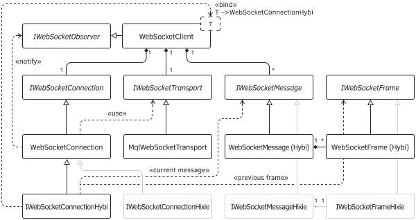

# WebSocket protocol in MQL5

We have previously looked at [Theoretical foundations of the WebSockets protocol](/en/book/advanced/project/project_websockets). The complete specification is quite extensive, and a detailed description of its implementation would require a lot of space and time. Therefore, we present the general structure of ready-made classes and their programming interfaces. All files are located in the directory MQL5/Include/MQL5Book/ws/.

- wsinterfaces.mqh — general abstract description of all interfaces, constants, and types;
- wstransport.mqh — MqlWebSocketTransport class that implements the IWebSocketTransport low-level network data transfer interface based on MQL5 [socket functions](/en/book/advanced/network);
- wsframe.mqh — WebSocketFrame and WebSocketFrameHixie classes that implement the IWebSocketFrame interface, which hides the algorithms for generating (encoding and decoding) frames for the Hybi and Hixie protocols, respectively;
- wsmessage.mqh — WebSocketMessage and WebSocketMessageHixie classes that implement the IWebSocketMessage interface, which formalizes the formation of messages from frames for the Hybi and Hixie protocols, respectively;
- wsprotocol.mqh — WebSocketConnection, WebSocketConnectionHybi, WebSocketConnectionHixie classes inherited from IWebSocketConnection; it is here that the coordinated management of the formation of frames, messages, greetings, and disconnection according to the specification takes place, for which the above interfaces are used;
- wsclient.mqh — ready-made implementation of a WebSocket client; a WebSocketClient template class that supports the IWebSocketObserver interface (for event processing) and expects WebSocketConnectionHybi or WebSocketConnectionHixie as a parameterized type;
- wstools.mqh — useful utilities in the WsTools namespace.

These header files will be automatically included in our future mqporj projects as dependencies from #include directives.



WebSocket class diagram in MQL5

The low-level network interface IWebSocketTransport has the following methods.

```
interface IWebSocketTransport
{
   int write(const uchar &data[]); // write the array of bytes to the network
   int read(uchar &buffer[]);      // read data from network into byte array
   bool isConnected(void) const;   // check for connection
   bool isReadable(void) const;    // check for the ability to read from the network
   bool isWritable(void) const;    // check for the possibility of writing to the network
   int getHandle(void) const;      // system socket descriptor
   void close(void);               // close connection
};

```

It is not difficult to guess from the names of the methods which MQL5 API Socket functions will be used to build them. But if necessary, those who wish can implement this interface by their own means, for example, through a DLL.

The MqlWebSocketTransport class that implements this interface requires the protocol, hostname, and port number to which the network connection is made when creating an instance. Additionally, you can specify a timeout value.

Frame types are collected in the WS_FRAME_OPCODE enum.

```
enum WS_FRAME_OPCODE
{
   WS_DEFAULT = 0,
   WS_CONTINUATION_FRAME = 0x00,
   WS_TEXT_FRAME = 0x01,
   WS_BINARY_FRAME = 0x02,
   WS_CLOSE_FRAME = 0x08,
   WS_PING_FRAME = 0x09,
   WS_PONG_FRAME = 0x0A
};

```

The interface for working with frames contains both static and regular methods related to frame instances. Static methods act as factories for creating frames of the required type by the transmitting side (create) and incoming frames (decode).

```
class IWebSocketFrame
{
public:
   class StaticCreator
   {
   public:
      virtual IWebSocketFrame *decode(uchar &data[], IWebSocketFrame *head = NULL) = 0;
      virtual IWebSocketFrame *create(WS_FRAME_OPCODE type, const string data = NULL,
         const bool deflate = false) = 0;
      virtual IWebSocketFrame *create(WS_FRAME_OPCODE type, const uchar &data[],
         const bool deflate = false) = 0;
   };
   ...

```

The presence of factory methods in descendant classes is made mandatory due to the presence of a template Creator and an instance of the getCreator method returning it (assuming return "singleton").

```
protected:
   template<typename P>
   class Creator: public StaticCreator
   {
   public:
     // decode received binary data in IWebSocketFrame
     // (in case of continuation, previous frame in 'head')
      virtual IWebSocketFrame *decode(uchar &data[],
         IWebSocketFrame *head = NULL) override
      {
         return P::decode(data, head);
      }
      // create a frame of the desired type (text/closing/other) with optional text
      virtual IWebSocketFrame *create(WS_FRAME_OPCODE type, const string data = NULL,
         const bool deflate = false) override
      {
         return P::create(type, data, deflate);
      };
      // create a frame of the desired type (binary/text/closure/other) with data
      virtual IWebSocketFrame *create(WS_FRAME_OPCODE type, const uchar &data[],
         const bool deflate = false) override
      {
         return P::create(type, data, deflate);
      };
   };
public:
   // require a Creator instance
   virtual IWebSocketFrame::StaticCreator *getCreator() = 0;
   ...

```

The remaining methods of the interface provide all the necessary manipulations with data in frames (encoding/decoding, receiving data and various flags).

```
   // encode the "clean" contents of the frame into data for transmission over the network
   virtual int encode(uchar &encoded[]) = 0;
   
   // get data as text
   virtual string getData() = 0;
   
   // get data as bytes, return size
   virtual int getData(uchar &buf[]) = 0;
   
   // return frame type (opcode)
   virtual WS_FRAME_OPCODE getType() = 0;
  
   // check if the frame is a control frame or with data:
   // control frames are processed inside classes
   virtual bool isControlFrame()
   {
      return (getType() >= WS_CLOSE_FRAME);
   }
   
   virtual bool isReady() { return true; }
   virtual bool isFinal() { return true; }
   virtual bool isMasked() { return false; }
   virtual bool isCompressed() { return false; }
};

```

The IWebSocketMessage interface contains methods for performing similar actions but at the message level.

```
class IWebSocketMessage
{
public:
   // get an array of frames that make up this message
   virtual void getFrames(IWebSocketFrame *&frames[]) = 0;
   
   // set text as message content
   virtual bool setString(const string &data) = 0;
  
   // return message content as text
   virtual string getString() = 0;
  
   // set binary data as message content
   virtual bool setData(const uchar &data[]) = 0;
   
   // return the contents of the message in "raw" binary form
   virtual bool getData(uchar &data[]) = 0;
  
   // sign of completeness of the message (all frames received)
   virtual bool isFinalised() = 0;
  
   // add a frame to the message
   virtual bool takeFrame(IWebSocketFrame *frame) = 0;
};

```

Taking into account the interfaces of frames and messages, a common interface for WebSocket connections IWebSocketConnection is defined.

```
interface IWebSocketConnection
{
   // open a connection with the specified URL and its parts,
   // and optional custom headers
   bool handshake(const string url, const string host, const string origin,
      const string custom = NULL);
   
   // low-level read frames from the server
   int readFrame(IWebSocketFrame *&frames[]);
   
   // low-level send frame (e.g. close or ping)
   bool sendFrame(IWebSocketFrame *frame);
   
   // low-level message sending
   bool sendMessage(IWebSocketMessage *msg);
   
   // custom check for new messages (event generation)
   int checkMessages();
   
   // custom text submission
   bool sendString(const string msg);
   
   // custom posting of binary data
   bool sendData(const uchar &data[]);
   
   // close the connection
   bool disconnect(void);
};

```

Notifications about disconnection and new messages are received via the IWebSocketObserver interface methods.

```
interface IWebSocketObserver
{
  void onConnected();
  void onDisconnect();
  void onMessage(IWebSocketMessage *msg);
};

```

In particular, the WebSocketClient class was made a successor of this interface and by default simply outputs information to the log. The class constructor expects an address to connect to the protocol ws or wss.

```
template<typename T>
class WebSocketClient: public IWebSocketObserver
{
protected:
   IWebSocketMessage *messages[];
   
   string scheme;
   string host;
   string port;
   string origin;
   string url;
   int timeOut;
   ...
public:
   WebSocketClient(const string address)
   {
      string parts[];
      URL::parse(address, parts);
   
      url = address;
      timeOut = 5000;
  
      scheme = parts[URL_SCHEME];
      if(scheme != "ws" && scheme != "wss")
      {
        Print("WebSocket invalid url scheme: ", scheme);
        scheme = "ws";
      }
  
      host = parts[URL_HOST];
      port = parts[URL_PORT];
  
      origin = (scheme == "wss" ? "https://" : "http://") + host;
   }
   ...
  
   void onDisconnect() override
   {
      Print(" > Disconnected ", url);
   }
  
   void onConnected() override
   {
      Print(" > Connected ", url);
   }
  
   void onMessage(IWebSocketMessage *msg) override
   {
      // NB: message can be binary, print it just for notification
      Print(" > Message ", url, " " , msg.getString());
      WsTools::push(messages, msg);
   }
   ...
};

```

The WebSocketClient class collects all message objects into an array and takes care of deleting them if the MQL program doesn't do it.

The connection is established in the open method.

```
template<typename T>
class WebSocketClient: public IWebSocketObserver
{
protected:
   IWebSocketTransport *socket;
   IWebSocketConnection *connection;
   ...
public:
   ...
   bool open(const string custom_headers = NULL)
   {
      uint _port = (uint)StringToInteger(port);
      if(_port == 0)
      {
         if(scheme == "ws") _port = 80;
         else _port = 443;
      }
  
      socket = MqlWebSocketTransport::create(scheme, host, _port, timeOut);
      if(!socket || !socket.isConnected())
      {
         return false;
      }
  
      connection = new T(&this, socket);
      return connection.handshake(url, host, origin, custom_headers);
   }
   ...

```

The most convenient ways to send data are provided by the overloaded send methods for text and binary data.

```
   bool send(const string str)
   {
      return connection ? connection.sendString(str) : false;
   }
    
   bool send(const uchar &data[])
   {
      return connection ? connection.sendData(data) : false;
   }

```

To check for new incoming messages, you can call the checkMessages method. Depending on its blocking parameter, the method will either wait for a message in a loop until the timeout or return immediately if there are no messages. Messages will go to the IWebSocketObserver::onMessage handler.

```
   void checkMessages(const bool blocking = true)
   {
      if(connection == NULL) return;
      
      uint stop = GetTickCount() + (blocking ? timeOut : 1);
      while(ArraySize(messages) == 0 && GetTickCount() < stop && isConnected())
      {
         // all frames are collected into the appropriate messages, and they become
         // available through event notifications IWebSocketObserver::onMessage,
         // however, control frames have already been internally processed and removed by now
         if(!connection.checkMessages()) // while no messages, let's make micro-pause
         {
            Sleep(100);
         }
      }
   }

```

An alternative way to receive messages is implemented in the readMessage method: it returns a pointer to the message to the calling code (in other words, the application handler onMessage is not required). After that, the MQL program is responsible for releasing the object.

```
   IWebSocketMessage *readMessage(const bool blocking = true)
   {
      if(ArraySize(messages) == 0) checkMessages(blocking);
      
      if(ArraySize(messages) > 0)
      {
         IWebSocketMessage *top = messages[0];
         ArrayRemove(messages, 0, 1);
         return top;
      }
      return NULL;
   }

```

The class also allows you to change the timeout, check the connection, and close it.

```
   void setTimeOut(const int ms)
   {
      timeOut = fabs(ms);
   }
   
   bool isConnected() const
   {
      return socket && socket.isConnected();
   }
   
   void close()
   {
      if(isConnected())
      {
         if(connection)
         {
            connection.disconnect(); // this will close socket after server acknowledge
            delete connection;
            connection = NULL;
         }
         if(socket)
         {
            delete socket;
            socket = NULL;
         }
      }
   }
};

```

The library of the considered classes allows you to create client applications for echo and chat services.
