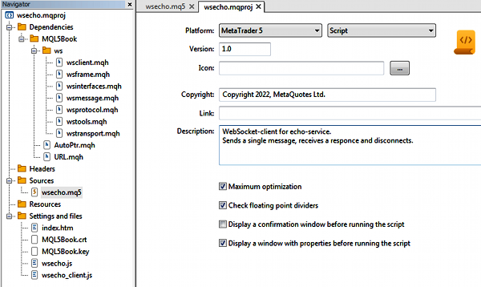
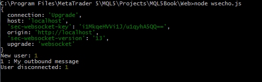
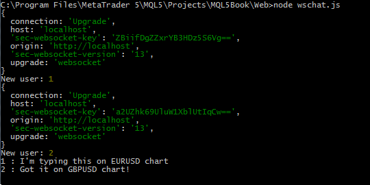

# Client programs for echo and chat services in MQL5

Let's write a simple script to connect to the echo service MQL5/Experts/MQL5Book/p7/wsEcho/wsecho.mq5 (note that this is a script, but we placed it inside the folder MQL5/Experts/MQL5Book/p7/, making it a single container for web-related MQL programs, since all subsequent examples will be Experts Advisors). Since in this chapter, we are considering the creation of software complexes within projects, we will design the script as part of an mqproj project, which will also include the server component.

The input parameters of the script allow you to specify the address of the service and the text of the message. The default is an unsecured connection. If you are going to launch the server wsecho.js with TLS support, you need to change the protocol to the secure wss. Keep in mind that establishing a secure connection takes longer (by a couple of seconds) than usual.

```
input string Server = "ws://localhost:9000/";
input string Message = "My outbound message";
   
#include <MQL5Book/AutoPtr.mqh>
#include <MQL5Book/ws/wsclient.mqh>

```

In the OnStart function, we create an instance of the WebSocket client (wss) for the given address and call the open method. In case of a successful connection, we wait for a welcome message from the service by calling wss.readMessage in blocking mode (wait up to 5 seconds, by default). We use an autopointer on the resulting object so as not to call delete manually at the end.

```
void OnStart()
{
   Print("\n");
   WebSocketClient<Hybi> wss(Server);
   Print("Opening...");
   if(wss.open())
   {
      Print("Waiting for welcome message (if any)");
      AutoPtr<IWebSocketMessage> welcome(wss.readMessage());
      ...

```

The WebSocketClient class contains event handler stubs, including the simple method onMessage, which will print the greeting to the log.

Then we send our message and again wait for a response from the server. The echo message will also be logged.

```
      Print("Sending message...");
      wss.send(Message);
      Print("Receiving echo...");
      AutoPtr<IWebSocketMessage> echo(wss.readMessage());
   }
   ...

```

Finally, we close the connection.

```
   if(wss.isConnected())
   {
      Print("Closing...");
      wss.close();
   }
}

```

Based on the script file, let's create a project file (wsecho.mqproj). We fill in the project properties with the version number (1.0), copyright, and description. Let's add echo service server files to the Settings and Files branch (this will at least remind the developer that there is a test server). After compilation, dependencies (header files) will appear in the hierarchy.

Everything should look like in the screenshot below.



Echo service project, client script and server

If the script was located inside the folder Shared Projects, for example, in MQL5/Shared Projects/MQL5Book/wsEcho/, then after successful compilation, its ex5 file would be automatically moved to the folder MQL5/Scripts/Shared Projects/MQL5Book/wsEcho/, and the corresponding entry would be displayed in the compilation log. This is the standard behavior for compiling any MQL programs in shared projects.

In all examples of this chapter, do not forget to start the server before testing the MQL script. In this case, run the command: node.exe wsecho.js while in the web folder.

Next, let's run the script wsecho.ex5. The log will show the actions that are taking place, as well as the message notifications.

```
Opening...
Connecting to localhost:9000
Buffer: 'HTTP/1.1 101 Switching Protocols
Upgrade: websocket
Connection: Upgrade
Sec-WebSocket-Accept: mIpas63g5xGMqJcKtreHKpSbY1w=
'
Headers: 
                               [,0]                           [,1]
[0,] "upgrade"                      "websocket"                   
[1,] "connection"                   "Upgrade"                     
[2,] "sec-websocket-accept"         "mIpas63g5xGMqJcKtreHKpSbY1w="
 > Connected ws://localhost:9000/
Waiting for welcome message (if any)
 > Message ws://localhost:9000/ server#Hello, user1
Sending message...
Receiving echo...
 > Message ws://localhost:9000/ user1#My outbound message
Closing...
Close requested
Waiting...
SocketRead failed: 5273 Available: 1
 > Disconnected ws://localhost:9000/
Server close ack

```

The above HTTP headers are the server's response during the handshake process. If we look into the console window where the server is running, we will find the HTTP headers received by the server from our client.



Echo service server log

Also, the user's connection, message, and disconnection are indicated here.

Let's do a similar job for the chat service: create a WebSocket client in MQL5, a project for it, and test it. This time the type of the client program will be an Expert Advisor because the chat needs support for interactive events from the keyboard on the chart. The Expert Advisor is attached to the book in a folder MQL5/MQL5Book/p7/wsChat/wschat.mq5.

To demonstrate the technology of receiving events in handler methods, let's define our own class MyWebSocket, derived from WebSocketClient.

```
class MyWebSocket: public WebSocketClient<Hybi>
{
public:
   MyWebSocket(const string address, const bool compress = false):
      WebSocketClient(address, compress) { }
   
   /* void onConnected() override { } */
   
   void onDisconnect() override
   {
      // we can do something else and call (or not call) the legacy code
      WebSocketClient<Hybi>::onDisconnect();
   }
   
   void onMessage(IWebSocketMessage *msg) override
   {
     // TODO: we could truncate copies of our own messages,
     // but they are left for debugging
      Alert(msg.getString());
      delete msg;
   }
};

```

When a message is received, we will display it not in the log, but as an alert, after which the object should be deleted.

In the global context, we describe the object of our wss class and the message string where the user input from the keyboard will be accumulated.

```
MyWebSocket wss(Server);
string message = "";

```

The OnInit function contains the necessary preparation, in particular, starts a timer and opens a connection.

```
int OnInit()
{
  ChartSetInteger(0, CHART_QUICK_NAVIGATION, false);
  EventSetTimer(1);
  wss.setTimeOut(1000);
  Print("Opening...");
  return wss.open() ? INIT_SUCCEEDED : INIT_FAILED;
}

```

The timer is needed to check for new messages from other users.

```
void OnTimer()
{
   wss.checkMessages(false); // use a non-blocking check in the timer
}

```

In the OnChartEvent handler, we respond to keystrokes: all alphanumeric keys are translated into characters and attached to the message string. If necessary, you can press Backspace to remove the last character. All typed text is updated in the chart comment. When the message is complete, press Enter to send it to the server.

```
void OnChartEvent(const int id, const long &lparam, const double &dparam,
   const string &sparam)
{
   if(id == CHARTEVENT_KEYDOWN)
   {
      if(lparam == VK_RETURN)
      {
         const static string longmessage = ...
         if(message == "long") wss.send(longmessage);
         else if(message == "bye") wss.close();
         else wss.send(message);
         message = "";
      }
      else if(lparam == VK_BACK)
      {
         StringSetLength(message, StringLen(message) - 1);
      }
      else
      {
         ResetLastError();
         const short c = TranslateKey((int)lparam);
         if(_LastError == 0)
         {
            message += ShortToString(c);
         }
      }
      Comment(message);
   }
}

```

If we enter the text "long", the program will send a specially prepared rather long text. If the message text is "bye", the program closes the connection. Also, the connection will be closed when the program exits.

```
void OnDeinit(const int)
{
   if(wss.isConnected())
   {
      Print("Closing...");
      wss.close();
   }
}

```

Let's create a project for the Expert Advisor (file wschat.mqproj), fill in its properties, and add the backend to the branch Settings and Files. This time we will show how the project file looks from the inside. In the mqproj file, the Dependencies branch is stored in the "files" property, and the Settings and Files branch is in the "tester" property.

```
{
  "platform"    :"mt5",
  "program_type":"expert",
  "copyright"   :"Copyright 2022, MetaQuotes Ltd.",
  "version"     :"1.0",
  "description" :"WebSocket-client for chat-service.\r\nType and send text messages for all connected users.\r\nShow alerts with messages from others.",
  "optimize"    :"1",
  "fpzerocheck" :"1",
  "tester_no_cache":"0",
  "tester_everytick_calculate":"0",
  "unicode_character_set":"0",
  "static_libraries":"0",
  "files":
  [
    {
      "path":"wschat.mq5",
      "compile":true,
      "relative_to_project":true
    },
    {
      "path":"MQL5\\Include\\MQL5Book\\ws\\wsclient.mqh",
      "compile":false,
      "relative_to_project":false
    },
    {
      "path":"MQL5\\Include\\MQL5Book\\URL.mqh",
      "compile":false,
      "relative_to_project":false
    },
    {
      "path":"MQL5\\Include\\MQL5Book\\ws\\wsframe.mqh",
      "compile":false,
      "relative_to_project":false
    },
    {
      "path":"MQL5\\Include\\MQL5Book\\ws\\wstools.mqh",
      "compile":false,
      "relative_to_project":false
    },
    {
      "path":"MQL5\\Include\\MQL5Book\\ws\\wsinterfaces.mqh",
      "compile":false,
      "relative_to_project":false
    },
    {
      "path":"MQL5\\Include\\MQL5Book\\ws\\wsmessage.mqh",
      "compile":false,
      "relative_to_project":false
    },
    {
      "path":"MQL5\\Include\\MQL5Book\\ws\\wstransport.mqh",
      "compile":false,
      "relative_to_project":false
    },
    {
      "path":"MQL5\\Include\\MQL5Book\\ws\\wsprotocol.mqh",
      "compile":false,
      "relative_to_project":false
    },
    {
      "path":"MQL5\\Include\\VirtualKeys.mqh",
      "compile":false,
      "relative_to_project":false
    }
  ],
  "tester":
  [
    {
      "type":"file",
      "path":"..\\Web\\MQL5Book.crt",
      "relative_to_project":true
    },
    {
      "type":"file",
      "path":"..\\Web\\MQL5Book.key",
      "relative_to_project":true
    },
    {
      "type":"file",
      "path":"..\\Web\\wschat.htm",
      "relative_to_project":true
    },
    {
      "type":"file",
      "path":"..\\Web\\wschat.js",
      "relative_to_project":true
    },
    {
      "type":"file",
      "path":"..\\Web\\wschat_client.js",
      "relative_to_project":true
    }
  ]
}

```

If the Expert Advisor were inside the Shared Projects folder, for example, in MQL5/Shared Projects/MQL5Book/wsChat/, after successful compilation, its ex5 file would be automatically moved to the folder MQL5/Experts/Shared Projects/MQL5Book/wsChat/.

Starting the server node.exe wschat.js. Now you can run a couple of copies of the Expert Advisor on different charts. Basically, the service involves "communication" between different terminals and even different computers, but you can also test it from one terminal.

Here is an example of communication between the EURUSD and GBPUSD charts.

```
(EURUSD,H1)        
(EURUSD,H1)        Opening...
(EURUSD,H1)        Connecting to localhost:9000
(EURUSD,H1)        Buffer: 'HTTP/1.1 101 Switching Protocols
(EURUSD,H1)        Upgrade: websocket
(EURUSD,H1)        Connection: Upgrade
(EURUSD,H1)        Sec-WebSocket-Accept: Dg+aQdCBwNExE5mEQsfk5w9J+uE=
(EURUSD,H1)        
(EURUSD,H1)        '
(EURUSD,H1)        Headers: 
(EURUSD,H1)                                       [,0]                           [,1]
(EURUSD,H1)        [0,] "upgrade"                      "websocket"                   
(EURUSD,H1)        [1,] "connection"                   "Upgrade"                     
(EURUSD,H1)        [2,] "sec-websocket-accept"         "Dg+aQdCBwNExE5mEQsfk5w9J+uE="
(EURUSD,H1)         > Connected ws://localhost:9000/
(EURUSD,H1)        Alert: server#Hello, user1
(GBPUSD,H1)        
(GBPUSD,H1)        Opening...
(GBPUSD,H1)        Connecting to localhost:9000
(GBPUSD,H1)        Buffer: 'HTTP/1.1 101 Switching Protocols
(GBPUSD,H1)        Upgrade: websocket
(GBPUSD,H1)        Connection: Upgrade
(GBPUSD,H1)        Sec-WebSocket-Accept: NZENnc8p05T4amvngeop/e/+gFw=
(GBPUSD,H1)        
(GBPUSD,H1)        '
(GBPUSD,H1)        Headers: 
(GBPUSD,H1)                                       [,0]                           [,1]
(GBPUSD,H1)        [0,] "upgrade"                      "websocket"                   
(GBPUSD,H1)        [1,] "connection"                   "Upgrade"                     
(GBPUSD,H1)        [2,] "sec-websocket-accept"         "NZENnc8p05T4amvngeop/e/+gFw="
(GBPUSD,H1)         > Connected ws://localhost:9000/
(GBPUSD,H1)        Alert: server#Hello, user2
(EURUSD,H1)        Alert: user1#I'm typing this on EURUSD chart
(GBPUSD,H1)        Alert: user1#I'm typing this on EURUSD chart
(GBPUSD,H1)        Alert: user2#Got it on GBPUSD chart!
(EURUSD,H1)        Alert: user2#Got it on GBPUSD chart!

```

Since our messages are sent to everyone, including the sender, they are duplicated in the log, but on different charts.

Communication is visible on the server side as well.



Chat service server log

Now we have all the technical components for organizing the trading signals service.
