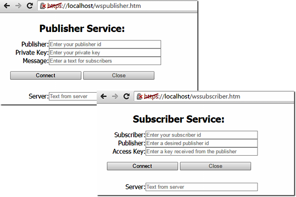

# Trading signal service and test web page

The trading signal service is technically identical to the chat service, however, its users (or rather client connections) must perform one of two roles:

- Message provider
- Message consumer

In addition, the information should not be available to everyone but work according to some subscription scheme.

To ensure this, when connecting to the service, users will be required to provide certain identifying information that differs depending on the role.

The provider must specify a public signal identifier (PUB_ID) that is unique among all signals. Basically, the same person could potentially generate more than one signal and should therefore be able to obtain multiple identifiers. In this sense, we will not complicate the service by introducing separate provider identifiers (as a specific person) and identifiers of its signals. Instead, only signal identifiers will be supported. For a real signal service, this issue needs to be worked out, along with authorization, which we left outside of this book.

The identifier will be required in order to advertise it or simply pass it on to persons interested in subscribing to this signal. But "everyone you meet" should not be able to access the signal knowing only the public identifier. In the simplest case, this would be acceptable for open account monitoring, but we will demonstrate the option of restricting access specifically in the context of signals.

For this purpose, the provider must provide the server with a secret key (PUB_KEY) known only to them but not to the public. This key will be required to generate a specific subscriber's access key.

The consumer (subscriber) must also have a unique identifier (SUB_ID, and here we will also do without authorization). To subscribe to the desired signal, the user must tell the signal provider the identifier (in practice, it is understood that at the same stage, it is necessary to confirm the payment, and usually this is all automated by the server). The provider forms a snapshot consisting of the provider's identifier, the subscriber's identifier, and the secret key. In our service, this will be done by calculating the SHA256 hash from the PUB_ID:PUB_KEY:SUB_ID string, after which the resulting bytes are converted to a hexadecimal format string. This will be the access key (SUB_KEY or ACCESS_KEY) to the signal of a particular provider for a particular subscriber. The provider (and in real systems, the server itself automatically) forwards this key to the subscriber.

Thus, when connecting to the service, the subscriber will have to specify the subscriber identifier (SUB_ID), the identifier of the desired signal (PUB_ID), and the access key (SUB_KEY). Because the server knows the provider's secret key, it can recalculate the access key for the given combination of PUB_ID and SUB_ID, and compare it with the provided SUB_KEY. A match means the normal messaging process continues. The difference will result in an error message and disconnecting the pseudo-subscriber from the service.

It is important to note that in our demo, for the sake of simplicity, there is no normal registration of users and signals, and therefore the choice of identifiers is arbitrary. It is only important for us to keep track of the uniqueness of identifiers in order to know to whom and from whom to send information online. So, our service does not guarantee that the identifier, for example, "Super Trend" belongs to the same user yesterday, today, and tomorrow. Reservation of names is made according to the principle that the early bird catches the worm. As long as a provider is continuously connected under the given identifier, the signal is delivered. If the provider disconnects, then the identifier becomes available for selection in any next connection.

The only identifier that will always be busy is "Server": the server uses it to send out its connection status messages.

To generate access keys in the server folder, there is a simple JavaScript access.js. When you run it on the command line, you need to pass as the only parameter a string of the above type PUB_ID:PUB_KEY:SUB_ID (identifiers and the secret key between them, connected by the ':' symbol)

If the parameter is not specified, the script generates an access key for some demo identifiers (PUB_ID_001, SUB_ID_100) and a secret (PUB_KEY_FFF).

```
// JavaScript
const args = process.argv.slice(2);
const input = args.length > 0 ? args[0] : 'PUB_ID_001:PUB_KEY_FFF:SUB_ID_100';
console.log('Hashing "', input, '"');
const crypto = require('crypto');
console.log(crypto.createHash('sha256').update(input).digest('hex'));

```

Running the script with the command:

```
node access.js PUB_ID_001:PUB_KEY_FFF:SUB_ID_100

```

we get this result:

```
fd3f7a105eae8c2d9afce0a7a4e11bf267a40f04b7c216dd01cf78c7165a2a5a

```

By the way, you can check and repeat this algorithm in pure MQL5 using the [CryptEncode](/en/book/advanced/crypt/crypt_encode) function.

Having analyzed the conceptual part, let's proceed to practical implementation.

The server script of the signaling service will be placed in the file MQL5/Experts/MQL5Book/p7/Web/wspubsub.js. Setting up servers in it is the same as what we did earlier. However, in addition, you will need to connect the same "crypto" module that was used in access.js. The home page will be called wspubsub.htm.

```
// JavaScript
const crypto = require('crypto');
...
http1.createServer(options, function (req, res)
{
   ...
   if(req.url == '/')
   {
      req.url = "wspubsub.htm";
   }
   ...
});

```

Instead of one map of connected clients, we will define two maps, separately for signal providers and consumers.

```
// JavaScript
const publishers = new Map();
const subscribers = new Map();

```

In both maps, the key is the provider ID, but the first one stores the objects of the providers, and the second one stores the objects of subscribers subscribed to each provider (arrays of objects).

To transfer identifiers and keys during the handshake, we will use a special header allowed by the WebSockets specification, namely Sec-Websocket-Protocol. Let's agree that identifiers and keys will be glued together with the symbol '-': in the case of a provider, a string like X-MQL5-publisher-PUB_ID-PUB_KEY is expected, and in the case of a subscriber, we expect X-MQL5-subscriber-SUB_ID-PUB_ID-SUB_KEY.

Any attempts to connect to our service without the Sec-Websocket-Protocol: X-MQL5-... header will be stopped by immediate closure.

In the new client object (in the "connection" event handler parameter onConnect(client)) this title is easy to extract from the client.protocol property.

Let's show the procedure for registering and sending the signal provider's messages in a simplified form, without error handling (the full code is attached). It is important to note that the message text is generated in JSON format (which we will discuss in more detail in the next section). In particular, the sender of the message is passed in the "origin" property (moreover, when the message is sent by the service itself, this field contains the string "Server"), and the application data from the provider is placed in the "msg" property, and this may not be just text, but also nested structure of any content.

```
// JavaScript
const wsServer = new WebSocket.Server({ server });
wsServer.on('connection', function onConnect(client)
{
   console.log('New user:', ++count, client.protocol);
   if(client.protocol.startsWith('X-MQL5-publisher'))
   {
      const parts = client.protocol.split('-');
      client.id = parts[3];
      client.key = parts[4];
      publishers.set(client.id, client);
      client.send('{"origin":"Server", "msg":"Hello, publisher ' + client.id + '"}');
      client.on('message', function(message)
      {
         console.log('%s : %s', client.id, message);
         
         if(subscribers.get(client.id))
            subscribers.get(client.id).forEach(function(elem)
         {
            elem.send('{"origin":"publisher ' + client.id + '", "msg":'
               + message + '}');
         });
      });
      client.on('close', function()
      {
         console.log('Publisher disconnected:', client.id);
         if(subscribers.get(client.id))
            subscribers.get(client.id).forEach(function(elem)
         {
            elem.close();
         });
         publishers.delete(client.id);
      });
   }
   ...

```

Half of the algorithm for subscribers is similar, but here we have the calculation of the access key and its comparison with what the connecting client transmitted, as an addition.

```
// JavaScript
   else if(client.protocol.startsWith('X-MQL5-subscriber'))
   {
      const parts = client.protocol.split('-');
      client.id = parts[3];
      client.pub_id = parts[4];
      client.access = parts[5];
      const id = client.pub_id;
      var p = publishers.get(id);
      if(p)
      {
         const check = crypto.createHash('sha256').update(id + ':' + p.key + ':'
            + client.id).digest('hex');
         if(check != client.access)
         {
            console.log(`Bad credentials: '${client.access}' vs '${check}'`);
            client.send('{"origin":"Server", "msg":"Bad credentials, subscriber '
               + client.id + '"}');
            client.close();
            return;
         }
   
         var list = subscribers.get(id);
         if(list == undefined)
         {
            list = [];
         }
         list.push(client);
         subscribers.set(id, list);
         client.send('{"origin":"Server", "msg":"Hello, subscriber '
            + client.id + '"}');
         p.send('{"origin":"Server", "msg":"New subscriber ' + client.id + '"}');
      }
      
      client.on('close', function()
      {
         console.log('Subscriber disconnected:', client.id);
         const list = subscribers.get(client.pub_id);
         if(list)
         {
            if(list.length > 1)
            {
               const filtered = list.filter(function(el) { return el !== client; });
               subscribers.set(client.pub_id, filtered);
            }
            else
            {
               subscribers.delete(client.pub_id);
            }
         }
      });
   }

```

The user interface on the client page wspubsub.htm simply invites you to follow a link to one of the two pages with forms for suppliers (wspublisher.htm + wspublisher_client.js) or subscribers (wssubscriber.htm + wssubscriber_client.js).



Web pages of signal service test clients

Their implementation inherits the features of the previously considered JavaScript clients, but with respect to the customization of the Sec-Websocket-Protocol: X-MQL5- header and one more nuance.

Until now, we have exchanged simple text messages. But for a signaling service, you will need to transfer a lot of structured information, and JSON is better suited for this. Therefore, clients can parse JSON, although they do not use it for its intended purpose, because even if a command to buy or sell a specific ticker with a given amount is found in JSON, the browser does not know how to do this.

We will need to add JSON support to our signal service client in MQL5. Meanwhile, you can run on the server wspubsub.js and test the selective connection of signal providers and consumers in accordance with the details specified by them. We suggest you do it yourself, for your own benefit.
