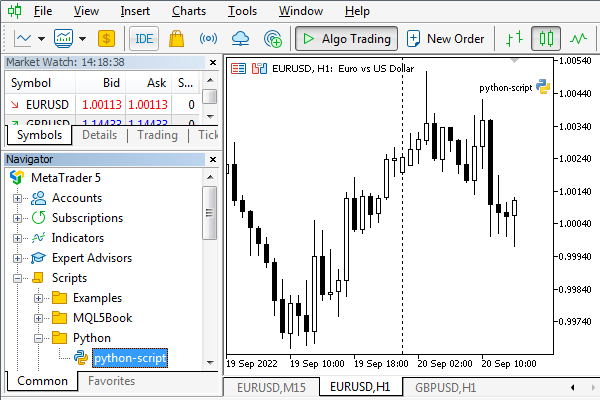

# Installing Python and the MetaTrader5 package

To study the materials in this chapter, Python must be installed on your computer. If you haven't installed it yet, download the latest version of Python (e.g. 3.10 at the time of writing) from https://www.python.org/downloads/windows.

When installing Python, it is recommended to check the "Add Python to PATH" flag so that you can run Python scripts from the command line from any folder.

Once Python is downloaded and running, install the MetaTrader5 module from the command line (here pip is a standard Python package manager program):

```
pip install MetaTrader5

```

Subsequently, you can check the package update with the following command line:

```
pip install --upgrade MetaTrader5

```

The syntax for adding other commonly used packages is similar. In particular, many scripts require data analysis and visualization packages: pandas and matplotlib, respectively.

```
pip install matplotlib
pip install pandas

```

You can create a new Python script directly from the MQL5 Wizard in MetaEditor. In addition to the script name, the user can select options for importing multiple packages, such as TensorFlow, NumPy, or Datetime.

Scripts by default are suggested to be placed in the folder MQL5/Scripts. Newly created and existing Python scripts are displayed in the MetaTrader 5 Navigator, marked with a special icon, and can be launched from the Navigator in the usual way. Python scripts can be executed on the chart in parallel with other MQL5 scripts and Expert Advisors. To stop a script if its execution is looped, simply remove it from the chart.



Running Python script in the terminal

The Python script launched from the terminal receives the name of the symbol and the timeframe of the chart through command line parameters. For example, we can run the following script on the EURUSD, H1 chart, in which the arguments are available as the sys.argv array:

```
import sys
   
print('The command line arguments are:')
for i in sys.argv:
   print(i)

```

It will output to the expert log:

```
The command line arguments are:
C:\Program Files\MetaTrader 5\MQL5\Scripts\MQL5Book\Python\python-args.py
EURUSD
60

```

In addition, a Python script can be run directly from MetaEditor by specifying the Python installation location in the editor Settings dialog, tab Compilers — then the compilation command for files with the extension *.py becomes a run command.

Finally, Python scripts can also be run in their native environment by passing them as parameters in python.exe calls from the command line or from another IDE (Integrated Development Environment) adapted for Python, such as Jupyter Notebook.

If algorithmic trading is enabled in the terminal, then trading from Python is also enabled by default. To further protect accounts when using third-party Python libraries, the platform settings provide the option "Disable automatic trading via external Python API". Thus, Python scripts can selectively block trading, leaving it available to MQL programs. When this option is enabled, trading function calls in a Python script will return error 10027 (TRADE_RETCODE_CLIENT_DISABLES_AT) indicating that algorithmic trading is disabled by the client terminal.

MQL5 vs Python  

   

 Python is an interpreted language, unlike compiled MQL5. For us as developers, this makes life easier because we don't need a separate compilation phase to get a working program. However, the execution speed of scripts in Python is noticeably lower than those compiled in MQL5.   

   

Python is a dynamically typed language: the type of a variable is determined by the value we put in it. On the one hand, this gives flexibility, but it also requires caution in order to avoid unforeseen errors. MQL5 uses static typing, that is, when describing variables, we must explicitly specify their type, and the compiler monitors type compatibility.   

   

Python itself "cleans the garbage", that is, frees the memory allocated by the application program for objects. In MQL5 we have to follow up the timely call of delete for dynamic objects.   

   

In Python syntax, source code indentation plays an important role. If you need to write a compound statement (for example, a loop or conditional) with a block of several nested statements, then Python uses spaces or tabs for this purpose (they must be equal in size within the block). Mixing tabs and spaces is not allowed. The wrong indentation will result in an error. In MQL5, we form blocks of compound statements by enclosing them in curly brackets { ... }, but formatting does not play a role, and you can apply any style you like without breaking the program's performance.   

   

Python functions support two types of parameters: named and positional. The second type corresponds to what we are used to in MQL5: the value for each parameter must be passed strictly in its order in the list of arguments (according to the function prototype). In contrast, named parameters are passed as a combination of name and value (with '=' between them), and therefore they can be specified in any order, for example, func(param2 = value2, param1 = value1).
