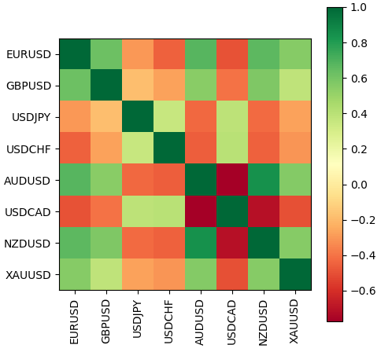

# Reading quotes

The Python API allows you to get arrays of prices (bars) using three functions that differ in the way you specify the range of requested data: by bar numbers or by time. All functions are similar to different forms of [CopyRates](/en/book/applications/timeseries/timeseries_copy_funcs_overview).

For all functions, the first two parameters are used to specify the name of the symbol and timeframe. The timeframes are listed in the TIMEFRAME enumeration, which is similar to the enumeration [ENUM_TIMEFRAMES](/en/book/applications/timeseries/timeseries_symbol_period) in MQL5.

Please note: In Python, the elements of this enumeration are prefixed with TIMEFRAME_, while the elements of a similar enumeration in MQL5 are prefixed with PERIOD_.

| Identifier | Description |
| --- | --- |
| TIMEFRAME_M1 | 1 minute |
| TIMEFRAME_M2 | 2 minutes |
| TIMEFRAME_M3 | 3 minutes |
| TIMEFRAME_M4 | 4 minutes |
| TIMEFRAME_M5 | 5 minutes |
| TIMEFRAME_M6 | 6 minutes |
| TIMEFRAME_M10 | 10 minutes |
| TIMEFRAME_M12 | 12 minutes |
| TIMEFRAME_M12 | 15 minutes |
| TIMEFRAME_M20 | 20 minutes |
| TIMEFRAME_M30 | 30 minutes |
| TIMEFRAME_H1 | 1 hour |
| TIMEFRAME_H2 | 2 hours |
| TIMEFRAME_H3 | 3 hours |
| TIMEFRAME_H4 | 4 hours |
| TIMEFRAME_H6 | 6 hours |
| TIMEFRAME_H8 | 8 hours |
| TIMEFRAME_H12 | 12 hours |
| TIMEFRAME_D1 | 1 day |
| TIMEFRAME_W1 | 1 week |
| TIMEFRAME_MN1 | 1 month |

All three functions return bars as a numpy batch array with named columns time, open, high, low, close, tick_volume, spread, and real_volume. The numpy.ndarray array is a more efficient analog of named tuples. To access columns, use square bracket notation, array['column'].

None is returned if an error occurs.

All function parameters are mandatory and unnamed.

numpy.ndarray copy_rates_from(symbol, timeframe, date_from, count)

The copy_rates_from function requests bars starting from the specified date (date_from) in the number of count bars. The date can be set by the datetime object, or as the number of seconds since 1970.01.01.

When creating the datetime object, Python uses the local time zone, while the MetaTrader 5 terminal stores tick and bar open times in UTC (GMT, no offset). Therefore, to execute functions that use time, it is necessary to create datetime variables in UTC. To configure timezones, you can use the pytz package. For example (see MQL5/Scripts/MQL5Book/Python/eurusdrates.py):

```
from datetime import datetime
import MetaTrader5 as mt5   
import pytz                    # import the pytz module to work with the timezone
# let's establish a connection to the MetaTrader 5 terminal
if not mt5.initialize():
   print("initialize() failed, error code =", mt5.last_error())
   mt5.shutdown()
   quit()
   
# set the timezone to UTC
timezone = pytz.timezone("Etc/UTC")
   
# create a datetime object in the UTC timezone so that the local timezone offset is not applied
utc_from = datetime(2022, 1, 10, tzinfo = timezone)
   
# get 10 bars from EURUSD H1 starting from 10/01/2022 in the UTC timezone
rates = mt5.copy_rates_from("EURUSD", mt5.TIMEFRAME_H1, utc_from, 10)
   
# complete the connection to the MetaTrader 5 terminal
mt5.shutdown()
   
# display each element of the received data (tuple)
for rate in rates:
   print(rate)

```

A sample of received data:

```
(1641567600, 1.12975, 1.13226, 1.12922, 1.13017, 8325, 0, 0)
(1641571200, 1.13017, 1.13343, 1.1299, 1.13302, 7073, 0, 0)
(1641574800, 1.13302, 1.13491, 1.13293, 1.13468, 5920, 0, 0)
(1641578400, 1.13469, 1.13571, 1.13375, 1.13564, 3723, 0, 0)
(1641582000, 1.13564, 1.13582, 1.13494, 1.13564, 1990, 0, 0)
(1641585600, 1.1356, 1.13622, 1.13547, 1.13574, 1269, 0, 0)
(1641589200, 1.13572, 1.13647, 1.13568, 1.13627, 1031, 0, 0)
(1641592800, 1.13627, 1.13639, 1.13573, 1.13613, 982, 0, 0)
(1641596400, 1.1361, 1.13613, 1.1358, 1.1359, 692, 1, 0)
(1641772800, 1.1355, 1.13597, 1.13524, 1.1356, 1795, 10, 0)

```

numpy.ndarray copy_rates_from_pos(symbol, timeframe, start, count)

The copy_rates_from_pos function requests bars starting from the specified start index, in the quantity of count.

The MetaTrader 5 terminal renders bars only within the limits of the history available to the user on the charts. The number of bars that are available to the user is set in the settings by the parameter "Max. bars in the window".

The following example (MQL5/Scripts/MQL5Book/Python/ratescorr.py) shows a graphic representation of the correlation matrix of several currencies based on quotes.

```
import MetaTrader5 as mt5
import pandas as pd              # connect the pandas module to output data
import matplotlib.pyplot as plt  # connect the matplotlib module for drawing
   
# let's establish a connection to the MetaTrader 5 terminal
if not mt5.initialize():
   print("initialize() failed, error code =", mt5.last_error())
   mt5.shutdown()
   quit()
   
# create a path in the sandbox for the image with the result
image = mt5.terminal_info().data_path + r'\MQL5\Files\MQL5Book\ratescorr'
   
# the list of working currencies for calculating correlation
sym = ['EURUSD','GBPUSD','USDJPY','USDCHF','AUDUSD','USDCAD','NZDUSD','XAUUSD']
   
# copy the closing prices of bars into DataFrame structures
d = pd.DataFrame()
for i in sym:        # last 1000 M1 bars for each symbol
   rates = mt5.copy_rates_from_pos(i, mt5.TIMEFRAME_M1, 0, 1000)
   d[i] = [y['close'] for y in rates]
   
# complete the connection to the MetaTrader 5 terminal
mt5.shutdown()
   
# calculate the price change as a percentage
rets = d.pct_change()
   
# compute correlations
corr = rets.corr()
   
# draw the correlation matrix
fig = plt.figure(figsize = (5, 5))
fig.add_axes([0.15, 0.1, 0.8, 0.8])
plt.imshow(corr, cmap = 'RdYlGn', interpolation = 'none', aspect = 'equal')
plt.colorbar()
plt.xticks(range(len(corr)), corr.columns, rotation = 'vertical')
plt.yticks(range(len(corr)), corr.columns)
plt.show()
plt.savefig(image)

```

The image file ratescorr.png is formed in the sandbox of the current working copy of MetaTrader 5. Interactive display of an image in a separate window using a call to plt.show() may not work if your Python installation does not include the Optional Features "tcl/tk and IDLE" or if you do not add the pip install.tk package.



Forex currency correlation matrix

numpy.ndarray copy_rates_range(symbol, timeframe, date_from, date_to)

The copy_rates_range function allows you to get bars in the specified date and time range, between date_from and date_to: both values are given as the number of seconds since the beginning of 1970, in the UTC time zone (because Python uses datetime local timezone, you should convert using the module pytz). The result includes bars with times of opening, time >= date_from and time <= date_to.

In the following script, we will request bars in a specific time range.

```
from datetime import datetime
import MetaTrader5 as mt5
import pytz             # connect the pytz module to work with the timezone
import pandas as pd     # connect the pandas module to display data in a tabular form
   
pd.set_option('display.max_columns', 500) # how many columns to show
pd.set_option('display.width', 1500)      # max. table width to display
   
# let's establish a connection to the MetaTrader 5 terminal
if not mt5.initialize():
   print("initialize() failed, error code =", mt5.last_error())
   quit()
   
# set the timezone to UTC
timezone = pytz.timezone("Etc/UTC")
# create datetime objects in UTC timezone so that local timezone offset is not applied
utc_from = datetime(2020, 1, 10, tzinfo=timezone)
utc_to = datetime(2020, 1, 10, minute = 30, tzinfo=timezone)
   
# get bars for USDJPY M5 for period 2020.01.10 00:00 - 2020.01.10 00:30 in UTC timezone
rates = mt5.copy_rates_range("USDJPY", mt5.TIMEFRAME_M5, utc_from, utc_to)
   
# complete the connection to the MetaTrader 5 terminal
mt5.shutdown()
   
# create a DataFrame from the received data
rates_frame = pd.DataFrame(rates)
# convert time from number of seconds to datetime format
rates_frame['time'] = pd.to_datetime(rates_frame['time'], unit = 's')
   
# output data
print(rates_frame)

```

An example of the result:

```
                 time     open     high      low    close  tick_volume  spread  real_volume 
0 2020-01-10 00:00:00  109.513  109.527  109.505  109.521           43       2            0 
1 2020-01-10 00:05:00  109.521  109.549  109.518  109.543          215       8            0 
2 2020-01-10 00:10:00  109.543  109.543  109.466  109.505           98      10            0 
3 2020-01-10 00:15:00  109.504  109.534  109.502  109.517          155       8            0 
4 2020-01-10 00:20:00  109.517  109.539  109.513  109.527           71       4            0 
5 2020-01-10 00:25:00  109.526  109.537  109.484  109.520          106       9            0 
6 2020-01-10 00:30:00  109.520  109.524  109.508  109.510          205       7            0 
 

```
