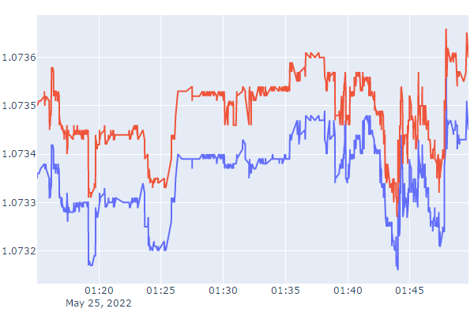

# Reading tick history

The Python API includes two functions for reading the real tick history: copy_ticks_from with an indication of the number of ticks starting from the specified date, and copy_ticks_range for all ticks for the specified period.

Both functions have four required unnamed parameters, the first of which specifies the symbol. The second parameter specifies the initial time of the requested ticks. The third parameter indicates either the required number of ticks is passed (in the copy_ticks_from function) or the end time of ticks (in the copy_ticks_range function).

The last parameter determines what kind of ticks will be returned. It can contain one of the following flags (COPY_TICKS):

| Identifier | Description |
| --- | --- |
| COPY_TICKS_ALL | All ticks |
| COPY_TICKS_INFO | Ticks containing Bid and/or Ask price changes |
| COPY_TICKS_TRADE | Ticks containing changes in the Last price and/or volume (Volume) |

Both functions return ticks as an array numpy.ndarray (from the package numpy) with named columns time, bid, ask, last, and flags. The value of the field flags is a combination of bit flags from the TICK_FLAG enumeration: each bit means a change in the corresponding field with the tick property.

| Identifier | Changed tick property |
| --- | --- |
| TICK_FLAG_BID | Bid price |
| TICK_FLAG_ASK | Ask price |
| TICK_FLAG_LAST | Last price |
| TICK_FLAG_VOLUME | Volume |
| TICK_FLAG_BUY | Last Buy price |
| TICK_FLAG_SELL | Last Sell price |

numpy.ndarray copy_ticks_from(symbol, date_from, count, flags)

The copy_ticks_from function requests ticks starting from the specified time (date_from) in the given quantity (count).

The function is an analog of [CopyTicks](/en/book/applications/timeseries/timeseries_ticks_mqltick).

numpy.array copy_ticks_range(symbol, date_from, date_to, flags)

The copy_ticks_range function allows you to get ticks for the specified time range.

The function is an analog of [CopyTicksRange](/en/book/applications/timeseries/timeseries_ticks_mqltick).

In the following example (MQL5/Scripts/MQL5Book/Python/copyticks.py), we generate an interactive web page with a tick chart (note: the plotly package is used here; to install it in Python, run the command pip install plotly).

```
import MetaTrader5 as mt5
import pandas as pd
import pytz
from datetime import datetime
   
# connect to terminal
if not mt5.initialize():
   print("initialize() failed, error code =", mt5.last_error())
   quit()
   
# set the name of the file to save to the sandbox
path = mt5.terminal_info().data_path + r'\MQL5\Files\MQL5Book\copyticks.html'
   
# copy 1000 EURUSD ticks from a specific moment in history
utc = pytz.timezone("Etc/UTC") 
rates = mt5.copy_ticks_from("EURUSD", \
datetime(2022, 5, 25, 1, 15, tzinfo = utc), 1000, mt5.COPY_TICKS_ALL)
bid = [x['bid'] for x in rates]
ask = [x['ask'] for x in rates]
time = [x['time'] for x in rates]
time = pd.to_datetime(time, unit = 's')
   
# terminate the connection to the terminal
mt5.shutdown()
   
# connect the graphics package and draw 2 rows of ask and bid prices on the web page
import plotly.graph_objs as go
from plotly.offline import download_plotlyjs, init_notebook_mode, plot, iplot
data = [go.Scatter(x = time, y = bid), go.Scatter(x = time, y = ask)]
plot(data, filename = path)

```

Here's what the result might look like.



Chart with ticks received in a Python script

Webpage copyticks.html is generated in the subdirectory MQL5/Files/MQL5Book.
