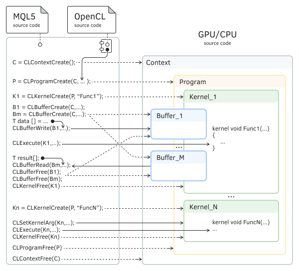
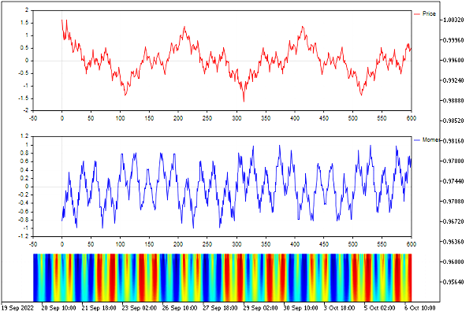

# Built-in support for parallel computing: OpenCL

OpenCL is an open parallel programming standard that allows you to create applications for simultaneous execution on many cores of modern processors, different in architecture, in particular, graphic (GPU) or central (CPU).

In other words, OpenCL allows you to use all the cores of the central processor or all the computing power of the video card for computing one task, which ultimately reduces the program execution time. Therefore, the use of OpenCL is very useful for computationally intensive tasks, but it is important to note that the algorithms for solving these tasks must be divisible into parallel threads. These include, for example, training neural networks, Fourier transform, or solving systems of equations of large dimensions.

For example, in relation to the trading specifics, an increase in performance can be achieved with a script, indicator, or Expert Advisor that performs a complex and lengthy analysis of historical data for several symbols and timeframes, and the calculation for each of which does not depend on others.

At the same time, beginners often have a question whether it is possible to speed up the testing and optimization of Expert Advisors using OpenCL. The answers to both questions are no. Testing reproduces the real process of sequential trading, and therefore each next bar or tick depends on the results of the previous ones, which makes it impossible to parallelize the calculations of one pass. As for optimization, the tester's agents only support CPU cores. This is due to the complexity of a full-fledged analysis of quotes or ticks, tracking positions and calculating balance and equity. However, if complexity doesn't scare you, you can implement your own optimization engine on the graphics card cores by transferring all the calculations that emulate the trading environment with the required reliability to OpenCL.

OpenCL means Open Computing Language. It is similar to the C and C++ languages, and therefore, to MQL5. However, in order to prepare ("compile") an OpenCL program, pass input data to it, run it in parallel on several cores, and obtain calculation results, a special programming interface (a set of functions) is used. This [OpenCL API](https://www.mql5.com/en/docs/opencl) is also available for MQL programs that wish to implement parallel execution.

To use OpenCL, it is not necessary to have a video card on your PC as the presence of a central processor is enough. In any case, special drivers from the manufacturer are required (OpenCL version 1.1 and higher is required). If your computer has games or other software (for example, scientific, video editor, etc.) that work directly with video cards, then the necessary software layer is most likely already available. This can be checked by trying to run an MQL program in the terminal with an OpenCL call (at least a simple example from the terminal delivery, see further).

If there is no OpenCL support, you will see an error in the log.

```
OpenCL OpenCL not found, please install OpenCL drivers

```

If there is a suitable device on your computer and OpenCL support has been enabled for it, the terminal will display a message with the name and type of this device (there may be several devices). For example:

```
OpenCL Device #0: CPU GenuineIntel Intel(R) Core(TM) i7-2700K CPU @ 3.50GHz with OpenCL 1.1 (8 units, 3510 MHz, 16301 Mb, version 2.0, rating 25)
OpenCL Device #1: GPU Intel(R) Corporation Intel(R) UHD Graphics 630 with OpenCL 2.1 (24 units, 1200 MHz, 13014 Mb, version 26.20.100.7985, rating 73)

```

The procedure for installing drivers for various devices is described in the [article on mql5.com](https://www.mql5.com/en/articles/690). Support extends to the most popular devices from Intel, AMD, ATI, and Nvidia.

In terms of the number of cores and the speed of distributed computing, central processors are significantly inferior to graphics cards, but a good multi-core central processor will be quite enough to significantly increase performance.

Important: If your computer has a video card with OpenCL support, then you do not need to install OpenCL software emulation on the CPU!

OpenCL device drivers automate the distribution of calculations across cores. For example, if you need to perform a million of calculations of the same type with different vectors, and there are only a thousand cores at your disposal, then the drivers will automatically start each next task as the previous ones are ready and the cores are released.

Preparatory operations for setting up the OpenCL runtime environment in an MQL program are performed only once using the functions of the above OpenCL API.

1. Creating a context for an OpenCL program (selecting a device, such as a video card, CPU, or any available): CLContextCreate(CL_USE_ANY). The function will return a context descriptor (an integer, let's denote it conditionally ContextHandle).
2. Creating an OpenCL program in the received context: it is compiled based on the source code in the OpenCL language using the CLProgramCreate function call, to which the text of the code is passed through the parameter Source:CLProgramCreate(ContextHandle, Source, BuildLog). The function will return the program handle (integer ProgramHandle). It is important to note here that inside the source code of this program, there must be functions (at least one) marked with a special keyword __kernel (or simply kernel): they contain the parts of the algorithm to be parallelized (see example below). Of course, in order to simplify (decompose the source code), the programmer can divide the logical subtasks of the kernel function into other auxiliary functions and call them from the kernel: at the same time, there is no need to mark the auxiliary functions with the word kernel.
3. Registering a kernel to execute by the name of one of those functions that are marked in the code of the OpenCL program as kernel-forming: CLKernelCreate(ProgramHandle, KernelName). Calling this function will return a handle to the kernel (an integer, let's say, KernelHandle). You can prepare many different functions in OpenCL code and register them as different kernels.
4. If necessary, creating buffers for data arrays passed by reference to the kernel and for returned values/arrays: CLBufferCreate(ContextHandle, Size * sizeof(double), CL_MEM_READ_WRITE), etc. Buffers are also identified and managed with descriptors.

Next, once or several times, if necessary, (for example, in indicator or Expert Advisor event handlers), calculations are performed directly according to the following scheme:

1. Passing input data and/or binding input/output buffers with CLSetKernelArg(KernelHandle,...) and/or CLSetKernelArgMem(KernelHandle,..., BufferHandle). The first function provides the setting of a scalar value, and the second is equivalent to passing or receiving a value (or an array of values) by reference. At this stage, data is moved from MQL5 to the OpenCL execution core. CLBufferWrite(BufferHandle,...) writes data to the buffer. Parameters and buffers will become available to the OpenCL program during kernel execution.
2. Performing Parallel Computations by Calling a Specific Kernel CLExecute(KernelHandle,...). The kernel function will be able to write the results of its work to the output buffer.
3. Getting results with CLBufferRead(BufferHandle). At this stage, data is moved back from OpenCL to MQL5.

After completion of calculations, all descriptors should be released: CLBufferFree(BufferHandle),CLKernelFree(KernelHandle), CLProgramFree(ProgramHandle), and CLContextFree(ContextHandle).

This sequence is conventionally indicated in the following diagram.



Scheme of interaction between an MQL program and an OpenCL attachment

It is recommended to write the OpenCL source code in separate text files, which can then be connected to the MQL5 program using [resource variables](/en/book/advanced/resources/resources_variables).

The standard header library supplied with the terminal contains a wrapper class for working with OpenCL: MQL5/Include/OpenCL/OpenCL.mqh.

Examples of using OpenCL can be found in the folder MQL5/Scripts/Examples/OpenCL/. In particular, there is the MQL5/Scripts/Examples/OpenCL/Double/Wavelet.mq5 script, which produces a wavelet transform of the time series (you can take an artificial curve according to the stochastic Weierstrass model or the increment in prices of the current financial instrument). In any case, the initial data for the algorithm is an array which is a two-dimensional image of a series.

When running this script, same as when running any other MQL program with OpenCL code, the terminal will select the fastest device (if there are several of them, and the specific device was not selected in the program itself or was not already defined earlier). Information about this is displayed in the Journal tab (terminal log, not experts).

```
Scripts script Wavelet (EURUSD,H1) loaded successfully
OpenCL  device #0: GPU NVIDIA Corporation NVIDIA GeForce GTX 1650 with OpenCL 3.0 (16 units, 1560 MHz, 4095 Mb, version 512.72)
OpenCL  device #1: GPU Intel(R) Corporation Intel(R) UHD Graphics 630 with OpenCL 3.0 (24 units, 1150 MHz, 6491 Mb, version 27.20.100.8935)
OpenCL  device performance test started
OpenCL  device performance test successfully finished
OpenCL  device #0: GPU NVIDIA Corporation NVIDIA GeForce GTX 1650 with OpenCL 3.0 (16 units, 1560 MHz, 4095 Mb, version 512.72, rating 129)
OpenCL  device #1: GPU Intel(R) Corporation Intel(R) UHD Graphics 630 with OpenCL 3.0 (24 units, 1150 MHz, 6491 Mb, version 27.20.100.8935, rating 136)
Scripts script Wavelet (EURUSD,H1) removed

```

As a result of execution, the script displays in the Experts tab records with calculation speed measurements in the usual way (in series, on the CPU) and in parallel (on OpenCL cores).

```
OpenCL: GPU device 'Intel(R) UHD Graphics 630' selected
time CPU=5235 ms, time GPU=125 ms, CPU/GPU ratio: 41.880000

```

The ratio of speeds, depending on the specifics of the task, can reach tens.

The script displays on the chart the original image, its derivative in the form of increments, and the result of the wavelet transform.



The original simulated series, its increments and wavelet transform

Please note that the graphic objects remain on the chart after the script finished working. They will need to be removed manually.

Here is how the source OpenCL code of the wavelet transform looks like, implemented in a separate file MQL5/Scripts/Examples/OpenCL/Double/Kernels/wavelet.cl.

```
// increased calculation accuracy double is required
// (by default, without this directive we get float)
#pragma OPENCL EXTENSION cl_khr_fp64 : enable
   
// Helper function Morlet
double Morlet(const double t)
{
   return exp(-t * t * 0.5) * cos(M_2_PI * t);
}
   
// OpenCL kernel function
__kernel void Wavelet_GPU(__global double *data, int datacount,
   int x_size, int y_size, __global double *result)
{
   size_t i = get_global_id(0);
   size_t j = get_global_id(1);
   double a1 = (double)10e-10;
   double a2 = (double)15.0;
   double da = (a2 - a1) / (double)y_size;
   double db = ((double)datacount - (double)0.0) / x_size;
   double a = a1 + j * da;
   double b = 0 + i * db;
   double B = (double)1.0;
   double B_inv = (double)1.0 / B;
   double a_inv = (double)1.0 / a;
   double dt = (double)1.0;
   double coef = (double)0.0;
   
   for(int k = 0; k < datacount; k++)
   {
      double arg = (dt * k - b) * a_inv;
      arg = -B_inv * arg * arg;
      coef = coef + exp(arg);
   }
   
   double sum = (float)0.0;
   for(int k = 0; k < datacount; k++)
   {
      double arg = (dt * k - b) * a_inv;
      sum += data[k] * Morlet(arg);
   }
   sum = sum / coef;
   uint pos = (int)(j * x_size + i);
   result[pos] = sum;
}

```

Full information about the OpenCL syntax, built-in functions and principles of operation can be found on the official website of [Khronos Group](https://www.khronos.org/opencl/).

In particular, it is interesting to note that OpenCL supports not only the usual scalar numeric data types (starting from char and ending with double) but also vector (u)charN, (u)shortN, (u)intN, (u)longN, floatN, doubleN, where N = {2|3|4|8|16} and denotes the length of the vector. In this example, this is not used.

In addition to the mentioned keyword kernel, an important role in the organization of parallel computing is played by the get_global_id function: it allows you to find in the code the number of the computational subtask that is currently running. Obviously, the calculations in different subtasks should be different (otherwise it would not make sense to use many cores). In this example, since the task involves the analysis of a two-dimensional image, it is more convenient to identify its fragments using two orthogonal coordinates. In the above code, we get them using two calls, get_global_id(0) and get_global_id(1).

Actually, we set the data dimension for the task ourselves when calling the MQL5 function CLExecute (see further).

In the file Wavelet.mq5, the OpenCL source code is included using the directive:

```
#resource "Kernels/wavelet.cl" as string cl_program

```

The image size is set by macros:

```
#define SIZE_X 600
#define SIZE_Y 200

```

To manage OpenCL, the standard library with the class COpenCL is used. Its methods have similar names and internally use the corresponding built-in OpenCL functions from the MQL5 API. It is suggested that you familiarize yourself with it.

```
#include <OpenCL/OpenCL.mqh>

```

In a simplified form (without error checking and visualization), the MQL code that launches the transformation is shown below. Wavelet transform-related actions are summarized in the CWavelet class.

```
class CWavelet
{
protected:
   ...
   int        m_xsize;              // image dimensions along the axes
   int        m_ysize;
   double     m_wavelet_data_GPU[]; // result goes here
   COpenCL    m_OpenCL;             // wrapper object
   ...
};

```

The main parallel computing is organized by its method CalculateWavelet_GPU.

```
bool CWavelet::CalculateWavelet_GPU(double &data[], uint &time)
{
   int datacount = ArraySize(data); // image size (number of dots)
   
   // compile the cl-program according to its source code
   m_OpenCL.Initialize(cl_program, true);
   
   // register a single kernel function from the cl file
   m_OpenCL.SetKernelsCount(1);
   m_OpenCL.KernelCreate(0, "Wavelet_GPU");
   
   // register 2 buffers for input and output data, write the input array
   m_OpenCL.SetBuffersCount(2);
   m_OpenCL.BufferFromArray(0, data, 0, datacount, CL_MEM_READ_ONLY);
   m_OpenCL.BufferCreate(1, m_xsize * m_ysize * sizeof(double), CL_MEM_READ_WRITE);
   m_OpenCL.SetArgumentBuffer(0, 0, 0);
   m_OpenCL.SetArgumentBuffer(0, 4, 1);
   
   ArrayResize(m_wavelet_data_GPU, m_xsize * m_ysize);
   uint work[2];              // task of analyzing a two-dimensional image - hence the dimension 2
   uint offset[2] = {0, 0};   // start from the very beginning (or you can skip something)
   work[0] = m_xsize;
   work[1] = m_ysize;
   
   // set input data   
   m_OpenCL.SetArgument(0, 1, datacount);
   m_OpenCL.SetArgument(0, 2, m_xsize);
   m_OpenCL.SetArgument(0, 3, m_ysize);
   
   time = GetTickCount();     // cutoff time for speed measurement
   // start computing on the GPU, two-dimensional task
   m_OpenCL.Execute(0, 2, offset, work);
   
   // get results into output buffer
   m_OpenCL.BufferRead(1, m_wavelet_data_GPU, 0, 0, m_xsize * m_ysize);
   
   time = GetTickCount() - time;
   
   m_OpenCL.Shutdown(); // free all resources - call all necessary functions CL***Free
   return true;
}

```

In the source code of the example, there is a commented out line calling PreparePriceData to prepare an input array based on real prices: you can activate it instead of the previous line with the PrepareModelData call (which generates an artificial number).

```
void OnStart()
{
   int momentum_period = 8;
   double price_data[];
   double momentum_data[];
   PrepareModelData(price_data, SIZE_X + momentum_period);
   
   // PreparePriceData("EURUSD", PERIOD_M1, price_data, SIZE_X + momentum_period);
   
   PrepareMomentumData(price_data, momentum_data, momentum_period);
   ... // visualization of the series and increments
   CWavelet wavelet;
   uint time_gpu = 0;
   wavelet.CalculateWavelet_GPU(momentum_data, time_gpu);
   ... // visualization of the result of the wavelet transform
}

```

A special set of error codes (with the ERR_OPENCL_ prefix, starting with code 5100, ERR_OPENCL_NOT_SUPPORTED) has been allocated for operations with OpenCL. The codes are described in the [help](https://www.mql5.com/en/docs/constants/errorswarnings/errorcodes). If there are problems with the execution of OpenCL programs, the terminal outputs detailed diagnostics to the log, indicating error codes.
