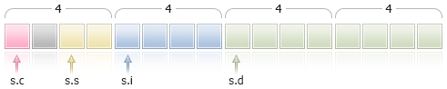

# Structures, Classes and Interfaces

## Structures

A structure is a set of elements of any type (except for the [void](/en/docs/basis/types/void) type). Thus, the structure combines logically related data of different types.

### Structure Declaration

The structure data type is determined by the following description:

```
struct structure_name
  {
   elements_description
  };

```

The structure name can't be used as an identifier (name of a variable or function). It should be noted that in MQL5 structure elements follow one another directly, without alignment. In C++ such an order is made to the compiler using the following instruction:

```
#pragma pack(1)

```

If you want to do another alignment in the structure, use auxiliary members, "fillers" to the right size.

Example:

```
struct trade_settings
  {
   uchar  slippage;     // value of the permissible slippage-size 1 byte
   char   reserved1;    // skip 1 byte
   short  reserved2;    // skip 2 bytes
   int    reserved4;    // another 4 bytes are skipped. ensure alignment of the boundary 8 bytes
   double take;         // values of the price of profit fixing
   double stop;         // price value of the protective stop
  };

```

Such a description of aligned structures is necessary only for transferring to imported dll-functions.

Attention: This example illustrates incorrectly designed data. It would be better first to declare the take and stop large data of the [double](/en/docs/basis/types/double) type, and then declare the slippage member of the uchar type. In this case, the internal representation of data will always be the same regardless of the value specified in #pragma pack().

If a structure contains variables of the [string](/en/docs/basis/types/stringconst) type and/or [object of a dynamic array](/en/docs/basis/types/dynamic_array), the compiler assigns an implicit constructor to such a structure. This constructor resets all the structure members of string type and correctly initializes objects of the dynamic array.

### Simple Structures

Structures that do not contain strings, class objects, pointers and objects of dynamic arrays are called simple structures. Variables of simple structures, as well as their arrays can be passed as parameters to functions [imported](/en/docs/basis/preprosessor/import) from DLL.

Copying of simple structures is allowed only in two cases:

- If the objects belong to the same structure type
- if the objects are connected by the lineage meaning that one structure is a descendant of another.

To provide an example, let's develop the CustomMqlTick custom structure with its contents identical to the built-in [MqlTick](/en/docs/basis/types/this) one. The compiler does not allow copying the MqlTick object value to the CustomMqlTick type object. [Direct typecasting](/en/docs/basis/types/casting) to the necessary type also causes the compilation error:

```
      //--- copying simple structures of different types is forbidden
      my_tick1=last_tick;               // compiler returns an error here
     
      //--- typecasting structures of different types to each other is forbidden as well
      my_tick1=(CustomMqlTick)last_tick;// compiler returns an error here

```

Therefore, only one option is left – copying the values of the structure elements one by one. It is still allowed to copy the values of the same type of CustomMqlTick.

```
      CustomMqlTick my_tick1,my_tick2;
      //--- it is allowed to copy the objects of the same type of CustomMqlTick the following way
      my_tick2=my_tick1;
     
      //--- create an array out of the objects of the simple CustomMqlTick structure and write values to it
      CustomMqlTick arr[2];
      arr[0]=my_tick1;
      arr[1]=my_tick2;

```

The [ArrayPrint()](/en/docs/array/arrayprint) function is called for a check to display the arr[] array value in the journal.

```
//+------------------------------------------------------------------+
//| Script program start function                                    |
//+------------------------------------------------------------------+
void OnStart()
  {
//--- develop the structure similar to the built-in MqlTick
   struct CustomMqlTick
     {
      datetime          time;          // Last price update time
      double            bid;           // Current Bid price
      double            ask;           // Current Ask price
      double            last;          // Current price of the last trade (Last)
      ulong             volume;        // Volume for the current Last price
      long              time_msc;      // Last price update time in milliseconds
      uint              flags;         // Tick flags     
     };
   //--- get the last tick value
   MqlTick last_tick;
   CustomMqlTick my_tick1,my_tick2;
//--- attempt to copy data from MqlTick to CustomMqlTick
   if(SymbolInfoTick(Symbol(),last_tick))
     {
      //--- copying unrelated simple structures is forbidden
      //1. my_tick1=last_tick;               // compiler returns an error here
     
      //--- typecasting unrelated structures to each other is forbidden as well
      //2. my_tick1=(CustomMqlTick)last_tick;// compiler returns an error here
     
      //--- therefore, copy the structure members one by one     
      my_tick1.time=last_tick.time;
      my_tick1.bid=last_tick.bid;
      my_tick1.ask=last_tick.ask;
      my_tick1.volume=last_tick.volume;
      my_tick1.time_msc=last_tick.time_msc;
      my_tick1.flags=last_tick.flags;
     
      //--- it is allowed to copy the objects of the same type of CustomMqlTick the following way
      my_tick2=my_tick1;
     
      //--- create an array out of the objects of the simple CustomMqlTick structure and write values to it
      CustomMqlTick arr[2];
      arr[0]=my_tick1;
      arr[1]=my_tick2;
      ArrayPrint(arr);
//--- example of displaying values of the array containing the objects of CustomMqlTick type
      /*
                       [time]   [bid]   [ask]   [last] [volume]    [time_msc] [flags]
      [0] 2017.05.29 15:04:37 1.11854 1.11863 +0.00000  1450000 1496070277157       2
      [1] 2017.05.29 15:04:37 1.11854 1.11863 +0.00000  1450000 1496070277157       2           
      */
     }
   else
      Print("SymbolInfoTick() failed, error = ",GetLastError());
  }

```

The second example shows the features of copying simple structures by the lineage. Suppose that we have the Animal basic structure, from which the Cat and Dog structures are derived. We can copy the Animal and Cat objects, as well as the Animal and Dog objects to each other but we cannot copy Cat and Dog to each other, although both are descendants of the Animal structure.

```
//--- structure for describing dogs
struct Dog: Animal
  {
   bool              hunting;       // hunting breed
  };
//--- structure for describing cats
struct Cat: Animal
  {
   bool              home;          // home breed
  };
//--- create objects of child structures
   Dog dog;
   Cat cat;
//--- can be copied from ancestor to descendant (Animal ==> Dog)
   dog=some_animal;
   dog.swim=true;    // dogs can swim
//--- you cannot copy objects of child structures (Dog != Cat)
   cat=dog;        // compiler returns an error

```

Complete example code:

```
//--- basic structure for describing animals
struct Animal
  {
   int               head;          // number of heads
   int               legs;          // number of legs
   int               wings;         // number of wings
   bool              tail;          // tail
   bool              fly;           // flying
   bool              swim;          // swimming  
   bool              run;           // running
  };
//--- structure for describing dogs
struct Dog: Animal
  {
   bool              hunting;       // hunting breed
  };
//--- structure for describing cats
struct Cat: Animal
  {
   bool              home;          // home breed
  };
//+------------------------------------------------------------------+
//| Script program start function                                    |
//+------------------------------------------------------------------+
void OnStart()
  {
//--- create and describe an object of the basic Animal type
   Animal some_animal;
   some_animal.head=1;
   some_animal.legs=4;
   some_animal.wings=0;
   some_animal.tail=true;
   some_animal.fly=false;
   some_animal.swim=false;
   some_animal.run=true;
//--- create objects of child types
   Dog dog;
   Cat cat;
//--- can be copied from ancestor to descendant (Animal ==> Dog)
   dog=some_animal;
   dog.swim=true;    // dogs can swim
//--- you cannot copy objects of child structures (Dog != Cat)
   //cat=dog;        // compiler returns an error here
//--- therefore, it is possible to copy elements one by one only
   cat.head=dog.head;
   cat.legs=dog.legs;
   cat.wings=dog.wings;
   cat.tail=dog.tail;
   cat.fly=dog.fly;
   cat.swim=false;   // cats cannot swim
//--- it is possible to copy the values from descendant to ancestor
   Animal elephant;
   elephant=cat;
   elephant.run=false;// elephants cannot run
   elephant.swim=true;// elephants can swim
//--- create an array
   Animal animals[4];
   animals[0]=some_animal;
   animals[1]=dog;  
   animals[2]=cat;
   animals[3]=elephant;
//--- print out
   ArrayPrint(animals);
//--- execution result
/*
       [head] [legs] [wings] [tail] [fly] [swim] [run]
   [0]      1      4       0   true false  false  true
   [1]      1      4       0   true false   true  true
   [2]      1      4       0   true false  false false
   [3]      1      4       0   true false   true false
*/  
  }

```

Another way to copy simple types is using a union. The objects of the structures should be members of the same union – see the example in [union](/en/docs/basis/types/classes#union).

### Access to Structure Members

The name of a structure becomes a new data type, so you can declare variables of this type. The structure can be declared only once within a project. The structure members are accessed using the[point operation](/en/docs/basis/operations/other#operation_dot) (.).

Example:

```
struct trade_settings
  {
   double take;         // values of the profit fixing price
   double stop;         // value of the protective stop price
   uchar  slippage;     // value of the acceptable slippage
  };
//--- create up and initialize a variable of the trade_settings type
trade_settings my_set={0.0,0.0,5};  
if (input_TP>0) my_set.take=input_TP;

```

### 'pack' for aligning structure and class fields  #

The special pack attribute allows setting the alignment of structure or class fields.

```
 pack([n])

```

where n is one of the following values: 1, 2, 4, 8 or 16. It may be absent.

Example:

```
   struct pack(sizeof(long)) MyStruct
     {
      // structure members are to be aligned to the 8-byte boundary
     };
or
   struct MyStruct pack(sizeof(long))
     {
      // structure members are to be aligned to the 8-byte boundary
     };

```

'pack(1)' is applied by default for structures. This means that the structure members are located one after another in memory, and the structure size is equal to the sum of its members' size.

Example:

```
//+------------------------------------------------------------------+
//| Script program start function                                    |
//+------------------------------------------------------------------+
void OnStart()
  {
//--- simple structure with no alignment
   struct Simple_Structure
     {
      char              c; // sizeof(char)=1
      short             s; // sizeof(short)=2
      int               i; // sizeof(int)=4
      double            d; // sizeof(double)=8
     };
   //--- declare a simple structure instance   
   Simple_Structure s;  
//--- display the size of each structure member  
   Print("sizeof(s.c)=",sizeof(s.c));
   Print("sizeof(s.s)=",sizeof(s.s));
   Print("sizeof(s.i)=",sizeof(s.i));
   Print("sizeof(s.d)=",sizeof(s.d));
//--- make sure the size of POD structure is equal to the sum of its members' size
   Print("sizeof(simple_structure)=",sizeof(simple_structure));
/*
  Result:
   sizeof(s.c)=1
   sizeof(s.s)=2
   sizeof(s.i)=4
   sizeof(s.d)=8
   sizeof(simple_structure)=15 
*/    
  }

```

Alignment of the structure fields may be needed when exchanging data with third-party libraries (*.DLL) where such alignment is applied.

Let's use some examples to show how alignment works. We will apply a structure consisting of four members with no alignment.

```
//--- simple structure with no alignment
   struct Simple_Structure pack() // no size is specified, alignment to the boundary of 1 byte is to be set
     {
      char              c; // sizeof(char)=1
      short             s; // sizeof(short)=2
      int               i; // sizeof(int)=4
      double            d; // sizeof(double)=8
     };
//--- declare a simple structure instance  
   Simple_Structure s;

```

Structure fields are to be located in memory one after another according to the declaration order and [type size](/en/docs/basis/operations/other#sizeof). The structure size is 15, while an offset to the structure fields in the arrays is undefined.


Now declare the same structure with the alignment of 4 bytes and run the code.

```
//+------------------------------------------------------------------+
//| Script program start function                                    |
//+------------------------------------------------------------------+
void OnStart()
  {
//--- simple structure with the 4-byte alignment
   struct Simple_Structure pack(4)
     {
      char              c; // sizeof(char)=1
      short             s; // sizeof(short)=2
      int               i; // sizeof(int)=4
      double            d; // sizeof(double)=8
     };
   //--- declare a simple structure instance   
   Simple_Structure s;  
//--- display the size of each structure member  
   Print("sizeof(s.c)=",sizeof(s.c));
   Print("sizeof(s.s)=",sizeof(s.s));
   Print("sizeof(s.i)=",sizeof(s.i));
   Print("sizeof(s.d)=",sizeof(s.d));
//--- make sure the size of POD structure is now not equal to the sum of its members' size
   Print("sizeof(simple_structure)=",sizeof(simple_structure));
/*
  Result:
   sizeof(s.c)=1
   sizeof(s.s)=2
   sizeof(s.i)=4
   sizeof(s.d)=8
   sizeof(simple_structure)=16 // structure size has changed
*/    
  }

```

The structure size has changed so that all members of 4 bytes and more has an offset from the beginning of the structure multiple of 4 bytes. Smaller members are to be aligned to their own size boundary (for example, 2 for 'short'). This is how it looks (the added byte is shown in gray).



In this case, 1 byte is added after the s.c member, so that the s.s (sizeof(short)==2) field has the boundary of 2 bytes (alignment for 'short' type).

The offset to the beginning of the structure in the array is also aligned to the 4-byte boundary, i.e. the addresses of the a[0], a[1] and a[n] elements are to be multiple of 4 bytes for Simple_Structure arr[].

Let's consider two more structures consisting of similar types with 4-bytes alignment but different member order. In the first structure, the members are located in type size ascending order.

```
//+------------------------------------------------------------------+
//| Script program start function                                    |
//+------------------------------------------------------------------+
void OnStart()
  {
//--- simple structure aligned to the 4-byte boundary
   struct CharShortInt pack(4)
     {
      char              c; // sizeof(char)=1
      short             s; // sizeof(short)=2
      int               i; // sizeof(double)=4
     };
//--- declare a simple structure instance  
   CharShortInt ch_sh_in;
//--- display the size of each structure member  
   Print("sizeof(ch_sh_in.c)=",sizeof(ch_sh_in.c));
   Print("sizeof(ch_sh_in.s)=",sizeof(ch_sh_in.s));
   Print("sizeof(ch_sh_in.i)=",sizeof(ch_sh_in.i));
 
//--- make sure the size of POD structure is equal to the sum of its members' size
   Print("sizeof(CharShortInt)=",sizeof(CharShortInt));
/*
  Result:
   sizeof(ch_sh_in.c)=1
   sizeof(ch_sh_in.s)=2
   sizeof(ch_sh_in.i)=4
   sizeof(CharShortInt)=8
*/   
  }

```

As we can see, the structure size is 8 and consists of the two 4-byte blocks. The first block contains the fields with 'char' and 'short' types, while the second one contains the field with ['int'](/en/docs/basis/types/integer/integertypes#int) type.


Now let's turn the first structure into the second one, which differs only in the field order, by moving the ['short'](/en/docs/basis/types/integer/integertypes#short) type member to the end.

```
//+------------------------------------------------------------------+
//| Script program start function                                    |
//+------------------------------------------------------------------+
void OnStart()
  {
//--- simple structure aligned to the 4-byte boundary
   struct CharIntShort pack(4)
     {
      char              c; // sizeof(char)=1
      int               i; // sizeof(double)=4
      short             s; // sizeof(short)=2
     };
//--- declare a simple structure instance  
   CharIntShort ch_in_sh;
//--- display the size of each structure member  
   Print("sizeof(ch_in_sh.c)=",sizeof(ch_in_sh.c));
   Print("sizeof(ch_in_sh.i)=",sizeof(ch_in_sh.i));
   Print("sizeof(ch_in_sh.s)=",sizeof(ch_in_sh.s));
//--- make sure the size of POD structure is equal to the sum of its members' size
   Print("sizeof(CharIntShort)=",sizeof(CharIntShort));
/*
  Result:
   sizeof(ch_in_sh.c)=1
   sizeof(ch_in_sh.i)=4
   sizeof(ch_in_sh.s)=2
   sizeof(CharIntShort)=12
*/   
  }

```

Although the structure content has not changed, altering the member sequence has increased its size.


Alignment should also be considered when inheriting. Let's demonstrate this using the simple Parent structure having a single 'char' type member. The structure size without alignment is 1.

```
   struct Parent
     {
      char              c;    // sizeof(char)=1
     };

```

Let's create the Children child class featuring the 'short' (sizeof(short)=2) type member.

```
   struct Children pack(2) : Parent
     {
      short             s;   // sizeof(short)=2
     };

```

As a result, when setting alignment to 2 bytes, the structure size is equal to 4, although the size of its members is 3. In this example, 2 bytes are to be allocated to the Parent class, so that the access to the 'short' field of the child class is aligned to 2 bytes.

The knowledge of how memory is allocated for the structure members is necessary if an MQL5 application interacts with third-party data by writing/reading on the files or streams level.

The MQL5\Include\WinAPI directory of the [Standard Library](/en/docs/standardlibrary) contains the functions for working with the WinAPI functions. These functions apply the structures with a specified alignment for the cases when it is required for working with WinAPI.

offsetof is a special command directly related to the [pack](/en/docs/basis/types/classes#pack) attribute. It allows us to obtain a member offset from the beginning of the structure.

```
//--- declare the Children type variable
   Children child;  
//--- detect offsets from the beginning of the structure
   Print("offsetof(Children,c)=",offsetof(Children,c));
   Print("offsetof(Children,s)=",offsetof(Children,s));  
/*
  Result:
   offsetof(Children,c)=0
   offsetof(Children,s)=2
*/   

```

### Specifier 'final'  #

The use of the 'final' specifier during structure declaration prohibits further inheritance from this structure. If a structure requires no further modifications, or modifications are not allowed for security reasons, declare this structure with the 'final' modifier. In addition, all the members of the structure will also be implicitly considered final.

```
struct settings final
  {
  //--- Structure body
  };
 
struct trade_settings : public settings
  {
  //--- Structure body
  };

```

If you try to inherit from a structure with the 'final' modifier as shown in the above example, the compiler will return an error:

```
cannot inherit from 'settings' as it has been declared as 'final'
see declaration of 'settings'

```

## Classes  #

Classes differ from structures in the following:

- the keyword class is used in declaration;

- by default, all class members have access specifier private, unless otherwise indicated. Data-members of the structure have the default type of access as public, unless otherwise indicated;
- class objects always have a table of [virtual functions](/en/docs/basis/oop/virtual), even if there are no virtual functions declared in the class. Structures cannot have virtual functions;

- the [new](/en/docs/basis/operators/newoperator) operator can be applied to class objects; this operator cannot be applied to structures;

- classes can be [inherited](/en/docs/basis/oop/inheritance) only from classes, structures can be inherited only from structures.

Classes and structures can have an explicit constructor and destructor. If your constructor is explicitly defined, the initialization of a structure or class variable using the initializing sequence is impossible.

Example:

```
struct trade_settings
  {
   double take;         // values of the profit fixing price
   double stop;         // value of the protective stop price
   uchar  slippage;     // value of the acceptable slippage
   //--- Constructor
          trade_settings() { take=0.0; stop=0.0; slippage=5; }
   //--- Destructor
         ~trade_settings() { Print("This is the end"); } 
  };
//--- Compiler will generate an error message that initialization is impossible
trade_settings my_set={0.0,0.0,5};  

```

### Constructors and Destructors

A constructor is a special function, which is called automatically when creating an object of a structure or class and is usually used to [initialize](/en/docs/basis/variables/object_live) class members. Further we will talk only about classes, while the same applies to structures, unless otherwise indicated. The name of a constructor must match the class name. The constructor has no return type (you can specify the [void](/en/docs/basis/types/void) type).

Defined class members – [strings](/en/docs/basis/types/stringconst), [dynamic arrays](/en/docs/basis/types/dynamic_array) and objects that require initialization – will be in any case initialized, regardless of whether there is a constructor.

Each class can have multiple constructors, differing by the number of parameters and the initialization list. A constructor that requires specifying parameters is called a parametric constructor.

A constructor with no parameters is called a default constructor. If no constructors are declared in a class, the compiler creates a default constructor during compilation.

```
//+------------------------------------------------------------------+
//| A class for working with a date                                  |
//+------------------------------------------------------------------+
class MyDateClass
  {
private:
   int               m_year;          // Year
   int               m_month;         // Month
   int               m_day;           // Day of the month
   int               m_hour;          // Hour in a day
   int               m_minute;        // Minutes
   int               m_second;        // Seconds
public:
   //--- Default constructor
                     MyDateClass(void);
   //--- Parametric constructor
                     MyDateClass(int h,int m,int s);
  };

```

A constructor can be declared in the class description and then its body can be defined. For example, two constructors of MyDateClass can be defined the following way:

```
//+------------------------------------------------------------------+
//| Default constructor                                              |
//+------------------------------------------------------------------+
MyDateClass::MyDateClass(void)
  {
//---
   MqlDateTime mdt;
   datetime t=TimeCurrent(mdt);
   m_year=mdt.year;
   m_month=mdt.mon;
   m_day=mdt.day;
   m_hour=mdt.hour;
   m_minute=mdt.min;
   m_second=mdt.sec;
   Print(__FUNCTION__);
  }
//+------------------------------------------------------------------+
//| Parametric constructor                                           |
//+------------------------------------------------------------------+
MyDateClass::MyDateClass(int h,int m,int s)
  {
   MqlDateTime mdt;
   datetime t=TimeCurrent(mdt);
   m_year=mdt.year;
   m_month=mdt.mon;
   m_day=mdt.day;
   m_hour=h;
   m_minute=m;
   m_second=s;
   Print(__FUNCTION__);
  }

```

In the [default constructor](/en/docs/basis/types/classes#default_constructor), all members of the class are filled using the TimeCurrent() function. In the parametric constructor only hour values are filled in. Other members of the class (m_year, m_month and m_day) will be automatically initialized with the current date.

The default constructor has a special purpose when initializing an array of objects of its class. The constructor, all parameters of which have default values, is not a default constructor. Here is an example:

```
//+------------------------------------------------------------------+
//| A class with a default constructor                               |
//+------------------------------------------------------------------+
class CFoo
  {
   datetime          m_call_time;     // Time of the last object call
public:
   //--- Constructor with a parameter that has a default value is not a default constructor
                     CFoo(const datetime t=0){m_call_time=t;};
   //--- Copy constructor
                     CFoo(const CFoo &foo){m_call_time=foo.m_call_time;};
 
   string ToString(){return(TimeToString(m_call_time,TIME_DATE|TIME_SECONDS));};
  };
//+------------------------------------------------------------------+
//| Script program start function                                    |
//+------------------------------------------------------------------+
void OnStart()
  {
// CFoo foo; // This variant cannot be used - a default constructor is not set
//--- Possible options to create the CFoo object
   CFoo foo1(TimeCurrent());     // An explicit call of a parametric constructor
   CFoo foo2();                  // An explicit call of a parametric constructor with a default parameter
   CFoo foo3=D'2009.09.09';      // An implicit call of a parametric constructor
   CFoo foo40(foo1);             // An explicit call of a copy constructor
   CFoo foo41=foo1;              // An implicit call of a copy constructor
   CFoo foo5;                    // An explicit call of a default constructor (if there is no default constructor,
                                 // then a parametric constructor with a default value is called)
//--- Possible options to receive CFoo pointers
   CFoo *pfoo6=new CFoo();       // Dynamic creation of an object and receiving of a pointer to it
   CFoo *pfoo7=new CFoo(TimeCurrent());// Another option of dynamic object creation
   CFoo *pfoo8=GetPointer(foo1); // Now pfoo8 points to object foo1
   CFoo *pfoo9=pfoo7;            // pfoo9 and pfoo7 point to one and the same object
   // CFoo foo_array[3];         // This option cannot be used - a default constructor is not specified
//--- Show the value of m_call_time
   Print("foo1.m_call_time=",foo1.ToString());
   Print("foo2.m_call_time=",foo2.ToString());
   Print("foo3.m_call_time=",foo3.ToString());
   Print("foo4.m_call_time=",foo4.ToString());
   Print("foo5.m_call_time=",foo5.ToString());
   Print("pfoo6.m_call_time=",pfoo6.ToString());
   Print("pfoo7.m_call_time=",pfoo7.ToString());
   Print("pfoo8.m_call_time=",pfoo8.ToString());
   Print("pfoo9.m_call_time=",pfoo9.ToString());
//--- Delete dynamically created arrays
   delete pfoo6;
   delete pfoo7;
   //delete pfoo8;  // You do not need to delete pfoo8 explicitly, since it points to the automatically created object foo1
   //delete pfoo9;  // You do not need to delete pfoo9 explicitly. since it points to the same object as pfoo7
  }

```

If you uncomment these strings

```
  //CFoo foo_array[3];     // This variant cannot be used - a default constructor is not set

```

or

```
  //CFoo foo_dyn_array[];  // This variant cannot be used - a default constructor is not set

```

then the compiler will return an error for them "default constructor is not defined".

If a class has a user-defined constructor, the default constructor is not generated by the compiler. This means that if a parametric constructor is declared in a class, but a default constructor is not declared, you can not declare the arrays of objects of this class. The compiler will return an error for this script:

```
//+------------------------------------------------------------------+
//| A class without a default constructor                            |
//+------------------------------------------------------------------+
class CFoo
  {
   string            m_name;
public:
                     CFoo(string name) { m_name=name;}
  };
//+------------------------------------------------------------------+
//| Script program start function                                    |
//+------------------------------------------------------------------+
void OnStart()
  {
//--- Get the "default constructor is not defined" error during compilation
   CFoo badFoo[5];
  }

```

In this example, the CFoo class has a declared parametric constructor - in such cases, the compiler does not create a default constructor automatically during compilation. At the same time when you declare an array of objects, it is assumed that all objects should be [created and initialized automatically](/en/docs/basis/variables/object_live). During auto-initialization of an object, it is necessary to call a default constructor, but since the default constructor is not explicitly declared and not automatically generated by the compiler, it is impossible to create such an object. For this reason, the compiler generates an error at the compilation stage.

There is a special syntax to initialize an object using a constructor. Constructor initializers (special constructions for initialization) for the members of a struct or class can be specified in the initialization list.

An initialization list is a list of initializers separated by commas, which comes after the colon after the [list of parameters](/en/docs/basis/variables/formal) of a constructor and precedes [the body](/en/docs/basis/function#function_body) (goes before an opening brace). There are several requirements:

- Initialization lists can be used only in [constructors](/en/docs/basis/types/classes#constructor);
- [Parent members](/en/docs/basis/oop/inheritance) cannot be initialized in the initialization list;
- The initialization list must be followed by a [definition](/en/docs/basis/function#function_definition) (implementation) of a function.

Here is an example of several constructors for initializing class members.

```
//+------------------------------------------------------------------+
//| A class for storing the name of a character                      |
//+------------------------------------------------------------------+
class CPerson
  {
   string            m_first_name;     // First name 
   string            m_second_name;    // Second name
public:
   //--- An empty default constructor
                     CPerson() {Print(__FUNCTION__);};
   //--- A parametric constructor
                     CPerson(string full_name);
   //--- A constructor with an initialization list
                     CPerson(string surname,string name): m_second_name(surname), m_first_name(name) {};
   void PrintName(){PrintFormat("Name=%s Surname=%s",m_first_name,m_second_name);};
  };
//+------------------------------------------------------------------+
//|                                                                  |
//+------------------------------------------------------------------+
CPerson::CPerson(string full_name)
  {
   int pos=StringFind(full_name," ");
   if(pos>=0)
     {
      m_first_name=StringSubstr(full_name,0,pos);
      m_second_name=StringSubstr(full_name,pos+1);
     }
  }
//+------------------------------------------------------------------+
//| Script program start function                                    |
//+------------------------------------------------------------------+
void OnStart()
  {
//--- Get an error "default constructor is not defined"
   CPerson people[5];
   CPerson Tom="Tom Sawyer";                       // Tom Sawyer
   CPerson Huck("Huckleberry","Finn");             // Huckleberry Finn
   CPerson *Pooh = new CPerson("Winnie","Pooh");  // Winnie the Pooh
   //--- Output values
   Tom.PrintName();
   Huck.PrintName();
   Pooh.PrintName();
   
   //--- Delete a dynamically created object
   delete Pooh;
  }

```

In this case, the CPerson class has three constructors:

1. An explicit [default constructor](/en/docs/basis/types/classes#default_constructor), which allows creating an array of objects of this class;
2. A constructor with one parameter, which gets a full name as a parameter and divides it to the name and second name according to the found space;
3. A constructor with two parameters that contains [an initialization list](/en/docs/basis/types/classes#initialization_list). Initializers - m_second_name(surname) and m_first_name(name).

Note that the initialization using a list has replaced an assignment. Individual members must be initialized as:

```
 class_member (a list of expressions)

```

In the initialization list, members can go in any order, but all members of the class will be initialized according to the order of their announcement. This means that in the third constructor, first the m_first_name member will be initialized, as it is announced first, and only after it m_second_name is initialized. This should be taken into account in cases where the initialization of some members of the class depends on the values in other class members.

If a default constructor is not declared in the base class, and at the same time one or more constructors with parameters are declared, you should always call one of the base class constructors in the initialization list. It goes through the comma as ordinary members of the list and will be called first during object initialization, no matter where in the initialization list it is located.

```
//+------------------------------------------------------------------+
//| Base class                                                       |
//+------------------------------------------------------------------+
class CFoo
  {
   string            m_name;
public:
   //--- A constructor with an initialization list
                     CFoo(string name) : m_name(name) { Print(m_name);}
  };
//+------------------------------------------------------------------+
//| Class derived from CFoo                                          |
//+------------------------------------------------------------------+
class CBar : CFoo
  {
   CFoo              m_member;      // A class member is an object of the parent
public:
   //--- A default constructor in the initialization list calls the constructor of a parent
                     CBar(): m_member(_Symbol), CFoo("CBAR") {Print(__FUNCTION__);}
  };
//+------------------------------------------------------------------+
//| Script program start function                                    |
//+------------------------------------------------------------------+
void OnStart()
  {
   CBar bar;
  }

```

In this example, when creating the bar object, a default constructor CBar() will be called, in which first a constructor for the parent CFoo is called, and then comes a constructor for the m_member class member.

A destructor is a special function that is called automatically when a class object is destroyed. The name of the destructor is written as a class name with a tilde (~). Strings, dynamic arrays and objects, requiring deinitialization, will be de-initialized anyway, regardless of the destructor presence or absence. If there is a destructor, these actions will be performed after calling the destructor.

Destructors are always [virtual](/en/docs/basis/oop/virtual), regardless of whether they are declared with the virtual keyword or not.

### Defining Class Methods

Class function-methods can be defined both inside the class and outside the class declaration. If the method is defined within a class, then its body comes right after the method declaration.

Example:

```
class CTetrisShape
  {
protected:
   int               m_type;
   int               m_xpos;
   int               m_ypos;
   int               m_xsize;
   int               m_ysize;
   int               m_prev_turn;
   int               m_turn;
   int               m_right_border;
public:
   void              CTetrisShape();
   void              SetRightBorder(int border) { m_right_border=border; }
   void              SetYPos(int ypos)          { m_ypos=ypos;           }
   void              SetXPos(int xpos)          { m_xpos=xpos;           }
   int               GetYPos()                  { return(m_ypos);        }
   int               GetXPos()                  { return(m_xpos);        }
   int               GetYSize()                 { return(m_ysize);       }
   int               GetXSize()                 { return(m_xsize);       }
   int               GetType()                  { return(m_type);        }
   void              Left()                     { m_xpos-=SHAPE_SIZE;    }
   void              Right()                    { m_xpos+=SHAPE_SIZE;    }
   void              Rotate()                   { m_prev_turn=m_turn; if(++m_turn>3) m_turn=0; }
   virtual void      Draw()                     { return;                }
   virtual bool      CheckDown(int& pad_array[]);
   virtual bool      CheckLeft(int& side_row[]);
   virtual bool      CheckRight(int& side_row[]);
  }; 

```

Functions from SetRightBorder(int border) to Draw() are declared and defined directly inside the CTetrisShape class.

The CTetrisShape() constructor and methods CheckDown(int& pad_array[]), CheckLeft(int& side_row[]) and CheckRight(int& side_row[]) are only declared inside the class, but not defined yet. Definitions of these functions will be further in the code. In order to define the method outside the class, the [scope resolution operator](/en/docs/basis/operations/other#context_allow) is used, the class name is used as the scope.

Example:

```
//+------------------------------------------------------------------+
//| Constructor of the basic class                                   |
//+------------------------------------------------------------------+
void CTetrisShape::CTetrisShape()
  {
   m_type=0;
   m_ypos=0;
   m_xpos=0;
   m_xsize=SHAPE_SIZE;
   m_ysize=SHAPE_SIZE;
   m_prev_turn=0;
   m_turn=0;
   m_right_border=0;
  }
//+------------------------------------------------------------------+
//| Checking ability to move down (for the stick and cube)           |
//+------------------------------------------------------------------+
bool CTetrisShape::CheckDown(int& pad_array[])
  {
   int i,xsize=m_xsize/SHAPE_SIZE;
//---
   for(i=0; i<xsize; i++)
     {
      if(m_ypos+m_ysize>=pad_array[i]) return(false);
     }
//---
   return(true);
  }

```

### Public, Protected and Private Access Specifiers

When developing a new class, it is recommended to restrict access to the members from the outside. For this purpose keywords private or protected are used. In this case, hidden data can be accessed only from function-methods of the same class. If the protected keyword is used, hidden data can be accessed also from methods of classes - [inheritors](/en/docs/basis/oop/inheritance) of this class. The same method can be used to restrict the access to functions-methods of a class.

If you need to completely open access to members and/or methods of a class, use the keyword public.

Example:

```
class CTetrisField
  {
private:
   int               m_score;                            // Score
   int               m_ypos;                             // Current position of the figures
   int               m_field[FIELD_HEIGHT][FIELD_WIDTH]; // Matrix of the well
   int               m_rows[FIELD_HEIGHT];               // Numbering of the well rows
   int               m_last_row;                         // Last free row
   CTetrisShape     *m_shape;                            // Tetris figure
   bool              m_bover;                            // Game over
public:
   void              CTetrisField() { m_shape=NULL; m_bover=false; }
   void              Init();
   void              Deinit();
   void              Down();
   void              Left();
   void              Right();
   void              Rotate();
   void              Drop();
private:
   void              NewShape();
   void              CheckAndDeleteRows();
   void              LabelOver();
  }; 

```

Any class members and methods declared after the specifier public: (and before the next access specifier) are available in any reference to the class object by the program. In this example these are the following members: functions CTetrisField(), Init(), Deinit(), Down(), Left(), Right(), Rotate() and Drop().

Any members that are declared after the access specifier to the elements private: (and before the next access specifier) are available only to members-functions of this class. Specifiers of access to elements always end with a colon (:) and can appear in the class definition many times.

Any class members declared after the protected: access specifier (and up to the next access specifier) are available only to members-functions of this class and members-functions of the class [descendants](/en/docs/basis/oop/inheritance). When attempting to refer to the members featuring the private and protected specifiers from the outside, we get the compilation stage error. Example:

```
class A
  {
protected:
   //--- the copy operator is available only inside class A and its descendants
   void operator=(const A &)
     {
     }
  };
class B
  {
   //--- class A object declared
   A                 a;
  };
//+------------------------------------------------------------------+
//| Script program start function                                    |
//+------------------------------------------------------------------+
void OnStart()
  {
   //--- declare two B type variables
   B b1, b2;
   //--- attempt to copy one object into another
   b2=b1;
  }

```

When compiling the code, the error message is received — an attempt to call the remote copy operator:

```
attempting to reference deleted function 'void B::operator=(const B&)'   trash3.mq5   32   6

```

The second string below provides a more detailed description — the copy operator in class B was explicitly deleted, since the unavailable copy operator of class A is called:

```
   function 'void B::operator=(const B&)' was implicitly deleted because it invokes inaccessible function 'void A::operator=(const A&)' 

```

Access to the members of the basis class can be redefined during [inheritance](/en/docs/basis/oop/inheritance) in derived classes.

'delete' specifier

The delete specifier marks the class members-functions that cannot be used. This means if the program refers to such a function explicitly or implicitly, the error is received at the compilation stage already. For example, this specifier allows you to make parent methods unavailable in a child class. The same result can be achieved if we declare the function in the private area of the parent class (declarations in the private section). Here, using delete makes the code more readable and manageable at the level of descendants.

```
class A
  {
public:
                     A(void) {value=5;};
   double            GetValue(void) {return(value);}
private:
   double            value;
  };
class B: public A
  {
   double            GetValue(void)=delete;
  };
//+------------------------------------------------------------------+
//| Script program start function                                    |
//+------------------------------------------------------------------+
void OnStart()
  {
//--- declare the A type variable
   A a;
   Print("a.GetValue()=", a.GetValue());
//--- attempt to get value from the B type variable
   B b;
   Print("b.GetValue()=", b.GetValue()); // the compiler displays an error at this string
  }

```

The compiler message:

```
attempting to reference deleted function 'double B::GetValue()'   
   function 'double B::GetValue()' was explicitly deleted here   

```

The 'delete' specifier allows disabling auto casting or the copy constructor, which otherwise would have to be hidden in the private section as well.  Example:

```
class A
  {
public:
   void              SetValue(double v) {value=v;}
   //--- disable int type call
   void              SetValue(int) = delete;
   //--- disable the copy operator
   void              operator=(const A&) = delete;
private:
   double            value;
  };
//+------------------------------------------------------------------+
//| Script program start function                                    |
//+------------------------------------------------------------------+
void OnStart()
  {
//--- declare two A type variables
   A a1, a2;
   a1.SetValue(3);      // error!
   a1.SetValue(3.14);   // OK
   a2=a1;               // error!
  }

```

During the compilation, we get the error messages:

```
attempting to reference deleted function 'void A::SetValue(int)' 
   function 'void A::SetValue(int)' was explicitly deleted here 
attempting to reference deleted function 'void A::operator=(const A&)'  
   function 'void A::operator=(const A&)' was explicitly deleted here  

```

### Specifier 'final'  #

The use of the 'final' specifier during class declaration prohibits further inheritance from this class. If the class interface requires no further modifications, or modifications are not allowed for security reasons, declare this class with the 'final' modifier. In addition, all the members of the class will also be implicitly considered final.

```
class CFoo final
  {
  //--- Class body
  };
 
class CBar : public CFoo
  {
  //--- Class body
  };

```

If you try to inherit form a class with the 'final' specifier as shown in the above example, the compiler will return an error:

```
cannot inherit from 'CFoo' as it has been declared as 'final'
see declaration of 'CFoo'

```

## Unions (union)  #

Union is a special data type consisting of several variables sharing the same memory area. Therefore, the union provides the ability to interpret the same bit sequence in two (or more) different ways. Union declaration is similar to [structure](/en/docs/basis/types/classes#simple_structure) declaration and starts with the [union](/en/docs/basis/types/classes#union) keyword.

```
union LongDouble
{
  long   long_value;
  double double_value;
};

```

Unlike the structure, various union members belong to the same memory area. In this example, the union of LongDouble is declared with [long](/en/docs/basis/types/integer/integertypes#long) and [double](/en/docs/basis/types/double) type values sharing the same memory area. Please note that it is impossible to make the union store a long integer value and a double real value simultaneously (unlike a structure), since long_value and double_value variables overlap (in memory). On the other hand, an MQL5 program is able to process data containing in the union as an integer (long) or real (double) value at any time. Therefore, the union allows receiving two (or more) options for representing the same data sequence.

During the union declaration, the compiler automatically allocates the memory area sufficient to store the [largest type](/en/docs/basis/operations/other#sizeof) (by volume) in the variable union. The same syntax is used for accessing the union element as for the structures – [point operator](/en/docs/basis/operations/other#operation_dot).

```
union LongDouble
{
  long   long_value;
  double double_value;
};
//+------------------------------------------------------------------+
//| Script program start function                                    |
//+------------------------------------------------------------------+
void OnStart()
  {
//---
   LongDouble lb;
//--- get and display the invalid -nan(ind) number
   lb.double_value=MathArcsin(2.0);
   printf("1.  double=%f                integer=%I64X",lb.double_value,lb.long_value);
//--- largest normalized value (DBL_MAX)
   lb.long_value=0x7FEFFFFFFFFFFFFF;
   printf("2.  double=%.16e  integer=%I64X",lb.double_value,lb.long_value);
//--- smallest positive normalized (DBL_MIN)
   lb.long_value=0x0010000000000000;    
   printf("3.  double=%.16e  integer=%.16I64X",lb.double_value,lb.long_value);
  }
/*  Execution result
    1.  double=-nan(ind)                integer=FFF8000000000000
    2.  double=1.7976931348623157e+308  integer=7FEFFFFFFFFFFFFF
    3.  double=2.2250738585072014e-308  integer=0010000000000000
*/

```

Since the unions allow the program to interpret the same memory data in different ways, they are often used when an unusual [type conversion](/en/docs/basis/types/casting) is required.

The unions cannot be involved in the [inheritance](/en/docs/basis/oop/inheritance), and they also cannot have [static members](/en/docs/basis/oop/staticmembers) due to their very nature. In all other aspects, the union behaves like a structure with all its members having a zero offset. The following types cannot be the union members:

- [dynamic arrays](/en/docs/basis/types/dynamic_array)
- [strings](/en/docs/basis/types/stringconst)
- [pointers](/en/docs/basis/types/object_pointers) to objects and [functions](/en/docs/basis/types/typedef)
- class objects
- structure objects having constructors or destructors
- structure objects having members from the points 1-5

Similar to classes, the union is capable of having constructors and destructors, as well as methods. By default, the union members are of [public](/en/docs/basis/types/classes#public) access type. In order to create private elements, use the [private](/en/docs/basis/variables#private) keyword. All these possibilities are displayed in the example illustrating how to convert a color of the [color](/en/docs/basis/types/integer/color) type to ARGB as does the [ColorToARGB()](/en/docs/convert/colortoargb) function.

```
//+------------------------------------------------------------------+
//| Union for color(BGR) conversion to ARGB                          |
//+------------------------------------------------------------------+
union ARGB
  {
   uchar             argb[4];
   color             clr;
   //--- constructors
                     ARGB(color col,uchar a=0){Color(col,a);};
                    ~ARGB(){};
   //--- public methods
public:
   uchar   Alpha(){return(argb[3]);};
   void    Alpha(const uchar alpha){argb[3]=alpha;};
   color   Color(){ return(color(clr));};
   //--- private methods
private:
   //+------------------------------------------------------------------+
   //| set the alpha channel value and color                            |
   //+------------------------------------------------------------------+
   void    Color(color col,uchar alpha)
     {
      //--- set color to clr member
      clr=col;
      //--- set the Alpha component value - opacity level
      argb[3]=alpha;
      //--- interchange the bytes of R and B components (Red and Blue)     
      uchar t=argb[0];argb[0]=argb[2];argb[2]=t;
     };
  };
//+------------------------------------------------------------------+
//| Script program start function                                    |
//+------------------------------------------------------------------+
void OnStart()
  {
//--- 0x55 means 55/255=21.6 % (0% - fully transparent)
   uchar alpha=0x55; 
//--- color type is represented as 0x00BBGGRR
   color test_color=clrDarkOrange;
//--- values of bytes from the ARGB union are accepted here
   uchar argb[]; 
   PrintFormat("0x%.8X - here is how the 'color' type look like for %s, BGR=(%s)",
               test_color,ColorToString(test_color,true),ColorToString(test_color));
//--- ARGB type is represented as 0x00RRGGBB, RR and BB components are swapped
   ARGB argb_color(test_color);
//--- copy the bytes array
   ArrayCopy(argb,argb_color.argb);
//--- here is how it looks in ARGB representation  
   PrintFormat("0x%.8X - ARGB representation with the alpha channel=0x%.2x, ARGB=(%d,%d,%d,%d)",
               argb_color.clr,argb_color.Alpha(),argb[3],argb[2],argb[1],argb[0]);
//--- add opacity level
   argb_color.Alpha(alpha);
//--- try defining ARGB as 'color' type
   Print("ARGB as color=(",argb_color.clr,")  alpha channel=",argb_color.Alpha());
//--- copy the bytes array
   ArrayCopy(argb,argb_color.argb);
//--- here is how it looks in ARGB representation
   PrintFormat("0x%.8X - ARGB representation with the alpha channel=0x%.2x, ARGB=(%d,%d,%d,%d)",
               argb_color.clr,argb_color.Alpha(),argb[3],argb[2],argb[1],argb[0]);
//--- check with the ColorToARGB() function results
   PrintFormat("0x%.8X - result of ColorToARGB(%s,0x%.2x)",ColorToARGB(test_color,alpha),
               ColorToString(test_color,true),alpha);
  }
/* Execution result
   0x00008CFF - here is how the color type looks for clrDarkOrange, BGR=(255,140,0)
   0x00FF8C00 - ARGB representation with the alpha channel=0x00, ARGB=(0,255,140,0)
   ARGB as color=(0,140,255)  alpha channel=85
   0x55FF8C00 - ARGB representation with the alpha channel=0x55, ARGB=(85,255,140,0)
   0x55FF8C00 - result of ColorToARGB(clrDarkOrange,0x55)
*/ 

```

## Interfaces  #

An interface allows determining specific functionality, which a class can then implement. In fact, an interface is a class that cannot contain any members, and may not have a constructor and/or a destructor. All methods declared in an interface are purely virtual, even without an explicit definition.

An interface is defined using the "interface" keyword. Example:

```
//--- Basic interface for describing animals
interface IAnimal
  {
//--- The methods of the interface have public access by default
   void Sound();  // The sound produced by the animal
  };
//+------------------------------------------------------------------+
//|  The CCat class is inherited from the IAnimal interface          |
//+------------------------------------------------------------------+
class CCat : public IAnimal
  {
public:
                     CCat() { Print("Cat was born"); }
                    ~CCat() { Print("Cat is dead");  }
   //--- Implementing the Sound method of the IAnimal interface
   void Sound(){ Print("meou"); }
  };
//+------------------------------------------------------------------+
//|  The CDog class is inherited from the IAnimal interface          |
//+------------------------------------------------------------------+
class CDog : public IAnimal
  {
public:
                     CDog() { Print("Dog was born"); }
                    ~CDog() { Print("Dog is dead");  }
   //--- Implementing the Sound method of the IAnimal interface
   void Sound(){ Print("guaf"); }
  };
//+------------------------------------------------------------------+
//| Script program start function                                    |
//+------------------------------------------------------------------+
void OnStart()
  {
//--- An array of pointers to objects of the IAnimal type
   IAnimal *animals[2];
//--- Creating child classes of IAnimal and saving pointers to them into an array    
   animals[0]=new CCat;
   animals[1]=new CDog;
//--- Calling the Sound() method of the basic IAnimal interface for each child  
   for(int i=0;i<ArraySize(animals);++i)
      animals[i].Sound();
//--- Deleting objects
   for(int i=0;i<ArraySize(animals);++i)
      delete animals[i];
//--- Execution result
/*
   Cat was born
   Dog was born
   meou
   guaf
   Cat is dead
   Dog is dead
*/
  }

```

Like with [abstract classes](/en/docs/basis/oop/abstract_type), an interface object cannot be created without inheritance. An interface can only be inherited from other interfaces and can be a parent for a class. An interface is always [publicly visible](/en/docs/basis/variables#public).

An interface cannot be declared within a class or structure declaration, but a pointer to the interface can be saved in a variable of type [void *](/en/docs/basis/types/void). Generally speaking, a pointer to an object of any class can be saved into a variable of type [void *](/en/docs/basis/types/void). In order to convert a void * pointer to a pointer to an object of a particular class, use the [dynamic_cast](/en/docs/basis/types/casting#dynamic_cast) operator. If conversion is not possible, the result of the dynamic_cast operation will be [NULL](/en/docs/basis/types/void).

See also

[Object-Oriented Programming](/en/docs/basis/oop)
