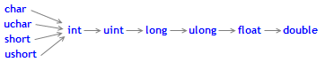

# Typecasting

### Casting Numeric Types

Often a necessity occurs to convert one numeric type into another. Not all numeric types can be converted into another. Here is the scheme of allowed casting:

![Solid lines with arrows indicate changes that are performed almost without any loss of information. Instead of the char type, the  bool  type can be used (both take 1 byte of memory), instead of type int, the  color  type can be used (4 bytes), instead of the long type,  datetime  can be used (take 8 bytes). The four dashed grey lines, also arrowed, denote conversions, when the loss of precision can occur. For example, the number of digits in an integer equal to 123456789 ( int ) is higher than the number of digits that can be represented by  float .](pics/casting.png)

Solid lines with arrows indicate changes that are performed almost without any loss of information. Instead of the char type, the [bool](/en/docs/basis/types/integer/boolconst) type can be used (both take 1 byte of memory), instead of type int, the [color](/en/docs/basis/types/integer/color) type can be used (4 bytes), instead of the long type, [datetime](/en/docs/basis/types/integer/datetime) can be used (take 8 bytes). The four dashed grey lines, also arrowed, denote conversions, when the loss of precision can occur. For example, the number of digits in an integer equal to 123456789 ([int](/en/docs/basis/types/integer/integertypes#int)) is higher than the number of digits that can be represented by [float](/en/docs/basis/types/double).

```
   int n=123456789;
   float f=n;    // the content of f is equal to 1.234567892E8
   Print("n = ",n,"   f = ",f);
   // result n= 123456789    f= 123456792.00000

```

A number converted into float has the same order, but is less accurate. Conversions, contrary to black arrows, can be performed with possible data loss. Conversions between char and uchar, short and ushort, int and uint, long and ulong (conversions to both sides), may lead to the loss of data.

As a result of converting floating point values to integer type, the fractional part is always deleted. If you want to round off a float to the nearest whole number (which in many cases is more useful), you should use [MathRound()](/en/docs/math/mathround).

Example:

```
//--- Gravitational acceleration
   double g=9.8;
   double round_g=(int)g;
   double math_round_g=MathRound(g);
   Print("round_g = ",round_g);
   Print("math_round_g = ",math_round_g);
/*
   Result:
   round_g = 9
   math_round_g = 10
*/

```

If two values are combined by a binary operator, before the operation execution the operand of a lower type is converted to the higher type in accordance with the priority given in the below scheme:



The data types char, uchar, short, and ushort unconditionally are converted to the int type.

Examples:

```
   char   c1=3;
//--- First example
   double d2=c1/2+0.3;
   Print("c1/2 + 0.3 = ",d2);
// Result:   c1/2+0.3 = 1.3
 
//--- Second example
   d2=c1/2.0+0.3;
   Print("c1/2.0 + 0.3 = ",d2);
// Result:   c1/2.0+0.3 = 1.8

```

The calculated expression consists of two operations. In the first example, the variable c1 of the char type is converted to a temporary variable of the int type, because the second operand in the division operation, the constant 2, is of the higher type int. As a result of the integer division 3/2 we get the value 1, which is of the int type.

In the second operation of the first example, the second operand is the constant 0.3, which is of the double type, so the result of the first operation is converted into a temporary variable of the double type with a value of 1.0.

In the second example the variable of the char type c1 is converted to a temporary variable of the double type, because the second operand in the division operation, the constant 2.0, is of the double type; no further conversions are made.

### Typecasting of Numeric Types

In the expressions of the MQL5 language both explicit and implicit typecasting can be used. The explicit typecasting is written as follows:

```
var_1 = (type)var_2;

```

An expression or function execution result can be used as the var_2 variable. The function style notation of the explicit typecasting is also possible:

```
var_1 = type(var_2);

```

Let's consider an explicit typecasting on the basis of the first example.

```
//--- Third example
   double d2=(double)c1/2+0.3;
   Print("(double)c1/2 + 0.3 = ",d2);
// Result:   (double)c1/2+0.3 = 1.80000000

```

Before the division operation is performed, the c1 variable is explicitly cast to the double type. Now the integer constant 2 is cast to the value 2.0 of the double type, because as a result of converting the first operand has taken the double type. In fact, the explicit typecasting is a unary operation.

Besides, when trying to cast types, the result may go beyond the permissible range. In this case, the truncation occurs. For example:

```
   char c;
   uchar u;
   c=400;
   u=400;
   Print("c = ",c); // Result c=-112
   Print("u = ",u); // Result u=144

```

Before operations (except for the assignment ones) are performed, the data are converted into the maximum priority type. Before assignment operations are performed, the data are cast into the target type.

Examples:

```
   int    i=1/2;        // no types casting, the result is 0
   Print("i = 1/2  ",i);
 
   int k=1/2.0;         // the expression is cast to the double type,
   Print("k = 1/2  ",k);  // then is to the target type of int, the result is 0
 
   double d=1.0/2.0;    // no types casting, the result is 0.5
   Print("d = 1/2.0; ",d);
 
   double e=1/2.0;      // the expression is cast to the double type,
   Print("e = 1/2.0; ",e);// that is the same as the target type, the result is 0.5
 
   double x=1/2;        // the expression of the int type is cast to the double target typr,
   Print("x = 1/2; ",x);  // the result is 0.0

```

When converting  long/ulong type into double, precision may be lost in case the integer value is greater than 9223372036854774784 or less than -9223372036854774784.

```
void OnStart()
  {
   long l_max=LONG_MAX;
   long l_min=LONG_MIN+1;
//--- define the highest integer value, which does not lose accuracy when being cast to double
   while(l_max!=long((double)l_max))
      l_max--;
//--- define the lowest integer value, which does not lose accuracy when being cast to double
   while(l_min!=long((double)l_min))
      l_min++;
//--- derive the found interval for integer values  
   PrintFormat("When casting an integer value to double, it must be "
               "within [%I64d, %I64d] interval",l_min,l_max);
//--- now, let's see what happens if the value falls out of this interval
   PrintFormat("l_max+1=%I64d, double(l_max+1)=%.f, ulong(double(l_max+1))=%I64d",
               l_max+1,double(l_max+1),long(double(l_max+1)));
   PrintFormat("l_min-1=%I64d, double(l_min-1)=%.f, ulong(double(l_min-1))=%I64d",
               l_min-1,double(l_min-1),long(double(l_min-1)));
//--- receive the following result
// When casting an integer value to double, it should be within [-9223372036854774784, 9223372036854774784] interval
// l_max+1=9223372036854774785, double(l_max+1)=9223372036854774800, ulong(double(l_max+1))=9223372036854774784
// l_min-1=-9223372036854774785, double(l_min-1)=-9223372036854774800, ulong(double(l_min-1))=-9223372036854774784
  }

```

### 

### Typecasting for the String Type

The string type has the highest priority among simple types. Therefore, if one of operands of an operation is of the string type, the second operand will be cast to a string automatically. Note that for a string, a single dyadic two-place operation of addition is possible. The explicit casting of string to any numeric type is allowed.

Examples:

```
   string s1=1.0/8;            // the expression is cast to the double type,
   Print("s1 = 1.0/8; ",s1);     //  then is to the target type of string,
// result is "0.12500000" (a string containing 10 characters)
 
   string s2=NULL;             // string deinitialization
   Print("s2 = NULL; ",s2);      // the result is an empty string
   string s3="Ticket N"+12345; // the expression is cast to the string type
   Print("s3 = \"Ticket N\"+12345",s3);
 
   string str1="true";
   string str2="0,255,0";
   string str3="2009.06.01";
   string str4="1.2345e2";
   Print(bool(str1));
   Print(color(str2));
   Print(datetime(str3));
   Print(double(str4));

```

### 

### Typecasting of Base Class Pointers to Pointers of Derivative Classes

Objects of the [open generated](/en/docs/basis/oop/inheritance#public_inheritance) class can also be viewed as objects of the corresponding base class. This leads to some interesting consequences. For example, despite the fact that objects of different classes, generated by a single base class, may differ significantly from each other, we can create a linked list (List) of them, as we view them as objects of the base type. But the converse is not true: the base class objects are not automatically objects of a derived class.

You can use the explicit casting to convert the base class pointers to the [pointers](/en/docs/basis/types/object_pointers) of a derived class. But you must be fully confident in the admissibility of such a transformation, because otherwise a critical runtime error will occur and the mql5 program will be stopped.

### Dynamic typecasting using dynamic_cast operator  #

Dynamic typecasting is performed using dynamic_cast operator that can be applied only to pointers to classes. Type validation is performed at runtime. This means that the compiler does not check the data type applied for typecasting when dynamic_cast operator is used. If a pointer is converted to a data type which is not the actual type of an object, the result is [NULL](/en/docs/basis/types/void).

```
dynamic_cast <type-id> ( expression )

```

The type-id parameter in angle brackets should point to a previously defined class type. Unlike C++, expression operand type can be of any value except for [void](/en/docs/basis/types/void).

Example:

```
class CBar { };
class CFoo : public CBar { };
 
void OnStart()
  {
   CBar bar;    
//--- dynamic casting of *bar pointer type to *foo pointer is allowed
   CFoo *foo = dynamic_cast<CFoo *>(&bar); // no critical error   
   Print(foo);                             // foo=NULL      
//--- an attempt to explicitly cast a Bar type object reference to a Foo type object is forbidden
   foo=(CFoo *)&bar;                       // critical runtime error
   Print(foo);                             // this string is not executed
  }

```

See also

[Data Types](/en/docs/basis/types)
