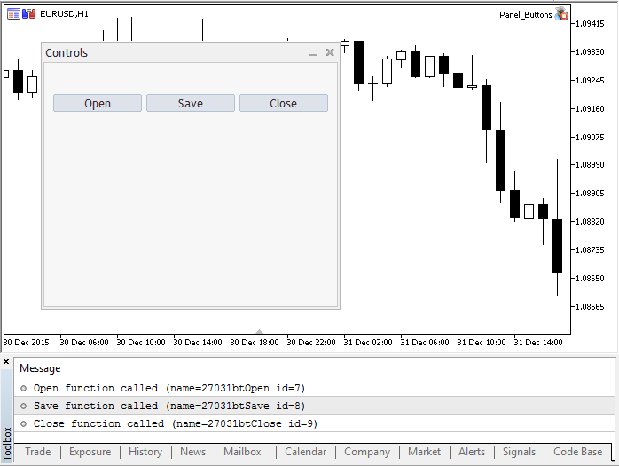

# User-defined types

The typedef keyword in C++ allows creating user-defined data types. To do this, simply specify a new data type name for an already existing data type. The new data type is not created. A new name for the existing type is defined instead. User-defined types make applications more flexible: sometimes, it is enough to change typedef instructions using substitution macros ([#define](/en/docs/basis/preprosessor/constant)). User-defined types also improve code readability since it is possible to apply custom names to standard data types using typedef. The general format of the entry for creating a user-defined type:

```
   typedef type new_name;

```

Here, type means any acceptable data type, while new_name is a new name of the type. A new name is set only as an addition (not as a replacement) to an existing type name. MQL5 allows creating pointers to functions using typedef.

## Pointer to the function

A pointer to a function is generally defined in the following format

```
   typedef function_result_type (*Function_name_type)(list_of_input_parameters_types);

```

where after typedef, the function signature (number and type of input parameters, as well as a type of a result returned by the function) is set. Below is a simple example of creating and applying a pointer to a function:

```
//--- declare a pointer to a function that accepts two int parameters
   typedef int (*TFunc)(int,int);
//--- TFunc is a type, and it is possible to declare the variable pointer to the function
   TFunc func_ptr; // pointer to the function
//--- declare the functions corresponding to the TFunc description
   int sub(int x,int y) { return(x-y); }  // subtract one number from another
   int add(int x,int y) { return(x+y); }  // addition of two numbers
   int neg(int x)       { return(~x);  }  // invert bits in the variable
//--- the func_ptr variable may store the function address to declare it later
   func_ptr=sub;
   Print(func_ptr(10,5));
   func_ptr=add;
   Print(func_ptr(10,5));
   func_ptr=neg;           // error: neg does not have int (int,int) type
   Print(func_ptr(10));    // error: two parameters needed

```

In this example, the func_ptr variable may receive the sub and add functions since they have two inputs each of [int](/en/docs/basis/types/integer/integertypes#int) type as defined in the TFunc pointer to the function. On the contrary, the neg function cannot be assigned to the func_ptr pointer since its signature is different.

### Arranging event models in the user interface

Pointers to functions allow you to easily create processing of events when creating a user interface. Let's use an example from the [CButton](/en/docs/standardlibrary/controls/cbutton#sample) section to show how to create buttons and add the functions for handling pressing to them. First, define a pointer to the TAction function to be called by pressing the button and create three functions according to the TAction description.

```
//--- create a custom function type
typedef int(*TAction)(string,int);
//+------------------------------------------------------------------+
//|  Open the file                                                  |
//+------------------------------------------------------------------+
int Open(string name,int id)
  {
   PrintFormat("%s function called (name=%s id=%d)",__FUNCTION__,name,id);
   return(1);
  }
//+------------------------------------------------------------------+
//|  Save the file                                                  |
//+------------------------------------------------------------------+
int Save(string name,int id)
  {
   PrintFormat("%s function called (name=%s id=%d)",__FUNCTION__,name,id);
   return(2);
  }
//+------------------------------------------------------------------+
//|  Close the file                                                  |
//+------------------------------------------------------------------+
int Close(string name,int id)
  {
   PrintFormat("%s function called (name=%s id=%d)",__FUNCTION__,name,id);
   return(3);
  }
 

```

Then, create the MyButton class from [CButton](/en/docs/standardlibrary/controls/cbutton), where we should add the TAction pointer to the function.

```
//+------------------------------------------------------------------+
//| Create the button class with the events processing function      |
//+------------------------------------------------------------------+
class MyButton: public CButton
  {
private:
   TAction           m_action;                    // chart events handler
public:
                     MyButton(void){}
                    ~MyButton(void){}
   //--- constructor specifying the button text and the pointer to the events handling function
                     MyButton(string text, TAction act)
     {
      Text(text);
      m_action=act;
     }
   //--- set the custom function called from the OnEvent() events handler
   void              SetAction(TAction act){m_action=act;}
   //--- standard chart events handler
   virtual bool      OnEvent(const int id,const long &lparam,const double &dparam,const string &sparam) override
     {      
      if(m_action!=NULL && lparam==Id())
        { 
         //--- call the custom m_action() handler 
         m_action(sparam,(int)lparam);
         return(true);
        }
      else
      //--- return the result of calling the handler from the CButton parent class
         return(CButton::OnEvent(id,lparam,dparam,sparam));
     }
  };

```

Create the CControlsDialog derivative class from [CAppDialog](/en/docs/standardlibrary/controls/cappdialog), add the m_buttons array to it for storing the buttons of the MyButton type, as well as the AddButton(MyButton &button) and CreateButtons() methods.

```
//+------------------------------------------------------------------+
//| CControlsDialog class                                            |
//| Objective: graphical panel for managing the application       |
//+------------------------------------------------------------------+
class CControlsDialog : public CAppDialog
  {
private:
   CArrayObj         m_buttons;                     // button array
public:
                     CControlsDialog(void){};
                    ~CControlsDialog(void){};
   //--- create
   virtual bool      Create(const long chart,const string name,const int subwin,const int x1,const int y1,const int x2,const int y2) override;
   //--- add the button
   bool              AddButton(MyButton &button){return(m_buttons.Add(GetPointer(button)));m_buttons.Sort();};
protected:
   //--- create the buttons 
   bool              CreateButtons(void);
  };
//+------------------------------------------------------------------+
//| Create the CControlsDialog object on the chart                   |
//+------------------------------------------------------------------+
bool CControlsDialog::Create(const long chart,const string name,const int subwin,const int x1,const int y1,const int x2,const int y2)
  {
   if(!CAppDialog::Create(chart,name,subwin,x1,y1,x2,y2))
      return(false);
   return(CreateButtons());
//---
  }
//+------------------------------------------------------------------+
//| defines                                                          |
//+------------------------------------------------------------------+
//--- indents and gaps
#define INDENT_LEFT                         (11)      // indent from left (with allowance for border width)
#define INDENT_TOP                          (11)      // indent from top (with allowance for border width)
#define CONTROLS_GAP_X                      (5)       // gap by X coordinate
#define CONTROLS_GAP_Y                      (5)       // gap by Y coordinate
//--- for buttons
#define BUTTON_WIDTH                        (100)     // size by X coordinate
#define BUTTON_HEIGHT                       (20)      // size by Y coordinate
//--- for the indication area
#define EDIT_HEIGHT                         (20)      // size by Y coordinate
//+------------------------------------------------------------------+
//| Create and add buttons to the CControlsDialog panel           |
//+------------------------------------------------------------------+
bool CControlsDialog::CreateButtons(void)
  {
//--- calculate buttons coordinates
   int x1=INDENT_LEFT;
   int y1=INDENT_TOP+(EDIT_HEIGHT+CONTROLS_GAP_Y);
   int x2;
   int y2=y1+BUTTON_HEIGHT;
//--- add buttons objects together with pointers to functions
   AddButton(new MyButton("Open",Open));
   AddButton(new MyButton("Save",::Save));
   AddButton(new MyButton("Close",Close));
//--- create the buttons graphically
   for(int i=0;i<m_buttons.Total();i++)
     {
      MyButton *b=(MyButton*)m_buttons.At(i);
      x1=INDENT_LEFT+i*(BUTTON_WIDTH+CONTROLS_GAP_X);
      x2=x1+BUTTON_WIDTH;
      if(!b.Create(m_chart_id,m_name+"bt"+b.Text(),m_subwin,x1,y1,x2,y2))
        {
         PrintFormat("Failed to create button %s %d",b.Text(),i);
         return(false);
        }
      //--- add each button to the CControlsDialog container
      if(!Add(b))
         return(false);
     }
//--- succeed
   return(true);
  }

```

Now, we can develop the program using the CControlsDialog control panel having 3 buttons: Open, Save and Close. When clicking a button, the appropriate function in the form of the TAction pointer is called.

```
//--- declare the object on the global level to automatically create it when launching the program
CControlsDialog MyDialog;
//+------------------------------------------------------------------+
//| Expert initialization function                                   |
//+------------------------------------------------------------------+
int OnInit()
  {
//--- now, create the object on the chart
   if(!MyDialog.Create(0,"Controls",0,40,40,380,344))
      return(INIT_FAILED);
//--- launch the application
   MyDialog.Run();
//--- application successfully initialized
   return(INIT_SUCCEEDED);
  }
//+------------------------------------------------------------------+
//| Expert deinitialization function                                 |
//+------------------------------------------------------------------+
void OnDeinit(const int reason)
  {
//--- destroy dialog
   MyDialog.Destroy(reason);
  }
//+------------------------------------------------------------------+
//| Expert chart event function                                      |
//+------------------------------------------------------------------+
void OnChartEvent(const int id,         // event ID  
                  const long& lparam,   // event parameter of the long type
                  const double& dparam, // event parameter of the double type
                  const string& sparam) // event parameter of the string type
  {
//--- call the handler from the parent class (here it is CAppDialog) for the chart events
   MyDialog.ChartEvent(id,lparam,dparam,sparam);
  }

```

The launched application's appearance and button clicking results are provided on the screenshot.



The full source code of the program

```
//+------------------------------------------------------------------+
//|                                                Panel_Buttons.mq5 |
//|                        Copyright 2017, MetaQuotes Software Corp. |
//|                                             https://www.mql5.com |
//+------------------------------------------------------------------+
 
#property copyright "Copyright 2017, MetaQuotes Software Corp."
#property link      "https://www.mql5.com"
#property version   "1.00"
#property description "The panel with several CButton buttons"
#include <Controls\Dialog.mqh>
#include <Controls\Button.mqh>
//+------------------------------------------------------------------+
//| defines                                                          |
//+------------------------------------------------------------------+
//--- indents and gaps
#define INDENT_LEFT                         (11)      // indent from left (with allowance for border width)
#define INDENT_TOP                          (11)      // indent from top (with allowance for border width)
#define CONTROLS_GAP_X                      (5)       // gap by X coordinate
#define CONTROLS_GAP_Y                      (5)       // gap by Y coordinate
//--- for buttons
#define BUTTON_WIDTH                        (100)     // size by X coordinate
#define BUTTON_HEIGHT                       (20)      // size by Y coordinate
//--- for the indication area
#define EDIT_HEIGHT                         (20)      // size by Y coordinate
 
//--- create the custom function type
typedef int(*TAction)(string,int);
//+------------------------------------------------------------------+
//|  Open the file                                                  |
//+------------------------------------------------------------------+
int Open(string name,int id)
  {
   PrintFormat("%s function called (name=%s id=%d)",__FUNCTION__,name,id);
   return(1);
  }
//+------------------------------------------------------------------+
//|  Save the file                                                  |
//+------------------------------------------------------------------+
int Save(string name,int id)
  {
   PrintFormat("%s function called (name=%s id=%d)",__FUNCTION__,name,id);
   return(2);
  }
//+------------------------------------------------------------------+
//|  Close the file                                                  |
//+------------------------------------------------------------------+
int Close(string name,int id)
  {
   PrintFormat("%s function called (name=%s id=%d)",__FUNCTION__,name,id);
   return(3);
  }
//+------------------------------------------------------------------+
//| Create the button class with the events processing function      |
//+------------------------------------------------------------------+
class MyButton: public CButton
  {
private:
   TAction           m_action;                    // chart events handler
public:
                     MyButton(void){}
                    ~MyButton(void){}
   //--- constructor specifying the button text and the pointer to the events handling function
                     MyButton(string text,TAction act)
     {
      Text(text);
      m_action=act;
     }
   //--- set the custom function called from the OnEvent() events handler
   void              SetAction(TAction act){m_action=act;}
   //--- standard chart events handler
   virtual bool      OnEvent(const int id,const long &lparam,const double &dparam,const string &sparam) override
     {
      if(m_action!=NULL && lparam==Id())
        {
         //--- call the custom handler
         m_action(sparam,(int)lparam);
         return(true);
        }
      else
      //--- return the result of calling the handler from the CButton parent class
         return(CButton::OnEvent(id,lparam,dparam,sparam));
     }
  };
//+------------------------------------------------------------------+
//| CControlsDialog class                                            |
//| Objective: graphical panel for managing the application       |
//+------------------------------------------------------------------+
class CControlsDialog : public CAppDialog
  {
private:
   CArrayObj         m_buttons;                     // button array
public:
                     CControlsDialog(void){};
                    ~CControlsDialog(void){};
   //--- create
   virtual bool      Create(const long chart,const string name,const int subwin,const int x1,const int y1,const int x2,const int y2) override;
   //--- add the button
   bool              AddButton(MyButton &button){return(m_buttons.Add(GetPointer(button)));m_buttons.Sort();};
protected:
   //--- create the buttons 
   bool              CreateButtons(void);
  };
//+------------------------------------------------------------------+
//| Create the CControlsDialog object on the chart                   |
//+------------------------------------------------------------------+
bool CControlsDialog::Create(const long chart,const string name,const int subwin,const int x1,const int y1,const int x2,const int y2)
  {
   if(!CAppDialog::Create(chart,name,subwin,x1,y1,x2,y2))
      return(false);
   return(CreateButtons());
//---
  }
//+------------------------------------------------------------------+
//| Create and add buttons to the CControlsDialog panel           |
//+------------------------------------------------------------------+
bool CControlsDialog::CreateButtons(void)
  {
//--- calculate buttons coordinates
   int x1=INDENT_LEFT;
   int y1=INDENT_TOP+(EDIT_HEIGHT+CONTROLS_GAP_Y);
   int x2;
   int y2=y1+BUTTON_HEIGHT;
//--- add buttons objects together with pointers to functions
   AddButton(new MyButton("Open",Open));
   AddButton(new MyButton("Save",::Save));
   AddButton(new MyButton("Close",Close));
//--- create the buttons graphically
   for(int i=0;i<m_buttons.Total();i++)
     {
      MyButton *b=(MyButton*)m_buttons.At(i);
      x1=INDENT_LEFT+i*(BUTTON_WIDTH+CONTROLS_GAP_X);
      x2=x1+BUTTON_WIDTH;
      if(!b.Create(m_chart_id,m_name+"bt"+b.Text(),m_subwin,x1,y1,x2,y2))
        {
         PrintFormat("Failed to create button %s %d",b.Text(),i);
         return(false);
        }
      //--- add each button to the CControlsDialog container
      if(!Add(b))
         return(false);
     }
//--- succeed
   return(true);
  }
//--- declare the object on the global level to automatically create it when launching the program
CControlsDialog MyDialog;
//+------------------------------------------------------------------+
//| Expert initialization function                                   |
//+------------------------------------------------------------------+
int OnInit()
  {
//--- now, create the object on the chart
   if(!MyDialog.Create(0,"Controls",0,40,40,380,344))
      return(INIT_FAILED);
//--- launch the application
   MyDialog.Run();
//--- application successfully initialized
   return(INIT_SUCCEEDED);
  }
//+------------------------------------------------------------------+
//| Expert deinitialization function                                 |
//+------------------------------------------------------------------+
void OnDeinit(const int reason)
  {
//--- destroy dialog
   MyDialog.Destroy(reason);
  }
//+------------------------------------------------------------------+
//| Expert chart event function                                      |
//+------------------------------------------------------------------+
void OnChartEvent(const int id,         // event ID  
                  const long& lparam,   // event parameter of the long type
                  const double& dparam, // event parameter of the double type
                  const string& sparam) // event parameter of the string type
  {
//--- call the handler from the parent class (here it is CAppDialog) for the chart events
   MyDialog.ChartEvent(id,lparam,dparam,sparam);
  }

```

See also

[Variables](/en/docs/basis/variables), [Functions](/en/docs/basis/function)
