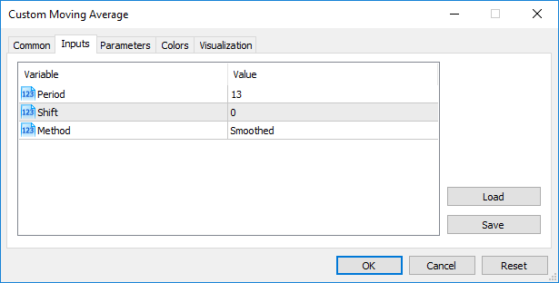
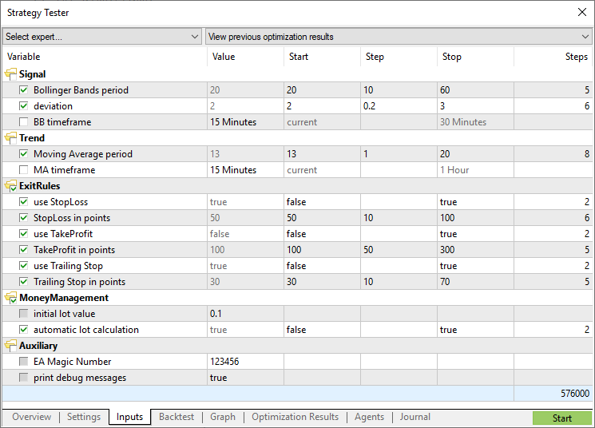

# Input Variables

The input storage class defines the external variable. The input modifier is indicated before the data type. A variable with the input modifier can't be changed inside mql5-programs, such variables can be accessed for reading only. Values of input variables can be changed only by a user from the program properties window. External variables are always reinitialized immediately before the [OnInit()](/en/docs/event_handlers/oninit) is called.

The maximum length of input variable names is 63 characters. For the input parameter of [string](/en/docs/basis/types/stringconst) type, the maximum value length (string length) can be from 191 to 253 characters (see the [Note](/en/docs/basis/variables/inputvariables#note_input_string)). The minimum length is 0 characters (the value is not set).

Example:

```
//--- input parameters
input int            MA_Period=13;
input int            MA_Shift=0;
input ENUM_MA_METHOD MA_Method=MODE_SMMA;

```

Input variables determine the input parameters of a program. They are available from the Properties window of a program.


### Setting the display name of an input variable

There is another way to set how your input parameter will look like in the Inputs tab. For this, place a string comment after the description of an input parameter in the same line. In this way you can make names of input parameters more understandable for users.

Example:

```
//--- input parameters
input int            InpMAPeriod=13;         // Smoothing period
input int            InpMAShift=0;           // Line horizontal shift
input ENUM_MA_METHOD InpMAMethod=MODE_SMMA;  // Smoothing method

```



Note: Arrays and variables of [complex types](/en/docs/basis/types/classes) can't act as input variables.

Note: The length of a string comment for Input variables cannot exceed 63 characters.

Note: For input variables of [string](/en/docs/basis/types/stringconst) type, the limitation of the value length (string length) is set by the following conditions:

- the parameter value is represented by the "parameter_name=parameter_value" string ('=' is considered),
- maximum representation length of 255 characters (total_length_max=255 or 254 characters excluding '='),
- maximum length of the parameter_name_length string parameter = 63 characters.

Thus, the maximum string size for a string parameter is calculated using the equation:

```
parameter_value_length=total_length_max-parameter_name_length=254-parameter_name_length

```

This provides the maximum string size from 191 (parameter_name_length=63) to 253 characters (parameter_name_length=1).

### Explicitly specifying the name of the input variable on the Inputs tab

More convenient is to explicitly specify a display name for input variables, which is shown in the program properties when launched. The display name is specified by the name parameter in parentheses after the 'input' keyword.

```
input(name="MA period") int InpMAPeriod = 14;

```

The name parameter accepts only string literal. If specified, comments following the variable declaration are not used to set the display name.

The previous syntax, in which the display name was specified in a comment, is also supported for compatibility:

```
input int InpMAPeriod = 14;  /*MA period*/

```

If both options are present (name and comment are specified), the compiler uses the value specified via the name parameter.

### Passing Parameters When Calling Custom Indicators from MQL5 Programs  #

Custom Indicators are called using the [iCustom()](/en/docs/indicators/icustom) function. After the name of the custom indicator, parameters should go in a strict accordance with the declaration of input variables of this custom indicator. If indicated parameters are less than input variables declared in the called custom indicator, the missing parameters are filled with values specified during the declaration of variables.

If the custom indicator uses the [OnCalculate](/en/docs/event_handlers/oncalculate) function of the first type (i.e., the indicator is calculated using the same array of data), then one of [ENUM_APPLIED_PRICE](/en/docs/constants/indicatorconstants/prices#enum_applied_price_enum) values or handle of another indicator should be used as the last parameter when calling such a custom indicator. All parameters corresponding to input variables must be clearly indicated.

### Enumerations as input Parameters

Not only built-in enumerations provided in MQL5, but also user defined variables can be used as input variables (input parameters for mql5 programs). For example, we can create the dayOfWeek enumeration, describing days of the week, and use the input variable to specify a particular day of the week, not as a number, but in a more common way.

Example:

```
#property script_show_inputs
//--- day of week
enum dayOfWeek 
  {
   S=0,     // Sunday
   M=1,     // Monday
   T=2,     // Tuesday
   W=3,     // Wednesday
   Th=4,    // Thursday
   Fr=5,    // Friday,
   St=6,    // Saturday
  };
//--- input parameters
input dayOfWeek swapday=W;

```

In order to enable a user to select a necessary value from the properties window during the script startup, we use the preprocessor command #property script_show_inputs. We start the script and can choose one of values of the dayOfWeek enumeration from the list. We start the EnumInInput script and go to the Inputs tab. By default, the value of swapday (day of triple swap charge) is Wednesday (W = 3), but we can specify any other value, and use this value to change the program operation.


Number of possible values of an enumeration is limited. In order to select an input value the drop-down list is used. Mnemonic names of enumeration members are used for values displayed in the list. If a comment is associated with a mnemonic name, as shown in this example, the comment content is used instead of the mnemonic name.

Each value of the dayOfWeek enumeration has its value from 0 to 6, but in the list of parameters, comments specified for each value will be shown. This provides additional flexibility for writing programs with clear descriptions of input parameters.

## Variables with sinput Modifier  #

Variables with input modifier allow not only setting external parameters values when launching programs but are also necessary when optimizing trading strategies in the Strategy Tester. Each input variable excluding the one of a string type can be used in optimization.

Sometimes, it is necessary to exclude some external program parameters from the area of all passes in the tester. sinput memory modifier has been introduced for such cases. sinput stands for static external variable declaration (sinput = static input). It means that the following declaration in an Expert Advisor code

```
sinput       int layers=6;   // Number of layers

```

will be equivalent to the full declaration

```
static input int layers=6;   // Number of layers

```

The variable declared with sinput modifier is an input parameter of MQL5 program. The value of this parameter can be changed when launching the program. However, this variable is not used in the optimization of input parameters. In other words, its values are not enumerated when searching for the best set of parameters fitting a specified condition.


The Expert Advisor shown above has 5 external parameters. "Number of layers" is declared to be sinput and equal to 6. This parameter cannot be changed during a trading strategy optimization. We can specify the necessary value for it to be used further on. Start, Step and Stop fields are not available for such a variable.

Therefore, users will not be able to optimize this parameter after we specify sinput modifier for the variable. In other words, the terminal users will not be able to set initial and final values for it in the Strategy Tester for automatic enumeration in the specified range during optimization.

However, there is one exception to this rule: sinput variables can be varied in optimization tasks using [ParameterSetRange()](/en/docs/optimization_frames/parametersetrange) function. This function has been introduced specifically for the program control of available values sets for any [input](/en/docs/basis/variables/inputvariables) variable including the ones declared as static input (sinput). The [ParameterGetRange()](/en/docs/optimization_frames/parametergetrange) function allows to receive input variables values when optimization is launched (in [OnTesterInit()](/en/docs/event_handlers/ontesterinit) handler) and to reset a change step value and a range, within which an optimized parameter values will be enumerated.

In this way, combining the sinput modifier and two functions that work with input parameters, allows to create a flexible rules for setting optimization intervals of input parameters that depend on values of another input parameters.

## Arranging input parameters  #

For the convenience of working with MQL5 programs, the input parameters can be divided into named blocks using the group keyword. This allows for visual separation of some parameters from others based on the logic embedded in them.

```
input group           "Group name"
input int             variable1 = ...
input double          variable2 = ...
input double          variable3= ...

```

After such a declaration, all input parameters are visually joined into a specified group simplifying parameters configuration for MQL5 users when launching on a chart or in the strategy tester.  Specification of each group is valid till a new group declaration appears:

```
input group           "Group name #1"
input int             group1_var1 = ...
input double          group1_var2 = ...
input double          group1_var3 = ...
 
input group           "Group name #2
input int             group2_var1 = ...
input double          group2_var2 = ...
input double          group2_var3 = ...

```

A sample EA featuring the block of inputs separated by their purpose:

```
input group           "Signal"
input int             ExtBBPeriod   = 20;       // Bollinger Bands period
input double          ExtBBDeviation= 2.0;      // deviation
input ENUM_TIMEFRAMES ExtSignalTF=PERIOD_M15;   // BB timeframe
 
input group           "Trend"
input int             ExtMAPeriod   = 13;       // Moving Average period
input ENUM_TIMEFRAMES ExtTrendTF=PERIOD_M15;    // MA timeframe
 
input group           "ExitRules"
input bool            ExtUseSL      = true;     // use StopLoss
input int             Ext_SL_Points = 50;       // StopLoss in points
input bool            ExtUseTP      = false;    // use TakeProfit
input int             Ext_TP_Points = 100;      // TakeProfit in points
input bool            ExtUseTS      = true;     // use Trailing Stop
input int             Ext_TS_Points = 30;       // Trailing Stop in points
 
input group           "MoneyManagement"
sinput double         ExtInitialLot = 0.1;      // initial lot value
input bool            ExtUseAutoLot = true;     // automatic lot calculation
 
input group           "Auxiliary"
sinput int            ExtMagicNumber = 123456;  // EA Magic Number
sinput bool           ExtDebugMessage= true;    // print debug messages

```

When launching such an EA in the strategy tester, you can double-click a group name to collapse/expand the inputs block, as well as click the group checkbox to select all its parameters for optimization.



See also

[iCustom](/en/docs/indicators/icustom), [Enumerations](/en/docs/basis/types/integer/enumeration), [Properties of Programs](/en/docs/basis/preprosessor/compilation)
