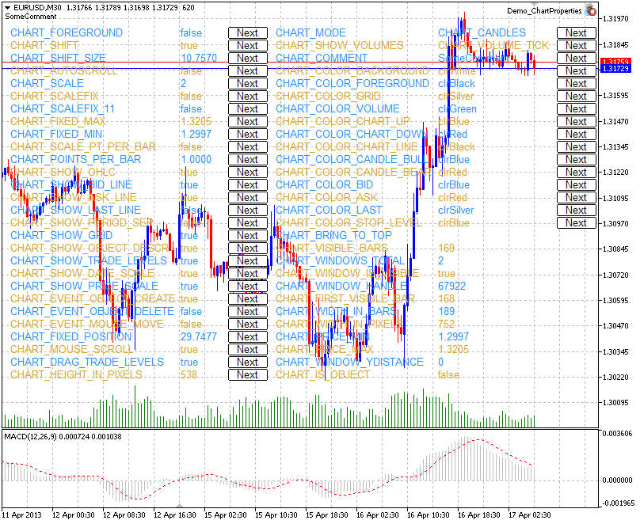

# Examples of Working with the Chart

This section contains examples of working with chart properties. One or two complete functions are displayed for each property. These functions allow setting/receiving the value of the property. These functions can be used "as is" in custom mql5 applications.

The screenshot below demonstrates the graphic panel illustrating how changing of [the chart property](/en/docs/constants/chartconstants/enum_chart_property) changes its appearance. Clicking Next button allows setting the new value of the appropriate property and view the changes in the chart window.



The panel's source code is located [below](/en/docs/constants/chartconstants/charts_samples#chart_properties_panel).

## Chart Properties and Sample Functions for Working with Them

- CHART_IS_OBJECT defines if an object is a real chart or a [graphic object](/en/docs/constants/objectconstants/enum_object).

| //+------------------------------------------------------------------+ 
 //| Checks if an object is a chart. If it is a graphic object,       | 
 //| the result is true. If it is a real chart, the result variable   | 
 //| has the value of false.                                          | 
 //+------------------------------------------------------------------+ 
 bool  ChartIsObject( bool  &result, const   long  chart_ID=0) 
   { 
 //--- prepare the variable to get the property value 
     long  value; 
 //--- reset the error value 
     ResetLastError (); 
 //--- get the chart property 
     if (! ChartGetInteger (chart_ID, CHART_IS_OBJECT ,0,value)) 
      { 
        //--- display the error message in Experts journal 
        Print ( __FUNCTION__ + ", Error Code = " , GetLastError ()); 
        //--- return false 
        return ( false ); 
      } 
 //--- store the value of the chart property in memory 
    result=value; 
 //--- successful execution 
     return ( true ); 
   } |
| --- |
|  |

- CHART_BRING_TO_TOP shows the chart on top of all others.

```
//+----------------------------------------------------------------------+
//| Sends command to the terminal to display the chart above all others  |
//+----------------------------------------------------------------------+
bool ChartBringToTop(const long chart_ID=0)
  {
//--- reset the error value
   ResetLastError();
//--- show the chart on top of all others
   if(!ChartSetInteger(chart_ID,CHART_BRING_TO_TOP,0,true))
     {
      //--- display the error message in Experts journal
      Print(__FUNCTION__+", Error Code = ",GetLastError());
      return(false);
     }
//--- successful execution
   return(true);
  }

```

- CHART_MOUSE_SCROLL is a property for scrolling the chart using left mouse button.

```
//+--------------------------------------------------------------------------+
//| Checks if scrolling of chart using left mouse button is enabled          |
//+--------------------------------------------------------------------------+
bool ChartMouseScrollGet(bool &result,const long chart_ID=0)
  {
//--- prepare the variable to get the property value
   long value;
//--- reset the error value
   ResetLastError();
//--- receive the property value
   if(!ChartGetInteger(chart_ID,CHART_MOUSE_SCROLL,0,value))
     {
      //--- display the error message in Experts journal
      Print(__FUNCTION__+", Error Code = ",GetLastError());
      return(false);
     }
//--- store the value of the chart property in memory
   result=value;
//--- successful execution
   return(true);
  }
//+--------------------------------------------------------------------+
//| Enables/disables scrolling of chart using left mouse button        |
//+--------------------------------------------------------------------+
bool ChartMouseScrollSet(const bool value,const long chart_ID=0)
  {
//--- reset the error value
   ResetLastError();
//--- set property value
   if(!ChartSetInteger(chart_ID,CHART_MOUSE_SCROLL,0,value))
     {
      //--- display the error message in Experts journal
      Print(__FUNCTION__+", Error Code = ",GetLastError());
      return(false);
     }
//--- successful execution
   return(true);
  }

```

- CHART_EVENT_MOUSE_MOVE  is a property of sending messages concerning move events and mouse clicks to mql5 applications ([CHARTEVENT_MOUSE_MOVE](/en/docs/constants/chartconstants/enum_chartevents)).

```
//+------------------------------------------------------------------+
//| Checks if messages concerning move events and mouse clicks       |
//| are sent to all MQL5 applications on the chart                   |
//+------------------------------------------------------------------+
bool ChartEventMouseMoveGet(bool &result,const long chart_ID=0)
  {
//--- prepare the variable to get the property value
   long value;
//--- reset the error value
   ResetLastError();
//--- receive the property value
   if(!ChartGetInteger(chart_ID,CHART_EVENT_MOUSE_MOVE,0,value))
     {
      //--- display the error message in Experts journal
      Print(__FUNCTION__+", Error Code = ",GetLastError());
      return(false);
     }
//--- store the value of the chart property in memory
   result=value;
//--- successful execution
   return(true);
  }
//+------------------------------------------------------------------------------+
//| Enables/disables the mode of sending messages concerning move events and     |
//| mouse clicks to MQL5 applications on the chart                               |
//+------------------------------------------------------------------------------+
bool ChartEventMouseMoveSet(const bool value,const long chart_ID=0)
  {
//--- reset the error value
   ResetLastError();
//--- set property value
   if(!ChartSetInteger(chart_ID,CHART_EVENT_MOUSE_MOVE,0,value))
     {
      //--- display the error message in Experts journal
      Print(__FUNCTION__+", Error Code = ",GetLastError());
      return(false);
     }
//--- successful execution
   return(true);
  }

```

- CHART_EVENT_OBJECT_CREATE is a property of sending messages concerning the event of a graphic object creation to mql5 applications ([CHARTEVENT_OBJECT_CREATE](/en/docs/constants/chartconstants/enum_chartevents)).

```
//+---------------------------------------------------------------------+
//| Checks if messages concerning the event of a graphic                |
//| object creation are sent to all MQL5 applications on the chart      |
//+---------------------------------------------------------------------+
bool ChartEventObjectCreateGet(bool &result,const long chart_ID=0)
  {
//--- prepare the variable to get the property value
   long value;
//--- reset the error value
   ResetLastError();
//--- receive the property value
   if(!ChartGetInteger(chart_ID,CHART_EVENT_OBJECT_CREATE,0,value))
     {
      //--- display the error message in Experts journal
      Print(__FUNCTION__+", Error Code = ",GetLastError());
      return(false);
     }
//--- store the value of the chart property in memory
   result=value;
//--- successful execution
   return(true);
  }
//+--------------------------------------------------------------------------+
//| Enables/disables the mode of sending messages concerning the event of a  |
//| graphic object creation to all mql5 applications on the chart            |
//+--------------------------------------------------------------------------+
bool ChartEventObjectCreateSet(const bool value,const long chart_ID=0)
  {
//--- reset the error value
   ResetLastError();
//--- set property value
   if(!ChartSetInteger(chart_ID,CHART_EVENT_OBJECT_CREATE,0,value))
     {
      //--- display the error message in Experts journal
      Print(__FUNCTION__+", Error Code = ",GetLastError());
      return(false);
     }
//--- successful execution
   return(true);
  }

```

- CHART_EVENT_OBJECT_DELETE is a property of sending messages concerning the event of a graphic object deletion to mql5 applications ([CHARTEVENT_OBJECT_DELETE](/en/docs/constants/chartconstants/enum_chartevents)).

```
//+---------------------------------------------------------------------+
//| Checks if messages concerning the event of a graphic object         |
//| deletion are sent to all mql5 applications on the chart             |
//+---------------------------------------------------------------------+
bool ChartEventObjectDeleteGet(bool &result,const long chart_ID=0)
  {
//--- prepare the variable to get the property value
   long value;
//--- reset the error value
   ResetLastError();
//--- receive the property value
   if(!ChartGetInteger(chart_ID,CHART_EVENT_OBJECT_DELETE,0,value))
     {
      //--- display the error message in Experts journal
      Print(__FUNCTION__+", Error Code = ",GetLastError());
      return(false);
     }
//--- store the value of the chart property in memory
   result=value;
//--- successful execution
   return(true);
  }
//+--------------------------------------------------------------------------+
//| Enables/disables the mode of sending messages concerning the event of a  |
//| graphic object deletion to all mql5 applications on the chart            |
//+--------------------------------------------------------------------------+
bool ChartEventObjectDeleteSet(const bool value,const long chart_ID=0)
  {
//--- reset the error value
   ResetLastError();
//--- set property value
   if(!ChartSetInteger(chart_ID,CHART_EVENT_OBJECT_DELETE,0,value))
     {
      //--- display the error message in Experts journal
      Print(__FUNCTION__+", Error Code = ",GetLastError());
      return(false);
     }
//--- successful execution
   return(true);
  }

```

- CHART_MODE – type of the chart (candlesticks, bars or line).

```
//+------------------------------------------------------------------+
//| Gets chart display type (candlesticks, bars or line)             |
//+------------------------------------------------------------------+
ENUM_CHART_MODE ChartModeGet(const long chart_ID=0)
  {
//--- prepare the variable to get the property value
   long result=WRONG_VALUE;
//--- reset the error value
   ResetLastError();
//--- receive the property value
   if(!ChartGetInteger(chart_ID,CHART_MODE,0,result))
     {
      //--- display the error message in Experts journal
      Print(__FUNCTION__+", Error Code = ",GetLastError());
     }
//--- return the value of the chart property
   return((ENUM_CHART_MODE)result);
  }
//+------------------------------------------------------------------+
//| Sets chart display type (candlesticks, bars or line)             |
//+------------------------------------------------------------------+
bool ChartModeSet(const long value,const long chart_ID=0)
  {
//--- reset the error value
   ResetLastError();
//--- set property value
   if(!ChartSetInteger(chart_ID,CHART_MODE,value))
     {
      //--- display the error message in Experts journal
      Print(__FUNCTION__+", Error Code = ",GetLastError());
      return(false);
     }
//--- successful execution
   return(true);
  }

```

- CHART_FOREGROUND is a property of displaying a price chart in the foreground.

```
//+------------------------------------------------------------------+
//| Checks if a price chart is displayed in the foreground           |
//+------------------------------------------------------------------+
bool ChartForegroundGet(bool &result,const long chart_ID=0)
  {
//--- prepare the variable to get the property value
   long value;
//--- reset the error value
   ResetLastError();
//--- receive the property value
   if(!ChartGetInteger(chart_ID,CHART_FOREGROUND,0,value))
     {
      //--- display the error message in Experts journal
      Print(__FUNCTION__+", Error Code = ",GetLastError());
      return(false);
     }
//--- store the value of the chart property in memory
   result=value;
//--- successful execution
   return(true);
  }
//+------------------------------------------------------------------+
//| Enables/disables displaying of a price chart on the foreground   |
//+------------------------------------------------------------------+
bool ChartForegroundSet(const bool value,const long chart_ID=0)
  {
//--- reset the error value
   ResetLastError();
//--- set property value
   if(!ChartSetInteger(chart_ID,CHART_FOREGROUND,0,value))
     {
      //--- display the error message in Experts journal
      Print(__FUNCTION__+", Error Code = ",GetLastError());
      return(false);
     }
//--- successful execution
   return(true);
  }

```

- CHART_SHIFT – mode of shift of the price chart from the right border.

```
//+-------------------------------------------------------------------+
//| Checks if shifting a price chart from the right border is enabled |
//+-------------------------------------------------------------------+
bool ChartShiftGet(bool &result,const long chart_ID=0)
  {
//--- prepare the variable to get the property value
   long value;
//--- reset the error value
   ResetLastError();
//--- receive the property value
   if(!ChartGetInteger(chart_ID,CHART_SHIFT,0,value))
     {
      //--- display the error message in Experts journal
      Print(__FUNCTION__+", Error Code = ",GetLastError());
      return(false);
     }
//--- store the value of the chart property in memory
   result=value;
//--- successful execution
   return(true);
  }
//+---------------------------------------------------------------------------------+
//| Enables/disables displaying of a price chart with a shift from the right border |
//+---------------------------------------------------------------------------------+
bool ChartShiftSet(const bool value,const long chart_ID=0)
  {
//--- reset the error value
   ResetLastError();
//--- set property value
   if(!ChartSetInteger(chart_ID,CHART_SHIFT,0,value))
     {
      //--- display the error message in Experts journal
      Print(__FUNCTION__+", Error Code = ",GetLastError());
      return(false);
     }
//--- successful execution
   return(true);
  }

```

- CHART_AUTOSCROLL – the mode of automatic shift to the right border of the chart.

```
//+------------------------------------------------------------------+
//| Checks if automatic scrolling of a chart to the right            |
//| on new ticks arrival is enabled                                  |
//+------------------------------------------------------------------+
bool ChartAutoscrollGet(bool &result,const long chart_ID=0)
  {
//--- prepare the variable to get the property value
   long value;
//--- reset the error value
   ResetLastError();
//--- receive the property value
   if(!ChartGetInteger(chart_ID,CHART_AUTOSCROLL,0,value))
     {
      //--- display the error message in Experts journal
      Print(__FUNCTION__+", Error Code = ",GetLastError());
      return(false);
     }
//--- store the value of the chart property in memory
   result=value;
//--- successful execution
   return(true);
  }
//+------------------------------------------------------------------+
//| Enables/disables automatic scrolling of a chart to the right     |
//| on new ticks arrival                                             |
//+------------------------------------------------------------------+
bool ChartAutoscrollSet(const bool value,const long chart_ID=0)
  {
//--- reset the error value
   ResetLastError();
//--- set property value
   if(!ChartSetInteger(chart_ID,CHART_AUTOSCROLL,0,value))
     {
      //--- display the error message in Experts journal
      Print(__FUNCTION__+", Error Code = ",GetLastError());
      return(false);
     }
//--- successful execution
   return(true);
  }

```

- CHART_SCALE – chart scale property.

```
//+------------------------------------------------------------------+
//| Gets chart scale (from 0 to 5)                                   |
//+------------------------------------------------------------------+
int ChartScaleGet(const long chart_ID=0)
  {
//--- prepare the variable to get the property value
   long result=-1;
//--- reset the error value
   ResetLastError();
//--- receive the property value
   if(!ChartGetInteger(chart_ID,CHART_SCALE,0,result))
     {
      //--- display the error message in Experts journal
      Print(__FUNCTION__+", Error Code = ",GetLastError());
     }
//--- return the value of the chart property
   return((int)result);
  }
//+------------------------------------------------------------------+
//| Sets chart scale (from 0 to 5)                                   |
//+------------------------------------------------------------------+
bool ChartScaleSet(const long value,const long chart_ID=0)
  {
//--- reset the error value
   ResetLastError();
//--- set property value
   if(!ChartSetInteger(chart_ID,CHART_SCALE,0,value))
     {
      //--- display the error message in Experts journal
      Print(__FUNCTION__+", Error Code = ",GetLastError());
      return(false);
     }
//--- successful execution
   return(true);
  }

```

- CHART_SCALEFIX – the mode of fixed chart scale.

```
//+------------------------------------------------------------------+
//| Checks if the fixed scale mode is enabled                        |
//+------------------------------------------------------------------+
bool ChartScaleFixGet(bool &result,const long chart_ID=0)
  {
//--- prepare the variable to get the property value
   long value;
//--- reset the error value
   ResetLastError();
//--- receive the property value
   if(!ChartGetInteger(chart_ID,CHART_SCALEFIX,0,value))
     {
      //--- display the error message in Experts journal
      Print(__FUNCTION__+", Error Code = ",GetLastError());
      return(false);
     }
//--- store the value of the chart property in memory
   result=value;
//--- successful execution
   return(true);
  }
//+------------------------------------------------------------------+
//| Enables/disables the fixed scale mode                            |
//+------------------------------------------------------------------+
bool ChartScaleFixSet(const bool value,const long chart_ID=0)
  {
//--- reset the error value
   ResetLastError();
//--- set property value
   if(!ChartSetInteger(chart_ID,CHART_SCALEFIX,0,value))
     {
      //--- display the error message in Experts journal
      Print(__FUNCTION__+", Error Code = ",GetLastError());
      return(false);
     }
//--- successful execution
   return(true);
  }

```

- CHART_SCALEFIX_11 – 1:1 chart scale mode.

```
//+------------------------------------------------------------------+
//| Checks if the "1:1" scale is enabled                             |
//+------------------------------------------------------------------+
bool ChartScaleFix11Get(bool &result,const long chart_ID=0)
  {
//--- prepare the variable to get the property value
   long value;
//--- reset the error value
   ResetLastError();
//--- receive the property value
   if(!ChartGetInteger(chart_ID,CHART_SCALEFIX_11,0,value))
     {
      //--- display the error message in Experts journal
      Print(__FUNCTION__+", Error Code = ",GetLastError());
      return(false);
     }
//--- store the value of the chart property in memory
   result=value;
//--- successful execution
   return(true);
  }
//+------------------------------------------------------------------+
//| Enables/disables the "1:1" scale mode                            |
//+------------------------------------------------------------------+
bool ChartScaleFix11Set(const bool value,const long chart_ID=0)
  {
//--- reset the error value
   ResetLastError();
//--- set property value
   if(!ChartSetInteger(chart_ID,CHART_SCALEFIX_11,0,value))
     {
      //--- display the error message in Experts journal
      Print(__FUNCTION__+", Error Code = ",GetLastError());
      return(false);
     }
//--- successful execution
   return(true);
  }

```

- CHART_SCALE_PT_PER_BAR – the mode of specifying the chart scale in points per bar.

```
//+------------------------------------------------------------------+
//| Checks if the "points per bar" chart scaling mode is enabled     |
//+------------------------------------------------------------------+
bool ChartScalePerBarGet(bool &result,const long chart_ID=0)
  {
//--- prepare the variable to get the property value
   long value;
//--- reset the error value
   ResetLastError();
//--- receive the property value
   if(!ChartGetInteger(chart_ID,CHART_SCALE_PT_PER_BAR,0,value))
     {
      //--- display the error message in Experts journal
      Print(__FUNCTION__+", Error Code = ",GetLastError());
      return(false);
     }
//--- store the value of the chart property in memory
   result=value;
//--- successful execution
   return(true);
  }
//+------------------------------------------------------------------+
//| Enables/disables the "points per bar" chart scaling mode         |
//+------------------------------------------------------------------+
bool ChartScalePerBarSet(const bool value,const long chart_ID=0)
  {
//--- reset the error value
   ResetLastError();
//--- set property value
   if(!ChartSetInteger(chart_ID,CHART_SCALE_PT_PER_BAR,0,value))
     {
      //--- display the error message in Experts journal
      Print(__FUNCTION__+", Error Code = ",GetLastError());
      return(false);
     }
//--- successful execution
   return(true);
  }

```

- CHART_SHOW_OHLC – the property of displaying OHLC values in the upper left corner.

```
//+----------------------------------------------------------------------------------+
//| Checks if displaying of OHLC values in the upper left corner of chart is enabled |
//+----------------------------------------------------------------------------------+
bool ChartShowOHLCGet(bool &result,const long chart_ID=0)
  {
//--- prepare the variable to get the property value
   long value;
//--- reset the error value
   ResetLastError();
//--- receive the property value
   if(!ChartGetInteger(chart_ID,CHART_SHOW_OHLC,0,value))
     {
      //--- display the error message in Experts journal
      Print(__FUNCTION__+", Error Code = ",GetLastError());
      return(false);
     }
//--- store the value of the chart property in memory
   result=value;
//--- successful execution
   return(true);
  }
//+------------------------------------------------------------------------------+
//| Enables/disables displaying of OHLC values in the upper left corner of chart |
//+------------------------------------------------------------------------------+
bool ChartShowOHLCSet(const bool value,const long chart_ID=0)
  {
//--- reset the error value
   ResetLastError();
//--- set property value
   if(!ChartSetInteger(chart_ID,CHART_SHOW_OHLC,0,value))
     {
      //--- display the error message in Experts journal
      Print(__FUNCTION__+", Error Code = ",GetLastError());
      return(false);
     }
//--- successful execution
   return(true);
  }

```

- CHART_SHOW_BID_LINE – the property of displaying Bid value as a horizontal line on the chart.

```
//+------------------------------------------------------------------+
//| Checks if displaying of Bid line on chart is enabled             |
//+------------------------------------------------------------------+
bool ChartShowBidLineGet(bool &result,const long chart_ID=0)
  {
//--- prepare the variable to get the property value
   long value;
//--- reset the error value
   ResetLastError();
//--- receive the property value
   if(!ChartGetInteger(chart_ID,CHART_SHOW_BID_LINE,0,value))
     {
      //--- display the error message in Experts journal
      Print(__FUNCTION__+", Error Code = ",GetLastError());
      return(false);
     }
//--- store the value of the chart property in memory
   result=value;
//--- successful execution
   return(true);
  }
//+------------------------------------------------------------------+
//| Enables/disables displaying of Bid line on chart                 |
//+------------------------------------------------------------------+
bool ChartShowBidLineSet(const bool value,const long chart_ID=0)
  {
//--- reset the error value
   ResetLastError();
//--- set property value
   if(!ChartSetInteger(chart_ID,CHART_SHOW_BID_LINE,0,value))
     {
      //--- display the error message in Experts journal
      Print(__FUNCTION__+", Error Code = ",GetLastError());
      return(false);
     }
//--- successful execution
   return(true);
  }

```

- CHART_SHOW_ASK_LINE – the property of displaying Ask value as a horizontal line on a chart.

```
//+------------------------------------------------------------------+
//| Checks if displaying of Ask line on chart is enabled             |
//+------------------------------------------------------------------+
bool ChartShowAskLineGet(bool &result,const long chart_ID=0)
  {
//--- prepare the variable to get the property value
   long value;
//--- reset the error value
   ResetLastError();
//--- receive the property value
   if(!ChartGetInteger(chart_ID,CHART_SHOW_ASK_LINE,0,value))
     {
      //--- display the error message in Experts journal
      Print(__FUNCTION__+", Error Code = ",GetLastError());
      return(false);
     }
//--- store the value of the chart property in memory
   result=value;
//--- successful execution
   return(true);
  }
//+------------------------------------------------------------------+
//| Enables/disables displaying of Ask line on chart                 |
//+------------------------------------------------------------------+
bool ChartShowAskLineSet(const bool value,const long chart_ID=0)
  {
//--- reset the error value
   ResetLastError();
//--- set property value
   if(!ChartSetInteger(chart_ID,CHART_SHOW_ASK_LINE,0,value))
     {
      //--- display the error message in Experts journal
      Print(__FUNCTION__+", Error Code = ",GetLastError());
      return(false);
     }
//--- successful execution
   return(true);
  }

```

- CHART_SHOW_LAST_LINE – the property of displaying Last value as a horizontal line on a chart.

```
//+-----------------------------------------------------------------------------+
//| Checks if displaying of line for the last performed deal's price is enabled |
//+-----------------------------------------------------------------------------+
bool ChartShowLastLineGet(bool &result,const long chart_ID=0)
  {
//--- prepare the variable to get the property value
   long value;
//--- reset the error value
   ResetLastError();
//--- receive the property value
   if(!ChartGetInteger(chart_ID,CHART_SHOW_LAST_LINE,0,value))
     {
      //--- display the error message in Experts journal
      Print(__FUNCTION__+", Error Code = ",GetLastError());
      return(false);
     }
//--- store the value of the chart property in memory
   result=value;
//--- successful execution
   return(true);
  }
//+-------------------------------------------------------------------------+
//| Enables/disables displaying of line for the last performed deal's price |
//+-------------------------------------------------------------------------+
bool ChartShowLastLineSet(const bool value,const long chart_ID=0)
  {
//--- reset the error value
   ResetLastError();
//--- set property value
   if(!ChartSetInteger(chart_ID,CHART_SHOW_LAST_LINE,0,value))
     {
      //--- display the error message in Experts journal
      Print(__FUNCTION__+", Error Code = ",GetLastError());
      return(false);
     }
//--- successful execution
   return(true);
  }

```

- CHART_SHOW_PERIOD_SEP – the property of displaying vertical separators between adjacent periods.

```
//+---------------------------------------------------------------------------------+
//| Checks if displaying of vertical separators between adjacent periods is enabled |
//+---------------------------------------------------------------------------------+
bool ChartShowPeriodSeparatorGet(bool &result,const long chart_ID=0)
  {
//--- prepare the variable to get the property value
   long value;
//--- reset the error value
   ResetLastError();
//--- receive the property value
   if(!ChartGetInteger(chart_ID,CHART_SHOW_PERIOD_SEP,0,value))
     {
      //--- display the error message in Experts journal
      Print(__FUNCTION__+", Error Code = ",GetLastError());
      return(false);
     }
//--- store the value of the chart property in memory
   result=value;
//--- successful execution
   return(true);
  }
//+-----------------------------------------------------------------------------+
//| Enables/disables displaying of vertical separators between adjacent periods |
//+-----------------------------------------------------------------------------+
bool ChartShowPeriodSepapatorSet(const bool value,const long chart_ID=0)
  {
//--- reset the error value
   ResetLastError();
//--- set property value
   if(!ChartSetInteger(chart_ID,CHART_SHOW_PERIOD_SEP,0,value))
     {
      //--- display the error message in Experts journal
      Print(__FUNCTION__+", Error Code = ",GetLastError());
      return(false);
     }
//--- successful execution
   return(true);
  }

```

- CHART_SHOW_GRID – the property of displaying the chart grid.

```
//+------------------------------------------------------------------+
//| Checks if the chart grid is displayed                            |
//+------------------------------------------------------------------+
bool ChartShowGridGet(bool &result,const long chart_ID=0)
  {
//--- prepare the variable to get the property value
   long value;
//--- reset the error value
   ResetLastError();
//--- receive the property value
   if(!ChartGetInteger(chart_ID,CHART_SHOW_GRID,0,value))
     {
      //--- display the error message in Experts journal
      Print(__FUNCTION__+", Error Code = ",GetLastError());
      return(false);
     }
//--- store the value of the chart property in memory
   result=value;
//--- successful execution
   return(true);
  }
//+------------------------------------------------------------------+
//| Enables/disables displaying of grid on chart                     |
//+------------------------------------------------------------------+
bool ChartShowGridSet(const bool value,const long chart_ID=0)
  {
//--- reset the error value
   ResetLastError();
//--- set the property value
   if(!ChartSetInteger(chart_ID,CHART_SHOW_GRID,0,value))
     {
      //--- display the error message in Experts journal
      Print(__FUNCTION__+", Error Code = ",GetLastError());
      return(false);
     }
//--- successful execution
   return(true);
  }

```

- CHART_SHOW_VOLUMES – the property of displaying the volumes on a chart.

```
//+------------------------------------------------------------------+
//| Checks if volumes are displayed on a chart                       |
//| The flag indicates the volumes showing mode                      |
//+------------------------------------------------------------------+
ENUM_CHART_VOLUME_MODE ChartShowVolumesGet(const long chart_ID=0)
  {
//--- prepare the variable to get the property value
   long result=WRONG_VALUE;
//--- reset the error value
   ResetLastError();
//--- receive the property value
   if(!ChartGetInteger(chart_ID,CHART_SHOW_VOLUMES,0,result))
     {
      //--- display the error message in Experts journal
      Print(__FUNCTION__+", Error Code = ",GetLastError());
     }
//--- return the value of the chart property
   return((ENUM_CHART_VOLUME_MODE)result);
  }
//+------------------------------------------------------------------+
//| Sets mode of displaying volumes on chart                         |
//+------------------------------------------------------------------+
bool ChartShowVolumesSet(const long value,const long chart_ID=0)
  {
//--- reset the error value
   ResetLastError();
//--- set property value
   if(!ChartSetInteger(chart_ID,CHART_SHOW_VOLUMES,value))
     {
      //--- display the error message in Experts journal
      Print(__FUNCTION__+", Error Code = ",GetLastError());
      return(false);
     }
//--- successful execution
   return(true);
  }

```

- CHART_SHOW_OBJECT_DESCR – the property of graphical object pop-up descriptions.

```
//+-------------------------------------------------------------------+
//| Checks if pop-up descriptions of graphical objects are displayed  |
//| when hovering mouse over them                                     |
//+-------------------------------------------------------------------+
bool ChartShowObjectDescriptionGet(bool &result,const long chart_ID=0)
  {
//--- prepare the variable to get the property value
   long value;
//--- reset the error value
   ResetLastError();
//--- receive the property value
   if(!ChartGetInteger(chart_ID,CHART_SHOW_OBJECT_DESCR,0,value))
     {
      //--- display the error message in Experts journal
      Print(__FUNCTION__+", Error Code = ",GetLastError());
      return(false);
     }
//--- store the value of the chart property in memory
   result=value;
//--- successful execution
   return(true);
  }
//+-------------------------------------------------------------------------+
//| Enables/disables displaying of pop-up descriptions of graphical objects |
//| when hovering mouse over them                                           |
//+-------------------------------------------------------------------------+
bool ChartShowObjectDescriptionSet(const bool value,const long chart_ID=0)
  {
//--- reset the error value
   ResetLastError();
//--- set property value
   if(!ChartSetInteger(chart_ID,CHART_SHOW_OBJECT_DESCR,0,value))
     {
      //--- display the error message in Experts journal
      Print(__FUNCTION__+", Error Code = ",GetLastError());
      return(false);
     }
//--- successful execution
   return(true);
  }

```

- CHART_VISIBLE_BARS defines the number of bars on a chart that are available for display.

```
//+----------------------------------------------------------------------+
//| Gets the number of bars that are displayed (visible) in chart window |
//+----------------------------------------------------------------------+
int ChartVisibleBars(const long chart_ID=0)
  {
//--- prepare the variable to get the property value
   long result=-1;
//--- reset the error value
   ResetLastError();
//--- receive the property value
   if(!ChartGetInteger(chart_ID,CHART_VISIBLE_BARS,0,result))
     {
      //--- display the error message in Experts journal
      Print(__FUNCTION__+", Error Code = ",GetLastError());
     }
//--- return the value of the chart property
   return((int)result);
  }

```

- CHART_WINDOWS_TOTAL defines the total number of chart windows including indicator subwindows.

```
//+-----------------------------------------------------------------------+
//| Gets the total number of chart windows including indicator subwindows |
//+-----------------------------------------------------------------------+
int ChartWindowsTotal(const long chart_ID=0)
  {
//--- prepare the variable to get the property value
   long result=-1;
//--- reset the error value
   ResetLastError();
//--- receive the property value
   if(!ChartGetInteger(chart_ID,CHART_WINDOWS_TOTAL,0,result))
     {
      //--- display the error message in Experts journal
      Print(__FUNCTION__+", Error Code = ",GetLastError());
     }
//--- return the value of the chart property
   return((int)result);
  }

```

- CHART_WINDOW_IS_VISIBLE defines the subwindow's visibility.

```
//+------------------------------------------------------------------+
//| Checks if the current chart window or subwindow is visible       |
//+------------------------------------------------------------------+
bool ChartWindowsIsVisible(bool &result,const long chart_ID=0,const int sub_window=0)
  {
//--- prepare the variable to get the property value
   long value;
//--- reset the error value
   ResetLastError();
//--- receive the property value
   if(!ChartGetInteger(chart_ID,CHART_WINDOW_IS_VISIBLE,sub_window,value))
     {
      //--- display the error message in Experts journal
      Print(__FUNCTION__+", Error Code = ",GetLastError());
      return(false);
     }
//--- store the value of the chart property in memory
   result=value;
//--- successful execution
   return(true);
  }

```

- CHART_WINDOW_HANDLE returns the chart handle.

```
//+------------------------------------------------------------------+
//| Gets the chart handle                                            |
//+------------------------------------------------------------------+
int ChartWindowsHandle(const long chart_ID=0)
  {
//--- prepare the variable to get the property value
   long result=-1;
//--- reset the error value
   ResetLastError();
//--- receive the property value
   if(!ChartGetInteger(chart_ID,CHART_WINDOW_HANDLE,0,result))
     {
      //--- display the error message in Experts journal
      Print(__FUNCTION__+", Error Code = ",GetLastError());
     }
//--- return the value of the chart property
   return((int)result);
  }

```

- CHART_WINDOW_YDISTANCE defines the distance in pixels between the upper frame of the indicator subwindow and the upper frame of the chart's main window.

```
//+------------------------------------------------------------------+
//| Gets the distance in pixels between the upper border of          |
//| subwindow and the upper border of chart's main window            |
//+------------------------------------------------------------------+
int ChartWindowsYDistance(const long chart_ID=0,const int sub_window=0)
  {
//--- prepare the variable to get the property value
   long result=-1;
//--- reset the error value
   ResetLastError();
//--- receive the property value
   if(!ChartGetInteger(chart_ID,CHART_WINDOW_YDISTANCE,sub_window,result))
     {
      //--- display the error message in Experts journal
      Print(__FUNCTION__+", Error Code = ",GetLastError());
     }
//--- return the value of the chart property
   return((int)result);
  }

```

- CHART_FIRST_VISIBLE_BAR returns the number of the first visible bar on the chart (bar indexing corresponds to the [time series](/en/docs/series)).

```
//+------------------------------------------------------------------------------+
//| Gets the index of the first visible bar on chart.                            |
//| Indexing is performed like in timeseries: latest bars have smallest indices. |
//+------------------------------------------------------------------------------+
int ChartFirstVisibleBar(const long chart_ID=0)
  {
//--- prepare the variable to get the property value
   long result=-1;
//--- reset the error value
   ResetLastError();
//--- receive the property value
   if(!ChartGetInteger(chart_ID,CHART_FIRST_VISIBLE_BAR,0,result))
     {
      //--- display the error message in Experts journal
      Print(__FUNCTION__+", Error Code = ",GetLastError());
     }
//--- return the value of the chart property
   return((int)result);
  }

```

- CHART_WIDTH_IN_BARS returns the chart width in bars.

```
//+------------------------------------------------------------------+
//| Gets the width of chart (in bars)                                |
//+------------------------------------------------------------------+
int ChartWidthInBars(const long chart_ID=0)
  {
//--- prepare the variable to get the property value
   long result=-1;
//--- reset the error value
   ResetLastError();
//--- receive the property value
   if(!ChartGetInteger(chart_ID,CHART_WIDTH_IN_BARS,0,result))
     {
      //--- display the error message in Experts journal
      Print(__FUNCTION__+", Error Code = ",GetLastError());
     }
//--- return the value of the chart property
   return((int)result);
  }

```

- CHART_WIDTH_IN_PIXELS returns the chart width in pixels.

```
//+------------------------------------------------------------------+
//| Gets the width of chart (in pixels)                              |
//+------------------------------------------------------------------+
int ChartWidthInPixels(const long chart_ID=0)
  {
//--- prepare the variable to get the property value
   long result=-1;
//--- reset the error value
   ResetLastError();
//--- receive the property value
   if(!ChartGetInteger(chart_ID,CHART_WIDTH_IN_PIXELS,0,result))
     {
      //--- display the error message in Experts journal
      Print(__FUNCTION__+", Error Code = ",GetLastError());
     }
//--- return the value of the chart property
   return((int)result);
  }

```

- CHART_HEIGHT_IN_PIXELS – chart height property in pixels.

```
//+------------------------------------------------------------------+
//| Gets the height of chart (in pixels)                             |
//+------------------------------------------------------------------+
int ChartHeightInPixelsGet(const long chart_ID=0,const int sub_window=0)
  {
//--- prepare the variable to get the property value
   long result=-1;
//--- reset the error value
   ResetLastError();
//--- receive the property value
   if(!ChartGetInteger(chart_ID,CHART_HEIGHT_IN_PIXELS,sub_window,result))
     {
      //--- display the error message in Experts journal
      Print(__FUNCTION__+", Error Code = ",GetLastError());
     }
//--- return the value of the chart property
   return((int)result);
  }
//+------------------------------------------------------------------+
//| Sets the height of chart (in pixels)                             |
//+------------------------------------------------------------------+
bool ChartHeightInPixelsSet(const int value,const long chart_ID=0,const int sub_window=0)
  {
//--- reset the error value
   ResetLastError();
//--- set property value
   if(!ChartSetInteger(chart_ID,CHART_HEIGHT_IN_PIXELS,sub_window,value))
     {
      //--- display the error message in Experts journal
      Print(__FUNCTION__+", Error Code = ",GetLastError());
      return(false);
     }
//--- successful execution
   return(true);
  }

```

- CHART_COLOR_BACKGROUND - chart background color.

```
//+------------------------------------------------------------------+
//| Gets the background color of chart                               |
//+------------------------------------------------------------------+
color ChartBackColorGet(const long chart_ID=0)
  {
//--- prepare the variable to receive the color
   long result=clrNONE;
//--- reset the error value
   ResetLastError();
//--- receive chart background color
   if(!ChartGetInteger(chart_ID,CHART_COLOR_BACKGROUND,0,result))
     {
      //--- display the error message in Experts journal
      Print(__FUNCTION__+", Error Code = ",GetLastError());
     }
//--- return the value of the chart property
   return((color)result);
  }
//+------------------------------------------------------------------+
//| Sets the background color of chart                               |
//+------------------------------------------------------------------+
bool ChartBackColorSet(const color clr,const long chart_ID=0)
  {
//--- reset the error value
   ResetLastError();
//--- set the chart background color
   if(!ChartSetInteger(chart_ID,CHART_COLOR_BACKGROUND,clr))
     {
      //--- display the error message in Experts journal
      Print(__FUNCTION__+", Error Code = ",GetLastError());
      return(false);
     }
//--- successful execution
   return(true);
  }

```

- CHART_COLOR_FOREGROUND – color of axes, scale and OHLC line.

```
//+------------------------------------------------------------------+
//| Gets the color of axes, scale and OHLC line                      |
//+------------------------------------------------------------------+
color ChartForeColorGet(const long chart_ID=0)
  {
//--- prepare the variable to receive the color
   long result=clrNONE;
//--- reset the error value
   ResetLastError();
//--- receive the color of axes, scale and OHLC line
   if(!ChartGetInteger(chart_ID,CHART_COLOR_FOREGROUND,0,result))
     {
      //--- display the error message in Experts journal
      Print(__FUNCTION__+", Error Code = ",GetLastError());
     }
//--- return the value of the chart property
   return((color)result);
  }
//+------------------------------------------------------------------+
//| Sets the color of axes, scale and OHLC line                      |
//+------------------------------------------------------------------+
bool ChartForeColorSet(const color clr,const long chart_ID=0)
  {
//--- reset the error value
   ResetLastError();
//--- set the color of axes, scale and OHLC line
   if(!ChartSetInteger(chart_ID,CHART_COLOR_FOREGROUND,clr))
     {
      //--- display the error message in Experts journal
      Print(__FUNCTION__+", Error Code = ",GetLastError());
      return(false);
     }
//--- successful execution
   return(true);
  }

```

- CHART_COLOR_GRID – chart grid color.

```
//+------------------------------------------------------------------+
//| Gets the color of chart grid                                     |
//+------------------------------------------------------------------+
color ChartGridColorGet(const long chart_ID=0)
  {
//--- prepare the variable to receive the color
   long result=clrNONE;
//--- reset the error value
   ResetLastError();
//--- receive chart grid color
   if(!ChartGetInteger(chart_ID,CHART_COLOR_GRID,0,result))
     {
      //--- display the error message in Experts journal
      Print(__FUNCTION__+", Error Code = ",GetLastError());
     }
//--- return the value of the chart property
   return((color)result);
  }
//+------------------------------------------------------------------+
//| Sets the color of chart grid                                     |
//+------------------------------------------------------------------+
bool ChartGridColorSet(const color clr,const long chart_ID=0)
  {
//--- reset the error value
   ResetLastError();
//--- set chart grid color
   if(!ChartSetInteger(chart_ID,CHART_COLOR_GRID,clr))
     {
      //--- display the error message in Experts journal
      Print(__FUNCTION__+", Error Code = ",GetLastError());
      return(false);
     }
//--- successful execution
   return(true);
  }

```

- CHART_COLOR_VOLUME - color of volumes and position opening levels.

```
//+------------------------------------------------------------------+
//| Gets the color of volumes and market entry levels                |
//+------------------------------------------------------------------+
color ChartVolumeColorGet(const long chart_ID=0)
  {
//--- prepare the variable to receive the color
   long result=clrNONE;
//--- reset the error value
   ResetLastError();
//--- receive color of volumes and market entry levels
   if(!ChartGetInteger(chart_ID,CHART_COLOR_VOLUME,0,result))
     {
      //--- display the error message in Experts journal
      Print(__FUNCTION__+", Error Code = ",GetLastError());
     }
//--- return the value of the chart property
   return((color)result);
  }
//+------------------------------------------------------------------+
//| Sets the color of volumes and market entry levels                |
//+------------------------------------------------------------------+
bool ChartVolumeColorSet(const color clr,const long chart_ID=0)
  {
//--- reset the error value
   ResetLastError();
//--- set color of volumes and market entry levels
   if(!ChartSetInteger(chart_ID,CHART_COLOR_VOLUME,clr))
     {
      //--- display the error message in Experts journal
      Print(__FUNCTION__+", Error Code = ",GetLastError());
      return(false);
     }
//--- successful execution
   return(true);
  }

```

- CHART_COLOR_CHART_UP – color of up bar, its shadow and border of a bullish candlestick's body.

```
//+-----------------------------------------------------------------------------+
//| Gets the color of up bar, shadow and border of a bullish candlestick's body |
//+-----------------------------------------------------------------------------+
color ChartUpColorGet(const long chart_ID=0)
  {
//--- prepare the variable to receive the color
   long result=clrNONE;
//--- reset the error value
   ResetLastError();
//--- receive the color of up bar, its shadow and border of bullish candlestick's body
   if(!ChartGetInteger(chart_ID,CHART_COLOR_CHART_UP,0,result))
     {
      //--- display the error message in Experts journal
      Print(__FUNCTION__+", Error Code = ",GetLastError());
     }
//--- return the value of the chart property
   return((color)result);
  }
//+------------------------------------------------------------------+
//| Sets the color of up bar, shadow and border of a bullish candlestick's body |
//+------------------------------------------------------------------+
bool ChartUpColorSet(const color clr,const long chart_ID=0)
  {
//--- reset the error value
   ResetLastError();
//--- set the color of up bar, its shadow and border of body of a bullish candlestick
   if(!ChartSetInteger(chart_ID,CHART_COLOR_CHART_UP,clr))
     {
      //--- display the error message in Experts journal
      Print(__FUNCTION__+", Error Code = ",GetLastError());
      return(false);
     }
//--- successful execution
   return(true);
  }

```

- CHART_COLOR_CHART_DOWN – color of down bar, its shadow and border of bearish candlestick's body.

```
//+-------------------------------------------------------------------------------+
//| Gets the color of down bar, shadow and border of a bearish candlestick's body |
//+-------------------------------------------------------------------------------+
color ChartDownColorGet(const long chart_ID=0)
  {
//--- prepare the variable to receive the color
   long result=clrNONE;
//--- reset the error value
   ResetLastError();
//--- receive the color of down bar, its shadow and border of bearish candlestick's body
   if(!ChartGetInteger(chart_ID,CHART_COLOR_CHART_DOWN,0,result))
     {
      //--- display the error message in Experts journal
      Print(__FUNCTION__+", Error Code = ",GetLastError());
     }
//--- return the value of the chart property
   return((color)result);
  }
//+-------------------------------------------------------------------------------+
//| Sets the color of down bar, shadow and border of a bearish candlestick's body |
//+-------------------------------------------------------------------------------+
bool ChartDownColorSet(const color clr,const long chart_ID=0)
  {
//--- reset the error value
   ResetLastError();
//--- set the color of down bar, its shadow and border of bearish candlestick's body
   if(!ChartSetInteger(chart_ID,CHART_COLOR_CHART_DOWN,clr))
     {
      //--- display the error message in Experts journal
      Print(__FUNCTION__+", Error Code = ",GetLastError());
      return(false);
     }
//--- successful execution
   return(true);
  }

```

- CHART_COLOR_CHART_LINE – color of the chart line and Doji candlesticks.

```
//+------------------------------------------------------------------+
//| Gets the color of chart line and Doji candlesticks               |
//+------------------------------------------------------------------+
color ChartLineColorGet(const long chart_ID=0)
  {
//--- prepare the variable to receive the color
   long result=clrNONE;
//--- reset the error value
   ResetLastError();
//--- receive color of the chart line and Doji candlesticks
   if(!ChartGetInteger(chart_ID,CHART_COLOR_CHART_LINE,0,result))
     {
      //--- display the error message in Experts journal
      Print(__FUNCTION__+", Error Code = ",GetLastError());
     }
//--- return the value of the chart property
   return((color)result);
  }
//+------------------------------------------------------------------+
//| Sets the color of chart line and Doji candlesticks               |
//+------------------------------------------------------------------+
bool ChartLineColorSet(const color clr,const long chart_ID=0)
  {
//--- reset the error value
   ResetLastError();
//--- set color of the chart line and Doji candlesticks
   if(!ChartSetInteger(chart_ID,CHART_COLOR_CHART_LINE,clr))
     {
      //--- display the error message in Experts journal
      Print(__FUNCTION__+", Error Code = ",GetLastError());
      return(false);
     }
//--- successful execution
   return(true);
  }

```

- CHART_COLOR_CANDLE_BULL – color of bullish candlestick's body.

```
//+------------------------------------------------------------------+
//| Gets the color of bullish candlestick's body                     |
//+------------------------------------------------------------------+
color ChartBullColorGet(const long chart_ID=0)
  {
//--- prepare the variable to receive the color
   long result=clrNONE;
//--- reset the error value
   ResetLastError();
//--- receive the color of bullish candlestick's body
   if(!ChartGetInteger(chart_ID,CHART_COLOR_CANDLE_BULL,0,result))
     {
      //--- display the error message in Experts journal
      Print(__FUNCTION__+", Error Code = ",GetLastError());
     }
//--- return the value of the chart property
   return((color)result);
  }
//+------------------------------------------------------------------+
//| Sets the color of bullish candlestick's body                     |
//+------------------------------------------------------------------+
bool ChartBullColorSet(const color clr,const long chart_ID=0)
  {
//--- reset the error value
   ResetLastError();
//--- set the color of bullish candlestick's body
   if(!ChartSetInteger(chart_ID,CHART_COLOR_CANDLE_BULL,clr))
     {
      //--- display the error message in Experts journal
      Print(__FUNCTION__+", Error Code = ",GetLastError());
      return(false);
     }
//--- successful execution
   return(true);
  }

```

- CHART_COLOR_CANDLE_BEAR – color of bearish candlestick's body.

```
//+------------------------------------------------------------------+
//| Gets the color of bearish candlestick's body                     |
//+------------------------------------------------------------------+
color ChartBearColorGet(const long chart_ID=0)
  {
//--- prepare the variable to receive the color
   long result=clrNONE;
//--- reset the error value
   ResetLastError();
//--- receive the color of bearish candlestick's body
   if(!ChartGetInteger(chart_ID,CHART_COLOR_CANDLE_BEAR,0,result))
     {
      //--- display the error message in Experts journal
      Print(__FUNCTION__+", Error Code = ",GetLastError());
     }
//--- return the value of the chart property
   return((color)result);
  }
//+------------------------------------------------------------------+
//| Sets the color of bearish candlestick's body                     |
//+------------------------------------------------------------------+
bool ChartBearColorSet(const color clr,const long chart_ID=0)
  {
//--- reset the error value
   ResetLastError();
//--- set the color of bearish candlestick's body
   if(!ChartSetInteger(chart_ID,CHART_COLOR_CANDLE_BEAR,clr))
     {
      //--- display the error message in Experts journal
      Print(__FUNCTION__+", Error Code = ",GetLastError());
      return(false);
     }
//--- successful execution
   return(true);
  }

```

- CHART_COLOR_BID – Bid price line color.

```
//+------------------------------------------------------------------+
//| Gets the color of Bid line                                       |
//+------------------------------------------------------------------+
color ChartBidColorGet(const long chart_ID=0)
  {
//--- prepare the variable to receive the color
   long result=clrNONE;
//--- reset the error value
   ResetLastError();
//--- receive the color of Bid price line
   if(!ChartGetInteger(chart_ID,CHART_COLOR_BID,0,result))
     {
      //--- display the error message in Experts journal
      Print(__FUNCTION__+", Error Code = ",GetLastError());
     }
//--- return the value of the chart property
   return((color)result);
  }
//+------------------------------------------------------------------+
//| Sets the color of Bid line                                       |
//+------------------------------------------------------------------+
bool ChartBidColorSet(const color clr,const long chart_ID=0)
  {
//--- reset the error value
   ResetLastError();
//--- set the color of Bid price line
   if(!ChartSetInteger(chart_ID,CHART_COLOR_BID,clr))
     {
      //--- display the error message in Experts journal
      Print(__FUNCTION__+", Error Code = ",GetLastError());
      return(false);
     }
//--- successful execution
   return(true);
  }

```

- CHART_COLOR_ASK – Ask price line color.

```
//+------------------------------------------------------------------+
//| Gets the color of Ask line                                       |
//+------------------------------------------------------------------+
color ChartAskColorGet(const long chart_ID=0)
  {
//--- prepare the variable to receive the color
   long result=clrNONE;
//--- reset the error value
   ResetLastError();
//--- receive the color of Ask price line
   if(!ChartGetInteger(chart_ID,CHART_COLOR_ASK,0,result))
     {
      //--- display the error message in Experts journal
      Print(__FUNCTION__+", Error Code = ",GetLastError());
     }
//--- return the value of the chart property
   return((color)result);
  }
//+------------------------------------------------------------------+
//| Sets the color of Ask line                                       |
//+------------------------------------------------------------------+
bool ChartAskColorSet(const color clr,const long chart_ID=0)
  {
//--- reset the error value
   ResetLastError();
//--- set the color of Ask price line
   if(!ChartSetInteger(chart_ID,CHART_COLOR_ASK,clr))
     {
      //--- display the error message in Experts journal
      Print(__FUNCTION__+", Error Code = ",GetLastError());
      return(false);
     }
//--- successful execution
   return(true);
  }

```

- CHART_COLOR_LAST – color of the last performed deal's price line (Last).

```
//+------------------------------------------------------------------+
//| Gets the color of the last performed deal's price line           |
//+------------------------------------------------------------------+
color ChartLastColorGet(const long chart_ID=0)
  {
//--- prepare the variable to receive the color
   long result=clrNONE;
//--- reset the error value
   ResetLastError();
//--- receive color of the last performed deal's price line (Last)
   if(!ChartGetInteger(chart_ID,CHART_COLOR_LAST,0,result))
     {
      //--- display the error message in Experts journal
      Print(__FUNCTION__+", Error Code = ",GetLastError());
     }
//--- return the value of the chart property
   return((color)result);
  }
//+------------------------------------------------------------------+
//| Sets the color of the last performed deal's price line           |
//+------------------------------------------------------------------+
bool ChartLastColorSet(const color clr,const long chart_ID=0)
  {
//--- reset the error value
   ResetLastError();
//--- set color of the last performed deal's price line (Last)
   if(!ChartSetInteger(chart_ID,CHART_COLOR_LAST,clr))
     {
      //--- display the error message in Experts journal
      Print(__FUNCTION__+", Error Code = ",GetLastError());
      return(false);
     }
//--- successful execution
   return(true);
  }

```

- CHART_COLOR_STOP_LEVEL – stop order level color (Stop Loss and Take Profit).

```
//+------------------------------------------------------------------+
//| Gets the color of Stop Loss and Take Profit levels               |
//+------------------------------------------------------------------+
color ChartStopLevelColorGet(const long chart_ID=0)
  {
//--- prepare the variable to receive the color
   long result=clrNONE;
//--- reset the error value
   ResetLastError();
//--- receive the color of stop order levels (Stop Loss and Take Profit)
   if(!ChartGetInteger(chart_ID,CHART_COLOR_STOP_LEVEL,0,result))
     {
      //--- display the error message in Experts journal
      Print(__FUNCTION__+", Error Code = ",GetLastError());
     }
//--- return the value of the chart property
   return((color)result);
  }
//+------------------------------------------------------------------+
//| Sets the color of Stop Loss and Take Profit levels               |
//+------------------------------------------------------------------+
bool ChartStopLevelColorSet(const color clr,const long chart_ID=0)
  {
//--- reset the error value
   ResetLastError();
//--- set the color of stop order levels (Stop Loss and Take Profit)
   if(!ChartSetInteger(chart_ID,CHART_COLOR_STOP_LEVEL,clr))
     {
      //--- display the error message in Experts journal
      Print(__FUNCTION__+", Error Code = ",GetLastError());
      return(false);
     }
//--- successful execution
   return(true);
  }

```

- CHART_SHOW_TRADE_LEVELS – property of displaying trade levels on the chart (levels of open positions, Stop Loss, Take Profit and pending orders).

```
//+------------------------------------------------------------------+
//| Checks if trading levels are displayed on chart                  |
//+------------------------------------------------------------------+
bool ChartShowTradeLevelsGet(bool &result,const long chart_ID=0)
  {
//--- prepare the variable to get the property value
   long value;
//--- reset the error value
   ResetLastError();
//--- receive the property value
   if(!ChartGetInteger(chart_ID,CHART_SHOW_TRADE_LEVELS,0,value))
     {
      //--- display the error message in Experts journal
      Print(__FUNCTION__+", Error Code = ",GetLastError());
      return(false);
     }
//--- store the value of the chart property in memory
   result=value;
//--- successful execution
   return(true);
  }
//+------------------------------------------------------------------+
//| Enables/disables displaying of trading levels                    |
//+------------------------------------------------------------------+
bool ChartShowTradeLevelsSet(const bool value,const long chart_ID=0)
  {
//--- reset the error value
   ResetLastError();
//--- set property value
   if(!ChartSetInteger(chart_ID,CHART_SHOW_TRADE_LEVELS,0,value))
     {
      //--- display the error message in Experts journal
      Print(__FUNCTION__+", Error Code = ",GetLastError());
      return(false);
     }
//--- successful execution
   return(true);
  }

```

- CHART_DRAG_TRADE_LEVELS – property of enabling the ability to drag trading levels on a chart using mouse.

```
//+----------------------------------------------------------------------+
//| Checks if dragging of trading levels on chart using mouse is allowed |
//+----------------------------------------------------------------------+
bool ChartDragTradeLevelsGet(bool &result,const long chart_ID=0)
  {
//--- prepare the variable to get the property value
   long value;
//--- reset the error value
   ResetLastError();
//--- receive the property value
   if(!ChartGetInteger(chart_ID,CHART_DRAG_TRADE_LEVELS,0,value))
     {
      //--- display the error message in Experts journal
      Print(__FUNCTION__+", Error Code = ",GetLastError());
      return(false);
     }
//--- store the value of the chart property in memory
   result=value;
//--- successful execution
   return(true);
  }
//+------------------------------------------------------------------+
//| Enables/disables dragging of trading levels on chart using mouse |
//+------------------------------------------------------------------+
bool ChartDragTradeLevelsSet(const bool value,const long chart_ID=0)
  {
//--- reset the error value
   ResetLastError();
//--- set property value
   if(!ChartSetInteger(chart_ID,CHART_DRAG_TRADE_LEVELS,0,value))
     {
      //--- display the error message in Experts journal
      Print(__FUNCTION__+", Error Code = ",GetLastError());
      return(false);
     }
//--- successful execution
   return(true);
  }

```

- CHART_SHOW_DATE_SCALE – property of displaying the time scale on a chart.

```
//+------------------------------------------------------------------+
//| Checks if the time scale is displayed on chart                   |
//+------------------------------------------------------------------+
bool ChartShowDateScaleGet(bool &result,const long chart_ID=0)
  {
//--- prepare the variable to get the property value
   long value;
//--- reset the error value
   ResetLastError();
//--- receive the property value
   if(!ChartGetInteger(chart_ID,CHART_SHOW_DATE_SCALE,0,value))
     {
      //--- display the error message in Experts journal
      Print(__FUNCTION__+", Error Code = ",GetLastError());
      return(false);
     }
//--- store the value of the chart property in memory
   result=value;
//--- successful execution
   return(true);
  }
//+------------------------------------------------------------------+
//| Enables/disables displaying of the time scale on chart           |
//+------------------------------------------------------------------+
bool ChartShowDateScaleSet(const bool value,const long chart_ID=0)
  {
//--- reset the error value
   ResetLastError();
//--- set property value
   if(!ChartSetInteger(chart_ID,CHART_SHOW_DATE_SCALE,0,value))
     {
      //--- display the error message in Experts journal
      Print(__FUNCTION__+", Error Code = ",GetLastError());
      return(false);
     }
//--- successful execution
   return(true);
  }

```

- CHART_SHOW_PRICE_SCALE – property of displaying the price scale on a chart.

```
//+------------------------------------------------------------------+
//| Checks if the price scale is displayed on chart                  |
//+------------------------------------------------------------------+
bool ChartShowPriceScaleGet(bool &result,const long chart_ID=0)
  {
//--- prepare the variable to get the property value
   long value;
//--- reset the error value
   ResetLastError();
//--- receive the property value
   if(!ChartGetInteger(chart_ID,CHART_SHOW_PRICE_SCALE,0,value))
     {
      //--- display the error message in Experts journal
      Print(__FUNCTION__+", Error Code = ",GetLastError());
      return(false);
     }
//--- store the value of the chart property in memory
   result=value;
//--- successful execution
   return(true);
  }
//+------------------------------------------------------------------+
//| Enables/disables displaying of the price scale on chart          |
//+------------------------------------------------------------------+
bool ChartShowPriceScaleSet(const bool value,const long chart_ID=0)
  {
//--- reset the error value
   ResetLastError();
//--- set property value
   if(!ChartSetInteger(chart_ID,CHART_SHOW_PRICE_SCALE,0,value))
     {
      //--- display the error message in Experts journal
      Print(__FUNCTION__+", Error Code = ",GetLastError());
      return(false);
     }
//--- successful execution
   return(true);
  }

```

- CHART_SHOW_ONE_CLICK – property of displaying the "One click trading" panel on a chart.

```
//+------------------------------------------------------------------+
//| Checks if the "One click trading" panel is displayed on chart    |
//+------------------------------------------------------------------+
bool ChartShowOneClickPanelGet(bool &result,const long chart_ID=0)
  {
//--- prepare the variable to get the property value
   long value;
//--- reset the error value
   ResetLastError();
//--- receive the property value
   if(!ChartGetInteger(chart_ID,CHART_SHOW_ONE_CLICK,0,value))
     {
      //--- display the error message in Experts journal
      Print(__FUNCTION__+", Error Code = ",GetLastError());
      return(false);
     }
//--- store the value of the chart property in memory
   result=value;
//--- successful execution
   return(true);
  }
//+------------------------------------------------------------------+
//| Enables/disables displaying of the "One click trading" panel     |
//| on chart                                                         |
//+------------------------------------------------------------------+
bool ChartShowOneClickPanelSet(const bool value,const long chart_ID=0)
  {
//--- reset the error value
   ResetLastError();
//--- set property value
   if(!ChartSetInteger(chart_ID,CHART_SHOW_ONE_CLICK,0,value))
     {
      //--- display the error message in Experts journal
      Print(__FUNCTION__+", Error Code = ",GetLastError());
      return(false);
     }
//--- successful execution
   return(true);
  }

```

- CHART_SHIFT_SIZE – shift size of the zero bar from the right border in percentage values.

```
//+-----------------------------------------------------------------+
//| Gets the size of shifting of the zero bar from the right border |
//| of the chart in percentage values (from 10% up to 50%)          |
//+-----------------------------------------------------------------+
double ChartShiftSizeGet(const long chart_ID=0)
  {
//--- prepare the variable to get the result
   double result=EMPTY_VALUE;
//--- reset the error value
   ResetLastError();
//--- receive the property value
   if(!ChartGetDouble(chart_ID,CHART_SHIFT_SIZE,0,result))
     {
      //--- display the error message in Experts journal
      Print(__FUNCTION__+", Error Code = ",GetLastError());
     }
//--- return the value of the chart property
   return(result);
  }
//+-----------------------------------------------------------------------------+
//| Gets the size of shifting of the zero bar from the right border             |
//| of the chart in percentage values (from 10% up to 50%).                     |
//| To enable the shift mode, CHART_SHIFT property value should be set to true. |
//+-----------------------------------------------------------------------------+
bool ChartShiftSizeSet(const double value,const long chart_ID=0)
  {
//--- reset the error value
   ResetLastError();
//--- set property value
   if(!ChartSetDouble(chart_ID,CHART_SHIFT_SIZE,value))
     {
      //--- display the error message in Experts journal
      Print(__FUNCTION__+", Error Code = ",GetLastError());
      return(false);
     }
//--- successful execution
   return(true);
  }

```

- CHART_FIXED_POSITION – chart fixed position from the left border in percentage value.

```
//+----------------------------------------------------------------------------------------+
//| Gets the location of chart's fixed position from the left border (in percentage value) |
//+----------------------------------------------------------------------------------------+
double ChartFixedPositionGet(const long chart_ID=0)
  {
//--- prepare the variable to get the result
   double result=EMPTY_VALUE;
//--- reset the error value
   ResetLastError();
//--- receive the property value
   if(!ChartGetDouble(chart_ID,CHART_FIXED_POSITION,0,result))
     {
      //--- display the error message in Experts journal
      Print(__FUNCTION__+", Error Code = ",GetLastError());
     }
//--- return the value of the chart property
   return(result);
  }
//+-----------------------------------------------------------------------------------------+
//| Gets the location of chart's fixed position from the left border (in percentage value). |
//| To view the location of chart's fixed position, the value of CHART_AUTOSCROLL property  |
//| should be set to false.                                                                 |
//+-----------------------------------------------------------------------------------------+
bool ChartFixedPositionSet(const double value,const long chart_ID=0)
  {
//--- reset the error value
   ResetLastError();
//--- set property value
   if(!ChartSetDouble(chart_ID,CHART_FIXED_POSITION,value))
     {
      //--- display the error message in Experts journal
      Print(__FUNCTION__+", Error Code = ",GetLastError());
      return(false);
     }
//--- successful execution
   return(true);
  }

```

- CHART_FIXED_MAX – property of the chart's fixed maximum.

```
//+------------------------------------------------------------------+
//| Gets the value of chart's fixed maximum                          |
//+------------------------------------------------------------------+
double ChartFixedMaxGet(const long chart_ID=0)
  {
//--- prepare the variable to get the result
   double result=EMPTY_VALUE;
//--- reset the error value
   ResetLastError();
//--- receive the property value
   if(!ChartGetDouble(chart_ID,CHART_FIXED_MAX,0,result))
     {
      //--- display the error message in Experts journal
      Print(__FUNCTION__+", Error Code = ",GetLastError());
     }
//--- return the value of the chart property
   return(result);
  }
//+------------------------------------------------------------------+
//| Sets the value of chart's fixed maximum.                         |
//| To change the value of the property, CHART_SCALEFIX property     |
//| value should be preliminarily set to true.                       |
//+------------------------------------------------------------------+
bool ChartFixedMaxSet(const double value,const long chart_ID=0)
  {
//--- reset the error value
   ResetLastError();
//--- set property value
   if(!ChartSetDouble(chart_ID,CHART_FIXED_MAX,value))
     {
      //--- display the error message in Experts journal
      Print(__FUNCTION__+", Error Code = ",GetLastError());
      return(false);
     }
//--- successful execution
   return(true);
  }

```

- CHART_FIXED_MIN – property of the chart's fixed minimum.

```
//+------------------------------------------------------------------+
//| Gets the value of chart's fixed minimum                          |
//+------------------------------------------------------------------+
double ChartFixedMinGet(const long chart_ID=0)
  {
//--- prepare the variable to get the result
   double result=EMPTY_VALUE;
//--- reset the error value
   ResetLastError();
//--- receive the property value
   if(!ChartGetDouble(chart_ID,CHART_FIXED_MIN,0,result))
     {
      //--- display the error message in Experts journal
      Print(__FUNCTION__+", Error Code = ",GetLastError());
     }
//--- return the value of the chart property
   return(result);
  }
//+------------------------------------------------------------------+
//| Sets the value of chart's fixed minimum.                         |
//| To change the value of the property, CHART_SCALEFIX property     |
//| value should be preliminarily set to true.                       |
//+------------------------------------------------------------------+
bool ChartFixedMinSet(const double value,const long chart_ID=0)
  {
//--- reset the error value
   ResetLastError();
//--- set property value
   if(!ChartSetDouble(chart_ID,CHART_FIXED_MIN,value))
     {
      //--- display the error message in Experts journal
      Print(__FUNCTION__+", Error Code = ",GetLastError());
      return(false);
     }
//--- successful execution
   return(true);
  }

```

- CHART_POINTS_PER_BAR – value of scale in points per bar.

```
//+------------------------------------------------------------------+
//| Gets the value of chart scale in points per bar                  |
//+------------------------------------------------------------------+
double ChartPointsPerBarGet(const long chart_ID=0)
  {
//--- prepare the variable to get the result
   double result=EMPTY_VALUE;
//--- reset the error value
   ResetLastError();
//--- receive the property value
   if(!ChartGetDouble(chart_ID,CHART_POINTS_PER_BAR,0,result))
     {
      //--- display the error message in Experts journal
      Print(__FUNCTION__+", Error Code = ",GetLastError());
     }
//--- return the value of the chart property
   return(result);
  }
//+----------------------------------------------------------------------+
//| Sets the value of chart scale in points per bar.                     |
//| To view the result of this property's value change, the value of     |
//| CHART_SCALE_PT_PER_BAR property should be preliminarily set to true. |
//+----------------------------------------------------------------------+
bool ChartPointsPerBarSet(const double value,const long chart_ID=0)
  {
//--- reset the error value
   ResetLastError();
//--- set property value
   if(!ChartSetDouble(chart_ID,CHART_POINTS_PER_BAR,value))
     {
      //--- display the error message in Experts journal
      Print(__FUNCTION__+", Error Code = ",GetLastError());
      return(false);
     }
//--- successful execution
   return(true);
  }

```

- CHART_PRICE_MIN returns the value of the chart minimum.

```
//+----------------------------------------------------------------------+
//| Gets the value of chart minimum in the main window or in a subwindow |
//+----------------------------------------------------------------------+
double ChartPriceMin(const long chart_ID=0,const int sub_window=0)
  {
//--- prepare the variable to get the result
   double result=EMPTY_VALUE;
//--- reset the error value
   ResetLastError();
//--- receive the property value
   if(!ChartGetDouble(chart_ID,CHART_PRICE_MIN,sub_window,result))
     {
      //--- display the error message in Experts journal
      Print(__FUNCTION__+", Error Code = ",GetLastError());
     }
//--- return the value of the chart property
   return(result);
  }

```

- CHART_PRICE_MAX returns the value of the chart maximum.

```
//+----------------------------------------------------------------------+
//| Gets the value of chart maximum in the main window or in a subwindow |
//+----------------------------------------------------------------------+
double ChartPriceMax(const long chart_ID=0,const int sub_window=0)
  {
//--- prepare the variable to get the result
   double result=EMPTY_VALUE;
//--- reset the error value
   ResetLastError();
//--- receive the property value
   if(!ChartGetDouble(chart_ID,CHART_PRICE_MAX,sub_window,result))
     {
      //--- display the error message in Experts journal
      Print(__FUNCTION__+", Error Code = ",GetLastError());
     }
//--- return the value of the chart property
   return(result);
  }

```

- CHART_COMMENT – comment on the chart.

```
//+------------------------------------------------------------------+
//| Gets comment in the upper left corner of chart                   |
//+------------------------------------------------------------------+
bool ChartCommentGet(string &result,const long chart_ID=0)
  {
//--- reset the error value
   ResetLastError();
//--- receive the property value
   if(!ChartGetString(chart_ID,CHART_COMMENT,result))
     {
      //--- display the error message in Experts journal
      Print(__FUNCTION__+", Error Code = ",GetLastError());
      return(false);
     }
//--- successful execution
   return(true);
  }
//+------------------------------------------------------------------+
//| Gets comment in the upper left corner of chart                   |
//+------------------------------------------------------------------+
bool ChartCommentSet(const string str,const long chart_ID=0)
  {
//--- reset the error value
   ResetLastError();
//--- set property value
   if(!ChartSetString(chart_ID,CHART_COMMENT,str))
     {
      //--- display the error message in Experts journal
      Print(__FUNCTION__+", Error Code = ",GetLastError());
      return(false);
     }
//--- successful execution
   return(true);
  }

```

- CHART_IS_MAXIMIZED - chart window is maximized.

```
//+------------------------------------------------------------------+
//| Defines if the current chart window is maximized                 |
//+------------------------------------------------------------------+
bool ChartWindowsIsMaximized(bool &result,const long chart_ID=0)
  {
//--- prepare the variable for receiving the property value
   long value;
//--- reset the error value
   ResetLastError();
//--- receive the property value
   if(!ChartGetInteger(chart_ID,CHART_IS_MAXIMIZED))
     {
      //--- display an error message in the Experts log
      Print(__FUNCTION__+", Error Code = ",GetLastError());
      return(false);
     }
//--- store the chart property value in the variable
   result=value;
//--- successful execution
   return(true);
  }
  

```

- CHART_IS_MINIMIZED – chart window is minimized.

```
//+------------------------------------------------------------------+
//| Defines if the current chart window is minimized                 |
//+------------------------------------------------------------------+
bool ChartWindowsIsMinimized(bool &result,const long chart_ID=0)
  {
//--- prepare the variable for receiving the property value
   long value;
//--- reset the error value
   ResetLastError();
//--- receive the property value
   if(!ChartGetInteger(chart_ID,CHART_IS_MINIMIZED))
     {
      //--- display an error message in the Experts log
      Print(__FUNCTION__+", Error Code = ",GetLastError());
      return(false);
     }
//--- store the chart property value in the variable
   result=value;
//--- successful execution
   return(true);
  }
  

```

Panel for chart properties

```
//--- connect the library of control elements
#include <ChartObjects\ChartObjectsTxtControls.mqh>
//--- predefined constants
#define X_PROPERTY_NAME_1    10  // x coordinate of the property name in the first column
#define X_PROPERTY_VALUE_1   225 // x coordinate of the property value in the first column
#define X_PROPERTY_NAME_2    345 // x coordinate of the property name in the second and third columns
#define X_PROPERTY_VALUE_2   550 // x coordinate of the property value in the second and third columns
#define X_BUTTON_1           285 // x coordinate of the button in the first column
#define X_BUTTON_2           700 // x coordinate of the button in the second column
#define Y_PROPERTY_1         30  // y coordinate of the beginning of the first and second column
#define Y_PROPERTY_2         286 // y coordinate of the beginning of the third column
#define Y_DISTANCE           16  // y axial distance between the lines
#define LAST_PROPERTY_NUMBER 111 // number of the last graphical property
//--- input parameters
input color InpFirstColor=clrDodgerBlue; // Color of odd lines
input color InpSecondColor=clrGoldenrod; // Color of even lines
//--- variables and arrays
CChartObjectLabel  ExtLabelsName[];  // labels for displaying property names
CChartObjectLabel  ExtLabelsValue[]; // labels for displaying property values
CChartObjectButton ExtButtons[];     // buttons
int                ExtNumbers[];     // property indices
string             ExtNames[];       // property names
uchar              ExtDataTypes[];   // property data types (integer, double, string)
uint               ExtGroupTypes[];  // array that stores the data on belonging of properties to one of the groups
uchar              ExtDrawTypes[];   // array that stores the data on the type of property display
double             ExtMaxValue[];    // maximum property values that are possible when working with the panel
double             ExtMinValue[];    // minimum property values that are possible when working with the panel
double             ExtStep[];        // steps for changing properties
int                ExtCount;         // total number of all properties
color              ExtColors[2];     // array of colors for displaying lines
string             ExtComments[2];   // array of comments (for CHART_COMMENT property)
//+------------------------------------------------------------------+
//| Custom indicator initialization function                         |
//+------------------------------------------------------------------+
int OnInit()
  {
//--- display a comment on the chart
   Comment("SomeComment");
//--- store colors in the array to be able to switch between them later
   ExtColors[0]=InpFirstColor;
   ExtColors[1]=InpSecondColor;
//--- store comments in the array to be able to switch between them later
   ExtComments[0]="FirstComment";
   ExtComments[1]="SecondComment";
//--- prepare and display the control panel for managing chart properties
   if(!PrepareControls())
      return(INIT_FAILED);
//--- successful execution
   return(INIT_SUCCEEDED);
  }
//+------------------------------------------------------------------+
//| Deinitialization function of the expert                          |
//+------------------------------------------------------------------+
void OnDeinit(const int reason)
  {
//--- remove the comment on the chart
   Comment("");
  }
//+------------------------------------------------------------------+
//| Handler of a chart event                                         |
//+------------------------------------------------------------------+
void OnChartEvent(const int id,
                  const long &lparam,
                  const double &dparam,
                  const string &sparam)
  {
//--- check the event of clicking the chart object
   if(id==CHARTEVENT_OBJECT_CLICK)
     {
      //--- divide the object name by separator
      string obj_name[];
      StringSplit(sparam,'_',obj_name);
      //--- check if the object is a button
      if(obj_name[0]=="Button")
        {
         //--- receive button index
         int index=(int)StringToInteger(obj_name[1]);
         //--- unpress the button
         ExtButtons[index].State(false);
         //--- set the new value of the property depending on its type
         if(ExtDataTypes[index]=='I')
            ChangeIntegerProperty(index);
         if(ExtDataTypes[index]=='D')
            ChangeDoubleProperty(index);
         if(ExtDataTypes[index]=='S')
            ChangeStringProperty(index);
        }
     }
//--- re-draw property values
   RedrawProperties();
   ChartRedraw();
  }
//+------------------------------------------------------------------+
//| Changes an integer property of chart                             |
//+------------------------------------------------------------------+
void ChangeIntegerProperty(const int index)
  {
//--- receive the current property value
   long value=ChartGetInteger(0,(ENUM_CHART_PROPERTY_INTEGER)ExtNumbers[index]);
//--- define the following property value
   switch(ExtDrawTypes[index])
     {
      case 'C':
         value=GetNextColor((color)value);
         break;
      default:
         value=(long)GetNextValue((double)value,index);
         break;
     }
//--- set the new property value
   ChartSetInteger(0,(ENUM_CHART_PROPERTY_INTEGER)ExtNumbers[index],0,value);
  }
//+------------------------------------------------------------------+
//| Changes a double property of chart                               |
//+------------------------------------------------------------------+
void ChangeDoubleProperty(const int index)
  {
//--- receive the current property value
   double value=ChartGetDouble(0,(ENUM_CHART_PROPERTY_DOUBLE)ExtNumbers[index]);
//--- define the following property value
   value=GetNextValue(value,index);
//--- set the new property value
   ChartSetDouble(0,(ENUM_CHART_PROPERTY_DOUBLE)ExtNumbers[index],value);
  }
//+------------------------------------------------------------------+
//| Changes a string property of chart                               |
//+------------------------------------------------------------------+
void ChangeStringProperty(const int index)
  {
//--- static variable for switching inside ExtComments array
   static uint comment_index=1;
//--- change index for receiving another comment
   comment_index=1-comment_index;
//--- set the new property value
   ChartSetString(0,(ENUM_CHART_PROPERTY_STRING)ExtNumbers[index],ExtComments[comment_index]);
  }
//+------------------------------------------------------------------+
//| Gets the next property value                                     |
//+------------------------------------------------------------------+
double GetNextValue(const double value,const int index)
  {
   if(value+ExtStep[index]<=ExtMaxValue[index])
      return(value+ExtStep[index]);
   else
      return(ExtMinValue[index]);
  }
//+------------------------------------------------------------------+
//| Gets the next color for color type property                      |
//+------------------------------------------------------------------+
color GetNextColor(const color clr)
  {
//--- return the following color value
   switch(clr)
     {
      case clrWhite: return(clrRed);
      case clrRed:   return(clrGreen);
      case clrGreen: return(clrBlue);
      case clrBlue:  return(clrBlack);
      default:       return(clrWhite);
     }
  }
//+------------------------------------------------------------------+
//| Re-draws property values                                         |
//+------------------------------------------------------------------+
void RedrawProperties(void)
  {
//--- property value text
   string text;
   long   value;
//--- loop of the number of properties
   for(int i=0;i<ExtCount;i++)
     {
      text="";
      switch(ExtDataTypes[i])
        {
         case 'I':
            //--- receive the current property value
            if(!ChartGetInteger(0,(ENUM_CHART_PROPERTY_INTEGER)ExtNumbers[i],0,value))
            break;
            //--- integer property text
            switch(ExtDrawTypes[i])
              {
               //--- color property
               case 'C':
                  text=(string)((color)value);
                  break;
                  //--- boolean property
               case 'B':
                  text=(string)((bool)value);
                  break;
                  //--- ENUM_CHART_MODE enumeration property
               case 'M':
                  text=EnumToString((ENUM_CHART_MODE)value);
                  break;
                  //--- ENUM_CHART_VOLUME_MODE enumeration property
               case 'V':
                  text=EnumToString((ENUM_CHART_VOLUME_MODE)value);
                  break;
                  //--- int type number
               default:
                  text=IntegerToString(value);
                  break;
              }
            break;
         case 'D':
            //--- double property text
            text=DoubleToString(ChartGetDouble(0,(ENUM_CHART_PROPERTY_DOUBLE)ExtNumbers[i]),4);
            break;
         case 'S':
            //--- string property text
            text=ChartGetString(0,(ENUM_CHART_PROPERTY_STRING)ExtNumbers[i]);
            break;
        }
      //--- display property value
      ExtLabelsValue[i].Description(text);
     }
  }
//+------------------------------------------------------------------+
//| Creates panel for managing chart properties                      |
//+------------------------------------------------------------------+
bool PrepareControls(void)
  {
//--- allocate memory for arrays with a reserve
   MemoryAllocation(LAST_PROPERTY_NUMBER+1);
//--- variables
   int i=0;     // loop variable
   int col_1=0; // number of properties in the first column
   int col_2=0; // number of properties in the second column
   int col_3=0; // number of properties in the third column
//--- current number of properties - 0
   ExtCount=0;
//--- looking for properties in the loop
   while(i<=LAST_PROPERTY_NUMBER)
     {
      //--- store the current number of the property
      ExtNumbers[ExtCount]=i;
      //--- increase the value of the loop variable
      i++;
      //--- check if there is a property with such a number
      if(CheckNumber(ExtNumbers[ExtCount],ExtNames[ExtCount],ExtDataTypes[ExtCount],ExtGroupTypes[ExtCount],ExtDrawTypes[ExtCount]))
        {
         //--- create control elements for the property
         switch(ExtGroupTypes[ExtCount])
           {
            case 1:
               //--- create labels and a button for the property
               if(!ShowProperty(ExtCount,0,X_PROPERTY_NAME_1,X_PROPERTY_VALUE_1,X_BUTTON_1,Y_PROPERTY_1+col_1*Y_DISTANCE,true))
               return(false);
               //--- number of the elements in the first column has increased
               col_1++;
               break;
            case 2:
               //--- create labels and a button for the property
               if(!ShowProperty(ExtCount,1,X_PROPERTY_NAME_2,X_PROPERTY_VALUE_2,X_BUTTON_2,Y_PROPERTY_1+col_2*Y_DISTANCE,true))
               return(false);
               //--- number of the elements in the second column has increased
               col_2++;
               break;
            case 3:
               //--- create only labels for the property
               if(!ShowProperty(ExtCount,2,X_PROPERTY_NAME_2,X_PROPERTY_VALUE_2,0,Y_PROPERTY_2+col_3*Y_DISTANCE,false))
               return(false);
               //--- number of the elements in the third column has increased
               col_3++;
               break;
           }
         //--- define maximum and minimum property value and step
         GetMaxMinStep(ExtNumbers[ExtCount],ExtMaxValue[ExtCount],ExtMinValue[ExtCount],ExtStep[ExtCount]);
         //--- increase the number of properties
         ExtCount++;
        }
     }
//--- free the memory not used by arrays
   MemoryAllocation(ExtCount);
//--- re-draw property values
   RedrawProperties();
   ChartRedraw();
//--- successful execution
   return(true);
  }
//+------------------------------------------------------------------+
//| Allocates memory for arrays                                      |
//+------------------------------------------------------------------+
void MemoryAllocation(const int size)
  {
   ArrayResize(ExtLabelsName,size);
   ArrayResize(ExtLabelsValue,size);
   ArrayResize(ExtButtons,size);
   ArrayResize(ExtNumbers,size);
   ArrayResize(ExtNames,size);
   ArrayResize(ExtDataTypes,size);
   ArrayResize(ExtGroupTypes,size);
   ArrayResize(ExtDrawTypes,size);
   ArrayResize(ExtMaxValue,size);
   ArrayResize(ExtMinValue,size);
   ArrayResize(ExtStep,size);
  }
//+------------------------------------------------------------------+
//| Checks if the property index belongs to the one of               |
//| ENUM_CHART_PROPERTIES enumerations                               |
//+------------------------------------------------------------------+
bool CheckNumber(const int ind,string &name,uchar &data_type,uint &group_type,uchar &draw_type)
  {
//--- check if the property is of integer type
   ResetLastError();
   name=EnumToString((ENUM_CHART_PROPERTY_INTEGER)ind);
   if(_LastError==0)
     {
      data_type='I';                      // property from ENUM_CHART_PROPERTY_INTEGER enumeration
      GetTypes(ind,group_type,draw_type); // define property display parameters
      return(true);
     }
//--- check if the property is of double type
   ResetLastError();
   name=EnumToString((ENUM_CHART_PROPERTY_DOUBLE)ind);
   if(_LastError==0)
     {
      data_type='D';                      // property from ENUM_CHART_PROPERTY_DOUBLE enumeration
      GetTypes(ind,group_type,draw_type); // define property display parameters
      return(true);
     }
//--- check if the property is of string type
   ResetLastError();
   name=EnumToString((ENUM_CHART_PROPERTY_STRING)ind);
   if(_LastError==0)
     {
      data_type='S';                      // property from ENUM_CHART_PROPERTY_STRING enumeration
      GetTypes(ind,group_type,draw_type); // define property display parameters
      return(true);
     }
//--- property does not belong to any enumeration
   return(false);
  }
//+------------------------------------------------------------------+
//| Defines the group in which property should be stored,            |
//| as well as its display type                                      |
//+------------------------------------------------------------------+
void GetTypes(const int property_number,uint &group_type,uchar &draw_type)
  {
//--- check if the property belongs to the third group
//--- third group properties are displayed in the second column starting from CHART_BRING_TO_TOP
   if(CheckThirdGroup(property_number,group_type,draw_type))
      return;
//--- check if the property belongs to the second group
//--- second group properties are displayed at the beginning of the second column
   if(CheckSecondGroup(property_number,group_type,draw_type))
      return;
//--- if you find yourself here, the property belongs to the first group (first column)
   CheckFirstGroup(property_number,group_type,draw_type);
  }
//+----------------------------------------------------------------------+
//| Checks if property belongs to the third group and                    |
//| defines its display type in case of a positive answer                |
//+----------------------------------------------------------------------+
bool CheckThirdGroup(const int property_number,uint &group_type,uchar &draw_type)
  {
//--- check if the property belongs to the third group
   switch(property_number)
     {
      //--- boolean properties
      case CHART_IS_OBJECT:
      case CHART_WINDOW_IS_VISIBLE:
         draw_type='B';
         break;
         //--- integer properties
      case CHART_VISIBLE_BARS:
      case CHART_WINDOWS_TOTAL:
      case CHART_WINDOW_HANDLE:
      case CHART_WINDOW_YDISTANCE:
      case CHART_FIRST_VISIBLE_BAR:
      case CHART_WIDTH_IN_BARS:
      case CHART_WIDTH_IN_PIXELS:
         draw_type='I';
         break;
         //--- double properties
      case CHART_PRICE_MIN:
      case CHART_PRICE_MAX:
         draw_type='D';
         break;
         //--- in fact, this property is a command of displaying the chart on top of all the others
         //--- there is no need to apply this panel, as the window will always be
         //--- on top of other ones before we use it
      case CHART_BRING_TO_TOP:
         draw_type=' ';
         break;
         //--- property does not belong to the third group
      default:
         return(false);
     }
//--- property belongs to the third group
   group_type=3;
   return(true);
  }
//+----------------------------------------------------------------------+
//| Checks if property belongs to the second group and                   |
//| defines its display type in case of a positive answer                |
//+----------------------------------------------------------------------+
bool CheckSecondGroup(const int property_number,uint &group_type,uchar &draw_type)
  {
//--- check if the property belongs to the second group
   switch(property_number)
     {
      //--- ENUM_CHART_MODE type property
      case CHART_MODE:
         draw_type='M';
         break;
         //--- ENUM_CHART_VOLUME_MODE type property
      case CHART_SHOW_VOLUMES:
         draw_type='V';
         break;
         //--- string property
      case CHART_COMMENT:
         draw_type='S';
         break;
         //--- color property
      case CHART_COLOR_BACKGROUND:
      case CHART_COLOR_FOREGROUND:
      case CHART_COLOR_GRID:
      case CHART_COLOR_VOLUME:
      case CHART_COLOR_CHART_UP:
      case CHART_COLOR_CHART_DOWN:
      case CHART_COLOR_CHART_LINE:
      case CHART_COLOR_CANDLE_BULL:
      case CHART_COLOR_CANDLE_BEAR:
      case CHART_COLOR_BID:
      case CHART_COLOR_ASK:
      case CHART_COLOR_LAST:
      case CHART_COLOR_STOP_LEVEL:
         draw_type='C';
         break;
         //--- property does not belong to the second group
      default:
         return(false);
     }
//--- property belongs to the second group
   group_type=2;
   return(true);
  }
//+-----------------------------------------------------------------------+
//| Called only if it is already known that property does not belong      |
//| to the second and third property groups                               |
//+-----------------------------------------------------------------------+
void CheckFirstGroup(const int property_number,uint &group_type,uchar &draw_type)
  {
//--- the property belongs to the first group
   group_type=1;
//--- define property display type
   switch(property_number)
     {
      //--- integer properties
      case CHART_SCALE:
      case CHART_HEIGHT_IN_PIXELS:
         draw_type='I';
         return;
         //--- double properties
      case CHART_SHIFT_SIZE:
      case CHART_FIXED_POSITION:
      case CHART_FIXED_MAX:
      case CHART_FIXED_MIN:
      case CHART_POINTS_PER_BAR:
         draw_type='D';
         return;
         //--- only boolean properties have remained
      default:
         draw_type='B';
         return;
     }
  }
//+------------------------------------------------------------------+
//| Creates label and button for property                            |
//+------------------------------------------------------------------+
bool ShowProperty(const int ind,const int type,const int x1,const int x2,
                  const int xb,const int y,const bool btn)
  {
//--- static array for switching inside ExtColors color array
   static uint color_index[3]={1,1,1};
//--- change index for receiving another color
   color_index[type]=1-color_index[type];
//--- display labels and a button (if btn=true) for the property
   if(!LabelCreate(ExtLabelsName[ind],"name_"+(string)ind,ExtNames[ind],ExtColors[color_index[type]],x1,y))
      return(false);
   if(!LabelCreate(ExtLabelsValue[ind],"value_"+(string)ind,"",ExtColors[color_index[type]],x2,y))
      return(false);
   if(btn && !ButtonCreate(ExtButtons[ind],(string)ind,xb,y+1))
      return(false);
//--- successful execution
   return(true);
  }
//+------------------------------------------------------------------+
//| Creates label                                                    |
//+------------------------------------------------------------------+
bool LabelCreate(CChartObjectLabel &lbl,const string name,const string text,
                 const color clr,const int x,const int y)
  {
   if(!lbl.Create(0,"Label_"+name,0,x,y)) return(false);
   if(!lbl.Description(text))             return(false);
   if(!lbl.FontSize(10))                  return(false);
   if(!lbl.Color(clr))                    return(false);
//--- successful execution
   return(true);
  }
//+------------------------------------------------------------------+
//| Creates button                                                   |
//+------------------------------------------------------------------+
bool ButtonCreate(CChartObjectButton &btn,const string name,
                  const int x,const int y)
  {
   if(!btn.Create(0,"Button_"+name,0,x,y,50,15)) return(false);
   if(!btn.Description("Next"))                  return(false);
   if(!btn.FontSize(10))                         return(false);
   if(!btn.Color(clrBlack))                      return(false);
   if(!btn.BackColor(clrWhite))                  return(false);
   if(!btn.BorderColor(clrBlack))                return(false);
//--- successful execution
   return(true);
  }
//+------------------------------------------------------------------+
//| Defines maximum and minimum property value and step              |
//+------------------------------------------------------------------+
void GetMaxMinStep(const int property_number,double &max,double &min,double &step)
  {
   double value;
//--- set values depending on the property type
   switch(property_number)
     {
      case CHART_SCALE:
         max=5;
         min=0;
         step=1;
         break;
      case CHART_MODE:
      case CHART_SHOW_VOLUMES:
         max=2;
         min=0;
         step=1;
         break;
      case CHART_SHIFT_SIZE:
         max=50;
         min=10;
         step=2.5;
         break;
      case CHART_FIXED_POSITION:
         max=90;
         min=0;
         step=15;
         break;
      case CHART_POINTS_PER_BAR:
         max=19;
         min=1;
         step=3;
         break;
      case CHART_FIXED_MAX:
         value=ChartGetDouble(0,CHART_FIXED_MAX);
         max=value*1.25;
         min=value;
         step=value/32;
         break;
      case CHART_FIXED_MIN:
         value=ChartGetDouble(0,CHART_FIXED_MIN);
         max=value;
         min=value*0.75;
         step=value/32;
         break;
      case CHART_HEIGHT_IN_PIXELS:
         max=700;
         min=520;
         step=30;
         break;
         //--- default values
      default:
         max=1;
         min=0;
         step=1;
     }
  }

```
