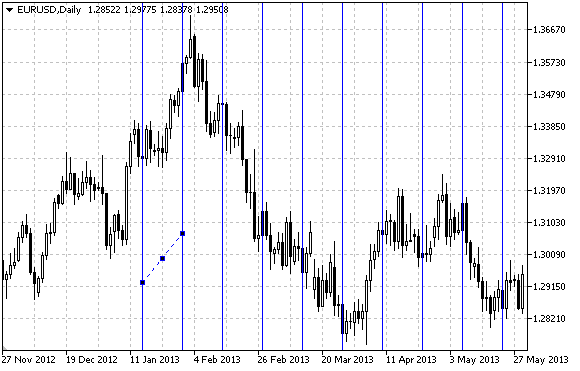

# OBJ_CYCLES

Cycle Lines.



Note

The distance between the lines is set by time coordinates of two anchor points of the object.

Example

The following script creates and moves cycle lines on the chart. Special functions have been developed to create and change graphical object's properties. You can use these functions "as is" in your own applications.

```
//--- description
#property description "Script creates cycle lines on the chart."
#property description "Anchor point coordinates are set in percentage"
#property description "percentage of the chart window size."
//--- display window of the input parameters during the script's launch
#property script_show_inputs
//--- input parameters of the script
input string          InpName="Cycles";   // Object name
input int             InpDate1=10;        // 1 st point's date, %
input int             InpPrice1=45;       // 1 st point's price, %
input int             InpDate2=20;        // 2 nd point's date, %
input int             InpPrice2=55;       // 2 nd point's price, %
input color           InpColor=clrRed;    // Color of cycle lines
input ENUM_LINE_STYLE InpStyle=STYLE_DOT; // Style of cycle lines
input int             InpWidth=1;         // Width of cycle lines
input bool            InpBack=false;      // Background object
input bool            InpSelection=true;  // Highlight to move
input bool            InpHidden=true;     // Hidden in the object list
input long            InpZOrder=0;        // Priority for mouse click
//+------------------------------------------------------------------+
//| Create cycle lines                                               |
//+------------------------------------------------------------------+
bool CyclesCreate(const long            chart_ID=0,        // chart's ID
                  const string          name="Cycles",     // object name
                  const int             sub_window=0,      // subwindow index
                  datetime              time1=0,           // first point time
                  double                price1=0,          // first point price
                  datetime              time2=0,           // second point time
                  double                price2=0,          // second point price
                  const color           clr=clrRed,        // color of cycle lines
                  const ENUM_LINE_STYLE style=STYLE_SOLID, // style of cycle lines
                  const int             width=1,           // width of cycle lines
                  const bool            back=false,        // in the background
                  const bool            selection=true,    // highlight to move
                  const bool            hidden=true,       // hidden in the object list
                  const long            z_order=0)         // priority for mouse click
  {
//--- set anchor points' coordinates if they are not set
   ChangeCyclesEmptyPoints(time1,price1,time2,price2);
//--- reset the error value
   ResetLastError();
//--- create cycle lines by the given coordinates
   if(!ObjectCreate(chart_ID,name,OBJ_CYCLES,sub_window,time1,price1,time2,price2))
     {
      Print(__FUNCTION__,
            ": failed to create cycle lines! Error code = ",GetLastError());
      return(false);
     }
//--- set color of the lines
   ObjectSetInteger(chart_ID,name,OBJPROP_COLOR,clr);
//--- set display style of the lines
   ObjectSetInteger(chart_ID,name,OBJPROP_STYLE,style);
//--- set width of the lines
   ObjectSetInteger(chart_ID,name,OBJPROP_WIDTH,width);
//--- display in the foreground (false) or background (true)
   ObjectSetInteger(chart_ID,name,OBJPROP_BACK,back);
//--- enable (true) or disable (false) the mode of moving the lines by mouse
//--- when creating a graphical object using ObjectCreate function, the object cannot be
//--- highlighted and moved by default. Inside this method, selection parameter
//--- is true by default making it possible to highlight and move the object
   ObjectSetInteger(chart_ID,name,OBJPROP_SELECTABLE,selection);
   ObjectSetInteger(chart_ID,name,OBJPROP_SELECTED,selection);
//--- hide (true) or display (false) graphical object name in the object list
   ObjectSetInteger(chart_ID,name,OBJPROP_HIDDEN,hidden);
//--- set the priority for receiving the event of a mouse click in the chart
   ObjectSetInteger(chart_ID,name,OBJPROP_ZORDER,z_order);
//--- successful execution
   return(true);
  }
//+------------------------------------------------------------------+
//| Move the anchor point                                            |
//+------------------------------------------------------------------+
bool CyclesPointChange(const long   chart_ID=0,    // chart's ID
                       const string name="Cycles", // object name
                       const int    point_index=0, // anchor point index
                       datetime     time=0,        // anchor point time coordinate
                       double       price=0)       // anchor point price coordinate
  {
//--- if point position is not set, move it to the current bar having Bid price
   if(!time)
      time=TimeCurrent();
   if(!price)
      price=SymbolInfoDouble(Symbol(),SYMBOL_BID);
//--- reset the error value
   ResetLastError();
//--- move the anchor point
   if(!ObjectMove(chart_ID,name,point_index,time,price))
     {
      Print(__FUNCTION__,
            ": failed to move the anchor point! Error code = ",GetLastError());
      return(false);
     }
//--- successful execution
   return(true);
  }
//+------------------------------------------------------------------+
//| Delete the cycle lines                                           |
//+------------------------------------------------------------------+
bool CyclesDelete(const long   chart_ID=0,    // chart's ID
                  const string name="Cycles") // object name
  {
//--- reset the error value
   ResetLastError();
//--- delete cycle lines
   if(!ObjectDelete(chart_ID,name))
     {
      Print(__FUNCTION__,
            ": failed to delete cycle lines! Error code = ",GetLastError());
      return(false);
     }
//--- successful execution
   return(true);
  }
//+------------------------------------------------------------------+
//| Check the values of cycle lines' anchor points and set default   |
//| values for empty ones                                            |
//+------------------------------------------------------------------+
void ChangeCyclesEmptyPoints(datetime &time1,double &price1,
                             datetime &time2,double &price2)
  {
//--- if the first point's time is not set, it will be on the current bar
   if(!time1)
      time1=TimeCurrent();
//--- if the first point's price is not set, it will have Bid value
   if(!price1)
      price1=SymbolInfoDouble(Symbol(),SYMBOL_BID);
//--- if the second point's time is not set, it is located 9 bars left from the second one
   if(!time2)
     {
      //--- array for receiving the open time of the last 10 bars
      datetime temp[10];
      CopyTime(Symbol(),Period(),time1,10,temp);
      //--- set the second point 9 bars left from the first one
      time2=temp[0];
     }
//--- if the second point's price is not set, it is equal to the first point's one
   if(!price2)
      price2=price1;
  }
//+------------------------------------------------------------------+
//| Script program start function                                    |
//+------------------------------------------------------------------+
void OnStart()
  {
//--- check correctness of the input parameters
   if(InpDate1<0 || InpDate1>100 || InpPrice1<0 || InpPrice1>100 || 
      InpDate2<0 || InpDate2>100 || InpPrice2<0 || InpPrice2>100)
     {
      Print("Error! Incorrect values of input parameters!");
      return;
     }
//--- number of visible bars in the chart window
   int bars=(int)ChartGetInteger(0,CHART_VISIBLE_BARS);
//--- price array size
   int accuracy=1000;
//--- arrays for storing the date and price values to be used
//--- for setting and changing the coordinates of cycle lines' anchor points
   datetime date[];
   double   price[];
//--- memory allocation
   ArrayResize(date,bars);
   ArrayResize(price,accuracy);
//--- fill the array of dates
   ResetLastError();
   if(CopyTime(Symbol(),Period(),0,bars,date)==-1)
     {
      Print("Failed to copy time values! Error code = ",GetLastError());
      return;
     }
//--- fill the array of prices
//--- find the highest and lowest values of the chart
   double max_price=ChartGetDouble(0,CHART_PRICE_MAX);
   double min_price=ChartGetDouble(0,CHART_PRICE_MIN);
//--- define a change step of a price and fill the array
   double step=(max_price-min_price)/accuracy;
   for(int i=0;i<accuracy;i++)
      price[i]=min_price+i*step;
//--- define points for drawing cycle lines
   int d1=InpDate1*(bars-1)/100;
   int d2=InpDate2*(bars-1)/100;
   int p1=InpPrice1*(accuracy-1)/100;
   int p2=InpPrice2*(accuracy-1)/100;
//--- create a trend line
   if(!CyclesCreate(0,InpName,0,date[d1],price[p1],date[d2],price[p2],InpColor,
      InpStyle,InpWidth,InpBack,InpSelection,InpHidden,InpZOrder))
     {
      return;
     }
//--- redraw the chart and wait for 1 second
   ChartRedraw();
   Sleep(1000);
//--- now, move the anchor points
//--- loop counter
   int h_steps=bars/5;
//--- move the second anchor point
   for(int i=0;i<h_steps;i++)
     {
      //--- use the following value
      if(d2<bars-1)
         d2+=1;
      //--- move the point
      if(!CyclesPointChange(0,InpName,1,date[d2],price[p2]))
         return;
      //--- check if the script's operation has been forcefully disabled
      if(IsStopped())
         return;
      //--- redraw the chart
      ChartRedraw();
      // 0.05 seconds of delay
      Sleep(50);
     }
//--- 1 second of delay
   Sleep(1000);
//--- loop counter
   h_steps=bars/4;
//--- move the first anchor point
   for(int i=0;i<h_steps;i++)
     {
      //--- use the following value
      if(d1<bars-1)
         d1+=1;
      //--- move the point
      if(!CyclesPointChange(0,InpName,0,date[d1],price[p1]))
         return;
      //--- check if the script's operation has been forcefully disabled
      if(IsStopped())
         return;
      //--- redraw the chart
      ChartRedraw();
      // 0.05 seconds of delay
      Sleep(50);
     }
//--- 1 second of delay
   Sleep(1000);
//--- delete the object from the chart
   CyclesDelete(0,InpName);
   ChartRedraw();
//--- 1 second of delay
   Sleep(1000);
//---
  }

```
