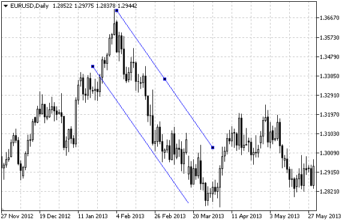

# OBJ_CHANNEL

Equidistant Channel



Note

For an equidistant channel, it is possible to specify the mode of its continuation to the right and/or to the left ([OBJPROP_RAY_RIGHT](/en/docs/constants/objectconstants/enum_object_property#enum_object_property_integer) and [OBJPROP_RAY_LEFT](/en/docs/constants/objectconstants/enum_object_property#enum_object_property_integer) properties accordingly). The mode of filling the channel with color can also be set.

Example

The following script creates and moves an equidistant channel on the chart. Special functions have been developed to create and change graphical object's properties. You can use these functions "as is" in your own applications.

```
//--- description
#property description "Script draws \"Equidistant Channel\" graphical object."
#property description "Anchor point coordinates are set in percentage of the size of"
#property description "the chart window."
//--- display window of the input parameters during the script's launch
#property script_show_inputs
//--- input parameters of the script
input string          InpName="Channel";   // Channel name
input int             InpDate1=25;         // 1 st point's date, %
input int             InpPrice1=60;        // 1 st point's price, %
input int             InpDate2=65;         // 2 nd point's date, %
input int             InpPrice2=80;        // 2 nd point's price, %
input int             InpDate3=30;         // 3 rd point's date, %
input int             InpPrice3=40;        // 3 rd point's price, %
input color           InpColor=clrRed;     // Channel color
input ENUM_LINE_STYLE InpStyle=STYLE_DASH; // Style of channel lines
input int             InpWidth=2;          // Channel line width
input bool            InpBack=false;       // Background channel
input bool            InpFill=false;       // Filling the channel with color
input bool            InpSelection=true;   // Highlight to move
input bool            InpRayLeft=false;    // Channel's continuation to the left
input bool            InpRayRight=false;   // Channel's continuation to the right
input bool            InpHidden=true;      // Hidden in the object list
input long            InpZOrder=0;         // Priority for mouse click
//+------------------------------------------------------------------+
//| Create an equidistant channel by the given coordinates           |
//+------------------------------------------------------------------+
bool ChannelCreate(const long            chart_ID=0,        // chart's ID
                   const string          name="Channel",    // channel name
                   const int             sub_window=0,      // subwindow index 
                   datetime              time1=0,           // first point time
                   double                price1=0,          // first point price
                   datetime              time2=0,           // second point time
                   double                price2=0,          // second point price
                   datetime              time3=0,           // third point time
                   double                price3=0,          // third point price
                   const color           clr=clrRed,        // channel color
                   const ENUM_LINE_STYLE style=STYLE_SOLID, // style of channel lines
                   const int             width=1,           // width of channel lines
                   const bool            fill=false,        // filling the channel with color
                   const bool            back=false,        // in the background
                   const bool            selection=true,    // highlight to move
                   const bool            ray_left=false,    // channel's continuation to the left
                   const bool            ray_right=false,   // channel's continuation to the right
                   const bool            hidden=true,       // hidden in the object list
                   const long            z_order=0)         // priority for mouse click
  {
//--- set anchor points' coordinates if they are not set
   ChangeChannelEmptyPoints(time1,price1,time2,price2,time3,price3);
//--- reset the error value
   ResetLastError();
//--- create a channel by the given coordinates
   if(!ObjectCreate(chart_ID,name,OBJ_CHANNEL,sub_window,time1,price1,time2,price2,time3,price3))
     {
      Print(__FUNCTION__,
            ": failed to create an equidistant channel! Error code = ",GetLastError());
      return(false);
     }
//--- set channel color
   ObjectSetInteger(chart_ID,name,OBJPROP_COLOR,clr);
//--- set style of the channel lines
   ObjectSetInteger(chart_ID,name,OBJPROP_STYLE,style);
//--- set width of the channel lines
   ObjectSetInteger(chart_ID,name,OBJPROP_WIDTH,width);
//--- enable (true) or disable (false) the mode of filling the channel
   ObjectSetInteger(chart_ID,name,OBJPROP_FILL,fill);
//--- display in the foreground (false) or background (true)
   ObjectSetInteger(chart_ID,name,OBJPROP_BACK,back);
//--- enable (true) or disable (false) the mode of highlighting the channel for moving
//--- when creating a graphical object using ObjectCreate function, the object cannot be
//--- highlighted and moved by default. Inside this method, selection parameter
//--- is true by default making it possible to highlight and move the object
   ObjectSetInteger(chart_ID,name,OBJPROP_SELECTABLE,selection);
   ObjectSetInteger(chart_ID,name,OBJPROP_SELECTED,selection);
//--- enable (true) or disable (false) the mode of continuation of the channel's display to the left
   ObjectSetInteger(chart_ID,name,OBJPROP_RAY_LEFT,ray_left);
//--- enable (true) or disable (false) the mode of continuation of the channel's display to the right
   ObjectSetInteger(chart_ID,name,OBJPROP_RAY_RIGHT,ray_right);
//--- hide (true) or display (false) graphical object name in the object list
   ObjectSetInteger(chart_ID,name,OBJPROP_HIDDEN,hidden);
//--- set the priority for receiving the event of a mouse click in the chart
   ObjectSetInteger(chart_ID,name,OBJPROP_ZORDER,z_order);
//--- successful execution
   return(true);
  }
//+------------------------------------------------------------------+
//| Move the channel's anchor point                                  |
//+------------------------------------------------------------------+
bool ChannelPointChange(const long   chart_ID=0,     // chart's ID
                        const string name="Channel", // channel name
                        const int    point_index=0,  // anchor point index
                        datetime     time=0,         // anchor point time coordinate
                        double       price=0)        // anchor point price coordinate
  {
//--- if point position is not set, move it to the current bar having Bid price
   if(!time)
      time=TimeCurrent();
   if(!price)
      price=SymbolInfoDouble(Symbol(),SYMBOL_BID);
//--- reset the error value
   ResetLastError();
//--- move the anchor point
   if(!ObjectMove(chart_ID,name,point_index,time,price))
     {
      Print(__FUNCTION__,
            ": failed to move the anchor point! Error code = ",GetLastError());
      return(false);
     }
//--- successful execution
   return(true);
  }
//+------------------------------------------------------------------+
//| Delete the channel                                               |
//+------------------------------------------------------------------+
bool ChannelDelete(const long   chart_ID=0,     // chart's ID
                   const string name="Channel") // channel name
  {
//--- reset the error value
   ResetLastError();
//--- delete the channel
   if(!ObjectDelete(chart_ID,name))
     {
      Print(__FUNCTION__,
            ": failed to delete the channel! Error code = ",GetLastError());
      return(false);
     }
//--- successful execution
   return(true);
  }
//+-------------------------------------------------------------------------+
//| Check the values of the channel's anchor points and set default values  |
//| for empty ones                                                          |
//+-------------------------------------------------------------------------+
void ChangeChannelEmptyPoints(datetime &time1,double &price1,datetime &time2,
                              double &price2,datetime &time3,double &price3)
  {
//--- if the second (right) point's time is not set, it will be on the current bar
   if(!time2)
      time2=TimeCurrent();
//--- if the second point's price is not set, it will have Bid value
   if(!price2)
      price2=SymbolInfoDouble(Symbol(),SYMBOL_BID);
//--- if the first (left) point's time is not set, it is located 9 bars left from the second one
   if(!time1)
     {
      //--- array for receiving the open time of the last 10 bars
      datetime temp[10];
      CopyTime(Symbol(),Period(),time2,10,temp);
      //--- set the first point 9 bars left from the second one
      time1=temp[0];
     }
//--- if the first point's price is not set, move it 300 points higher than the second one
   if(!price1)
      price1=price2+300*SymbolInfoDouble(Symbol(),SYMBOL_POINT);
//--- if the third point's time is not set, it coincides with the first point's one
   if(!time3)
      time3=time1;
//--- if the third point's price is not set, it is equal to the second point's one
   if(!price3)
      price3=price2;
  }
//+------------------------------------------------------------------+
//| Script program start function                                    |
//+------------------------------------------------------------------+
void OnStart()
  {
//--- check correctness of the input parameters
   if(InpDate1<0 || InpDate1>100 || InpPrice1<0 || InpPrice1>100 || 
      InpDate2<0 || InpDate2>100 || InpPrice2<0 || InpPrice2>100 || 
      InpDate3<0 || InpDate3>100 || InpPrice3<0 || InpPrice3>100)
     {
      Print("Error! Incorrect values of input parameters!");
      return;
     }
//--- number of visible bars in the chart window
   int bars=(int)ChartGetInteger(0,CHART_VISIBLE_BARS);
//--- price array size
   int accuracy=1000;
//--- arrays for storing the date and price values to be used
//--- for setting and changing channel anchor points' coordinates
   datetime date[];
   double   price[];
//--- memory allocation
   ArrayResize(date,bars);
   ArrayResize(price,accuracy);
//--- fill the array of dates
   ResetLastError();
   if(CopyTime(Symbol(),Period(),0,bars,date)==-1)
     {
      Print("Failed to copy time values! Error code = ",GetLastError());
      return;
     }
//--- fill the array of prices
//--- find the highest and lowest values of the chart
   double max_price=ChartGetDouble(0,CHART_PRICE_MAX);
   double min_price=ChartGetDouble(0,CHART_PRICE_MIN);
//--- define a change step of a price and fill the array
   double step=(max_price-min_price)/accuracy;
   for(int i=0;i<accuracy;i++)
      price[i]=min_price+i*step;
//--- define points for drawing the channel
   int d1=InpDate1*(bars-1)/100;
   int d2=InpDate2*(bars-1)/100;
   int d3=InpDate3*(bars-1)/100;
   int p1=InpPrice1*(accuracy-1)/100;
   int p2=InpPrice2*(accuracy-1)/100;
   int p3=InpPrice3*(accuracy-1)/100;
//--- create the equidistant channel
   if(!ChannelCreate(0,InpName,0,date[d1],price[p1],date[d2],price[p2],date[d3],price[p3],InpColor,
      InpStyle,InpWidth,InpFill,InpBack,InpSelection,InpRayLeft,InpRayRight,InpHidden,InpZOrder))
     {
      return;
     }
//--- redraw the chart and wait for 1 second
   ChartRedraw();
   Sleep(1000);
//--- now, move the channel's anchor points
//--- loop counter
   int h_steps=bars/6;
//--- move the second anchor point
   for(int i=0;i<h_steps;i++)
     {
      //--- use the following value
      if(d2<bars-1)
         d2+=1;
      //--- move the point
      if(!ChannelPointChange(0,InpName,1,date[d2],price[p2]))
         return;
      //--- check if the script's operation has been forcefully disabled
      if(IsStopped())
         return;
      //--- redraw the chart
      ChartRedraw();
      // 0.05 seconds of delay
      Sleep(50);
     }
//--- 1 second of delay
   Sleep(1000);
//--- move the first anchor point
   for(int i=0;i<h_steps;i++)
     {
      //--- use the following value
      if(d1>1)
         d1-=1;
      //--- move the point
      if(!ChannelPointChange(0,InpName,0,date[d1],price[p1]))
         return;
      //--- check if the script's operation has been forcefully disabled
      if(IsStopped())
         return;
      //--- redraw the chart
      ChartRedraw();
      // 0.05 seconds of delay
      Sleep(50);
     }
//--- 1 second of delay
   Sleep(1000);
//--- loop counter
   int v_steps=accuracy/10;
//--- move the third anchor point
   for(int i=0;i<v_steps;i++)
     {
      //--- use the following value
      if(p3>1)
         p3-=1;
      //--- move the point
      if(!ChannelPointChange(0,InpName,2,date[d3],price[p3]))
         return;
      //--- check if the script's operation has been forcefully disabled
      if(IsStopped())
         return;
      //--- redraw the chart
      ChartRedraw();
     }
//--- 1 second of delay
   Sleep(1000);
//--- delete the channel from the chart
   ChannelDelete(0,InpName);
   ChartRedraw();
//--- 1 second of delay
   Sleep(1000);
//---
  }

```
