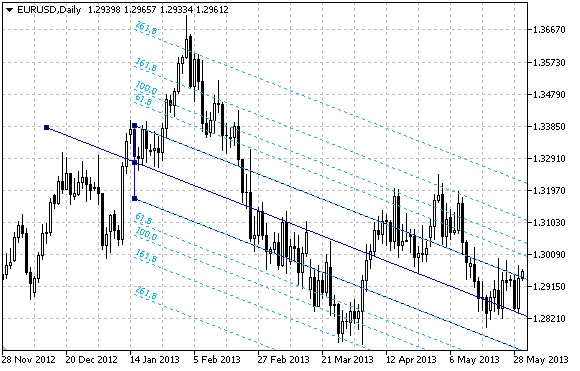

# OBJ_PITCHFORK

Andrews’ Pitchfork.



Note

For Andrews’ Pitchfork, it is possible to specify the mode of continuation of its display to the right and/or left ([OBJPROP_RAY_RIGHT](/en/docs/constants/objectconstants/enum_object_property#enum_object_property_integer) and [OBJPROP_RAY_LEFT](/en/docs/constants/objectconstants/enum_object_property#enum_object_property_integer) properties accordingly).

You can also specify the number of line-levels, their values and color.

Example

The following script creates and moves Andrews’ Pitchfork on the chart. Special functions have been developed to create and change graphical object's properties. You can use these functions "as is" in your own applications.

```
//--- description
#property description "Script draws \"Andrews’ Pitchfork\" graphical object."
#property description "Anchor point coordinates are set in percentage of"
#property description "the chart window size."
//--- display window of the input parameters during the script's launch
#property script_show_inputs
//--- input parameters of the script
input string          InpName="Pitchfork";  // Pitchfork name
input int             InpDate1=14;          // 1 st point's date, %
input int             InpPrice1=40;         // 1 st point's price, %
input int             InpDate2=18;          // 2 nd point's date, %
input int             InpPrice2=50;         // 2 nd point's price, %
input int             InpDate3=18;          // 3 rd point's date, %
input int             InpPrice3=30;         // 3 rd point's price, %
input color           InpColor=clrRed;      // Pitchfork color
input ENUM_LINE_STYLE InpStyle=STYLE_SOLID; // Style of pitchfork lines
input int             InpWidth=1;           // Width of pitchfork lines
input bool            InpBack=false;        // Background pitchfork
input bool            InpSelection=true;    // Highlight to move
input bool            InpRayLeft=false;     // Pitchfork's continuation to the left
input bool            InpRayRight=false;    // Pitchfork's continuation to the right
input bool            InpHidden=true;       // Hidden in the object list
input long            InpZOrder=0;          // Priority for mouse click
//+------------------------------------------------------------------+
//| Create Andrews' Pitchfork by the given coordinates               |
//+------------------------------------------------------------------+
bool PitchforkCreate(const long            chart_ID=0,        // chart's ID
                     const string          name="Pitchfork",  // pitchfork name
                     const int             sub_window=0,      // subwindow index 
                     datetime              time1=0,           // first point time
                     double                price1=0,          // first point price
                     datetime              time2=0,           // second point time
                     double                price2=0,          // second point price
                     datetime              time3=0,           // third point time
                     double                price3=0,          // third point price
                     const color           clr=clrRed,        // color of pitchfork lines
                     const ENUM_LINE_STYLE style=STYLE_SOLID, // style of pitchfork lines
                     const int             width=1,           // width of pitchfork lines
                     const bool            back=false,        // in the background
                     const bool            selection=true,    // highlight to move
                     const bool            ray_left=false,    // pitchfork's continuation to the left
                     const bool            ray_right=false,   // pitchfork's continuation to the right
                     const bool            hidden=true,       // hidden in the object list
                     const long            z_order=0)         // priority for mouse click
  {
//--- set anchor points' coordinates if they are not set
   ChangeChannelEmptyPoints(time1,price1,time2,price2,time3,price3);
//--- reset the error value
   ResetLastError();
//--- create Andrews' Pitchfork by the given coordinates
   if(!ObjectCreate(chart_ID,name,OBJ_PITCHFORK,sub_window,time1,price1,time2,price2,time3,price3))
     {
      Print(__FUNCTION__,
            ": failed to create \"Andrews' Pitchfork\"! Error code = ",GetLastError());
      return(false);
     }
//--- set color
   ObjectSetInteger(chart_ID,name,OBJPROP_COLOR,clr);
//--- set the line style
   ObjectSetInteger(chart_ID,name,OBJPROP_STYLE,style);
//--- set width of the lines
   ObjectSetInteger(chart_ID,name,OBJPROP_WIDTH,width);
//--- display in the foreground (false) or background (true)
   ObjectSetInteger(chart_ID,name,OBJPROP_BACK,back);
//--- enable (true) or disable (false) the mode of highlighting the pitchfork for moving
//--- when creating a graphical object using ObjectCreate function, the object cannot be
//--- highlighted and moved by default. Inside this method, selection parameter
//--- is true by default making it possible to highlight and move the object
   ObjectSetInteger(chart_ID,name,OBJPROP_SELECTABLE,selection);
   ObjectSetInteger(chart_ID,name,OBJPROP_SELECTED,selection);
//--- enable (true) or disable (false) the mode of continuation of the pitchfork's display to the left
   ObjectSetInteger(chart_ID,name,OBJPROP_RAY_LEFT,ray_left);
//--- enable (true) or disable (false) the mode of continuation of the pitchfork's display to the right
   ObjectSetInteger(chart_ID,name,OBJPROP_RAY_RIGHT,ray_right);
//--- hide (true) or display (false) graphical object name in the object list
   ObjectSetInteger(chart_ID,name,OBJPROP_HIDDEN,hidden);
//--- set the priority for receiving the event of a mouse click in the chart
   ObjectSetInteger(chart_ID,name,OBJPROP_ZORDER,z_order);
//--- successful execution
   return(true);
  }
//+------------------------------------------------------------------+
//| Set number of Andrews' Pitchfork levels and their parameters     |
//+------------------------------------------------------------------+
bool PitchforkLevelsSet(int             levels,           // number of level lines
                        double          &values[],        // values of level lines
                        color           &colors[],        // color of level lines
                        ENUM_LINE_STYLE &styles[],        // style of level lines
                        int             &widths[],        // width of level lines
                        const long      chart_ID=0,       // chart's ID
                        const string    name="Pitchfork") // pitchfork name
  {
//--- check array sizes
   if(levels!=ArraySize(colors) || levels!=ArraySize(styles) ||
      levels!=ArraySize(widths) || levels!=ArraySize(widths))
     {
      Print(__FUNCTION__,": array length does not correspond to the number of levels, error!");
      return(false);
     }
//--- set the number of levels
   ObjectSetInteger(chart_ID,name,OBJPROP_LEVELS,levels);
//--- set the properties of levels in the loop
   for(int i=0;i<levels;i++)
     {
      //--- level value
      ObjectSetDouble(chart_ID,name,OBJPROP_LEVELVALUE,i,values[i]);
      //--- level color
      ObjectSetInteger(chart_ID,name,OBJPROP_LEVELCOLOR,i,colors[i]);
      //--- level style
      ObjectSetInteger(chart_ID,name,OBJPROP_LEVELSTYLE,i,styles[i]);
      //--- level width
      ObjectSetInteger(chart_ID,name,OBJPROP_LEVELWIDTH,i,widths[i]);
      //--- level description
      ObjectSetString(chart_ID,name,OBJPROP_LEVELTEXT,i,DoubleToString(100*values[i],1));
     }
//--- successful execution
   return(true);
  }
//+------------------------------------------------------------------+
//| Move Andrews' Pitchfork anchor point                             |
//+------------------------------------------------------------------+
bool PitchforkPointChange(const long   chart_ID=0,       // chart's ID
                          const string name="Pitchfork", // channel name
                          const int    point_index=0,    // anchor point index
                          datetime     time=0,           // anchor point time coordinate
                          double       price=0)          // anchor point price coordinate
  {
//--- if point position is not set, move it to the current bar having Bid price
   if(!time)
      time=TimeCurrent();
   if(!price)
      price=SymbolInfoDouble(Symbol(),SYMBOL_BID);
//--- reset the error value
   ResetLastError();
//--- move the anchor point
   if(!ObjectMove(chart_ID,name,point_index,time,price))
     {
      Print(__FUNCTION__,
            ": failed to move the anchor point! Error code = ",GetLastError());
      return(false);
     }
//--- successful execution
   return(true);
  }
//+------------------------------------------------------------------+
//| Delete Andrews’ Pitchfork                                        |
//+------------------------------------------------------------------+
bool PitchforkDelete(const long   chart_ID=0,       // chart's ID
                     const string name="Pitchfork") // channel name
  {
//--- reset the error value
   ResetLastError();
//--- delete the channel
   if(!ObjectDelete(chart_ID,name))
     {
      Print(__FUNCTION__,
            ": failed to delete \"Andrews' Pitchfork\"! Error code = ",GetLastError());
      return(false);
     }
//--- successful execution
   return(true);
  }
//+----------------------------------------------------------------------+
//| Check the values of Andrews' Pitchfork anchor points and set default |
//| values for empty ones                                                |
//+----------------------------------------------------------------------+
void ChangeChannelEmptyPoints(datetime &time1,double &price1,datetime &time2,
                              double &price2,datetime &time3,double &price3)
  {
//--- if the second (upper right) point's time is not set, it will be on the current bar
   if(!time2)
      time2=TimeCurrent();
//--- if the second point's price is not set, it will have Bid value
   if(!price2)
      price2=SymbolInfoDouble(Symbol(),SYMBOL_BID);
//--- if the first (left) point's time is not set, it is located 9 bars left from the second one
   if(!time1)
     {
      //--- array for receiving the open time of the last 10 bars
      datetime temp[10];
      CopyTime(Symbol(),Period(),time2,10,temp);
      //--- set the first point 9 bars left from the second one
      time1=temp[0];
     }
//--- if the first point's price is not set, move it 200 points below the second one
   if(!price1)
      price1=price2-200*SymbolInfoDouble(Symbol(),SYMBOL_POINT);
//--- if the third point's time is not set, it coincides with the second point's one
   if(!time3)
      time3=time2;
//--- if the third point's price is not set, move it 200 points lower than the first one
   if(!price3)
      price3=price1-200*SymbolInfoDouble(Symbol(),SYMBOL_POINT);
  }
//+------------------------------------------------------------------+
//| Script program start function                                    |
//+------------------------------------------------------------------+
void OnStart()
  {
//--- check correctness of the input parameters
   if(InpDate1<0 || InpDate1>100 || InpPrice1<0 || InpPrice1>100 || 
      InpDate2<0 || InpDate2>100 || InpPrice2<0 || InpPrice2>100 || 
      InpDate3<0 || InpDate3>100 || InpPrice3<0 || InpPrice3>100)
     {
      Print("Error! Incorrect values of input parameters!");
      return;
     }
//--- number of visible bars in the chart window
   int bars=(int)ChartGetInteger(0,CHART_VISIBLE_BARS);
//--- price array size
   int accuracy=1000;
//--- arrays for storing the date and price values to be used
//--- for setting and changing the coordinates of Andrews' Pitchfork anchor points
   datetime date[];
   double   price[];
//--- memory allocation
   ArrayResize(date,bars);
   ArrayResize(price,accuracy);
//--- fill the array of dates
   ResetLastError();
   if(CopyTime(Symbol(),Period(),0,bars,date)==-1)
     {
      Print("Failed to copy time values! Error code = ",GetLastError());
      return;
     }
//--- fill the array of prices
//--- find the highest and lowest values of the chart
   double max_price=ChartGetDouble(0,CHART_PRICE_MAX);
   double min_price=ChartGetDouble(0,CHART_PRICE_MIN);
//--- define a change step of a price and fill the array
   double step=(max_price-min_price)/accuracy;
   for(int i=0;i<accuracy;i++)
      price[i]=min_price+i*step;
//--- define points for drawing Andrews' Pitchfork
   int d1=InpDate1*(bars-1)/100;
   int d2=InpDate2*(bars-1)/100;
   int d3=InpDate3*(bars-1)/100;
   int p1=InpPrice1*(accuracy-1)/100;
   int p2=InpPrice2*(accuracy-1)/100;
   int p3=InpPrice3*(accuracy-1)/100;
//--- create the pitchfork
   if(!PitchforkCreate(0,InpName,0,date[d1],price[p1],date[d2],price[p2],date[d3],price[p3],
      InpColor,InpStyle,InpWidth,InpBack,InpSelection,InpRayLeft,InpRayRight,InpHidden,InpZOrder))
     {
      return;
     }
//--- redraw the chart and wait for 1 second
   ChartRedraw();
   Sleep(1000);
//--- now, move the pitchfork's anchor points
//--- loop counter
   int v_steps=accuracy/10;
//--- move the first anchor point
   for(int i=0;i<v_steps;i++)
     {
      //--- use the following value
      if(p1>1)
         p1-=1;
      //--- move the point
      if(!PitchforkPointChange(0,InpName,0,date[d1],price[p1]))
         return;
      //--- check if the script's operation has been forcefully disabled
      if(IsStopped())
         return;
      //--- redraw the chart
      ChartRedraw();
     }
//--- 1 second of delay
   Sleep(1000);
//--- loop counter
   int h_steps=bars/8;
//--- move the third anchor point
   for(int i=0;i<h_steps;i++)
     {
      //--- use the following value
      if(d3<bars-1)
         d3+=1;
      //--- move the point
      if(!PitchforkPointChange(0,InpName,2,date[d3],price[p3]))
         return;
      //--- check if the script's operation has been forcefully disabled
      if(IsStopped())
         return;
      //--- redraw the chart
      ChartRedraw();
      //--- redraw the chart
      ChartRedraw();
      // 0.05 seconds of delay
      Sleep(50);
     }
//--- 1 second of delay
   Sleep(1000);
//--- loop counter
   v_steps=accuracy/10;
//--- move the second anchor point
   for(int i=0;i<v_steps;i++)
     {
      //--- use the following value
      if(p2>1)
         p2-=1;
      //--- move the point
      if(!PitchforkPointChange(0,InpName,1,date[d2],price[p2]))
         return;
      //--- check if the script's operation has been forcefully disabled
      if(IsStopped())
         return;
      //--- redraw the chart
      ChartRedraw();
     }
//--- 1 second of delay
   Sleep(1000);
//--- delete the pitchfork from the chart
   PitchforkDelete(0,InpName);
   ChartRedraw();
//--- 1 second of delay
   Sleep(1000);
//---
  }

```
