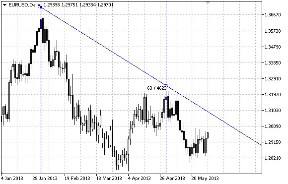

# OBJ_GANNLINE

Gann Line.



Note

For Gann Line, it is possible to specify the mode of continuation of its display to the right and/or left ([OBJPROP_RAY_RIGHT](/en/docs/constants/objectconstants/enum_object_property#enum_object_property_integer) and [OBJPROP_RAY_LEFT](/en/docs/constants/objectconstants/enum_object_property#enum_object_property_integer) properties accordingly).

Both Gann angle with a scale and coordinates of the second anchor point can be used to set the slope of the line.

Example

The following script creates and moves Gann Line on the chart. Special functions have been developed to create and change graphical object's properties. You can use these functions "as is" in your own applications.

```
//--- description
#property description "Script draws \"Gann Line\" graphical object."
#property description "Anchor point coordinates are set in percentage of"
#property description "the chart window size."
//--- display window of the input parameters during the script's launch
#property script_show_inputs
//--- input parameters of the script
input string          InpName="GannLine";        // Line name
input int             InpDate1=20;               // 1 st point's date, %
input int             InpPrice1=75;              // 1 st point's price, %
input int             InpDate2=80;               // 2 nd point's date, %
input double          InpAngle=0.0;              // Gann Angle
input double          InpScale=1.0;              // Scale
input color           InpColor=clrRed;           // Line color
input ENUM_LINE_STYLE InpStyle=STYLE_DASHDOTDOT; // Line style
input int             InpWidth=2;                // Line width
input bool            InpBack=false;             // Background line
input bool            InpSelection=true;         // Highlight to move
input bool            InpRayLeft=false;          // Line's continuation to the left
input bool            InpRayRight=true;          // Line's continuation to the right
input bool            InpHidden=true;            // Hidden in the object list
input long            InpZOrder=0;               // Priority for mouse click
//+------------------------------------------------------------------+
//| Create Gann Line by the coordinates, angle and scale             |
//+------------------------------------------------------------------+
bool GannLineCreate(const long            chart_ID=0,        // chart's ID
                    const string          name="GannLine",   // line name
                    const int             sub_window=0,      // subwindow index
                    datetime              time1=0,           // first point time
                    double                price1=0,          // first point price
                    datetime              time2=0,           // second point time
                    const double          angle=1.0,         // Gann angle
                    const double          scale=1.0,         // scale
                    const color           clr=clrRed,        // line color
                    const ENUM_LINE_STYLE style=STYLE_SOLID, // line style
                    const int             width=1,           // line width
                    const bool            back=false,        // in the background
                    const bool            selection=true,    // highlight to move
                    const bool            ray_left=false,    // line's continuation to the left
                    const bool            ray_right=true,    // line's continuation to the right
                    const bool            hidden=true,       // hidden in the object list
                    const long            z_order=0)         // priority for mouse click
  {
//--- set anchor points' coordinates if they are not set
   ChangeGannLineEmptyPoints(time1,price1,time2);
//--- reset the error value
   ResetLastError();
//--- create Gann Line by the given coordinates
//--- correct coordinate of the second anchor point is redefined
//--- automatically after Gann angle and/or the scale changes,
   if(!ObjectCreate(chart_ID,name,OBJ_GANNLINE,sub_window,time1,price1,time2,0))
     {
      Print(__FUNCTION__,
            ": failed to create \"Gann Line\"! Error code = ",GetLastError());
      return(false);
     }
//--- change Gann angle
   ObjectSetDouble(chart_ID,name,OBJPROP_ANGLE,angle);
//--- change the scale (number of pips per bar)
   ObjectSetDouble(chart_ID,name,OBJPROP_SCALE,scale);
//--- set line color
   ObjectSetInteger(chart_ID,name,OBJPROP_COLOR,clr);
//--- set line display style
   ObjectSetInteger(chart_ID,name,OBJPROP_STYLE,style);
//--- set line width
   ObjectSetInteger(chart_ID,name,OBJPROP_WIDTH,width);
//--- display in the foreground (false) or background (true)
   ObjectSetInteger(chart_ID,name,OBJPROP_BACK,back);
//--- enable (true) or disable (false) the mode of highlighting the lines for moving
//--- when creating a graphical object using ObjectCreate function, the object cannot be
//--- highlighted and moved by default. Inside this method, selection parameter
//--- is true by default making it possible to highlight and move the object
   ObjectSetInteger(chart_ID,name,OBJPROP_SELECTABLE,selection);
   ObjectSetInteger(chart_ID,name,OBJPROP_SELECTED,selection);
//--- enable (true) or disable (false) the mode of continuation of the line's display to the left
   ObjectSetInteger(chart_ID,name,OBJPROP_RAY_LEFT,ray_left);
//--- enable (true) or disable (false) the mode of continuation of the line's display to the right
   ObjectSetInteger(chart_ID,name,OBJPROP_RAY_RIGHT,ray_right);
//--- hide (true) or display (false) graphical object name in the object list
   ObjectSetInteger(chart_ID,name,OBJPROP_HIDDEN,hidden);
//--- set the priority for receiving the event of a mouse click in the chart
   ObjectSetInteger(chart_ID,name,OBJPROP_ZORDER,z_order);
//--- successful execution
   return(true);
  }
//+------------------------------------------------------------------+
//| Move Gann Line anchor point                                      |
//+------------------------------------------------------------------+
bool GannLinePointChange(const long   chart_ID=0,      // chart's ID
                         const string name="GannLine", // line name
                         const int    point_index=0,   // anchor point index
                         datetime     time=0,          // anchor point time coordinate
                         double       price=0)         // anchor point price coordinate
  {
//--- if point position is not set, move it to the current bar having Bid price
   if(!time)
      time=TimeCurrent();
   if(!price)
      price=SymbolInfoDouble(Symbol(),SYMBOL_BID);
//--- reset the error value
   ResetLastError();
//--- move the line's anchor point
   if(!ObjectMove(chart_ID,name,point_index,time,price))
     {
      Print(__FUNCTION__,
            ": failed to move the anchor point! Error code = ",GetLastError());
      return(false);
     }
//--- successful execution
   return(true);
  }
//+------------------------------------------------------------------+
//| Change Gann angle                                                |
//+------------------------------------------------------------------+
bool GannLineAngleChange(const long   chart_ID=0,      // chart's ID
                         const string name="GannLine", // line name
                         const double angle=1.0)       // Gann angle
  {
//--- reset the error value
   ResetLastError();
//--- change Gann angle
   if(!ObjectSetDouble(chart_ID,name,OBJPROP_ANGLE,angle))
     {
      Print(__FUNCTION__,
            ": failed to change Gann angle! Error code = ",GetLastError());
      return(false);
     }
//--- successful execution
   return(true);
  }
//+------------------------------------------------------------------+
//| Change Gann Line's scale                                         |
//+------------------------------------------------------------------+
bool GannLineScaleChange(const long   chart_ID=0,      // chart's ID
                         const string name="GannLine", // line name
                         const double scale=1.0)       // scale
  {
//--- reset the error value
   ResetLastError();
//--- change the scale (number of pips per bar)
   if(!ObjectSetDouble(chart_ID,name,OBJPROP_SCALE,scale))
     {
      Print(__FUNCTION__,
            ": failed to change the scale! Error code = ",GetLastError());
      return(false);
     }
//--- successful execution
   return(true);
  }
//+------------------------------------------------------------------+
//| The function removes Gann Line from the chart                    |
//+------------------------------------------------------------------+
bool GannLineDelete(const long   chart_ID=0,      // chart's ID
                    const string name="GannLine") // line name
  {
//--- reset the error value
   ResetLastError();
//--- delete Gann line
   if(!ObjectDelete(chart_ID,name))
     {
      Print(__FUNCTION__,
            ": failed to delete \"Gann Line\"! Error code = ",GetLastError());
      return(false);
     }
//--- successful execution
   return(true);
  }
//+------------------------------------------------------------------+
//| Check the values of Gann Line anchor points and set default      |
//| values for empty ones                                            |
//+------------------------------------------------------------------+
void ChangeGannLineEmptyPoints(datetime &time1,double &price1,datetime &time2)
  {
//--- if the second point's time is not set, it will be on the current bar
   if(!time2)
      time2=TimeCurrent();
//--- if the first point's time is not set, it is located 9 bars left from the second one
   if(!time1)
     {
      //--- array for receiving the open time of the last 10 bars
      datetime temp[10];
      CopyTime(Symbol(),Period(),time2,10,temp);
      //--- set the first point 9 bars left from the second one
      time1=temp[0];
     }
//--- if the first point's price is not set, it will have Bid value
   if(!price1)
      price1=SymbolInfoDouble(Symbol(),SYMBOL_BID);
  }
//+------------------------------------------------------------------+
//| Script program start function                                    |
//+------------------------------------------------------------------+
void OnStart()
  {
//--- check correctness of the input parameters
   if(InpDate1<0 || InpDate1>100 || InpPrice1<0 || InpPrice1>100 || 
      InpDate2<0 || InpDate2>100)
     {
      Print("Error! Incorrect values of input parameters!");
      return;
     }
//--- number of visible bars in the chart window
   int bars=(int)ChartGetInteger(0,CHART_VISIBLE_BARS);
//--- price array size
   int accuracy=1000;
//--- arrays for storing the date and price values to be used
//--- for setting and changing line anchor points' coordinates
   datetime date[];
   double   price[];
//--- memory allocation
   ArrayResize(date,bars);
   ArrayResize(price,accuracy);
//--- fill the array of dates
   ResetLastError();
   if(CopyTime(Symbol(),Period(),0,bars,date)==-1)
     {
      Print("Failed to copy time values! Error code = ",GetLastError());
      return;
     }
//--- fill the array of prices
//--- find the highest and lowest values of the chart
   double max_price=ChartGetDouble(0,CHART_PRICE_MAX);
   double min_price=ChartGetDouble(0,CHART_PRICE_MIN);
//--- define a change step of a price and fill the array
   double step=(max_price-min_price)/accuracy;
   for(int i=0;i<accuracy;i++)
      price[i]=min_price+i*step;
//--- define points for drawing Gann Line
   int d1=InpDate1*(bars-1)/100;
   int d2=InpDate2*(bars-1)/100;
   int p1=InpPrice1*(accuracy-1)/100;
//--- create Gann Line
   if(!GannLineCreate(0,InpName,0,date[d1],price[p1],date[d2],InpAngle,InpScale,InpColor,
      InpStyle,InpWidth,InpBack,InpSelection,InpRayLeft,InpRayRight,InpHidden,InpZOrder))
     {
      return;
     }
//--- redraw the chart and wait for 1 second
   ChartRedraw();
   Sleep(1000);
//--- now, move the line's anchor point and change the angle
//--- loop counter
   int v_steps=accuracy/2;
//--- move the first anchor point vertically
   for(int i=0;i<v_steps;i++)
     {
      //--- use the following value
      if(p1>1)
         p1-=1;
      //--- move the point
      if(!GannLinePointChange(0,InpName,0,date[d1],price[p1]))
         return;
      //--- check if the script's operation has been forcefully disabled
      if(IsStopped())
         return;
      //--- redraw the chart
      ChartRedraw();
     }
//--- half a second of delay
   Sleep(500);
//--- define the current value of Gann angle (changed
//--- after moving the first anchor point)
   double curr_angle;
   if(!ObjectGetDouble(0,InpName,OBJPROP_ANGLE,0,curr_angle))
      return;
//--- loop counter
   v_steps=accuracy/8;
//--- change Gann angle
   for(int i=0;i<v_steps;i++)
     {
      if(!GannLineAngleChange(0,InpName,curr_angle-0.05*i))
         return;
      //--- check if the script's operation has been forcefully disabled
      if(IsStopped())
         return;
      //--- redraw the chart
      ChartRedraw();
     }
//--- 1 second of delay
   Sleep(1000);
//--- delete the line from the chart
   GannLineDelete(0,InpName);
   ChartRedraw();
//--- 1 second of delay
   Sleep(1000);
//---
  }

```
