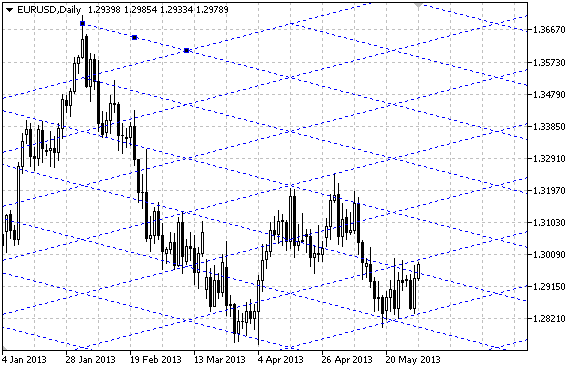

# OBJ_GANNGRID

Gann Grid.



Note

For Gann Grid, it is possible to specify trend type from [ENUM_GANN_DIRECTION](/en/docs/constants/objectconstants/enum_gann_direction). By adjusting the scale value ([OBJPROP_SCALE](/en/docs/constants/objectconstants/enum_object_property#enum_object_property_double)), it is possible to change slope angle of the grid lines.

Example

The following script creates and moves Gann Grid on the chart. Special functions have been developed to create and change graphical object's properties. You can use these functions "as is" in your own applications.

```
//--- description
#property description "Script draws \"Gann Grid\" graphical object."
#property description "Anchor point coordinates of the grid are set in percentage of"
#property description "the chart window size."
//--- display window of the input parameters during the script's launch
#property script_show_inputs
//--- input parameters of the script
input string          InpName="GannGrid";        // Grid name
input int             InpDate1=15;               // 1 st point's date, %
input int             InpPrice1=25;              // 1 st point's price, %
input int             InpDate2=35;               // 2 nd point's date, %
input double          InpScale=3.0;              // Scale
input bool            InpDirection=false;        // Trend direction 
input color           InpColor=clrRed;           // Grid color
input ENUM_LINE_STYLE InpStyle=STYLE_DASHDOTDOT; // Style of grid lines
input int             InpWidth=1;                // Width of fan lines
input bool            InpBack=false;             // Background grid
input bool            InpSelection=true;         // Highlight to move
input bool            InpHidden=true;            // Hidden in the object list
input long            InpZOrder=0;               // Priority for mouse click
//+------------------------------------------------------------------+
//| Create Gann Grid                                                 |
//+------------------------------------------------------------------+
bool GannGridCreate(const long            chart_ID=0,        // chart's ID
                    const string          name="GannGrid",   // grid name
                    const int             sub_window=0,      // subwindow index
                    datetime              time1=0,           // first point time
                    double                price1=0,          // first point price
                    datetime              time2=0,           // second point time
                    const double          scale=1.0,         // scale
                    const bool            direction=true,    // trend direction
                    const color           clr=clrRed,        // grid color
                    const ENUM_LINE_STYLE style=STYLE_SOLID, // style of grid lines
                    const int             width=1,           // width of grid lines
                    const bool            back=false,        // in the background
                    const bool            selection=true,    // highlight to move
                    const bool            hidden=true,       // hidden in the object list
                    const long            z_order=0)         // priority for mouse click
  {
//--- set anchor points' coordinates if they are not set
   ChangeGannGridEmptyPoints(time1,price1,time2);
//--- reset the error value
   ResetLastError();
//--- create Gann Grid by the given coordinates
   if(!ObjectCreate(chart_ID,name,OBJ_GANNGRID,sub_window,time1,price1,time2,0))
     {
      Print(__FUNCTION__,
            ": failed to create \"Gann Grid\"! Error code = ",GetLastError());
      return(false);
     }
//--- change the scale (number of pips per bar)
   ObjectSetDouble(chart_ID,name,OBJPROP_SCALE,scale);
//--- change Gann Fan's trend direction (true - descending, false - ascending)
   ObjectSetInteger(chart_ID,name,OBJPROP_DIRECTION,direction);
//--- set grid color
   ObjectSetInteger(chart_ID,name,OBJPROP_COLOR,clr);
//--- set display style of the grid lines
   ObjectSetInteger(chart_ID,name,OBJPROP_STYLE,style);
//--- set width of the grid lines
   ObjectSetInteger(chart_ID,name,OBJPROP_WIDTH,width);
//--- display in the foreground (false) or background (true)
   ObjectSetInteger(chart_ID,name,OBJPROP_BACK,back);
//--- enable (true) or disable (false) the mode of highlighting the grid for moving
//--- when creating a graphical object using ObjectCreate function, the object cannot be
//--- highlighted and moved by default. Inside this method, selection parameter
//--- is true by default making it possible to highlight and move the object
   ObjectSetInteger(chart_ID,name,OBJPROP_SELECTABLE,selection);
   ObjectSetInteger(chart_ID,name,OBJPROP_SELECTED,selection);
//--- hide (true) or display (false) graphical object name in the object list
   ObjectSetInteger(chart_ID,name,OBJPROP_HIDDEN,hidden);
//--- set the priority for receiving the event of a mouse click in the chart
   ObjectSetInteger(chart_ID,name,OBJPROP_ZORDER,z_order);
//--- successful execution
   return(true);
  }
//+------------------------------------------------------------------+
//| Move Gann Grid anchor point                                      |
//+------------------------------------------------------------------+
bool GannGridPointChange(const long   chart_ID=0,      // chart's ID
                         const string name="GannGrid", // grid name
                         const int    point_index=0,   // anchor point index
                         datetime     time=0,          // anchor point time coordinate
                         double       price=0)         // anchor point price coordinate
  {
//--- if point position is not set, move it to the current bar having Bid price
   if(!time)
      time=TimeCurrent();
   if(!price)
      price=SymbolInfoDouble(Symbol(),SYMBOL_BID);
//--- reset the error value
   ResetLastError();
//--- move the grid's anchor point
   if(!ObjectMove(chart_ID,name,point_index,time,price))
     {
      Print(__FUNCTION__,
            ": failed to move the anchor point! Error code = ",GetLastError());
      return(false);
     }
//--- successful execution
   return(true);
  }
//+------------------------------------------------------------------+
//| Change Gann Grid's scale                                         |
//+------------------------------------------------------------------+
bool GannGridScaleChange(const long   chart_ID=0,      // chart's ID
                         const string name="GannGrid", // grids
                         const double scale=1.0)       // scale
  {
//--- reset the error value
   ResetLastError();
//--- change the scale (number of pips per bar)
   if(!ObjectSetDouble(chart_ID,name,OBJPROP_SCALE,scale))
     {
      Print(__FUNCTION__,
            ": failed to change the scale! Error code = ",GetLastError());
      return(false);
     }
//--- successful execution
   return(true);
  }
//+------------------------------------------------------------------+
//| Change Gann Grid's trend direction                               |
//+------------------------------------------------------------------+
bool GannGridDirectionChange(const long   chart_ID=0,      // chart's ID
                             const string name="GannGrid", // grid name
                             const bool   direction=true)  // trend direction
  {
//--- reset the error value
   ResetLastError();
//--- change Gann Grid's trend direction
   if(!ObjectSetInteger(chart_ID,name,OBJPROP_DIRECTION,direction))
     {
      Print(__FUNCTION__,
            ": failed to change trend direction! Error code = ",GetLastError());
      return(false);
     }
//--- successful execution
   return(true);
  }
//+------------------------------------------------------------------+
//| The function removes Gann Fan from the chart                     |
//+------------------------------------------------------------------+
bool GannGridDelete(const long   chart_ID=0,      // chart's ID
                    const string name="GannGrid") // grid name
  {
//--- reset the error value
   ResetLastError();
//--- delete Gann Grid
   if(!ObjectDelete(chart_ID,name))
     {
      Print(__FUNCTION__,
            ": failed to delete \"Gann Grid\"! Error code = ",GetLastError());
      return(false);
     }
//--- successful execution
   return(true);
  }
//+------------------------------------------------------------------+
//| Check the values of Gann Grid anchor points and set default      |
//| values for empty ones                                            |
//+------------------------------------------------------------------+
void ChangeGannGridEmptyPoints(datetime &time1,double &price1,datetime &time2)
  {
//--- if the second point's time is not set, it will be on the current bar
   if(!time2)
      time2=TimeCurrent();
//--- if the first point's time is not set, it is located 9 bars left from the second one
   if(!time1)
     {
      //--- array for receiving the open time of the last 10 bars
      datetime temp[10];
      CopyTime(Symbol(),Period(),time2,10,temp);
      //--- set the first point 9 bars left from the second one
      time1=temp[0];
     }
//--- if the first point's price is not set, it will have Bid value
   if(!price1)
      price1=SymbolInfoDouble(Symbol(),SYMBOL_BID);
  }
//+------------------------------------------------------------------+
//| Script program start function                                    |
//+------------------------------------------------------------------+
void OnStart()
  {
//--- check correctness of the input parameters
   if(InpDate1<0 || InpDate1>100 || InpPrice1<0 || InpPrice1>100 || 
      InpDate2<0 || InpDate2>100)
     {
      Print("Error! Incorrect values of input parameters!");
      return;
     }
//--- number of visible bars in the chart window
   int bars=(int)ChartGetInteger(0,CHART_VISIBLE_BARS);
//--- price array size
   int accuracy=1000;
//--- arrays for storing the date and price values to be used
//--- for setting and changing grid anchor points' coordinates
   datetime date[];
   double   price[];
//--- memory allocation
   ArrayResize(date,bars);
   ArrayResize(price,accuracy);
//--- fill the array of dates
   ResetLastError();
   if(CopyTime(Symbol(),Period(),0,bars,date)==-1)
     {
      Print("Failed to copy time values! Error code = ",GetLastError());
      return;
     }
//--- fill the array of prices
//--- find the highest and lowest values of the chart
   double max_price=ChartGetDouble(0,CHART_PRICE_MAX);
   double min_price=ChartGetDouble(0,CHART_PRICE_MIN);
//--- define a change step of a price and fill the array
   double step=(max_price-min_price)/accuracy;
   for(int i=0;i<accuracy;i++)
      price[i]=min_price+i*step;
//--- define points for drawing Gann Grid
   int d1=InpDate1*(bars-1)/100;
   int d2=InpDate2*(bars-1)/100;
   int p1=InpPrice1*(accuracy-1)/100;
//--- create Gann Grid
   if(!GannGridCreate(0,InpName,0,date[d1],price[p1],date[d2],InpScale,InpDirection,
      InpColor,InpStyle,InpWidth,InpBack,InpSelection,InpHidden,InpZOrder))
     {
      return;
     }
//--- redraw the chart and wait for 1 second
   ChartRedraw();
   Sleep(1000);
//--- now, move the grid's anchor points
//--- loop counter
   int v_steps=accuracy/4;
//--- move the first anchor point vertically
   for(int i=0;i<v_steps;i++)
     {
      //--- use the following value
      if(p1<accuracy-1)
         p1+=1;
      if(!GannGridPointChange(0,InpName,0,date[d1],price[p1]))
         return;
      //--- check if the script's operation has been forcefully disabled
      if(IsStopped())
         return;
      //--- redraw the chart
      ChartRedraw();
     }
//--- 1 second of delay
   Sleep(1000);
//--- loop counter
   int h_steps=bars/4;
//--- move the second anchor point horizontally
   for(int i=0;i<h_steps;i++)
     {
      //--- use the following value
      if(d2<bars-1)
         d2+=1;
      if(!GannGridPointChange(0,InpName,1,date[d2],0))
         return;
      //--- check if the script's operation has been forcefully disabled
      if(IsStopped())
         return;
      //--- redraw the chart
      ChartRedraw();
      // 0.05 seconds of delay
      Sleep(50);
     }
//--- 1 second of delay
   Sleep(1000);
//--- change grid's trend direction to descending one
   GannGridDirectionChange(0,InpName,true);
//--- redraw the chart
   ChartRedraw();
//--- 1 second of delay
   Sleep(1000);
//--- delete the grid from the chart
   GannGridDelete(0,InpName);
   ChartRedraw();
//--- 1 second of delay
   Sleep(1000);
//---
  }

```
