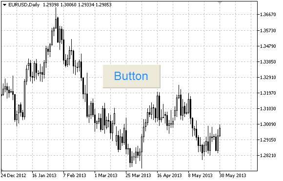

# OBJ_BUTTON

Button object.



Note

Anchor point coordinates are set in pixels. You can select button anchoring corner from [ENUM_BASE_CORNER](/en/docs/constants/objectconstants/enum_basecorner).

Example

The following script creates and moves Button object on the chart. Special functions have been developed to create and change graphical object's properties. You can use these functions "as is" in your own applications.

```
//--- description
#property description "Script creates the button on the chart."
//--- display window of the input parameters during the script's launch
#property script_show_inputs
//--- input parameters of the script
input string           InpName="Button";            // Button name
input ENUM_BASE_CORNER InpCorner=CORNER_LEFT_UPPER; // Chart corner for anchoring
input string           InpFont="Arial";             // Font
input int              InpFontSize=14;              // Font size
input color            InpColor=clrBlack;           // Text color
input color            InpBackColor=C'236,233,216'; // Background color
input color            InpBorderColor=clrNONE;      // Border color
input bool             InpState=false;              // Pressed/Released
input bool             InpBack=false;               // Background object
input bool             InpSelection=false;          // Highlight to move
input bool             InpHidden=true;              // Hidden in the object list
input long             InpZOrder=0;                 // Priority for mouse click
//+------------------------------------------------------------------+
//| Create the button                                                |
//+------------------------------------------------------------------+
bool ButtonCreate(const long              chart_ID=0,               // chart's ID
                  const string            name="Button",            // button name
                  const int               sub_window=0,             // subwindow index
                  const int               x=0,                      // X coordinate
                  const int               y=0,                      // Y coordinate
                  const int               width=50,                 // button width
                  const int               height=18,                // button height
                  const ENUM_BASE_CORNER  corner=CORNER_LEFT_UPPER, // chart corner for anchoring
                  const string            text="Button",            // text
                  const string            font="Arial",             // font
                  const int               font_size=10,             // font size
                  const color             clr=clrBlack,             // text color
                  const color             back_clr=C'236,233,216',  // background color
                  const color             border_clr=clrNONE,       // border color
                  const bool              state=false,              // pressed/released
                  const bool              back=false,               // in the background
                  const bool              selection=false,          // highlight to move
                  const bool              hidden=true,              // hidden in the object list
                  const long              z_order=0)                // priority for mouse click
  {
//--- reset the error value
   ResetLastError();
//--- create the button
   if(!ObjectCreate(chart_ID,name,OBJ_BUTTON,sub_window,0,0))
     {
      Print(__FUNCTION__,
            ": failed to create the button! Error code = ",GetLastError());
      return(false);
     }
//--- set button coordinates
   ObjectSetInteger(chart_ID,name,OBJPROP_XDISTANCE,x);
   ObjectSetInteger(chart_ID,name,OBJPROP_YDISTANCE,y);
//--- set button size
   ObjectSetInteger(chart_ID,name,OBJPROP_XSIZE,width);
   ObjectSetInteger(chart_ID,name,OBJPROP_YSIZE,height);
//--- set the chart's corner, relative to which point coordinates are defined
   ObjectSetInteger(chart_ID,name,OBJPROP_CORNER,corner);
//--- set the text
   ObjectSetString(chart_ID,name,OBJPROP_TEXT,text);
//--- set text font
   ObjectSetString(chart_ID,name,OBJPROP_FONT,font);
//--- set font size
   ObjectSetInteger(chart_ID,name,OBJPROP_FONTSIZE,font_size);
//--- set text color
   ObjectSetInteger(chart_ID,name,OBJPROP_COLOR,clr);
//--- set background color
   ObjectSetInteger(chart_ID,name,OBJPROP_BGCOLOR,back_clr);
//--- set border color
   ObjectSetInteger(chart_ID,name,OBJPROP_BORDER_COLOR,border_clr);
//--- display in the foreground (false) or background (true)
   ObjectSetInteger(chart_ID,name,OBJPROP_BACK,back);
//--- set button state
   ObjectSetInteger(chart_ID,name,OBJPROP_STATE,state);
//--- enable (true) or disable (false) the mode of moving the button by mouse
   ObjectSetInteger(chart_ID,name,OBJPROP_SELECTABLE,selection);
   ObjectSetInteger(chart_ID,name,OBJPROP_SELECTED,selection);
//--- hide (true) or display (false) graphical object name in the object list
   ObjectSetInteger(chart_ID,name,OBJPROP_HIDDEN,hidden);
//--- set the priority for receiving the event of a mouse click in the chart
   ObjectSetInteger(chart_ID,name,OBJPROP_ZORDER,z_order);
//--- successful execution
   return(true);
  }
//+------------------------------------------------------------------+
//| Move the button                                                  |
//+------------------------------------------------------------------+
bool ButtonMove(const long   chart_ID=0,    // chart's ID
                const string name="Button", // button name
                const int    x=0,           // X coordinate
                const int    y=0)           // Y coordinate
  {
//--- reset the error value
   ResetLastError();
//--- move the button
   if(!ObjectSetInteger(chart_ID,name,OBJPROP_XDISTANCE,x))
     {
      Print(__FUNCTION__,
            ": failed to move X coordinate of the button! Error code = ",GetLastError());
      return(false);
     }
   if(!ObjectSetInteger(chart_ID,name,OBJPROP_YDISTANCE,y))
     {
      Print(__FUNCTION__,
            ": failed to move Y coordinate of the button! Error code = ",GetLastError());
      return(false);
     }
//--- successful execution
   return(true);
  }
//+------------------------------------------------------------------+
//| Change button size                                               |
//+------------------------------------------------------------------+
bool ButtonChangeSize(const long   chart_ID=0,    // chart's ID
                      const string name="Button", // button name
                      const int    width=50,      // button width
                      const int    height=18)     // button height
  {
//--- reset the error value
   ResetLastError();
//--- change the button size
   if(!ObjectSetInteger(chart_ID,name,OBJPROP_XSIZE,width))
     {
      Print(__FUNCTION__,
            ": failed to change the button width! Error code = ",GetLastError());
      return(false);
     }
   if(!ObjectSetInteger(chart_ID,name,OBJPROP_YSIZE,height))
     {
      Print(__FUNCTION__,
            ": failed to change the button height! Error code = ",GetLastError());
      return(false);
     }
//--- successful execution
   return(true);
  }
//+------------------------------------------------------------------+
//| Change corner of the chart for binding the button                |
//+------------------------------------------------------------------+
bool ButtonChangeCorner(const long             chart_ID=0,               // chart's ID
                        const string           name="Button",            // button name
                        const ENUM_BASE_CORNER corner=CORNER_LEFT_UPPER) // chart corner for anchoring
  {
//--- reset the error value
   ResetLastError();
//--- change anchor corner
   if(!ObjectSetInteger(chart_ID,name,OBJPROP_CORNER,corner))
     {
      Print(__FUNCTION__,
            ": failed to change the anchor corner! Error code = ",GetLastError());
      return(false);
     }
//--- successful execution
   return(true);
  }
//+------------------------------------------------------------------+
//| Change button text                                               |
//+------------------------------------------------------------------+
bool ButtonTextChange(const long   chart_ID=0,    // chart's ID
                      const string name="Button", // button name
                      const string text="Text")   // text
  {
//--- reset the error value
   ResetLastError();
//--- change object text
   if(!ObjectSetString(chart_ID,name,OBJPROP_TEXT,text))
     {
      Print(__FUNCTION__,
            ": failed to change the text! Error code = ",GetLastError());
      return(false);
     }
//--- successful execution
   return(true);
  }
//+------------------------------------------------------------------+
//| Delete the button                                                |
//+------------------------------------------------------------------+
bool ButtonDelete(const long   chart_ID=0,    // chart's ID
                  const string name="Button") // button name
  {
//--- reset the error value
   ResetLastError();
//--- delete the button
   if(!ObjectDelete(chart_ID,name))
     {
      Print(__FUNCTION__,
            ": failed to delete the button! Error code = ",GetLastError());
      return(false);
     }
//--- successful execution
   return(true);
  }
//+------------------------------------------------------------------+
//| Script program start function                                    |
//+------------------------------------------------------------------+
void OnStart()
  {
//--- chart window size
   long x_distance;
   long y_distance;
//--- set window size
   if(!ChartGetInteger(0,CHART_WIDTH_IN_PIXELS,0,x_distance))
     {
      Print("Failed to get the chart width! Error code = ",GetLastError());
      return;
     }
   if(!ChartGetInteger(0,CHART_HEIGHT_IN_PIXELS,0,y_distance))
     {
      Print("Failed to get the chart height! Error code = ",GetLastError());
      return;
     }
//--- define the step for changing the button size
   int x_step=(int)x_distance/32;
   int y_step=(int)y_distance/32;
//--- set the button coordinates and its size
   int x=(int)x_distance/32;
   int y=(int)y_distance/32;
   int x_size=(int)x_distance*15/16;
   int y_size=(int)y_distance*15/16;
//--- create the button
   if(!ButtonCreate(0,InpName,0,x,y,x_size,y_size,InpCorner,"Press",InpFont,InpFontSize,
      InpColor,InpBackColor,InpBorderColor,InpState,InpBack,InpSelection,InpHidden,InpZOrder))
     {
      return;
     }
//--- redraw the chart
   ChartRedraw();
//--- reduce the button in the loop
   int i=0;
   while(i<13)
     {
      //--- half a second of delay
      Sleep(500);
      //--- switch the button to the pressed state
      ObjectSetInteger(0,InpName,OBJPROP_STATE,true);
      //--- redraw the chart and wait for 0.2 second
      ChartRedraw();
      Sleep(200);
      //--- redefine coordinates and button size
      x+=x_step;
      y+=y_step;
      x_size-=x_step*2;
      y_size-=y_step*2;
      //--- reduce the button
      ButtonMove(0,InpName,x,y);
      ButtonChangeSize(0,InpName,x_size,y_size);
      //--- bring the button back to the released state
      ObjectSetInteger(0,InpName,OBJPROP_STATE,false);
      //--- redraw the chart
      ChartRedraw();
      //--- check if the script's operation has been forcefully disabled
      if(IsStopped())
         return;
      //--- increase the loop counter
      i++;
     }
//--- half a second of delay
   Sleep(500);
//--- delete the button
   ButtonDelete(0,InpName);
   ChartRedraw();
//--- wait for 1 second
   Sleep(1000);
//---
  }

```
