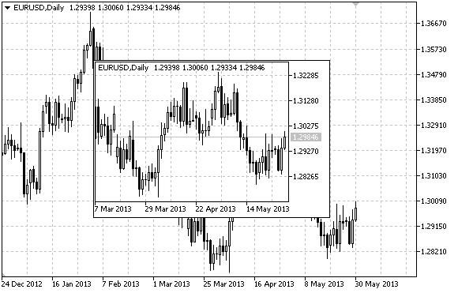

# OBJ_CHART

Chart object.



Note

" OBJ_CHART" type object is not supported (not displayed) during a visual test.

Anchor point coordinates are set in pixels. You can select anchoring corner from [ENUM_BASE_CORNER](/en/docs/constants/objectconstants/enum_basecorner) enumeration.

Symbol, period and scale can be selected for Chart object. Price scale and date display mode can also be enabled/disabled.

Example

The following script creates and moves Chart object on the chart. Special functions have been developed to create and change graphical object's properties. You can use these functions "as is" in your own applications.

```
//--- description
#property description "Script creates \"Chart\" object."
//--- display window of the input parameters during the script's launch
#property script_show_inputs
//--- input parameters of the script
input string           InpName="Chart";             // Object name
input string           InpSymbol="EURUSD";          // Symbol
input ENUM_TIMEFRAMES  InpPeriod=PERIOD_H1;         // Period
input ENUM_BASE_CORNER InpCorner=CORNER_LEFT_UPPER; // Anchoring corner
input int              InpScale=2;                  // Scale
input bool             InpDateScale=true;           // Time scale display
input bool             InpPriceScale=true;          // Price scale display
input color            InpColor=clrRed;             // Border color when highlighted
input ENUM_LINE_STYLE  InpStyle=STYLE_DASHDOTDOT;   // Line style when highlighted
input int              InpPointWidth=1;             // Point size to move
input bool             InpBack=false;               // Background object
input bool             InpSelection=true;           // Highlight to move
input bool             InpHidden=true;              // Hidden in the object list
input long             InpZOrder=0;                 // Priority for mouse click
//+------------------------------------------------------------------+
//| Creating Chart object                                            |
//+------------------------------------------------------------------+
bool ObjectChartCreate(const long              chart_ID=0,               // chart's ID
                       const string            name="Chart",             // object name
                       const int               sub_window=0,             // subwindow index
                       const string            symbol="EURUSD",          // symbol
                       const ENUM_TIMEFRAMES   period=PERIOD_H1,         // period
                       const int               x=0,                      // X coordinate
                       const int               y=0,                      // Y coordinate
                       const int               width=300,                // width
                       const int               height=200,               // height
                       const ENUM_BASE_CORNER  corner=CORNER_LEFT_UPPER, // anchoring corner
                       const int               scale=2,                  // scale
                       const bool              date_scale=true,          // time scale display
                       const bool              price_scale=true,         // price scale display
                       const color             clr=clrRed,               // border color when highlighted
                       const ENUM_LINE_STYLE   style=STYLE_SOLID,        // line style when highlighted
                       const int               point_width=1,            // move point size
                       const bool              back=false,               // in the background
                       const bool              selection=false,          // highlight to move
                       const bool              hidden=true,              // hidden in the object list
                       const long              z_order=0)                // priority for mouse click
  {
//--- reset the error value
   ResetLastError();
//--- create Chart object
   if(!ObjectCreate(chart_ID,name,OBJ_CHART,sub_window,0,0))
     {
      Print(__FUNCTION__,
            ": failed to create \"Chart\" object! Error code = ",GetLastError());
      return(false);
     }
//--- set object coordinates
   ObjectSetInteger(chart_ID,name,OBJPROP_XDISTANCE,x);
   ObjectSetInteger(chart_ID,name,OBJPROP_YDISTANCE,y);
//--- set object size
   ObjectSetInteger(chart_ID,name,OBJPROP_XSIZE,width);
   ObjectSetInteger(chart_ID,name,OBJPROP_YSIZE,height);
//--- set the chart's corner, relative to which point coordinates are defined
   ObjectSetInteger(chart_ID,name,OBJPROP_CORNER,corner);
//--- set the symbol
   ObjectSetString(chart_ID,name,OBJPROP_SYMBOL,symbol);
//--- set the period
   ObjectSetInteger(chart_ID,name,OBJPROP_PERIOD,period);
//--- set the scale
   ObjectSetInteger(chart_ID,name,OBJPROP_CHART_SCALE,scale);
//--- display (true) or hide (false) the time scale
   ObjectSetInteger(chart_ID,name,OBJPROP_DATE_SCALE,date_scale);
//--- display (true) or hide (false) the price scale
   ObjectSetInteger(chart_ID,name,OBJPROP_PRICE_SCALE,price_scale);
//--- set the border color when object highlighting mode is enabled
   ObjectSetInteger(chart_ID,name,OBJPROP_COLOR,clr);
//--- set the border line style when object highlighting mode is enabled
   ObjectSetInteger(chart_ID,name,OBJPROP_STYLE,style);
//--- set a size of the anchor point for moving an object
   ObjectSetInteger(chart_ID,name,OBJPROP_WIDTH,point_width);
//--- display in the foreground (false) or background (true)
   ObjectSetInteger(chart_ID,name,OBJPROP_BACK,back);
//--- enable (true) or disable (false) the mode of moving the label by mouse
   ObjectSetInteger(chart_ID,name,OBJPROP_SELECTABLE,selection);
   ObjectSetInteger(chart_ID,name,OBJPROP_SELECTED,selection);
//--- hide (true) or display (false) graphical object name in the object list
   ObjectSetInteger(chart_ID,name,OBJPROP_HIDDEN,hidden);
//--- set the priority for receiving the event of a mouse click in the chart
   ObjectSetInteger(chart_ID,name,OBJPROP_ZORDER,z_order);
//--- successful execution
   return(true);
  }
//+------------------------------------------------------------------+
//| Sets the symbol and time frame of the Chart object               |
//+------------------------------------------------------------------+
bool ObjectChartSetSymbolAndPeriod(const long            chart_ID=0,       // chart's ID (not Chart object's one)
                                   const string          name="Chart",     // object name
                                   const string          symbol="EURUSD",  // symbol
                                   const ENUM_TIMEFRAMES period=PERIOD_H1) // time frame
  {
//--- reset the error value
   ResetLastError();
//--- set Chart object's symbol and time frame
   if(!ObjectSetString(chart_ID,name,OBJPROP_SYMBOL,symbol))
     {
      Print(__FUNCTION__,
            ": failed to set a symbol for \"Chart\" object! Error code = ",GetLastError());
      return(false);
     }
   if(!ObjectSetInteger(chart_ID,name,OBJPROP_PERIOD,period))
     {
      Print(__FUNCTION__,
            ": failed to set a period for \"Chart\" object! Error code = ",GetLastError());
      return(false);
     }
//--- successful execution
   return(true);
  }
//+------------------------------------------------------------------+
//| Move Chart object                                                |
//+------------------------------------------------------------------+
bool ObjectChartMove(const long   chart_ID=0,   // chart's ID (not Chart object's one)
                     const string name="Chart", // object name
                     const int    x=0,          // X coordinate
                     const int    y=0)          // Y coordinate
  {
//--- reset the error value
   ResetLastError();
//--- move the object
   if(!ObjectSetInteger(chart_ID,name,OBJPROP_XDISTANCE,x))
     {
      Print(__FUNCTION__,
            ": failed to move X coordinate of \"Chart\" object! Error code = ",GetLastError());
      return(false);
     }
   if(!ObjectSetInteger(chart_ID,name,OBJPROP_YDISTANCE,y))
     {
      Print(__FUNCTION__,
            ": failed to move Y coordinate of \"Chart\" object! Error code = ",GetLastError());
      return(false);
     }
//--- successful execution
   return(true);
  }
//+------------------------------------------------------------------+
//| Change Chart object size                                         |
//+------------------------------------------------------------------+
bool ObjectChartChangeSize(const long   chart_ID=0,   // chart's ID (not Chart object's one)
                           const string name="Chart", // object name
                           const int    width=300,    // width
                           const int    height=200)   // height
  {
//--- reset the error value
   ResetLastError();
//--- change the object size
   if(!ObjectSetInteger(chart_ID,name,OBJPROP_XSIZE,width))
     {
      Print(__FUNCTION__,
            ": failed to change the width of \"Chart\" object! Error code = ",GetLastError());
      return(false);
     }
   if(!ObjectSetInteger(chart_ID,name,OBJPROP_YSIZE,height))
     {
      Print(__FUNCTION__,
            ": failed to change the height of \"Chart\" object! Error code = ",GetLastError());
      return(false);
     }
//--- successful execution
   return(true);
  }
//+------------------------------------------------------------------+
//| Return Chart object's ID                                         |
//+------------------------------------------------------------------+
long ObjectChartGetID(const long   chart_ID=0,   // chart's ID (not Chart object's one)
                      const string name="Chart") // object name
  {
//--- prepare the variable to get Chart object's ID
   long id=-1;
//--- reset the error value
   ResetLastError();
//--- get ID
   if(!ObjectGetInteger(chart_ID,name,OBJPROP_CHART_ID,0,id))
     {
      Print(__FUNCTION__,
            ": failed to get \"Chart\" object's ID! Error code = ",GetLastError());
     }
//--- return the result
   return(id);
  }
//+------------------------------------------------------------------+
//| Delete Chart object                                              |
//+------------------------------------------------------------------+
bool ObjectChartDelete(const long   chart_ID=0,   // chart's ID (not Chart object's one)
                       const string name="Chart") // object name
  {
//--- reset the error value
   ResetLastError();
//--- delete the button
   if(!ObjectDelete(chart_ID,name))
     {
      Print(__FUNCTION__,
            ": failed to delete \"Chart\" object! Error code = ",GetLastError());
      return(false);
     }
//--- successful execution
   return(true);
  }
//+------------------------------------------------------------------+
//| Script program start function                                    |
//+------------------------------------------------------------------+
void OnStart()
  {
//--- get the number of symbols in Market Watch
   int  symbols=SymbolsTotal(true);
//--- check if the symbol with a specified name is present in the symbol list
   bool exist=false;
   for(int i=0;i<symbols;i++)
      if(InpSymbol==SymbolName(i,true))
        {
         exist=true;
         break;
        }
   if(!exist)
     {
      Print("Error! ",InpSymbol," symbol is not present in \"Market Watch\"!");
      return;
     }
//--- check validity of input parameters
   if(InpScale<0 || InpScale>5)
     {
      Print("Error! Incorrect values of input parameters!");
      return;
     }
 
//--- chart window size
   long x_distance;
   long y_distance;
//--- set window size
   if(!ChartGetInteger(0,CHART_WIDTH_IN_PIXELS,0,x_distance))
     {
      Print("Failed to get the chart width! Error code = ",GetLastError());
      return;
     }
   if(!ChartGetInteger(0,CHART_HEIGHT_IN_PIXELS,0,y_distance))
     {
      Print("Failed to get the chart height! Error code = ",GetLastError());
      return;
     }
//--- set Chart object coordinates and its size
   int x=(int)x_distance/16;
   int y=(int)y_distance/16;
   int x_size=(int)x_distance*7/16;
   int y_size=(int)y_distance*7/16;
//--- create Chart object
   if(!ObjectChartCreate(0,InpName,0,InpSymbol,InpPeriod,x,y,x_size,y_size,InpCorner,InpScale,InpDateScale,
      InpPriceScale,InpColor,InpStyle,InpPointWidth,InpBack,InpSelection,InpHidden,InpZOrder))
     {
      return;
     }
//--- redraw the chart and wait for 1 second
   ChartRedraw();
   Sleep(1000);
//--- stretch Chart object
   int steps=(int)MathMin(x_distance*7/16,y_distance*7/16);
   for(int i=0;i<steps;i++)
     {
      //--- resize
      x_size+=1;
      y_size+=1;
      if(!ObjectChartChangeSize(0,InpName,x_size,y_size))
         return;
      //--- check if the script's operation has been forcefully disabled
      if(IsStopped())
         return;
      //--- redraw the chart and wait for 0.01 seconds
      ChartRedraw();
      Sleep(10);
     }
//--- half a second of delay
   Sleep(500);
//--- change chart's time frame
   if(!ObjectChartSetSymbolAndPeriod(0,InpName,InpSymbol,PERIOD_M1))
      return;
   ChartRedraw();
//--- three seconds of delay
   Sleep(3000);
//--- delete the object
   ObjectChartDelete(0,InpName);
   ChartRedraw();
//--- wait for 1 second
   Sleep(1000);
//---
  }

```
