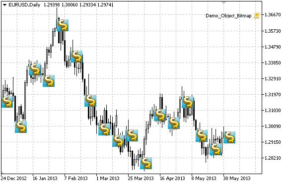

# OBJ_BITMAP

Bitmap object.



Note

For Bitmap object, you can select [visibility scope](/en/docs/constants/objectconstants/enum_object_property#visual_rectangle) of an image.

Example

The following script creates several bitmaps on the chart. Special functions have been developed to create and change graphical object's properties. You can use these functions "as is" in your own applications.

```
//--- description
#property description "Script creates a bitmap in the chart window."
//--- display window of the input parameters during the script's launch
#property script_show_inputs
//--- input parameters of the script
input string          InpFile="\\Images\\dollar.bmp"; // Bitmap file name
input int             InpWidth=24;                    // Visibility scope X coordinate
input int             InpHeight=24;                   // Visibility scope Y coordinate
input int             InpXOffset=4;                   // Visibility scope shift by X axis
input int             InpYOffset=4;                   // Visibility scope shift by Y axis
input color           InpColor=clrRed;                // Border color when highlighted
input ENUM_LINE_STYLE InpStyle=STYLE_SOLID;           // Line style when highlighted
input int             InpPointWidth=1;                // Point size to move
input bool            InpBack=false;                  // Background object
input bool            InpSelection=false;             // Highlight to move
input bool            InpHidden=true;                 // Hidden in the object list
input long            InpZOrder=0;                    // Priority for mouse click
//+------------------------------------------------------------------+
//| Create a bitmap in the chart window                              |
//+------------------------------------------------------------------+
bool BitmapCreate(const long            chart_ID=0,        // chart's ID
                  const string          name="Bitmap",     // bitmap name
                  const int             sub_window=0,      // subwindow index
                  datetime              time=0,            // anchor point time
                  double                price=0,           // anchor point price
                  const string          file="",           // bitmap file name
                  const int             width=10,          // visibility scope X coordinate
                  const int             height=10,         // visibility scope Y coordinate
                  const int             x_offset=0,        // visibility scope shift by X axis
                  const int             y_offset=0,        // visibility scope shift by Y axis
                  const color           clr=clrRed,        // border color when highlighted
                  const ENUM_LINE_STYLE style=STYLE_SOLID, // line style when highlighted
                  const int             point_width=1,     // move point size
                  const bool            back=false,        // in the background
                  const bool            selection=false,   // highlight to move
                  const bool            hidden=true,       // hidden in the object list
                  const long            z_order=0)         // priority for mouse click
  {
//--- set anchor point coordinates if they are not set
   ChangeBitmapEmptyPoint(time,price);
//--- reset the error value
   ResetLastError();
//--- create a bitmap
   if(!ObjectCreate(chart_ID,name,OBJ_BITMAP,sub_window,time,price))
     {
      Print(__FUNCTION__,
            ": failed to create a bitmap in the chart window! Error code = ",GetLastError());
      return(false);
     }
//--- set the path to the image file
   if(!ObjectSetString(chart_ID,name,OBJPROP_BMPFILE,file))
     {
      Print(__FUNCTION__,
            ": failed to load the image! Error code = ",GetLastError());
      return(false);
     }
//--- set visibility scope for the image; if width or height values
//--- exceed the width and height (respectively) of a source image,
//--- it is not drawn; in the opposite case,
//--- only the part corresponding to these values is drawn
   ObjectSetInteger(chart_ID,name,OBJPROP_XSIZE,width);
   ObjectSetInteger(chart_ID,name,OBJPROP_YSIZE,height);
//--- set the part of an image that is to be displayed in the visibility scope
//--- the default part is the upper left area of an image; the values allow
//--- performing a shift from this area displaying another part of the image
   ObjectSetInteger(chart_ID,name,OBJPROP_XOFFSET,x_offset);
   ObjectSetInteger(chart_ID,name,OBJPROP_YOFFSET,y_offset);
//--- set the border color when object highlighting mode is enabled
   ObjectSetInteger(chart_ID,name,OBJPROP_COLOR,clr);
//--- set the border line style when object highlighting mode is enabled
   ObjectSetInteger(chart_ID,name,OBJPROP_STYLE,style);
//--- set a size of the anchor point for moving an object
   ObjectSetInteger(chart_ID,name,OBJPROP_WIDTH,point_width);
//--- display in the foreground (false) or background (true)
   ObjectSetInteger(chart_ID,name,OBJPROP_BACK,back);
//--- enable (true) or disable (false) the mode of moving the label by mouse
   ObjectSetInteger(chart_ID,name,OBJPROP_SELECTABLE,selection);
   ObjectSetInteger(chart_ID,name,OBJPROP_SELECTED,selection);
//--- hide (true) or display (false) graphical object name in the object list
   ObjectSetInteger(chart_ID,name,OBJPROP_HIDDEN,hidden);
//--- set the priority for receiving the event of a mouse click in the chart
   ObjectSetInteger(chart_ID,name,OBJPROP_ZORDER,z_order);
//--- successful execution
   return(true);
  }
//+------------------------------------------------------------------+
//| Set a new image for the bitmap                                   |
//+------------------------------------------------------------------+
bool BitmapSetImage(const long   chart_ID=0,    // chart's ID
                    const string name="Bitmap", // bitmap name
                    const string file="")       // path to the file
  {
//--- reset the error value
   ResetLastError();
//--- set the path to the image file
   if(!ObjectSetString(chart_ID,name,OBJPROP_BMPFILE,file))
     {
      Print(__FUNCTION__,
            ": failed to load the image! Error code = ",GetLastError());
      return(false);
     }
//--- successful execution
   return(true);
  }
//+------------------------------------------------------------------+
//| Move a bitmap in the chart window                                |
//+------------------------------------------------------------------+
bool BitmapMove(const long   chart_ID=0,    // chart's ID
                const string name="Bitmap", // bitmap name
                datetime     time=0,        // anchor point time
                double       price=0)       // anchor point price
  {
//--- if point position is not set, move it to the current bar having Bid price
   if(!time)
      time=TimeCurrent();
   if(!price)
      price=SymbolInfoDouble(Symbol(),SYMBOL_BID);
//--- reset the error value
   ResetLastError();
//--- move the anchor point
   if(!ObjectMove(chart_ID,name,0,time,price))
     {
      Print(__FUNCTION__,
            ": failed to move the anchor point! Error code = ",GetLastError());
      return(false);
     }
//--- successful execution
   return(true);
  }
//+------------------------------------------------------------------+
//| Change visibility scope (bitmap) size                            |
//+------------------------------------------------------------------+
bool BitmapChangeSize(const long   chart_ID=0,    // chart's ID
                      const string name="Bitmap", // bitmap name
                      const int    width=0,       // bitmap width
                      const int    height=0)      // bitmap height
  {
//--- reset the error value
   ResetLastError();
//--- change bitmap size
   if(!ObjectSetInteger(chart_ID,name,OBJPROP_XSIZE,width))
     {
      Print(__FUNCTION__,
            ": failed to change the bitmap width! Error code = ",GetLastError());
      return(false);
     }
   if(!ObjectSetInteger(chart_ID,name,OBJPROP_YSIZE,height))
     {
      Print(__FUNCTION__,
            ": failed to change the bitmap height! Error code = ",GetLastError());
      return(false);
     }
//--- successful execution
   return(true);
  }
//+--------------------------------------------------------------------+
//| Change coordinate of the upper left corner of the visibility scope |
//+--------------------------------------------------------------------+
bool BitmapMoveVisibleArea(const long   chart_ID=0,    // chart's ID
                           const string name="Bitmap", // bitmap name
                           const int    x_offset=0,    // visibility scope X coordinate
                           const int    y_offset=0)    // visibility scope Y coordinate
  {
//--- reset the error value
   ResetLastError();
//--- change the bitmap's visibility scope coordinates
   if(!ObjectSetInteger(chart_ID,name,OBJPROP_XOFFSET,x_offset))
     {
      Print(__FUNCTION__,
            ": failed to change X coordinate of the visibility scope! Error code = ",GetLastError());
      return(false);
     }
   if(!ObjectSetInteger(chart_ID,name,OBJPROP_YOFFSET,y_offset))
     {
      Print(__FUNCTION__,
            ": failed to change Y coordinate of the visibility scope! Error code = ",GetLastError());
      return(false);
     }
//--- successful execution
   return(true);
  }
//+------------------------------------------------------------------+
//| Delete a bitmap                                                  |
//+------------------------------------------------------------------+
bool BitmapDelete(const long   chart_ID=0,    // chart's ID
                  const string name="Bitmap") // bitmap name
  {
//--- reset the error value
   ResetLastError();
//--- delete the label
   if(!ObjectDelete(chart_ID,name))
     {
      Print(__FUNCTION__,
            ": failed to delete a bitmap! Error code = ",GetLastError());
      return(false);
     }
//--- successful execution
   return(true);
  }
//+------------------------------------------------------------------+
//| Check anchor point values and set default values                 |
//| for empty ones                                                   |
//+------------------------------------------------------------------+
void ChangeBitmapEmptyPoint(datetime &time,double &price)
  {
//--- if the point's time is not set, it will be on the current bar
   if(!time)
      time=TimeCurrent();
//--- if the point's price is not set, it will have Bid value
   if(!price)
      price=SymbolInfoDouble(Symbol(),SYMBOL_BID);
  }
//+------------------------------------------------------------------+
//| Script program start function                                    |
//+------------------------------------------------------------------+
void OnStart()
  {
   datetime date[];  // array for storing dates of visible bars
   double   close[]; // array for storing Close prices
//--- bitmap file name
   string   file="\\Images\\dollar.bmp";
//--- number of visible bars in the chart window
   int bars=(int)ChartGetInteger(0,CHART_VISIBLE_BARS);
//--- memory allocation
   ArrayResize(date,bars);
   ArrayResize(close,bars);
//--- fill the array of dates
   ResetLastError();
   if(CopyTime(Symbol(),Period(),0,bars,date)==-1)
     {
      Print("Failed to copy time values! Error code = ",GetLastError());
      return;
     }
//--- fill the array of Close prices
   if(CopyClose(Symbol(),Period(),0,bars,close)==-1)
     {
      Print("Failed to copy the values of Close prices! Error code = ",GetLastError());
      return;
     }
//--- define how often the images should be displayed
   int scale=(int)ChartGetInteger(0,CHART_SCALE);
//--- define the step
   int step=1;
   switch(scale)
     {
      case 0:
         step=27;
         break;
      case 1:
         step=14;
         break;
      case 2:
         step=7;
         break;
      case 3:
         step=4;
         break;
      case 4:
         step=2;
         break;
     }
//--- create bitmaps for High and Low bars' values (with gaps)
   for(int i=0;i<bars;i+=step)
     {
      //--- create the bitmaps
      if(!BitmapCreate(0,"Bitmap_"+(string)i,0,date[i],close[i],InpFile,InpWidth,InpHeight,InpXOffset,
         InpYOffset,InpColor,InpStyle,InpPointWidth,InpBack,InpSelection,InpHidden,InpZOrder))
        {
         return;
        }
      //--- check if the script's operation has been forcefully disabled
      if(IsStopped())
         return;
      //--- redraw the chart
      ChartRedraw();
      // 0.05 seconds of delay
      Sleep(50);
     }
//--- half a second of delay
   Sleep(500);
//--- delete Sell signs
   for(int i=0;i<bars;i+=step)
     {
      if(!BitmapDelete(0,"Bitmap_"+(string)i))
         return;
      if(!BitmapDelete(0,"Bitmap_"+(string)i))
         return;
      //--- redraw the chart
      ChartRedraw();
      // 0.05 seconds of delay
      Sleep(50);
     }
//---
  }

```
