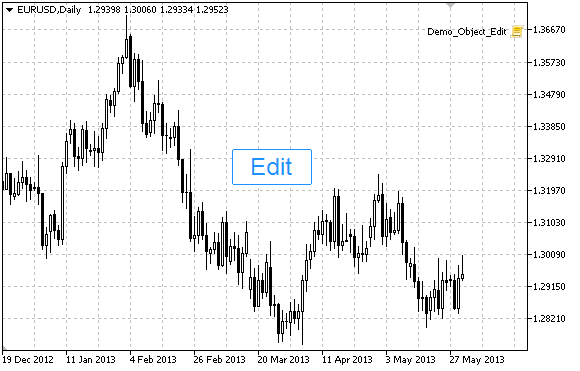

# OBJ_EDIT

Edit object.



Note

Anchor point coordinates are set in pixels. You can select Edit anchoring corner from [ENUM_BASE_CORNER](/en/docs/constants/objectconstants/enum_basecorner) enumeration.

You can also select one of the text alignment types inside Edit from [ENUM_ALIGN_MODE](/en/docs/constants/objectconstants/enum_object_property#enum_align_mode) enumeration.

Example

The following script creates and moves Edit object on the chart. Special functions have been developed to create and change graphical object's properties. You can use these functions "as is" in your own applications.

```
//--- description
#property description "Script creates \"Edit\" object."
//--- display window of the input parameters during the script's launch
#property script_show_inputs
//--- input parameters of the script
input string           InpName="Edit";              // Object name
input string           InpText="Text";              // Object text
input string           InpFont="Arial";             // Font
input int              InpFontSize=14;              // Font size
input ENUM_ALIGN_MODE  InpAlign=ALIGN_CENTER;       // Text alignment type
input bool             InpReadOnly=false;           // Permission to edit
input ENUM_BASE_CORNER InpCorner=CORNER_LEFT_UPPER; // Chart corner for anchoring
input color            InpColor=clrBlack;           // Text color
input color            InpBackColor=clrWhite;       // Background color
input color            InpBorderColor=clrBlack;     // Border color
input bool             InpBack=false;               // Background object
input bool             InpSelection=false;          // Highlight to move
input bool             InpHidden=true;              // Hidden in the object list
input long             InpZOrder=0;                 // Priority for mouse click
//+------------------------------------------------------------------+
//| Create Edit object                                               |
//+------------------------------------------------------------------+
bool EditCreate(const long             chart_ID=0,               // chart's ID
                const string           name="Edit",              // object name
                const int              sub_window=0,             // subwindow index
                const int              x=0,                      // X coordinate
                const int              y=0,                      // Y coordinate
                const int              width=50,                 // width
                const int              height=18,                // height
                const string           text="Text",              // text
                const string           font="Arial",             // font
                const int              font_size=10,             // font size
                const ENUM_ALIGN_MODE  align=ALIGN_CENTER,       // alignment type
                const bool             read_only=false,          // ability to edit
                const ENUM_BASE_CORNER corner=CORNER_LEFT_UPPER, // chart corner for anchoring
                const color            clr=clrBlack,             // text color
                const color            back_clr=clrWhite,        // background color
                const color            border_clr=clrNONE,       // border color
                const bool             back=false,               // in the background
                const bool             selection=false,          // highlight to move
                const bool             hidden=true,              // hidden in the object list
                const long             z_order=0)                // priority for mouse click
  {
//--- reset the error value
   ResetLastError();
//--- create edit field
   if(!ObjectCreate(chart_ID,name,OBJ_EDIT,sub_window,0,0))
     {
      Print(__FUNCTION__,
            ": failed to create \"Edit\" object! Error code = ",GetLastError());
      return(false);
     }
//--- set object coordinates
   ObjectSetInteger(chart_ID,name,OBJPROP_XDISTANCE,x);
   ObjectSetInteger(chart_ID,name,OBJPROP_YDISTANCE,y);
//--- set object size
   ObjectSetInteger(chart_ID,name,OBJPROP_XSIZE,width);
   ObjectSetInteger(chart_ID,name,OBJPROP_YSIZE,height);
//--- set the text
   ObjectSetString(chart_ID,name,OBJPROP_TEXT,text);
//--- set text font
   ObjectSetString(chart_ID,name,OBJPROP_FONT,font);
//--- set font size
   ObjectSetInteger(chart_ID,name,OBJPROP_FONTSIZE,font_size);
//--- set the type of text alignment in the object
   ObjectSetInteger(chart_ID,name,OBJPROP_ALIGN,align);
//--- enable (true) or cancel (false) read-only mode
   ObjectSetInteger(chart_ID,name,OBJPROP_READONLY,read_only);
//--- set the chart's corner, relative to which object coordinates are defined
   ObjectSetInteger(chart_ID,name,OBJPROP_CORNER,corner);
//--- set text color
   ObjectSetInteger(chart_ID,name,OBJPROP_COLOR,clr);
//--- set background color
   ObjectSetInteger(chart_ID,name,OBJPROP_BGCOLOR,back_clr);
//--- set border color
   ObjectSetInteger(chart_ID,name,OBJPROP_BORDER_COLOR,border_clr);
//--- display in the foreground (false) or background (true)
   ObjectSetInteger(chart_ID,name,OBJPROP_BACK,back);
//--- enable (true) or disable (false) the mode of moving the label by mouse
   ObjectSetInteger(chart_ID,name,OBJPROP_SELECTABLE,selection);
   ObjectSetInteger(chart_ID,name,OBJPROP_SELECTED,selection);
//--- hide (true) or display (false) graphical object name in the object list
   ObjectSetInteger(chart_ID,name,OBJPROP_HIDDEN,hidden);
//--- set the priority for receiving the event of a mouse click in the chart
   ObjectSetInteger(chart_ID,name,OBJPROP_ZORDER,z_order);
//--- successful execution
   return(true);
  }
//+------------------------------------------------------------------+
//| Move Edit object                                                 |
//+------------------------------------------------------------------+
bool EditMove(const long   chart_ID=0,  // chart's ID
              const string name="Edit", // object name
              const int    x=0,         // X coordinate
              const int    y=0)         // Y coordinate
  {
//--- reset the error value
   ResetLastError();
//--- move the object
   if(!ObjectSetInteger(chart_ID,name,OBJPROP_XDISTANCE,x))
     {
      Print(__FUNCTION__,
            ": failed to move X coordinate of the object! Error code = ",GetLastError());
      return(false);
     }
   if(!ObjectSetInteger(chart_ID,name,OBJPROP_YDISTANCE,y))
     {
      Print(__FUNCTION__,
            ": failed to move Y coordinate of the object! Error code = ",GetLastError());
      return(false);
     }
//--- successful execution
   return(true);
  }
//+------------------------------------------------------------------+
//| Resize Edit object                                               |
//+------------------------------------------------------------------+
bool EditChangeSize(const long   chart_ID=0,  // chart's ID
                    const string name="Edit", // object name
                    const int    width=0,     // width
                    const int    height=0)    // height
  {
//--- reset the error value
   ResetLastError();
//--- change the object size
   if(!ObjectSetInteger(chart_ID,name,OBJPROP_XSIZE,width))
     {
      Print(__FUNCTION__,
            ": failed to change the object width! Error code = ",GetLastError());
      return(false);
     }
   if(!ObjectSetInteger(chart_ID,name,OBJPROP_YSIZE,height))
     {
      Print(__FUNCTION__,
            ": failed to change the object height! Error code = ",GetLastError());
      return(false);
     }
//--- successful execution
   return(true);
  }
//+------------------------------------------------------------------+
//| Change Edit object's text                                        |
//+------------------------------------------------------------------+
bool EditTextChange(const long   chart_ID=0,  // chart's ID
                    const string name="Edit", // object name
                    const string text="Text") // text
  {
//--- reset the error value
   ResetLastError();
//--- change object text
   if(!ObjectSetString(chart_ID,name,OBJPROP_TEXT,text))
     {
      Print(__FUNCTION__,
            ": failed to change the text! Error code = ",GetLastError());
      return(false);
     }
//--- successful execution
   return(true);
  }
//+------------------------------------------------------------------+
//| Return Edit object text                                          |
//+------------------------------------------------------------------+
bool EditTextGet(string      &text,        // text
                 const long   chart_ID=0,  // chart's ID
                 const string name="Edit") // object name
  {
//--- reset the error value
   ResetLastError();
//--- get object text
   if(!ObjectGetString(chart_ID,name,OBJPROP_TEXT,0,text))
     {
      Print(__FUNCTION__,
            ": failed to get the text! Error code = ",GetLastError());
      return(false);
     }
//--- successful execution
   return(true);
  }
//+------------------------------------------------------------------+
//| Delete Edit object                                               |
//+------------------------------------------------------------------+
bool EditDelete(const long   chart_ID=0,  // chart's ID
                const string name="Edit") // object name
  {
//--- reset the error value
   ResetLastError();
//--- delete the label
   if(!ObjectDelete(chart_ID,name))
     {
      Print(__FUNCTION__,
            ": failed to delete \"Edit\" object! Error code = ",GetLastError());
      return(false);
     }
//--- successful execution
   return(true);
  }
//+------------------------------------------------------------------+
//| Script program start function                                    |
//+------------------------------------------------------------------+
void OnStart()
  {
//--- chart window size
   long x_distance;
   long y_distance;
//--- set window size
   if(!ChartGetInteger(0,CHART_WIDTH_IN_PIXELS,0,x_distance))
     {
      Print("Failed to get the chart width! Error code = ",GetLastError());
      return;
     }
   if(!ChartGetInteger(0,CHART_HEIGHT_IN_PIXELS,0,y_distance))
     {
      Print("Failed to get the chart height! Error code = ",GetLastError());
      return;
     }
//--- define the step for changing the edit field
   int x_step=(int)x_distance/64;
//--- set edit field coordinates and its size
   int x=(int)x_distance/8;
   int y=(int)y_distance/2;
   int x_size=(int)x_distance/8;
   int y_size=InpFontSize*2;
//--- store the text in the local variable
   string text=InpText;
//--- create edit field
   if(!EditCreate(0,InpName,0,x,y,x_size,y_size,InpText,InpFont,InpFontSize,InpAlign,InpReadOnly,
      InpCorner,InpColor,InpBackColor,InpBorderColor,InpBack,InpSelection,InpHidden,InpZOrder))
     {
      return;
     }
//--- redraw the chart and wait for 1 second
   ChartRedraw();
   Sleep(1000);
//--- stretch the edit field
   while(x_size-x<x_distance*5/8)
     {
      //--- increase edit field's width
      x_size+=x_step;
      if(!EditChangeSize(0,InpName,x_size,y_size))
         return;
      //--- check if the script's operation has been forcefully disabled
      if(IsStopped())
         return;
      //--- redraw the chart and wait for 0.05 seconds
      ChartRedraw();
      Sleep(50);
     }
//--- half a second of delay
   Sleep(500);
//--- change the text
   for(int i=0;i<20;i++)
     {
      //--- add "+" at the beginning and at the end
      text="+"+text+"+";
      if(!EditTextChange(0,InpName,text))
         return;
      //--- check if the script's operation has been forcefully disabled
      if(IsStopped())
         return;
      //--- redraw the chart and wait for 0.1 seconds
      ChartRedraw();
      Sleep(100);
     }
//--- half a second of delay
   Sleep(500);
//--- delete edit field
   EditDelete(0,InpName);
   ChartRedraw();
//--- wait for 1 second
   Sleep(1000);
//---
  }

```
