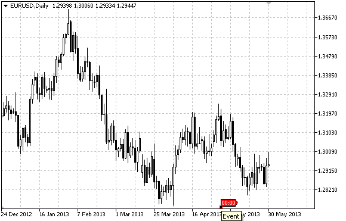

# OBJ_EVENT

Event object.



Note

When hovering mouse over the event, its text appears.

Example

The following script creates and moves Event object on the chart. Special functions have been developed to create and change graphical object's properties. You can use these functions "as is" in your own applications.

```
//--- description
#property description "Script draws \"Event\" graphical object."
#property description "Anchor point date is set in percentage of"
#property description "the chart window width in bars."
//--- display window of the input parameters during the script's launch
#property script_show_inputs
//--- input parameters of the script
input string          InpName="Event";    // Event name
input int             InpDate=25;         // Event date, %
input string          InpText="Text";     // Event text
input color           InpColor=clrRed;    // Event color
input int             InpWidth=1;         // Point size when highlighted
input bool            InpBack=false;      // Background event
input bool            InpSelection=false; // Highlight to move
input bool            InpHidden=true;     // Hidden in the object list
input long            InpZOrder=0;        // Priority for mouse click
//+------------------------------------------------------------------+
//| Create Event object on the chart                                 |
//+------------------------------------------------------------------+
bool EventCreate(const long            chart_ID=0,      // chart's ID
                 const string          name="Event",    // event name
                 const int             sub_window=0,    // subwindow index
                 const string          text="Text",     // event text
                 datetime              time=0,          // time
                 const color           clr=clrRed,      // color
                 const int             width=1,         // point width when highlighted
                 const bool            back=false,      // in the background
                 const bool            selection=false, // highlight to move
                 const bool            hidden=true,     // hidden in the object list
                 const long            z_order=0)       // priority for mouse click
  {
//--- if time is not set, create the object on the last bar
   if(!time)
      time=TimeCurrent();
//--- reset the error value
   ResetLastError();
//--- create Event object
   if(!ObjectCreate(chart_ID,name,OBJ_EVENT,sub_window,time,0))
     {
      Print(__FUNCTION__,
            ": failed to create \"Event\" object! Error code = ",GetLastError());
      return(false);
     }
//--- set event text
   ObjectSetString(chart_ID,name,OBJPROP_TEXT,text);
//--- set color
   ObjectSetInteger(chart_ID,name,OBJPROP_COLOR,clr);
//--- set anchor point width if the object is highlighted
   ObjectSetInteger(chart_ID,name,OBJPROP_WIDTH,width);
//--- display in the foreground (false) or background (true)
   ObjectSetInteger(chart_ID,name,OBJPROP_BACK,back);
//--- enable (true) or disable (false) the mode of moving event by mouse
   ObjectSetInteger(chart_ID,name,OBJPROP_SELECTABLE,selection);
   ObjectSetInteger(chart_ID,name,OBJPROP_SELECTED,selection);
//--- hide (true) or display (false) graphical object name in the object list
   ObjectSetInteger(chart_ID,name,OBJPROP_HIDDEN,hidden);
//--- set the priority for receiving the event of a mouse click in the chart
   ObjectSetInteger(chart_ID,name,OBJPROP_ZORDER,z_order);
//--- successful execution
   return(true);
  }
//+------------------------------------------------------------------+
//| Change Event object text                                         |
//+------------------------------------------------------------------+
bool EventTextChange(const long   chart_ID=0,   // chart's ID
                     const string name="Event", // event name
                     const string text="Text")  // text
  {
//--- reset the error value
   ResetLastError();
//--- change object text
   if(!ObjectSetString(chart_ID,name,OBJPROP_TEXT,text))
     {
      Print(__FUNCTION__,
            ": failed to change the text! Error code = ",GetLastError());
      return(false);
     }
//--- successful execution
   return(true);
  }
//+------------------------------------------------------------------+
//| Move Event object                                                |
//+------------------------------------------------------------------+
bool EventMove(const long   chart_ID=0,   // chart's ID
               const string name="Event", // event name
               datetime     time=0)       // time
  {
//--- if time is not set, move event to the last bar
   if(!time)
      time=TimeCurrent();
//--- reset the error value
   ResetLastError();
//--- move the object
   if(!ObjectMove(chart_ID,name,0,time,0))
     {
      Print(__FUNCTION__,
            ": failed to move \"Event\" object! Error code = ",GetLastError());
      return(false);
     }
//--- successful execution
   return(true);
  }
//+------------------------------------------------------------------+
//| Delete Event object                                              |
//+------------------------------------------------------------------+
bool EventDelete(const long   chart_ID=0,   // chart's ID
                 const string name="Event") // event name
  {
//--- reset the error value
   ResetLastError();
//--- delete the object
   if(!ObjectDelete(chart_ID,name))
     {
      Print(__FUNCTION__,
            ": failed to delete \"Event\" object! Error code = ",GetLastError());
      return(false);
     }
//--- successful execution
   return(true);
  }
//+------------------------------------------------------------------+
//| Script program start function                                    |
//+------------------------------------------------------------------+
void OnStart()
  {
//--- check correctness of the input parameters
   if(InpDate<0 || InpDate>100)
     {
      Print("Error! Incorrect values of input parameters!");
      return;
     }
//--- number of visible bars in the chart window
   int bars=(int)ChartGetInteger(0,CHART_VISIBLE_BARS);
//--- array for storing the date values to be used
//--- for setting and changing Event object anchor point's coordinates
   datetime date[];
//--- memory allocation
   ArrayResize(date,bars);
//--- fill the array of dates
   ResetLastError();
   if(CopyTime(Symbol(),Period(),0,bars,date)==-1)
     {
      Print("Failed to copy time values! Error code = ",GetLastError());
      return;
     }
//--- define the points to create an object
   int d=InpDate*(bars-1)/100;
//--- create Event object
   if(!EventCreate(0,InpName,0,InpText,date[d],InpColor,InpWidth,
      InpBack,InpSelection,InpHidden,InpZOrder))
     {
      return;
     }
//--- redraw the chart and wait for 1 second
   ChartRedraw();
   Sleep(1000);
//--- now, move the object
//--- loop counter
   int h_steps=bars/2;
//--- move the object
   for(int i=0;i<h_steps;i++)
     {
      //--- use the following value
      if(d<bars-1)
         d+=1;
      //--- move the point
      if(!EventMove(0,InpName,date[d]))
         return;
      //--- check if the script's operation has been forcefully disabled
      if(IsStopped())
         return;
      //--- redraw the chart
      ChartRedraw();
      // 0.05 seconds of delay
      Sleep(50);
     }
//--- 1 second of delay
   Sleep(1000);
//--- delete the channel from the chart
   EventDelete(0,InpName);
   ChartRedraw();
//--- 1 second of delay
   Sleep(1000);
//---
  }

```
