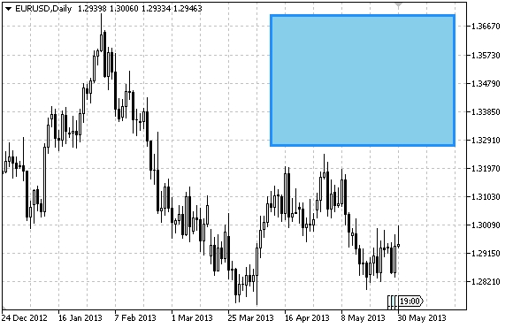

# OBJ_RECTANGLE_LABEL

Rectangle Label object.



Note

Anchor point coordinates are set in pixels. You can select rectangle label's anchoring corner from [ENUM_BASE_CORNER](/en/docs/constants/objectconstants/enum_basecorner) enumeration. Rectangle label's border type can be selected from [ENUM_BORDER_TYPE](/en/docs/constants/objectconstants/enum_object_property#enum_border_type) enumeration.

The object is used to create and design the custom graphical interface.

Example

The following script creates and moves Rectangle Label object on the chart. Special functions have been developed to create and change graphical object's properties. You can use these functions "as is" in your own applications.

```
//--- description
#property description "Script creates \"Rectangle Label\" graphical object."
//--- display window of the input parameters during the script's launch
#property script_show_inputs
//--- input parameters of the script
input string           InpName="RectLabel";         // Label name
input color            InpBackColor=clrSkyBlue;     // Background color
input ENUM_BORDER_TYPE InpBorder=BORDER_FLAT;       // Border type
input ENUM_BASE_CORNER InpCorner=CORNER_LEFT_UPPER; // Chart corner for anchoring
input color            InpColor=clrDarkBlue;        // Flat border color (Flat)
input ENUM_LINE_STYLE  InpStyle=STYLE_SOLID;        // Flat border style (Flat)
input int              InpLineWidth=3;              // Flat border width (Flat)
input bool             InpBack=false;               // Background object
input bool             InpSelection=true;           // Highlight to move
input bool             InpHidden=true;              // Hidden in the object list
input long             InpZOrder=0;                 // Priority for mouse click
//+------------------------------------------------------------------+
//| Create rectangle label                                           |
//+------------------------------------------------------------------+
bool RectLabelCreate(const long             chart_ID=0,               // chart's ID
                     const string           name="RectLabel",         // label name
                     const int              sub_window=0,             // subwindow index
                     const int              x=0,                      // X coordinate
                     const int              y=0,                      // Y coordinate
                     const int              width=50,                 // width
                     const int              height=18,                // height
                     const color            back_clr=C'236,233,216',  // background color
                     const ENUM_BORDER_TYPE border=BORDER_SUNKEN,     // border type
                     const ENUM_BASE_CORNER corner=CORNER_LEFT_UPPER, // chart corner for anchoring
                     const color            clr=clrRed,               // flat border color (Flat)
                     const ENUM_LINE_STYLE  style=STYLE_SOLID,        // flat border style
                     const int              line_width=1,             // flat border width
                     const bool             back=false,               // in the background
                     const bool             selection=false,          // highlight to move
                     const bool             hidden=true,              // hidden in the object list
                     const long             z_order=0)                // priority for mouse click
  {
//--- reset the error value
   ResetLastError();
//--- create a rectangle label
   if(!ObjectCreate(chart_ID,name,OBJ_RECTANGLE_LABEL,sub_window,0,0))
     {
      Print(__FUNCTION__,
            ": failed to create a rectangle label! Error code = ",GetLastError());
      return(false);
     }
//--- set label coordinates
   ObjectSetInteger(chart_ID,name,OBJPROP_XDISTANCE,x);
   ObjectSetInteger(chart_ID,name,OBJPROP_YDISTANCE,y);
//--- set label size
   ObjectSetInteger(chart_ID,name,OBJPROP_XSIZE,width);
   ObjectSetInteger(chart_ID,name,OBJPROP_YSIZE,height);
//--- set background color
   ObjectSetInteger(chart_ID,name,OBJPROP_BGCOLOR,back_clr);
//--- set border type
   ObjectSetInteger(chart_ID,name,OBJPROP_BORDER_TYPE,border);
//--- set the chart's corner, relative to which point coordinates are defined
   ObjectSetInteger(chart_ID,name,OBJPROP_CORNER,corner);
//--- set flat border color (in Flat mode)
   ObjectSetInteger(chart_ID,name,OBJPROP_COLOR,clr);
//--- set flat border line style
   ObjectSetInteger(chart_ID,name,OBJPROP_STYLE,style);
//--- set flat border width
   ObjectSetInteger(chart_ID,name,OBJPROP_WIDTH,line_width);
//--- display in the foreground (false) or background (true)
   ObjectSetInteger(chart_ID,name,OBJPROP_BACK,back);
//--- enable (true) or disable (false) the mode of moving the label by mouse
   ObjectSetInteger(chart_ID,name,OBJPROP_SELECTABLE,selection);
   ObjectSetInteger(chart_ID,name,OBJPROP_SELECTED,selection);
//--- hide (true) or display (false) graphical object name in the object list
   ObjectSetInteger(chart_ID,name,OBJPROP_HIDDEN,hidden);
//--- set the priority for receiving the event of a mouse click in the chart
   ObjectSetInteger(chart_ID,name,OBJPROP_ZORDER,z_order);
//--- successful execution
   return(true);
  }
//+------------------------------------------------------------------+
//| Move rectangle label                                             |
//+------------------------------------------------------------------+
bool RectLabelMove(const long   chart_ID=0,       // chart's ID
                   const string name="RectLabel", // label name
                   const int    x=0,              // X coordinate
                   const int    y=0)              // Y coordinate
  {
//--- reset the error value
   ResetLastError();
//--- move the rectangle label
   if(!ObjectSetInteger(chart_ID,name,OBJPROP_XDISTANCE,x))
     {
      Print(__FUNCTION__,
            ": failed to move X coordinate of the label! Error code = ",GetLastError());
      return(false);
     }
   if(!ObjectSetInteger(chart_ID,name,OBJPROP_YDISTANCE,y))
     {
      Print(__FUNCTION__,
            ": failed to move Y coordinate of the label! Error code = ",GetLastError());
      return(false);
     }
//--- successful execution
   return(true);
  }
//+------------------------------------------------------------------+
//| Change the size of the rectangle label                           |
//+------------------------------------------------------------------+
bool RectLabelChangeSize(const long   chart_ID=0,       // chart's ID
                         const string name="RectLabel", // label name
                         const int    width=50,         // label width
                         const int    height=18)        // label height
  {
//--- reset the error value
   ResetLastError();
//--- change label size
   if(!ObjectSetInteger(chart_ID,name,OBJPROP_XSIZE,width))
     {
      Print(__FUNCTION__,
            ": failed to change the label's width! Error code = ",GetLastError());
      return(false);
     }
   if(!ObjectSetInteger(chart_ID,name,OBJPROP_YSIZE,height))
     {
      Print(__FUNCTION__,
            ": failed to change the label's height! Error code = ",GetLastError());
      return(false);
     }
//--- successful execution
   return(true);
  }
//+------------------------------------------------------------------+
//| Change rectangle label border type                               |
//+------------------------------------------------------------------+
bool RectLabelChangeBorderType(const long             chart_ID=0,           // chart's ID
                               const string           name="RectLabel",     // label name
                               const ENUM_BORDER_TYPE border=BORDER_SUNKEN) // border type
  {
//--- reset the error value
   ResetLastError();
//--- change border type
   if(!ObjectSetInteger(chart_ID,name,OBJPROP_BORDER_TYPE,border))
     {
      Print(__FUNCTION__,
            ": failed to change the border type! Error code = ",GetLastError());
      return(false);
     }
//--- successful execution
   return(true);
  }
//+------------------------------------------------------------------+
//| Delete the rectangle label                                       |
//+------------------------------------------------------------------+
bool RectLabelDelete(const long   chart_ID=0,       // chart's ID
                     const string name="RectLabel") // label name
  {
//--- reset the error value
   ResetLastError();
//--- delete the label
   if(!ObjectDelete(chart_ID,name))
     {
      Print(__FUNCTION__,
            ": failed to delete a rectangle label! Error code = ",GetLastError());
      return(false);
     }
//--- successful execution
   return(true);
  }
//+------------------------------------------------------------------+
//| Script program start function                                    |
//+------------------------------------------------------------------+
void OnStart()
  {
//--- chart window size
   long x_distance;
   long y_distance;
//--- set window size
   if(!ChartGetInteger(0,CHART_WIDTH_IN_PIXELS,0,x_distance))
     {
      Print("Failed to get the chart width! Error code = ",GetLastError());
      return;
     }
   if(!ChartGetInteger(0,CHART_HEIGHT_IN_PIXELS,0,y_distance))
     {
      Print("Failed to get the chart height! Error code = ",GetLastError());
      return;
     }
//--- define rectangle label coordinates
   int x=(int)x_distance/4;
   int y=(int)y_distance/4;
//--- set label size
   int width=(int)x_distance/4;
   int height=(int)y_distance/4;
//--- create a rectangle label
   if(!RectLabelCreate(0,InpName,0,x,y,width,height,InpBackColor,InpBorder,InpCorner,
      InpColor,InpStyle,InpLineWidth,InpBack,InpSelection,InpHidden,InpZOrder))
     {
      return;
     }
//--- redraw the chart and wait one second
   ChartRedraw();
   Sleep(1000);
//--- change the size of the rectangle label
   int steps=(int)MathMin(x_distance/4,y_distance/4);
   for(int i=0;i<steps;i++)
     {
      //--- resize
      width+=1;
      height+=1;
      if(!RectLabelChangeSize(0,InpName,width,height))
         return;
      //--- check if the script's operation has been forcefully disabled
      if(IsStopped())
         return;
      //--- redraw the chart and wait for 0.01 seconds
      ChartRedraw();
      Sleep(10);
     }
//--- 1 second of delay
   Sleep(1000);
//--- change border type
   if(!RectLabelChangeBorderType(0,InpName,BORDER_RAISED))
      return;
//--- redraw the chart and wait for 1 second
   ChartRedraw();
   Sleep(1000);
//--- change border type
   if(!RectLabelChangeBorderType(0,InpName,BORDER_SUNKEN))
      return;
//--- redraw the chart and wait for 1 second
   ChartRedraw();
   Sleep(1000);
//--- delete the label
   RectLabelDelete(0,InpName);
   ChartRedraw();
//--- wait for 1 second
   Sleep(1000);
//---
  }

```
