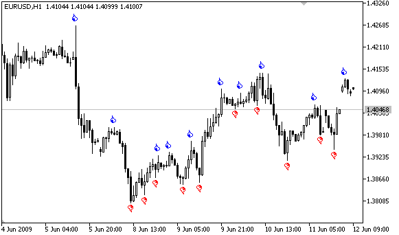

# Methods of Object Binding

Graphical objects Text, Label, Bitmap and Bitmap Label (OBJ_TEXT, OBJ_LABEL, OBJ_BITMAP and OBJ_BITMAP_LABEL) can have one of the 9 different ways of coordinate binding defined by the OBJPROP_ANCHOR property.

| Object | ID | X/Y | Width/Height | Date/Price | OBJPROP_CORNER | OBJPROP_ANCHOR | OBJPROP_ANGLE |
| --- | --- | --- | --- | --- | --- | --- | --- |
| Text | OBJ_TEXT | — | — | Yes | — | Yes | Yes |
| Label | OBJ_LABEL | Yes | Yes (read only) | — | Yes | Yes | Yes |
| Button | OBJ_BUTTON | Yes | Yes | — | Yes | — | — |
| Bitmap | OBJ_BITMAP | — | Yes (read only) | Yes | — | Yes | — |
| Bitmap Label | OBJ_BITMAP_LABEL | Yes | Yes (read only) | — | Yes | Yes | — |
| Edit | OBJ_EDIT | Yes | Yes | — | Yes | — | — |
| Rectangle Label | OBJ_RECTANGLE_LABEL | Yes | Yes | — | Yes | — | — |

The following designations are used in the table:

- X/Y – coordinates of anchor points specified in pixels relative to a chart corner;
- Width/Height – objects have width and height. For "read only", the width and height values are calculated only once the object is rendered on chart;
- Date/Price – anchor point coordinates are specified using the date and price values;
- OBJPROP_CORNER – defines the chart corner relative to which the anchor point coordinates are specified. Can be one of the 4 values of the [ENUM_BASE_CORNER](/en/docs/constants/objectconstants/enum_basecorner#enum_base_corner) enumeration;
- OBJPROP_ANCHOR – defines the anchor point in object itself and can be one of the 9 values of the [ENUM_ANCHOR_POINT](/en/docs/constants/objectconstants/enum_anchorpoint#enum_anchor_point) enumeration. Coordinates in pixels are specified from this very point to selected chart corner;
- OBJPROP_ANGLE – defines the object rotation angle counterclockwise.

The necessary variant can be specified using the function [ObjectSetInteger](/en/docs/objects/objectsetinteger)(chart_handle, object_name, OBJPROP_ANCHOR, anchor_point_mode),  where anchor_point_mode is one of the values of ENUM_ANCHOR_POINT.

ENUM_ANCHOR_POINT

| ID | Description |
| --- | --- |
| ANCHOR_LEFT_UPPER | Anchor point at the upper left corner |
| ANCHOR_LEFT | Anchor point to the left in the center |
| ANCHOR_LEFT_LOWER | Anchor point at the lower left corner |
| ANCHOR_LOWER | Anchor point below in the center |
| ANCHOR_RIGHT_LOWER | Anchor point at the lower right corner |
| ANCHOR_RIGHT | Anchor point to the right in the center |
| ANCHOR_RIGHT_UPPER | Anchor point at the upper right corner |
| ANCHOR_UPPER | Anchor point above in the center |
| ANCHOR_CENTER | Anchor point strictly in the center of the object |

The [OBJ_BUTTON](/en/docs/constants/objectconstants/enum_object/obj_button), [OBJ_RECTANGLE_LABEL](/en/docs/constants/objectconstants/enum_object/obj_rectangle_label), [OBJ_EDIT](/en/docs/constants/objectconstants/enum_object/obj_edit) and [OBJ_CHART](/en/docs/constants/objectconstants/enum_object/obj_chart) objects have a fixed anchor point in the upper left corner (ANCHOR_LEFT_UPPER).

Example:

```
   string text_name="my_OBJ_TEXT_object";
   if(ObjectFind(0,text_name)<0)
     {
      Print("Object ",text_name," not found. Error code = ",GetLastError());
      //--- Get the maximal price of the chart
      double chart_max_price=ChartGetDouble(0,CHART_PRICE_MAX,0);
      //--- Create object Label
      ObjectCreate(0,text_name,OBJ_TEXT,0,TimeCurrent(),chart_max_price);
      //--- Set color of the text
      ObjectSetInteger(0,text_name,OBJPROP_COLOR,clrWhite);
      //--- Set background color 
      ObjectSetInteger(0,text_name,OBJPROP_BGCOLOR,clrGreen);
      //--- Set text for the Label object
      ObjectSetString(0,text_name,OBJPROP_TEXT,TimeToString(TimeCurrent()));
      //--- Set text font
      ObjectSetString(0,text_name,OBJPROP_FONT,"Trebuchet MS");
      //--- Set font size
      ObjectSetInteger(0,text_name,OBJPROP_FONTSIZE,10);
      //--- Bind to the upper right corner
      ObjectSetInteger(0,text_name,OBJPROP_ANCHOR,ANCHOR_RIGHT_UPPER);
      //--- Rotate 90 degrees counter-clockwise
      ObjectSetDouble(0,text_name,OBJPROP_ANGLE,90);
      //--- Forbid the selection of the object by mouse
      ObjectSetInteger(0,text_name,OBJPROP_SELECTABLE,false);
      //--- redraw object
      ChartRedraw(0);
     }

```

Graphical objects Arrow (OBJ_ARROW) have only 2 ways of linking their coordinates. Identifiers are listed in ENUM_ARROW_ANCHOR.

ENUM_ARROW_ANCHOR

| ID | Description |
| --- | --- |
| ANCHOR_TOP | Anchor on the top side |
| ANCHOR_BOTTOM | Anchor on the bottom side |

Example:

```
void OnStart()
  {
//--- Auxiliary arrays
   double Ups[],Downs[];
   datetime Time[];
//--- Set the arrays as timeseries
   ArraySetAsSeries(Ups,true);
   ArraySetAsSeries(Downs,true);
   ArraySetAsSeries(Time,true);
//--- Create handle of the Indicator Fractals
   int FractalsHandle=iFractals(NULL,0);
   Print("FractalsHandle = ",FractalsHandle);
//--- Set Last error value to Zero
   ResetLastError();
//--- Try to copy the values of the indicator
   int copied=CopyBuffer(FractalsHandle,0,0,1000,Ups);
   if(copied<=0)
     {
      Print("Unable to copy the upper fractals. Error = ",GetLastError());
      return;
     }
 
   ResetLastError();
//--- Try to copy the values of the indicator
   copied=CopyBuffer(FractalsHandle,1,0,1000,Downs);
   if(copied<=0)
     {
      Print("Unable to copy the bottom fractals. Error = ",GetLastError());
      return;
     }
 
   ResetLastError();
//--- Copy timeseries containing the opening bars of the last 1000 ones
   copied=CopyTime(NULL,0,0,1000,Time);
   if(copied<=0)
     {
      Print("Unable to copy the Opening Time of the last 1000 bars");
      return;
     }
 
   int upcounter=0,downcounter=0; // count there the number of arrows
   bool created;// receive the result of attempts to create an object
   for(int i=2;i<copied;i++)// Run through the values of the indicator iFractals
     {
      if(Ups[i]!=EMPTY_VALUE)// Found the upper fractal
        {
         if(upcounter<10)// Create no more than 10 "Up" arrows
           {
            //--- Try to create an "Up" object
            created=ObjectCreate(0,string(Time[i]),OBJ_ARROW_THUMB_UP,0,Time[i],Ups[i]);
            if(created)// If set up - let's make tuning for it
              {
               //--- Point anchor is below in order not to cover bar
               ObjectSetInteger(0,string(Time[i]),OBJPROP_ANCHOR,ANCHOR_BOTTOM);
               //--- Final touch - painted
               ObjectSetInteger(0,string(Time[i]),OBJPROP_COLOR,clrBlue);
               upcounter++;
              }
           }
        }
      if(Downs[i]!=EMPTY_VALUE)// Found a lower fractal
        {
         if(downcounter<10)// Create no more than 10 arrows "Down"
           {
            //--- Try to create an object "Down"
            created=ObjectCreate(0,string(Time[i]),OBJ_ARROW_THUMB_DOWN,0,Time[i],Downs[i]);
            if(created)// If set up - let's make tuning for it
              {
               //--- Point anchor is above in order not to cover bar
               ObjectSetInteger(0,string(Time[i]),OBJPROP_ANCHOR,ANCHOR_TOP);
               //--- Final touch - painted
               ObjectSetInteger(0,string(Time[i]),OBJPROP_COLOR,clrRed);
               downcounter++;
              }
           }
        }
     }
  }

```

After the script execution the chart will look like in this figure.


