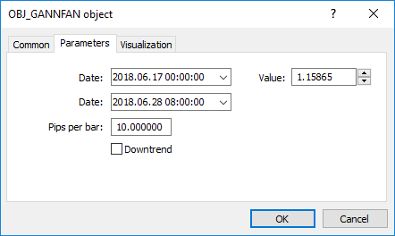

# Gann Objects

For Gann Fan (OBJ_GANNFAN) and Gann Grid (OBJ_GANNGRID) objects you can specify two values of the ENUM_GANN_DIRECTION enumeration that sets the trend direction.

ENUM_GANN_DIRECTION

| ID | Description |
| --- | --- |
| GANN_UP_TREND | Line corresponding to the uptrend line |
| GANN_DOWN_TREND | Line corresponding to the downward trend |

To set the scale of the main line as 1x1, use function [ObjectSetDouble](/en/docs/objects/objectsetdouble)(chart_handle, gann_object_name, OBJPROP_SCALE, scale), where:

- chart_handle – chart window where the object is located;
- gann_object_name – object name;
- OBJPROP_SCALE – identifier of the "Scale" property;
- scale – required scale in units of Pips/Bar.



Example of creating Gann Fan:

```
void OnStart()
  {
//---
   string my_gann="OBJ_GANNFAN object";
   if(ObjectFind(0,my_gann)<0)// Object not found
     {
      //--- Inform about the failure
      Print("Object ",my_gann," not found. Error code = ",GetLastError());
      //--- Get the maximal price of the chart
      double chart_max_price=ChartGetDouble(0,CHART_PRICE_MAX,0);
      //--- Get the minimal price of the chart
      double chart_min_price=ChartGetDouble(0,CHART_PRICE_MIN,0);
      //--- How many bars are shown in the chart?
      int bars_on_chart=ChartGetInteger(0,CHART_VISIBLE_BARS);
      //--- Create an array, to write the opening time of each bar to
      datetime Time[];
      //--- Arrange access to the array as that of timeseries
      ArraySetAsSeries(Time,true);
      //--- Now copy data of bars visible in the chart into this array
      int times=CopyTime(NULL,0,0,bars_on_chart,Time);
      if(times<=0)
        {
         Print("Could not copy the array with the open time!");
         return;
        }
      //--- Preliminary preparations completed
 
      //--- Index of the central bar in the chart
      int center_bar=bars_on_chart/2;
      //--- Chart equator - between the maximum and minimum
      double mean=(chart_max_price+chart_min_price)/2.0;
      //--- Set the coordinates of the first anchor point to the center
      ObjectCreate(0,my_gann,OBJ_GANNFAN,0,Time[center_bar],mean,
                   //--- Second anchor point to the right
                   Time[center_bar/2],(mean+chart_min_price)/2.0);
      Print("Time[center_bar] = "+(string)Time[center_bar]+"  Time[center_bar/2] = "+(string)Time[center_bar/2]);
      //Print("Time[center_bar]/="+Time[center_bar]+"  Time[center_bar/2]="+Time[center_bar/2]);
      //--- Set the scale in units of Pips / Bar
      ObjectSetDouble(0,my_gann,OBJPROP_SCALE,10);
      //--- Set the line trend
      ObjectSetInteger(0,my_gann,OBJPROP_DIRECTION,GANN_UP_TREND);
      //--- Set the line width
      ObjectSetInteger(0,my_gann,OBJPROP_WIDTH,1);
      //--- Define the line style
      ObjectSetInteger(0,my_gann,OBJPROP_STYLE,STYLE_DASHDOT);
      //--- Set the line color
      ObjectSetInteger(0,my_gann,OBJPROP_COLOR,clrYellowGreen);
      //--- Allow the user to select an object
      ObjectSetInteger(0,my_gann,OBJPROP_SELECTABLE,true);
      //--- Select it yourself
      ObjectSetInteger(0,my_gann,OBJPROP_SELECTED,true);
      //--- Draw it on the chart
      ChartRedraw(0);
     }
  }

```
