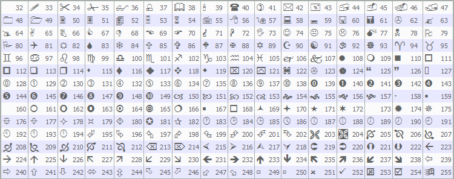

# Wingdings

Characters of Wingdings used with the [OBJ_ARROW](/en/docs/constants/objectconstants/enum_object) object:



A necessary character can be set using the [ObjectSetInteger()](/en/docs/objects/objectsetinteger) function.

Example:

```
void OnStart()
  {
//---
   string up_arrow="up_arrow";
   datetime time=TimeCurrent();
   double lastClose[1];
   int close=CopyClose(Symbol(),Period(),0,1,lastClose);     // Get the Close price
//--- If the price was obtained
   if(close>0)
     {
      ObjectCreate(0,up_arrow,OBJ_ARROW,0,0,0,0,0);          // Create an arrow
      ObjectSetInteger(0,up_arrow,OBJPROP_ARROWCODE,241);    // Set the arrow code
      ObjectSetInteger(0,up_arrow,OBJPROP_TIME,time);        // Set time
      ObjectSetDouble(0,up_arrow,OBJPROP_PRICE,lastClose[0]);// Set price
      ChartRedraw(0);                                        // Draw arrow now
     }
   else
      Print("Unable to get the latest Close price!");
  }

```
