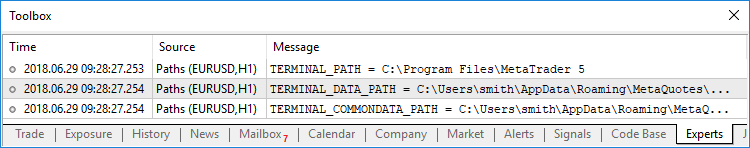

# Client Terminal Properties

Information about the client terminal can be obtained by two functions: [TerminalInfoInteger()](/en/docs/check/terminalinfointeger) and [TerminalInfoString()](/en/docs/check/terminalinfostring). For parameters, these functions accept values from ENUM_TERMINAL_INFO_INTEGER and ENUM_TERMINAL_INFO_STRING respectively.

ENUM_TERMINAL_INFO_INTEGER

| Identifier | Description | Type |
| --- | --- | --- |
| TERMINAL_BUILD | The client terminal build number | int |
| TERMINAL_COMMUNITY_ACCOUNT | The flag indicates the presence of MQL5.community authorization data in the terminal | bool |
| TERMINAL_COMMUNITY_CONNECTION | Connection to MQL5.community | bool |
| TERMINAL_CONNECTED | Connection to a trade server | bool |
| TERMINAL_DLLS_ALLOWED | Permission to use DLL | bool |
| TERMINAL_TRADE_ALLOWED | Permission to trade | bool |
| TERMINAL_EMAIL_ENABLED | Permission to send e-mails using SMTP-server and login, specified in the terminal settings | bool |
| TERMINAL_FTP_ENABLED | Permission to send reports using FTP-server and login, specified in the terminal settings | bool |
| TERMINAL_NOTIFICATIONS_ENABLED | Permission to send notifications to smartphone | bool |
| TERMINAL_MAXBARS | The maximal bars count on the chart | int |
| TERMINAL_MQID | The flag indicates the presence of MetaQuotes ID data for  Push notifications | bool |
| TERMINAL_CODEPAGE | Number of  the code page of the language  installed in the client terminal | int |
| TERMINAL_CPU_CORES | The number of CPU cores in the system | int |
| TERMINAL_DISK_SPACE | Free disk space for the MQL5\Files folder of the terminal (agent), MB | int |
| TERMINAL_MEMORY_PHYSICAL | Physical memory in the system, MB | int |
| TERMINAL_MEMORY_TOTAL | Memory available to the process of the terminal (agent), MB | int |
| TERMINAL_MEMORY_AVAILABLE | Free memory of the terminal (agent) process, MB | int |
| TERMINAL_MEMORY_USED | Memory used by the terminal (agent), MB | int |
| TERMINAL_X64 | Indication of the "64-bit terminal" | bool |
| TERMINAL_OPENCL_SUPPORT | The version of the supported OpenCL in the format of 0x00010002 = 1.2.  "0" means that OpenCL is not supported | int |
| TERMINAL_SCREEN_DPI | The resolution of information display on the screen is measured as number of Dots in a line per Inch (DPI). 
 Knowing the parameter value, you can set the size of graphical objects so that they look the same on monitors with different resolution characteristics. | int |
| TERMINAL_SCREEN_LEFT | The left coordinate of the virtual screen. A virtual screen is a rectangle that covers all monitors. If the system has two monitors ordered from right to left, then the left coordinate of the virtual screen can be on the border of two monitors. | int |
| TERMINAL_SCREEN_TOP | The top coordinate of the virtual screen | int |
| TERMINAL_SCREEN_WIDTH | Terminal width | int |
| TERMINAL_SCREEN_HEIGHT | Terminal height | int |
| TERMINAL_LEFT | The left coordinate of the terminal relative to the virtual screen | int |
| TERMINAL_TOP | The top coordinate of the terminal relative to the virtual screen | int |
| TERMINAL_RIGHT | The right coordinate of the terminal relative to the virtual screen | int |
| TERMINAL_BOTTOM | The bottom coordinate of the terminal relative to the virtual screen | int |
| TERMINAL_PING_LAST | The last known value of a ping to a trade server in microseconds. One second comprises of one million microseconds | int |
| TERMINAL_VPS | Indication that the terminal is launched on the  MetaTrader Virtual Hosting server  (MetaTrader VPS) | bool |
| Key identifier | Description |  |
| TERMINAL_KEYSTATE_LEFT | State of the "Left arrow" key | int |
| TERMINAL_KEYSTATE_UP | State of the "Up arrow" key | int |
| TERMINAL_KEYSTATE_RIGHT | State of the "Right arrow" key | int |
| TERMINAL_KEYSTATE_DOWN | State of the "Down arrow" key | int |
| TERMINAL_KEYSTATE_SHIFT | State of the "Shift" key | int |
| TERMINAL_KEYSTATE_CONTROL | State of the "Ctrl" key | int |
| TERMINAL_KEYSTATE_MENU | State of the "Windows" key | int |
| TERMINAL_KEYSTATE_CAPSLOCK | State of the "CapsLock" key | int |
| TERMINAL_KEYSTATE_NUMLOCK | State of the "NumLock" key | int |
| TERMINAL_KEYSTATE_SCRLOCK | State of the "ScrollLock" key | int |
| TERMINAL_KEYSTATE_ENTER | State of the "Enter" key | int |
| TERMINAL_KEYSTATE_INSERT | State of the "Insert" key | int |
| TERMINAL_KEYSTATE_DELETE | State of the "Delete" key | int |
| TERMINAL_KEYSTATE_HOME | State of the "Home" key | int |
| TERMINAL_KEYSTATE_END | State of the "End" key | int |
| TERMINAL_KEYSTATE_TAB | State of the "Tab" key | int |
| TERMINAL_KEYSTATE_PAGEUP | State of the "PageUp" key | int |
| TERMINAL_KEYSTATE_PAGEDOWN | State of the "PageDown" key | int |
| TERMINAL_KEYSTATE_ESCAPE | State of the "Escape" key | int |

Call to TerminalInfoInteger(TERMINAL_KEYSTATE_XXX) returns the same state code of a key as the [GetKeyState()](https://docs.microsoft.com/en-us/windows/win32/api/winuser/nf-winuser-getkeystate) function in MSDN.

Example of scaling factor calculation:

```
//--- Creating a 1.5 inch wide button on a screen
int screen_dpi = TerminalInfoInteger(TERMINAL_SCREEN_DPI); // Find DPI of the user monitor
int base_width = 144;                                      // The basic width in the screen points for standard monitors with DPI=96
int width      = (button_width * screen_dpi) / 96;         // Calculate the button width for the user monitor (for the specific DPI)
...
 
//--- Calculating the scaling factor as a percentage
int scale_factor=(TerminalInfoInteger(TERMINAL_SCREEN_DPI) * 100) / 96;
//--- Use of the scaling factor
width=(base_width * scale_factor) / 100;

```

In the above example, the graphical [resource](/en/docs/runtime/resources) looks the same on monitors with different resolution characteristics. The size of control elements (buttons, dialog windows, etc.) corresponds to personalization settings.

ENUM_TERMINAL_INFO_DOUBLE

| Identifier | Description | Type |
| --- | --- | --- |
| TERMINAL_COMMUNITY_BALANCE | Balance in MQL5.community | double |
| TERMINAL_RETRANSMISSION | Percentage of resent network packets in the TCP/IP protocol for all running applications and services on the given computer. Packet loss occurs even in the fastest and correctly configured networks. In this case, there is no confirmation of packet delivery between the recipient and the sender, therefore lost packets are resent. 
   
 It is not an indication of the connection quality between a particular terminal and a trade server, since the percentage is calculated for the entire network activity, including system and background activity. 
   
 The TERMINAL_RETRANSMISSION value is requested from the operating system once per minute. The terminal itself does not calculate this value. | double |

[File operations](/en/docs/files) can be performed only in two directories; corresponding paths can be obtained using the request for TERMINAL_DATA_PATH and TERMINAL_COMMONDATA_PATH properties.

ENUM_TERMINAL_INFO_STRING

| Identifier | Description | Type |
| --- | --- | --- |
| TERMINAL_LANGUAGE | Language of the terminal | string |
| TERMINAL_COMPANY | Company name | string |
| TERMINAL_NAME | Terminal name | string |
| TERMINAL_PATH | Folder from which the terminal is started | string |
| TERMINAL_DATA_PATH | Folder in which terminal data are stored | string |
| TERMINAL_COMMONDATA_PATH | Common path for all of the terminals installed on a computer | string |
| TERMINAL_CPU_NAME | CPU name | string |
| TERMINAL_CPU_ARCHITECTURE | CPU architecture | string |
| TERMINAL_OS_VERSION | User's OS name | string |
| TERMINAL_COLORTHEME_NAME | Terminal color scheme; possible values: Light and Dark. | string |

For a better understanding of paths, stored in properties of TERMINAL_PATH, TERMINAL_DATA_PATH and TERMINAL_COMMONDATA_PATH parameters, it is recommended to execute the script, which will return these values for the current copy of the client terminal, installed on your computer

Example: Script returns information about the client terminal paths

```
//+------------------------------------------------------------------+
//|                                          Check_TerminalPaths.mq5 |
//|                        Copyright 2009, MetaQuotes Software Corp. |
//|                                             https://www.mql5.com |
//+------------------------------------------------------------------+
#property copyright "2009, MetaQuotes Software Corp."
#property link      "https://www.mql5.com"
#property version   "1.00"
//+------------------------------------------------------------------+
//| Script program start function                                    |
//+------------------------------------------------------------------+
void OnStart()
  {
//---
   Print("TERMINAL_PATH = ",TerminalInfoString(TERMINAL_PATH));
   Print("TERMINAL_DATA_PATH = ",TerminalInfoString(TERMINAL_DATA_PATH));
   Print("TERMINAL_COMMONDATA_PATH = ",TerminalInfoString(TERMINAL_COMMONDATA_PATH));
  }

```

As result of the script execution in the Experts Journal you will see a messages, like the following:



## 

## Get Terminal Color Scheme Information  #

The terminal supports two color schemes: Light (default) and Dark. When developing custom applications with graphical user interfaces, programmers should take the current terminal color scheme into account. Visual components used in the application should be dynamically adaptable to enhance user experience and maintain visual consistency.

To support this, the language provides functions for detecting the terminal color scheme:

- The TERMINAL_COLORTHEME_NAME value from the [ENUM_TERMINAL_INFO_STRING](/en/docs/constants/environment_state/terminalstatus#enum_terminal_info_string) enumeration allows you to retrieve the name of the current color scheme using the [TerminalInfoString](/en/docs/check/terminalinfostring) function. Possible values: Light and Dark.
- Use the THEME_COLOR_* values from the [ENUM_TERMINAL_INFO_INTEGER](/en/docs/constants/environment_state/terminalstatus#enum_terminal_info_integer) enumeration to retrieve the colors of specific UI elements through the [TerminalInfoInteger](/en/docs/check/terminalinfointeger) function.

| Identifier | Description | Property type |
| --- | --- | --- |
| THEME_COLOR_WINDOW | Window background | color |
| THEME_COLOR_WINDOWTEXT | Text in the window | color |
| THEME_COLOR_BTNTEXT | Button text | color |
| THEME_COLOR_GRAYTEXT | Inactive (disabled) text | color |
| THEME_COLOR_INFOTEXT | Tooltip text | color |
| THEME_COLOR_INFOBK | Tooltip background | color |
| THEME_COLOR_3DFACE | Front face of 3D elements | color |
| THEME_COLOR_3DLIGHT | Light side of 3D elements | color |
| THEME_COLOR_3DSHADOW | Shadow side of 3D elements | color |
| THEME_COLOR_3DDKSHADOW | Dark shadow of 3D elements | color |
| THEME_COLOR_3DHILIGHT | Highlight of 3D elements | color |
| THEME_COLOR_HIGHLIGHT | Background of selected elements | color |
| THEME_COLOR_HIGHLIGHTTEXT | Text of selected elements | color |
| THEME_COLOR_BTNFACE | Button front face | color |
| THEME_COLOR_BTNHILIGHT | Button highlight | color |
| THEME_COLOR_BTNSHADOW | Button shadow | color |
| THEME_COLOR_MENU | Menu background | color |
| THEME_COLOR_MENUBAR | Menu bar background | color |
| THEME_COLOR_MENUTEXT | Menu text | color |
| THEME_COLOR_MENUHILIGHT | Highlight of selected menu item | color |
| THEME_COLOR_ACTIVECAPTION | Active window title | color |
| THEME_COLOR_INACTIVECAPTION | Inactive window title | color |
| THEME_COLOR_GRADIENTINACTIVECAPTION | Gradient of inactive window title | color |
| THEME_COLOR_CAPTIONTEXT | Window title text | color |
| THEME_COLOR_INACTIVECAPTIONTEXT | Inactive window title text | color |
| THEME_COLOR_HOTTEXT | Hyperlinks or active elements | color |
| THEME_COLOR_NONE | Color not selected | color |
| THEME_COLOR_SEPARATOR | Separator | color |
| THEME_COLOR_SCROLLBACK | Scrollbar | color |
| THEME_COLOR_LINE1 | Background color of odd rows in the Journal | color |
| THEME_COLOR_LINE2 | Background color of even rows in the Journal | color |
| THEME_COLOR_GRID | Grid color in the Journal | color |
| THEME_COLOR_SUMMARY | Background color of summary row in the Journal | color |
| THEME_COLOR_ERROR | Error message text color | color |
| THEME_COLOR_INVALID | Invalid value text color | color |
| THEME_COLOR_NEGATIVE | Negative value color | color |
| THEME_COLOR_POSITIVE | Positive value color | color |
| THEME_COLOR_LINK | Link color | color |
| THEME_COLOR_LINKHOVER | Link hover color | color |
| THEME_COLOR_LINKTESTER | Link color from  cached results of previous  testing/optimization runs | color |
| THEME_COLOR_TEXTUP | "Button released" state | color |
| THEME_COLOR_TEXTDOWN | "Button pressed" state | color |
| THEME_COLOR_BACKUP | Color of "BUY" and "SELL" buttons in "One Click Trading" when the quote increases | color |
| THEME_COLOR_BACKDOWN | Color of "BUY" and "SELL" buttons in "One Click Trading" when the quote decreases | color |
| THEME_COLOR_CLOSE | "Close" operation button color | color |
| THEME_COLOR_BUY | "BUY" operation button color | color |
| THEME_COLOR_SELL | "SELL" operation button color | color |
| THEME_COLOR_DEPOSIT | "Deposit" button color | color |
| THEME_COLOR_WITHDRAWAL | "Withdrawal" button color | color |
| THEME_COLOR_BID | Bid line color | color |
| THEME_COLOR_ASK | Ask line color | color |
| THEME_COLOR_STOPS | Stop line color | color |
| THEME_COLOR_STOPS_RED | StopLoss value highlight when profit is negative (Trade tab) | color |
| THEME_COLOR_STOPS_GREEN | StopLoss value highlight when profit is positive (Trade tab) | color |
| THEME_COLOR_CONFIRM | "Accept" button color in the order submission window | color |
| THEME_COLOR_REQUOTE | "Requote" button color in the order submission window | color |
| THEME_COLOR_REJECT | "Reject" button color in the order submission window | color |
| THEME_COLOR_NOTIFICATION | Color of a change notification from the server in the order submission window | color |
| THEME_COLOR_RATING | Rating bar color in the  learning system | color |
| THEME_COLOR_BOOK_BUY | Background color of buy levels in the Depth of Market | color |
| THEME_COLOR_BOOK_SELL | Background color of sell levels in the Depth of Market | color |
| THEME_COLOR_BOOK_LAST | Color of the last trade in the Depth of Market | color |
| THEME_COLOR_BOOK_STOP | StopLoss level color in the Depth of Market | color |
| THEME_COLOR_BOOK_SPREAD | Background color of levels within the spread in the Depth of Market | color |
| THEME_COLOR_TICKS_BID | Bid line color on the tick chart in the order submission window | color |
| THEME_COLOR_TICKS_ASK | Ask line color on the tick chart in the order submission window | color |
| THEME_COLOR_TICKS_LAST | Last line color on the tick chart in the order submission window | color |
| THEME_COLOR_TICKS_CROSS | Crosshair color on the tick chart in the order submission window | color |
| THEME_COLOR_TICKS_SL | StopLoss line color on the tick chart in the order submission window | color |
| THEME_COLOR_TICKS_TP | TakeProfit line color on the tick chart in the order submission window | color |
| THEME_COLOR_TESTER_START | "Start" button color in testing/optimization | color |
| THEME_COLOR_TESTER_STOP | "Stop" button color in testing/optimization | color |
| THEME_COLOR_TESTER_START_FRAME | Border color of the "Start" button in testing/optimization | color |
| THEME_COLOR_TESTER_STOP_FRAME | Border color of the "Stop" button in testing/optimization | color |
| THEME_COLOR_TESTER_PROGRESS | Progress bar color in testing/optimization | color |
| THEME_COLOR_TESTER_BALANCE | Balance line color in the Strategy Tester | color |
| THEME_COLOR_TESTER_EQUITY | Equity line color in the Strategy Tester | color |
| THEME_COLOR_TESTER_MARGIN | Deposit Load graph color in the Strategy Tester | color |
| THEME_COLOR_PROFILER_CALL | Color of the code line with a call during Profiling | color |
| THEME_COLOR_PROFILER_CALLSEL | Selected code line color with a call during Profiling | color |
| THEME_COLOR_PROFILER_LINE | Line color in the Profiler Journal | color |
| THEME_COLOR_PROFILER_LINESEL | Selected line color in the Profiler Journal | color |
