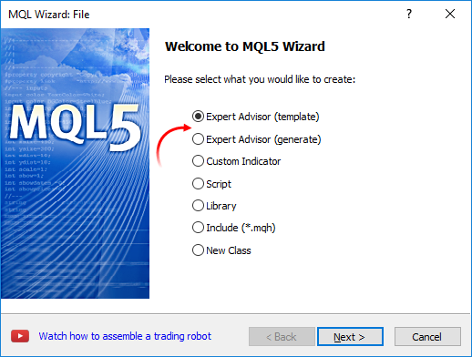
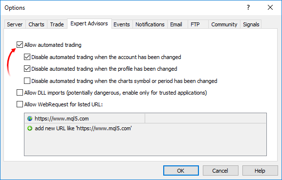
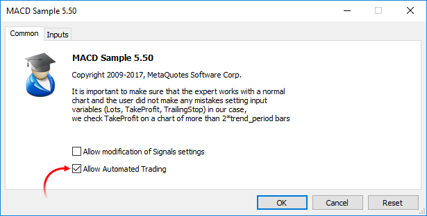

# Trade Permission

## Trade Automation

MQL5 language provides a special group of [trade functions](/en/docs/trading) designed for developing automated trading systems. Programs developed for automated trading with no human intervention are called Expert Advisors or trading robots. In order to create an Expert Advisor in MetaEditor, launch MQL5 Wizard and select one of the two options:

- Expert Advisor (template) – allows you to create a template with ready-made [event handling functions](/en/docs/basis/function/events) that should be supplemented with all necessary functionality by means of programming.
- Expert Advisor (generate) – allows you to [ develop a full-fledged trading robot](https://www.mql5.com/en/articles/275) simply by selecting the necessary modules: trading signals module, money management module and trailing stop module.



Trading functions can work only in Expert Advisors and scripts. Trading is not allowed for indicators.

## Checking for Permission to Perform Automated Trading

In order to develop a reliable Expert Advisor capable of working without human intervention, it is necessary to arrange a set of important checks. First, we should programmatically check if trading is allowed at all. This is a basic check that is indispensable when developing any automated system.

### Checking for permission to perform automated trading in the terminal

The terminal settings provide you with an ability to allow or forbid automated trading for all programs.



You can switch automated trading option right on the terminal's Standard panel:

-  – automated trading enabled, trading functions in launched applications are allowed for use.
-  – automated trading disabled, running applications are unable to execute trading functions.

Sample check:

```
if (!TerminalInfoInteger(TERMINAL_TRADE_ALLOWED)) 
   Alert("Check if automated trading is allowed in the terminal settings!");

```

### Checking if trading is allowed for a certain running Expert Advisor/script

You can allow or forbid automated trading for a certain program when launching it. To do this, use the special check box in the program properties.



Sample check:

```
   if(!TerminalInfoInteger(TERMINAL_TRADE_ALLOWED))
      Alert("Check if automated trading is allowed in the terminal settings!");
   else
     {
      if(!MQLInfoInteger(MQL_TRADE_ALLOWED))
         Alert("Automated trading is forbidden in the program settings for ",__FILE__);
     }

```

### Checking if trading is allowed for any Expert Advisors/scripts for the current account

Automated trading can be disabled at the trade server side. Sample check:

```
   if(!AccountInfoInteger(ACCOUNT_TRADE_EXPERT))
      Alert("Automated trading is forbidden for the account ",AccountInfoInteger(ACCOUNT_LOGIN),
      " at the trade server side");

```

If automated trading is disabled for a trading account, trading operations of Expert Advisors/scripts are not executed.

### Checking if trading is allowed for the current account

In some cases, any trading operations are disabled for a certain trading account – neither manual nor automated trading can be performed. Sample check when an investor password has been used to connect to a trading account:

```
   if(!AccountInfoInteger(ACCOUNT_TRADE_ALLOWED))
      Comment("Trading is forbidden for the account ",AccountInfoInteger(ACCOUNT_LOGIN),
            ".\n Perhaps an investor password has been used to connect to the trading account.",
            "\n Check the terminal journal for the following entry:",
            "\n\'",AccountInfoInteger(ACCOUNT_LOGIN),"\': trading has been disabled - investor mode.");

```

AccountInfoInteger(ACCOUNT_TRADE_ALLOWED) may return false in the following cases:

- no connection to the trade server. That can be checked using TerminalInfoInteger(TERMINAL_CONNECTED);
- trading account switched to read-only mode (sent to the archive);
- trading on the account is disabled at the trade server side;
- connection to a trading account has been performed in Investor mode.

See also

[Client Terminal Properties](/en/docs/constants/environment_state/terminalstatus), [Account Properties](/en/docs/constants/environment_state/accountinformation), [Properties of a Running MQL5 Program](/en/docs/constants/environment_state/mql5_programm_info)
