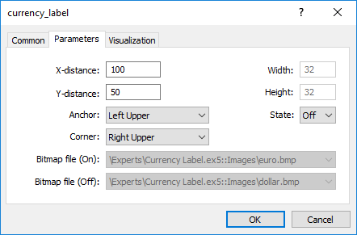

# Resources

## Using graphics and sound in MQL5 programs

Programs in MQL5 allow working with sound and graphic files:

- [PlaySound()](/en/docs/common/playsound) plays a sound file;
- [ObjectCreate()](/en/docs/objects/objectcreate) allows creating user interfaces using [graphical objects](/en/docs/constants/objectconstants/enum_object) OBJ_BITMAP and OBJ_BITMAP_LABEL.

### PlaySound()

Example of call of the [PlaySound()](/en/docs/common/playsound) function:

```
//+------------------------------------------------------------------+
//| Calls standard OrderSend() and plays a sound                     |
//+------------------------------------------------------------------+
void OrderSendWithAudio(MqlTradeRequest  &request, MqlTradeResult &result)
  {
  //--- send a request to a server
   OrderSend(request,result);
   //--- if a request is accepted, play sound Ok.wav 
   if(result.retcode==TRADE_RETCODE_PLACED) PlaySound("Ok.wav");
   //--- if fails, play alarm from file timeout.wav
   else PlaySound("timeout.wav");
  }

```

The example shows how to play sounds from files 'Ok.wav' and 'timeout.wav', which are included into the standard terminal package. These files are located in the folder terminal_directory\Sounds. Here terminal_directory is a folder, from which the MetaTrader 5 Client Terminal is started. The location of the terminal directory can be found out from an mql5 program in the following way:

```
//--- Folder, in which terminal data are stored
   string terminal_path=TerminalInfoString(TERMINAL_PATH);

```

You can use sound files not only from the folder terminal_directory\Sounds, but also from any subfolder located in terminal_data_directory\MQL5. You can find out the location of the terminal data directory from the terminal menu "File" -> "Open Data Folder" or using program method:

```
//--- Folder, in which terminal data are stored
   string terminal_data_path=TerminalInfoString(TERMINAL_DATA_PATH);

```

For example, if the Demo.wav sound file is located in terminal_data_directory\MQL5\Files, then call of PlaySound() should be written the following way:

```
//--- play Demo.wav from the folder terminal_directory_data\MQL5\Files\
   PlaySound("\\Files\\Demo.wav");

```

Please note that in the comment the path to the file is written using backslash "\", and in the function "\\" is used.

When specifying the path, always use only the double backslash as a separator, because a single backslash is a control symbol for the compiler when dealing with constant strings and [character constants](/en/docs/basis/types/integer/symbolconstants) in the program source code.

Call [PlaySound()](/en/docs/common/playsound) function with NULL parameter to stop playback:

```
//--- call of PlaySound() with NULL parameter stops playback
   PlaySound(NULL);

```

### ObjectCreate()

Example of an Expert Advisor, which creates a graphical label (OBJ_BITMAP_LABEL) using the ObjectCreate() function.

```
string label_name="currency_label";        // name of the OBJ_BITMAP_LABEL object
string euro      ="\\Images\\euro.bmp";    // path to the file terminal_data_directory\MQL5\Images\euro.bmp
string dollar    ="\\Images\\dollar.bmp";  // path to the file terminal_data_directory\MQL5\Images\dollar.bmp
//+------------------------------------------------------------------+
//| Expert initialization function                                   |
//+------------------------------------------------------------------+
int OnInit()
  {
//--- create a button OBJ_BITMAP_LABEL, if it hasn't been created yet
   if(ObjectFind(0,label_name)<0)
     {
      //--- trying to create object OBJ_BITMAP_LABEL
      bool created=ObjectCreate(0,label_name,OBJ_BITMAP_LABEL,0,0,0);
      if(created)
        {
         //--- link the button to the left upper corner of the chart
         ObjectSetInteger(0,label_name,OBJPROP_CORNER,CORNER_RIGHT_UPPER);
         //--- now set up the object properties
         ObjectSetInteger(0,label_name,OBJPROP_XDISTANCE,100);
         ObjectSetInteger(0,label_name,OBJPROP_YDISTANCE,50);
         //--- reset the code of the last error to 0
         ResetLastError();
         //--- download a picture to indicate the "Pressed" state of the button
         bool set=ObjectSetString(0,label_name,OBJPROP_BMPFILE,0,euro);
         //--- test the result
         if(!set)
           {
            PrintFormat("Failed to download image from file %s. Error code %d",euro,GetLastError());
           }
         ResetLastError();
         //--- download a picture to indicate the "Unpressed" state of the button
         set=ObjectSetString(0,label_name,OBJPROP_BMPFILE,1,dollar);
         
         if(!set)
           {
            PrintFormat("Failed to download image from file %s. Error code %d",dollar,GetLastError());
           }
         //--- send a command for a chart to refresh so that the button appears immediately without a tick
         ChartRedraw(0);
        }
      else
        {
         //--- failed to create an object, notify
         PrintFormat("Failed to create object OBJ_BITMAP_LABEL. Error code %d",GetLastError());
        }
     }
//---
   return(INIT_SUCCEEDED);
  }
//+------------------------------------------------------------------+
//| Expert deinitialization function                                 |
//+------------------------------------------------------------------+
void OnDeinit(const int reason)
  {
//--- delete an object from a chart 
   ObjectDelete(0,label_name);
  }

```

Creation and setup of the graphical object named currency_label are carried out in the OnInit() function. The paths to the graphical files are set in [global variables](/en/docs/basis/variables/global) euro and dollar, a double backlash is used for a separator:

```
string euro      ="\\Images\\euro.bmp";    // path to the file terminal_dara_directory\MQL5\Images\euro.bmp
string dollar    ="\\Images\\dollar.bmp";  // path to the file terminal_dara_directory\MQL5\Images\dollar.bmp

```

The files are located in the folder terminal_data_directory\MQL5\Images.

Object OBJ_BITMAP_LABEL is actually a button, which displays one of the two images, depending on the button state (pressed or unpressed): euro.bmp or dollar.bmp.


The size of the button with a graphical interface is automatically adjusted to the size of the picture. The image is changed by a left mouse button click on the OBJ_BITMAP_LABEL object ("Disable selection" option must be checked in the properties). The OBJ_BITMAP object is created the same way - it is used for creating the background with a necessary image.

The value of the [OBJPROP_BMPFILE](/en/docs/constants/objectconstants/enum_object_property#enum_object_property_integer) property, which is responsible for the appearance of the objects OBJ_BITMAP and OBJ_BITMAP_LABEL, can be changed dynamically. This allows creating various interactive user interfaces for mql5 programs.

## Including resources to executable files during compilation of mql5 programs  #

An mql5 program may need a lot of different downloadable resources in the form of image and sound files. In order to eliminate the need to transfer all these files when moving an executable file in MQL5, the compiler's directive #resource should be used:

```
 #resource path_to_resource_file

```

The #resource command tells the compiler that the resource at the specified path path_to_resource_file should be included into the executable EX5 file. Thus all the necessary images and sounds can be located directly in an EX5 file, so that there is no need to transfer separately the files used in it, if you want to run the program on a different terminal. Any EX5 file can contain resources, and any EX5 program can use resources from another EX5 program.

The files in format BMP and WAV are automatically compressed before including them to an EX5 file. This denotes that in addition to the creation of complete programs in MQL5, using resources also allows to reduce the total size of necessary files when using graphics and sounds, as compared to the usual way of MQL5 program writing.

The resource file size must not exceed 128 Mb.

## Search for specified resources by a compiler

A resource is inserted using the command #resource "<path to the resource file>"

```
 #resource "<path_to_resource_file>"

```

The length of the constant string <path_to_resource_file> must not exceed 63 characters.

The compiler searches for a resource at the specified path in the following order:

- if the backslash "\" separator (written as "\\") is placed at  the beginning of the path, it searches for the resource relative to the directory terminal_data_directory\MQL5\,
- if there is no backslash, it searches for the resource relative to the location of the source file, in which the resource is written.

The resource path cannot contain the substrings "..\\" and ":\\".

Examples of resource inclusion:

```
//--- correct specification of resources
#resource "\\Images\\euro.bmp" // euro.bmp is located in terminal_data_directory\MQL5\Images\
#resource "picture.bmp"        // picture.bmp is located in the same directory as the source file
#resource "Resource\\map.bmp"  // the resource is located in source_file_directory\Resource\map.bmp
 
//--- incorrect specification of resources
#resource ":picture_2.bmp"     // must not contain ":"
#resource "..\\picture_3.bmp"  // must not contain ".."
#resource "\\Files\\Images\\Folder_First\\My_panel\\Labels\\too_long_path.bmp" //more than 63 symbols

```

## Use of Resources

### Resource name

After a resource is declared using the #resource directive, it can be used in any part of a program. The name of the resource is its path without a backslash at the beginning of the line, which sets the path to the resource. To use your own resource in the code, the special sign "::" should be added before the resource name.

Examples:

```
//--- examples of resource specification and their names in comments
#resource "\\Images\\euro.bmp"          // resource name - Images\euro.bmp
#resource "picture.bmp"                 // resource name - picture.bmp
#resource "Resource\\map.bmp"           // resource name - Resource\map.bmp
#resource "\\Files\\Pictures\\good.bmp" // resource name - Files\Pictures\good.bmp
#resource "\\Files\\Demo.wav";          // resource name - Files\Demo.wav"
#resource "\\Sounds\\thrill.wav";       // resource name - Sounds\thrill.wav"
...                                  
 
//--- utilization of resources
ObjectSetString(0,bitmap_name,OBJPROP_BMPFILE,0,"::Images\\euro.bmp");
...
ObjectSetString(0,my_bitmap,OBJPROP_BMPFILE,0,"::picture.bmp");
...
set=ObjectSetString(0,bitmap_label,OBJPROP_BMPFILE,1,"::Files\\Pictures\\good.bmp");
...
PlaySound("::Files\\Demo.wav");
...
PlaySound("::Sounds\\thrill.wav");

```

It should be noted that when setting images from a resource to the OBJ_BITMAP and OBJ_BITMAP_LABEL objects, the value of the OBJPROP_BMPFILE property cannot be modified manually. For example, for creating OBJ_BITMAP_LABEL we use resources euro.bmp and dollar.bmp.

```
#resource "\\Images\\euro.bmp";    // euro.bmp is located in terminal_data_directory\MQL5\Images\
#resource "\\Images\\dollar.bmp";  // dollar.bmp is located in terminal_data_directory\MQL5\Images\

```

When viewing the properties of this object, we'll see that the properties BitMap File (On) and BitMap File (Off) are dimmed and cannot be change manually:



### Using the resources of other mql5 programs

There is another advantage of using resources – in any MQL5 program, resources of another EX5 file can be used. Thus the resources from one EX5 file can be used in many other mql5 programs.

In order to use a resource name from another file, it should be specified as <path_EX5_file_name>::<resource_name>. For example, suppose the Draw_Triangles_Script.mq5 script contains a resource to an image in the file triangle.bmp:

```
 #resource "\\Files\\triangle.bmp"

```

Then its name, for using in the script itself, will look like "Files\triangle.bmp", and in order to use it, "::" should be added to the resource name.

```
//--- using the resource in the script
ObjectSetString(0,my_bitmap_name,OBJPROP_BMPFILE,0,"::Files\\triangle.bmp");

```

In order to use the same resource from another program, e.g. from an Expert Advisor, we need to add to the resource name the path to the EX5 file relative to terminal_data_directory\MQL5\ and the name of the script's EX5 file - Draw_Triangles_Script.ex5. Suppose the script is located in the standard folder terminal_data_directory\MQL5\Scripts\, then the call should be written the following way:

```
//--- using a resource from a script in an EA
ObjectSetString(0,my_bitmap_name,OBJPROP_BMPFILE,0,"\\Scripts\\Draw_Triangles_Script.ex5::Files\\triangle.bmp");

```

If the path to the executable file is not specified when calling the resource from another EX5, the executable file is searched for in the same folder that contains the program that calls the resource. This means that if an Expert Advisor calls a resource from Draw_Triangles_Script.ex5 without specification of the path, like this:

```
//--- call script resource in an EA without specifying the path
ObjectSetString(0,my_bitmap_name,OBJPROP_BMPFILE,0,"Draw_Triangles_Script.ex5::Files\\triangle.bmp");

```

then the file will be searched for in the folder terminal_data_directory\MQL5\Experts\, if the Expert Advisor is located in terminal_data_directory\MQL5\Experts\.

### 

### Working with custom indicators included as resources

One or several custom indicators may be necessary for the operation of MQL5 applications. All of them can be included into the code of an executable MQL5 program. Inclusion of indicators as resources simplifies the distribution of applications.

Below is an example of including and using SampleIndicator.ex5 custom indicator located in terminal_data_folder\MQL5\Indicators\ directory:

```
//+------------------------------------------------------------------+
//|                                                     SampleEA.mq5 |
//|                        Copyright 2013, MetaQuotes Software Corp. |
//|                                              https://www.mql5.com |
//+------------------------------------------------------------------+
#resource "\\Indicators\\SampleIndicator.ex5"
int handle_ind;
//+------------------------------------------------------------------+
//| Expert initialization function                                   |
//+------------------------------------------------------------------+
int OnInit()
  {
//---
   handle_ind=iCustom(_Symbol,_Period,"::Indicators\\SampleIndicator.ex5");
   if(handle_ind==INVALID_HANDLE)
     {
      Print("Expert: iCustom call: Error code=",GetLastError());
      return(INIT_FAILED);
     }
//--- ...
   return(INIT_SUCCEEDED);
  }

```

The case when a custom indicator in [OnInit()](/en/docs/event_handlers/oninit) function creates one or more copies of itself requires special consideration. Please keep in mind that the resource should be specified in the following way: <path_EX5_file_name>::<resource_name>.

For example, if SampleIndicator.ex5 indicator is included to SampleEA.ex5 Expert Advisor as a resource, the path to itself specified when calling [iCustom()](/en/docs/indicators/icustom) in the custom indicator's initialization function looks the following way: "\\Experts\\SampleEA.ex5::Indicators\\SampleIndicator.ex5". When this path is set explicitly, SampleIndicator.ex5 custom indicator is rigidly connected to SampleEA.ex5 Expert Advisor losing ability to work independently.

The path to itself can be received using GetRelativeProgramPath() function. The example of its usage is provided below:

```
//+------------------------------------------------------------------+
//|                                              SampleIndicator.mq5 |
//|                        Copyright 2013, MetaQuotes Software Corp. |
//|                                              https://www.mql5.com |
//+------------------------------------------------------------------+
#property indicator_separate_window
#property indicator_plots 0
int handle;
//+------------------------------------------------------------------+
//| Custom indicator initialization function                         |
//+------------------------------------------------------------------+
int OnInit()
  {
//--- the wrong way to provide a link to itself
//--- string path="\\Experts\\SampleEA.ex5::Indicators\\SampleIndicator.ex5";  
//--- the right way to receive a link to itself
  string path=GetRelativeProgramPath();
//--- indicator buffers mapping
   handle=iCustom(_Symbol,_Period,path,0,0);
   if(handle==INVALID_HANDLE)
     {
      Print("Indicator: iCustom call: Error code=",GetLastError());
      return(INIT_FAILED);
     }
   else Print("Indicator handle=",handle);
//---
   return(INIT_SUCCEEDED);
  }
///....
//+------------------------------------------------------------------+
//| GetRelativeProgramPath                                           |
//+------------------------------------------------------------------+
string GetRelativeProgramPath()
  {
   int pos2;
//--- get the absolute path to the application
   string path=MQLInfoString(MQL_PROGRAM_PATH);
//--- find the position of "\MQL5\" substring
   int    pos =StringFind(path,"\\MQL5\\");
//--- substring not found - error
   if(pos<0)
      return(NULL);
//--- skip "\MQL5" directory
   pos+=5;
//--- skip extra '\' symbols
   while(StringGetCharacter(path,pos+1)=='\\')
      pos++;
//--- if this is a resource, return the path relative to MQL5 directory
   if(StringFind(path,"::",pos)>=0)
      return(StringSubstr(path,pos));
//--- find a separator for the first MQL5 subdirectory (for example, MQL5\Indicators)
//--- if not found, return the path relative to MQL5 directory
   if((pos2=StringFind(path,"\\",pos+1))<0)
      return(StringSubstr(path,pos));
//--- return the path relative to the subdirectory (for example, MQL5\Indicators)
   return(StringSubstr(path,pos2+1));
  }
//+------------------------------------------------------------------+
//| Custom indicator iteration function                              |
//+------------------------------------------------------------------+
int OnCalculate(const int rates_total,
                const int prev_calculated,
                const int begin,        
                const double& price[])
  {
//--- return value of prev_calculated for next call
   return(rates_total);
  }

```

## 

## Resource variables  #

Resources can be declared using the resource variables and treated as if they are variables of the appropriate type. Declaration format:

```
#resource path_to_the_resource_file as resource_variable_type resource_variable_name

```

Sample declarations:

```
#resource "data.bin" as int ExtData[]             // declare the numeric array containing data from the data.bin file
#resource "data.bin" as MqlRates ExtData[]        // declare the simple structures array containing data from the data.bin file
//--- strings
#resource "data.txt" as string ExtCode            // declare the string containing the data.txt file data (ANSI, UTF-8 and UTF-16 encodings are supported)
//--- graphical resources
#resource "image.bmp" as bitmap ExtBitmap[]       // declare the one-dimensional array containing a bitmap from the BMP file, array size = height * width
#resource "image.bmp" as bitmap ExtBitmap2[][]    // declare the two-dimensional array containing a bitmap from the BMP file, array size [height][width]

```

In case of such declaration, the resource data can be addressed only via the variable, auto addressing via "::<rsource name>" does not work.

```
#resource "\\Images\\euro.bmp" as bitmap euro[][]
#resource "\\Images\\dollar.bmp"
//+------------------------------------------------------------------+
//|  OBJ_BITMAP_LABEL object creation function using the resource   |
//+------------------------------------------------------------------+
void Image(string name,string rc,int x,int y)
  {
   ObjectCreate(0,name,OBJ_BITMAP_LABEL,0,0,0);
   ObjectSetInteger(0,name,OBJPROP_XDISTANCE,x);
   ObjectSetInteger(0,name,OBJPROP_YDISTANCE,y);
   ObjectSetString(0,name,OBJPROP_BMPFILE,rc);
  }
//+------------------------------------------------------------------+
//| Script program start function                                    |
//+------------------------------------------------------------------+
void OnStart()
  {
//--- output the size of the image [width, height] stored in euro resource variable
   Print(ArrayRange(euro,1),", ",ArrayRange(euro,0));
//--- change the image in euro - draw the red horizontal stripe in the middle
   for(int x=0;x<ArrayRange(euro,1);x++)
      euro[ArrayRange(euro,1)/2][x]=0xFFFF0000;
//--- create the graphical resource using the resource variable
   ResourceCreate("euro_icon",euro,ArrayRange(euro,1),ArrayRange(euro,0),0,0,ArrayRange(euro,1),COLOR_FORMAT_ARGB_NORMALIZE);
//--- create the Euro graphical label object, to which the image from the euro_icon resource will be set
   Image("Euro","::euro_icon",10,40);
//--- another method of applying the resource, we cannot draw do it
   Image("USD","::Images\\dollar.bmp",15+ArrayRange(euro,1),40);
//--- direct method of addressing the euro.bmp resource is unavailable since it has already been declared via the euro resource variable
   Image("E2","::Images\\euro.bmp",20+ArrayRange(euro,1)*2,40); // execution time error is to occur
  }

```

Script execution result – only two [OBJ_BITMAP_LABEL](/en/docs/constants/objectconstants/enum_object/obj_bitmap_label) objects out of three ones are created. The image of the first object has the red stripe in the middle.


An important advantage of applying the resources is that the resource files are automatically compressed before they are included into an executable EX5 file prior to compilation. Thus, using the resource variables allows you to put all necessary data directly into the executable EX5 file as well as reduce the number and total size of the files compared to the conventional way of writing MQL5 programs.

Using the resource variables is particularly convenient for publishing products in the [Market](https://www.mql5.com/en/market).

### Features

- The special bitmap resource variable type informs the compiler that the resource is an image. Such variables receive the uint type.
- The bitmap type array resource variable may have two dimensions. In this case, the array size is defined as [image_height ][ image_width ]. If an array of one dimension is specified, the number of elements is equal to image_height*image_width.
- When downloading a 24-bit image, the [alpha channel](/en/docs/convert/colortoargb) component is set to 255 for all the image pixels.
- When downloading a 32-bit image without the alpha channel, the alpha channel component is also set to 255 for all the image pixels.
- When downloading a 32-bit image with the alpha channel, the pixels are not processed in any way.
- The resource file size cannot exceed 128 Mb.
- The automatic encoding detection by BOM (header) presence is performed for string files. If BOM is absent, the encoding is defined by the file contents. The files in the ANSI, UTF-8 and UTF-16 encodings are supported. All strings are converted to Unicode when reading data from the files.

### OpenCL programs

Using the resource string variables may greatly facilitate the development of some programs. For example, you are able to write a code of an [OpenCL program](/en/docs/opencl) in a separate CL file and then include it as a string into your MQL5 program resources.

```
#resource "seascape.cl" as string cl_program
...
int context;
if((cl_program=CLProgramCreate(context,cl_program)!=INVALID_HANDLE)
  {
   //--- perform further actions with an OpenCL program
  }

```

In this example, you would have had to write the entire code as a single big string if no cl_program resource variable had been used.

See also

[ResourceCreate()](/en/docs/common/resourcecreate), [ResourceSave()](/en/docs/common/resourcesave), [PlaySound()](/en/docs/common/playsound), [ObjectSetInteger()](/en/docs/objects/objectsetinteger), [ChartApplyTemplate()](/en/docs/chart_operations/chartapplytemplate), [File Functions](/en/docs/files)
