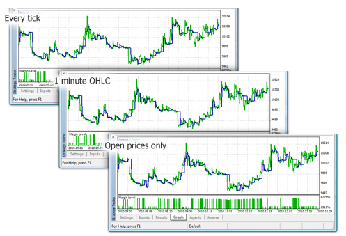
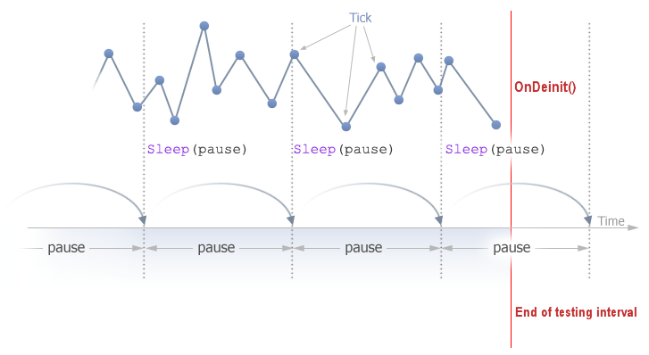
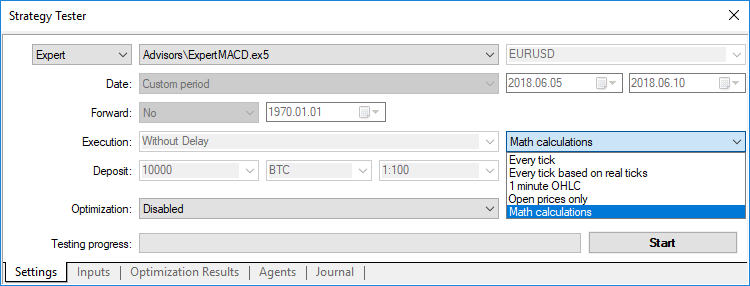
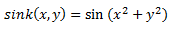
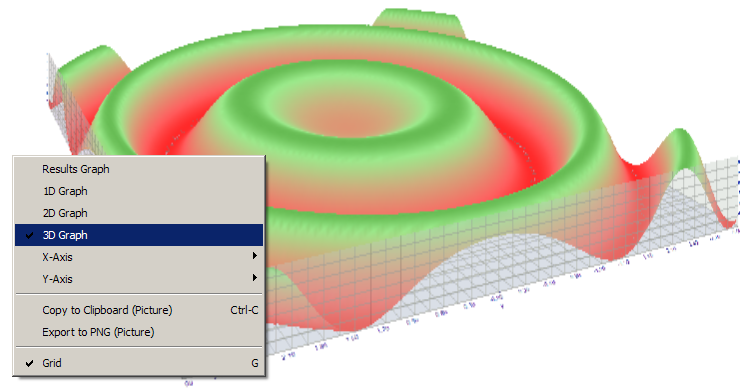
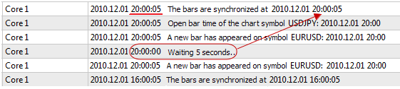
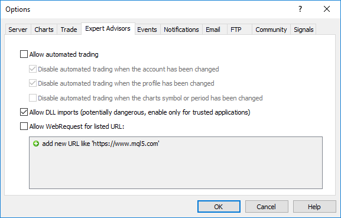

# Testing Trading Strategies

The idea of automated trading is appealing by the fact that the trading robot can work non-stop for 24 hours a day, seven days a week. The robot does not get tired, doubtful or scared, it's is totally free from any psychological problems. It is sufficient enough to clearly formalize the trading rules and implement them in the algorithms, and the robot is ready to work tirelessly. But first, you must make sure that the following two important conditions are met:

- The Expert Advisor performs [trading operations](/en/docs/constants/tradingconstants/enum_trade_request_actions) in accordance with the rules of the trading system;
- The trading strategy, implemented in the EA, demonstrates a profit on the history.

To get answers to these questions, we turn to the [Strategy Tester](https://www.metatrader5.com/en/automated-trading/strategy-tester), included in the MetaTrader 5 client terminal.

This section covers the features of program testing and optimization in the strategy tester:

- [Function Limitations in the Strategy Tester](/en/docs/runtime/testing#function_limitations)
- [Tick Generation Modes](/en/docs/runtime/testing#ticks)
- [Simulation of spread](/en/docs/runtime/testing#spread)
- [Using real ticks during a test](/en/docs/runtime/testing#real_ticks)
- [The Global Variables of the Client Terminal ](/en/docs/runtime/testing#globals)
- [The Calculation of Indicators During Testing ](/en/docs/runtime/testing#indicators)
- [Loading History during Testing](/en/docs/runtime/testing#history)
- [Multi-Currency Testing ](/en/docs/runtime/testing#multicurrency)
- [Simulation of Time in the Strategy Tester ](/en/docs/runtime/testing#time)
- [Graphical Objects in Testing](/en/docs/runtime/testing#objects)
- [The OnTimer() Function in the Strategy Tester ](/en/docs/runtime/testing#ontimer)
- [The Sleep() Function in the Strategy Tester ](/en/docs/runtime/testing#sleep)
- [Using the Strategy Tester for Optimization Problems in Mathematical Calculations ](/en/docs/runtime/testing#math)
- [The Synchronization of Bars in the "Open prices only" mode](/en/docs/runtime/testing#bar_synchro)
- [The IndicatorRelease() function in the Tester ](/en/docs/runtime/testing#indicatorrelease)
- [Event Handling in the Tester ](/en/docs/runtime/testing#events)
- [Testing Agents ](/en/docs/runtime/testing#agents)
- [The Data Exchange between the Terminal and the Agent](/en/docs/runtime/testing#data)
- [Using the Shared Folder of All of the Client Terminals ](/en/docs/runtime/testing#common_folder)
- [Using DLLs](/en/docs/runtime/testing#dll)

## 

## Memory and disk space limits in MQL5 Cloud Network

The following limitation applies to optimizations run in the [MQL5 Cloud Network](https://www.metatrader5.com/en/terminal/help/algotrading/strategy_optimization#cloud_start): the Expert Advisor must not write to disk more than 4GB of information or use more than 4GB of RAM. If the limit is exceeded, the network agent will not be able to complete the calculation correctly, and you will not receive the result. However, you will be charged for all the time spent on the calculations.

If you need to get information from each optimization pass, [send frames](/en/docs/optimization_frames) without writing to disk. To avoid using [file operations](/en/docs/files) in Expert Advisors during calculations in the MQL5 Cloud Network, you can use the following check:

```
   int handle=INVALID_HANDLE;
   bool file_operations_allowed=true;
   if(MQLInfoInteger(MQL_OPTIMIZATION) || MQLInfoInteger(MQL_FORWARD))
      file_operations_allowed=false;
 
   if(file_operations_allowed)
     {
      ...
      handle=FileOpen(...);
      ...
     }

```

## Function Limitations in the Strategy Tester  #

There are operation limitations for some functions in the client terminal's Strategy Tester.

### The Comment(), Print() and PrintFormat() Functions  #

To increase performance [Comment()](/en/docs/common/comment), [Print()](/en/docs/common/print) and [PrintFormat()](/en/docs/common/printformat) functions are not executed when optimizing the trading robot's parameters. The exception is the use of these functions inside the [OnInit()](/en/docs/event_handlers/oninit) handler. This allows you to easily find the cause of errors when they occur.

### The Alert(), MessageBox(), PlaySound(), SendFTP, SendMail(), SendNotification(), WebRequest() Functions  #

The [Alert()](/en/docs/common/alert), [MessageBox()](/en/docs/common/messagebox), [PlaySound()](/en/docs/common/playsound), [SendFTP()](/en/docs/network/sendftp), [SendMail()](/en/docs/network/sendmail), [SendNotification()](/en/docs/network/sendnotification) and [WebRequest()](/en/docs/network/webrequest) functions designed for interaction with the "outside world" are not executed in the Strategy Tester.

## 

## Tick Generation Modes  #

An Expert Advisor is a program, written in MQL5, that is run each time in response to some external [event](/en/docs/runtime/event_fire). The EA has a corresponding function ([event handler](/en/docs/basis/function/events)) for each pre-defined event.

The [NewTick](/en/docs/runtime/event_fire#newtick) event (price change) is the main event for the EA and, therefore,  we need to generate a tick sequence to test the EA. There are 3 modes of tick generation implemented in the Strategy Tester of MetaTrader 5 client terminal:

- Every tick
- 1 Minute OHLC (OHLC prices with minute bars)
- Open prices only

The basic and the most detailed is the "Every tick" mode, the other two modes are the simplifications of the basic one, and will be described in comparison to the "Every tick" mode. Consider all three modes in order to understand the differences between them.

### "Every Tick"

The historical quotes data for financial instruments is transferred from the trading server to the MetaTrader 5 client terminal in the form of packed minute bars. Detailed information on the occurrence of requests and the construction of the required time-frames can be obtained from the [Organizing Data Access](/en/docs/series/timeseries_access) chapter of MQL5 Reference.

The minimal element of the price history is the minute bar, from which you can obtain information on the four values of the price:

- Open - the price at which the minute bar was opened;
- High - the maximum that was achieved during this minute bar;
- Low - the minimum that was achieved during this minute bar;
- Close - the closing price of the bar.

The new minute bar is not opened at the moment when the new minute begins (number of seconds becomes equal to 0), but when a tick occurs - a price change by at least one point. The figure shows the first minute bar of the new trading week, which has the opening time of 2011.01.10 00:00. The price gap between Friday and Monday, which we see on the chart, is common, since currency rates fluctuates even on weekends in response to incoming news.


For this bar, we only know that the minute bar was opened on January 10th 2011 at 00 hours 00 minutes, but we know nothing about the seconds. It could have been opened at 00:00:12 or 00:00:36 (12 or 36 seconds after the start of a new day) or any other time within that minute. But we do know that the Open price of EURUSD was at 1.28940 at the opening time of the new minute bar.

We also don't know (accurate within a second) when we received the tick corresponding to the closing price of the considered minute bar. We known only one thing - the last Close price of the minute bar. For this minute, the price was 1.28958. The time of the appearance of High and Low prices is also unknown, but we know that the maximum and minimum prices were on the levels of 1.28958 and 1.28940, respectively.

To test the trading strategy, we need a sequence of ticks, on which the work of the Expert Advisor will be simulated. Thus, for every minute bar, we know the 4 control points, where the price has definitely been. If a bar has only 4 ticks, then this is enough information to perform a testing, but usually the tick volume is greater than 4.

Hence, there is a need to generate additional control points for ticks, which occurred between the Open, High, Low, and Close prices. The principle of the "Every tick" ticks generation mode is described in the [The Algorithm of Ticks’ Generation within the Strategy Tester of the MetaTrader 5 Terminal](https://www.mql5.com/en/articles/75) a figure from which is presented below.


When testing in the "Every tick" mode, the [OnTick()](/en/docs/event_handlers/ontick) function of the EA will be called at every control point. Each control point is a tick from a generated sequence. The EA will receive the time and price of the simulated tick, just as it would when working online.

```
Important: the "Every tick" testing mode is the most accurate, but at the same time, the most time consuming. For an initial testing of the majority of trading strategies, it is usually sufficient to use one of the other two testing modes.

```

### "1 Minute OHLC"

The "Every tick" mode is the most accurate of the three modes, but at the same time, is the slowest. The running of the OnTick() handler occurs at every tick, while tick volume can be quite large. For a strategy, in which the tick sequence of price movement throughout the bar, does not matter, there is a faster and rougher simulation mode - "1 minute OHLC".

In the "1 minute OHLC" mode, the tick sequence is constructed only by the OHLC prices of the minute bars, the number of the generated control points is significantly reduced - hence, so is the testing time. The launch of the OnTick () function is performed on all control points, which are constructed by the prices of OHLC minute bars.

The refusal to generate additional intermediate ticks between the Open, High, Low, and Close prices, leads to an appearance of rigid determinism in the development of prices, from the moment that the Open price is determined. This makes it possible to create a "Testing Grail", which shows a nice upward graph of the testing balance.

An example of such Grail is presented in the CodeBase - [Grr-al](https://www.mql5.com/en/code/244).


The figure shows a very attractive graph of this EA testing. How was it obtained? We know 4 prices for a minute bar, and we also know that the first is the Open price, and the last is the Close price. We have the High and Low prices between them, and the sequence of their occurrence is unknown, but it is known, that the High price is greater than or equal to the Open price (and the Low price is less than or equal to the Open price).

It is sufficient enough to determine the moment of receiving the Open price, and then analyze the next tick in order to determine what price we have at the moment - either the High or the Low. If the price is below the Open price, then we have a Low price and buy at this tick, the next tick will correspond to the High price, at which we will close the buy and open for sell. The next tick is the last one, this is the Close price, and we close the sale on it.

If after the price, we receive a tick with a price greater than the opening price, then the sequence of deals is reversed. Process a minute bar in this "cheat" mode, and wait for the next one.

When testing such EA on the history, everything goes smoothly, but once we launch it online, the truth begins to get revealed - the balance line remains steady, but heads downwards. To expose this trick, we simply need to run the EA in the "Every tick" mode.

```
Note: If the test results of the EA in the rough testing modes ("1 minute OHLC" and "Open Prices only") seem too good, make sure to test it in the "Every tick" mode.

```

### "Open Prices Only"

In this mode ticks are generated based on the OHLC prices of the timeframe selected for testing. The OnTick() function of the Expert Advisor runs only at the beginning of the bar at the Open price. Due to this feature, stop levels and pending may trigger at a price that differs from the specified one (especially when testing on higher timeframes). Instead, we have an opportunity to quickly run an evaluation test of the Expert Advisor.

W1 and MN1 periods are the exceptions in the "Open Price Only" ticks generation mode: for these timeframes ticks are generated for the OHLC prices of each day, not OHLC prices of the week or month.

Suppose we test an Expert Advisor on EURUSD H1 in the "Open Prices Only" mode. In this case the total number of ticks (control points) will be no more than 4*number of one-hour bars within the tested interval. But the OnTick() handler is called only at the opening of the one-hour bar. The checks required for a correct testing occur on the rest of the ticks (that are "hidden" from the EA).

- The calculation of margin requirements;
- The triggering of Stop Loss and Take Profit levels;
- The triggering of pending orders;
- The removal of expired pending orders.

If there are no open positions or pending orders, we don't need to perform these checks on hidden ticks, and the increase of speed may be quite substantial. This "Open prices only" mode is well suited for testing strategies, which process deals only at the opening of the bar and do not use pending orders, as well as StopLoss and TakeProfit orders. For the class of such strategies, the necessary accuracy of testing is preserved.

Let's use the Moving Average Expert Advisor from the standard package as an example of an EA, which can be tested in any mode. The logic of this EA is built in such a way that all of the decisions are made at the opening of the bar, and deals are carried out immediately, without the use of pending orders.

Run a testing of the EA on EURUSD H1 on an interval from 2010.09.01 to 2010.12.31, and compare the graphs. The figure shows the balance graph from the test report for all of the three modes.



As you can see, the graphs on different testing modes are exactly the same for the Moving Average EA from the standard package.

There are some limitations on the "Open Prices Only" mode:

- You cannot use [the Random Delay execution mode](https://www.metatrader5.com/en/terminal/help/algotrading/testing#trade_mode).
- In the tested Expert Advisor, you cannot access data of the [timeframe](https://www.metatrader5.com/en/terminal/help/algotrading/testing#symbol) lower than that used for testing/optimization. For example, if you run testing/optimization on the H1 period, you can access data of H2, H3, H4 etc., but not M30, M20, M10 etc. In addition, the higher timeframes that are accessed must be multiple of the testing timeframe. For example, if you run testing in M20, you cannot access data of M30, but it is possible to access H1. These limitations are connected with the impossibility to obtain data of lower or non-multiple timeframes out of the bars generated during testing/optimization.
- Limitations on accessing data of other timeframes also apply to other symbols whose data are used by the Expert Advisor. In this case the limitation for each symbol depends on the first timeframe accessed during testing/optimization. Suppose, during testing on EURUSD H1, an Expert Advisor accesses data of GBPUSD M20. In this case the Expert Advisor will be able to further use data of EURUSD H1, H2, etc., as well as GBPUSD M20, H1, H2 etc.

```
Note: The "Open prices only" mode has the fastest testing time, but it is not suitable for all of the trading strategies. Select the desired test mode based on the characteristics of the trading system. 

```

To conclude the section on the tick generation modes, let's consider a visual comparison of the different tick generation modes for EURUSD, for two M15 bars on an interval from 2011.01.11 21:00:00 - 2011.01.11 21:30:00.

The ticks were saved into different files using the WriteTicksFromTester.mq5 EA and the ending of these files names are specified in filenameEveryTick, filenameOHLC and filenameOpenPrice [input-parameters](/en/docs/basis/variables/inputvariables).


To obtain three files with three tick sequences (for each of the following modes "Every tick", "1 minute OHLC" and "Open prices only), the EA was launched three times in the corresponding modes, in single runs. Then, the data from these three files were displayed on the chart using the TicksFromTester.mq5 indicator. The indicator code is attached to this article.


By default, all of the [file operations](/en/docs/files) in the MQL5 language are made within the "file sandbox", and during testing the EA has access only to its own "file sandbox". In order for the indicator and the EA to work with files from one folder during testing, we used the [flag FILE_COMMON](/en/docs/constants/io_constants/fileflags). An example of code from the EA:

```
//--- open the file
   file=FileOpen(filename,FILE_WRITE|FILE_CSV|FILE_COMMON,";");
//--- check file handle
   if(file==INVALID_HANDLE)
     {
      PrintFormat("Error in opening of file %s for writing. Error code=%d",filename,GetLastError());
      return;
     }
   else
     {
      PrintFormat("The file will be created in %s folder",TerminalInfoString(TERMINAL_COMMONDATA_PATH));
     }

```

For reading the data in the indicator, we also used the [flag FILE_COMMON](/en/docs/constants/io_constants/fileflags). This allowed us to avoid manually transferring the necessary files from one folder to another.

```
//--- open the file
   int file=FileOpen(fname,FILE_READ|FILE_CSV|FILE_COMMON,";");
//--- check file handle
   if(file==INVALID_HANDLE)
     {
      PrintFormat("Error in open of file %s for reading. Error code=%d",fname,GetLastError());
      return;
     }
   else
     {
      PrintFormat("File will be opened from %s",TerminalInfoString(TERMINAL_COMMONDATA_PATH));
     }

```

## Simulation of spread  #

The price difference between the Bid and the Ask prices is called the spread. During testing, the spread is not modeled but is taken from historical data. If the spread is less than or equal to zero in the historical data, then the last known (at the moment of generation) spread is used by testing agent.

In the Strategy Tester, the spread is always considered floating. That is, [SymbolInfoInteger](/en/docs/marketinformation/symbolinfointeger)(symbol, SYMBOL_SPREAD_FLOAT) always returns true.

In addition, the historical data contains tick values and trading volumes. For the storage and retrieval of data we use a special [MqlRates](/en/docs/constants/structures/mqlrates) structure:

```
struct MqlRates
  {
   datetime time;         // Period start time
   double   open;         // Open price
   double   high;         // The highest price of the period
   double   low;          // The lowest price of the period
   double   close;        // Close price
   long     tick_volume;  // Tick volume
   int      spread;       // Spread
   long     real_volume;  // Trade volume
  };

```

## Using real ticks during a test  #

Testing and optimization on real ticks are as close to real conditions as possible. Instead of generated ticks based on minute data, it is possible to use real ticks accumulated by a broker. These are ticks from exchanges and liquidity providers.

To ensure the greatest test accuracy, minute bars are also used in the real ticks mode. The bars are applied to check and correct tick data. This also allows you to avoid the divergence of charts in the tester and the client terminal.

The tester compares the tick data to the minute bar parameters: a tick should not exceed the bar's High/Low levels, also initial and final ticks should coincide with the bar's Open/Close prices. The volume is compared as well. If a mismatch is detected, all ticks corresponding to this minute bar are discarded. Generated ticks are used instead (like in the "Every tick" mode).

If a symbol history has a minute bar with no tick data for it, the tester generates ticks in the "Every tick" mode. This allows plotting a correct chart in the tester in case a broker's tick data is insufficient.

If a symbol history has no minute bar but the appropriate tick data for the minute is present, the data can be used in the tester. For example, exchange symbol pairs are formed using Last prices. If only ticks with Bid/Ask prices without the Last price arrive from the server, the bar is not generated. The tester uses these tick data since they do not contradict the minute ones.

Tick data may not coincide with minute bars for various reasons, for example because of connection losses or other failures when transmitting data from a source to the client terminal. The minute data is considered more reliable during tests.

Keep in mind the following features when testing on real ticks:

- When launching a test, the minute data on a symbol is synchronized along with the tick one.
- Ticks are stored in the symbol cache of the strategy tester. The cache size does not exceed 128 000 ticks. When new ticks arrive, the oldest data is removed from the cache. However, the [CopyTicks](/en/docs/series/copyticks) function allows receiving ticks outside the cache (only when testing on real ticks). In that case, the data is requested from the tester tick database that is completely similar to the corresponding client terminal database. No minute bar corrections are implemented to this base. Therefore, the ticks there may differ from the ones stored in the cache.

## The Global Variables of the Client Terminal  #

During testing, the [global variables of the client terminal](/en/docs/globals) are also emulated, but they are not related to the current [global variables of the terminal](https://www.metatrader5.com/en/terminal/help/algotrading/service_global), which can be seen in the terminal using the F3 button. It means that all operations with the global variables of the terminal, during testing, take place outside of the client terminal (in the testing agent).

## The Calculation of Indicators During Testing  #

In the real-time mode, the [indicator values are calculated](/en/docs/event_handlers/oncalculate) at every tick.

In the Strategy Tester, indicators are calculated only when they are accessed for data, i.e. when indicator buffer values are requested. The only exceptions are [custom indicators](/en/docs/customind) with the specified [#property tester_everytick_calculate](/en/docs/basis/preprosessor/compilation). In this case, recalculation is done on each tick.

In the visual testing mode, all indicators are unconditionally recalculated when a new tick arrives in order to be correctly displayed on the visual testing chart.

The indicator is calculated once per tick. All subsequent requests for indicator data do not lead to recalculation until a new tick arrives. Therefore, if the timer is enabled in an EA via the [EventSetTimer()](/en/docs/eventfunctions/eventsettimer) function, the indicator data is requested from the last tick before each call of the [OnTimer()](/en/docs/event_handlers/ontimer) handler. If the indicator has not been calculated on the last tick yet, the calculations of the indicator values are launched. If the data has already been prepared, it is provided without a new recalculation.

Thus, all indicator calculations are performed in the most resource-saving manner — if the indicator has already been calculated at a given tick, its data is provided 'as is'. No recalculation is launched.

## Loading History during Testing  #

The history of a symbol to be tested is synchronized and loaded by the terminal from the trade server before starting the testing process. During the first time, the terminal loads all available history of a symbol in order not to request it later. Further only the new data are loaded.

A testing agent receives the history of a symbol to be tested from the client terminal right after the start of testing. If data of other instruments are used in the process of testing (for example, it is a multicurrency Expert Advisor), the testing agent requests the required history from the client terminal during the first call to such data. If historical data are available in the terminal, they are immediately passed to the testing agent. If data are not available, the terminal requests and downloads them from the server, and then passes to the testing agent.

Data of additional instruments is also required for calculating cross-rates for trade operations. For example, when testing a strategy on EURCHF with the deposit currency in USD, prior to processing the first trading operation, the testing agent requests the history data of EURUSD and USDCHF from the client terminal, though the strategy does not contain direct use call of these symbols.

Before testing a multi-currency strategy, it is recommended to download all the necessary historical data to the client terminal. This will help to avoid delays in testing/optimization associated with download of the required data. You can download history, for example, by opening the appropriate charts and scrolling them to the history beginning. An example of forced loading of history into the terminal is available in the [Organizing Access to Data](/en/docs/series/timeseries_access) section of the MQL5 Reference.

Testing agents, in turn, receive history from the terminal in the packed form. During the next testing, the tester does not load history from the terminal, because the required data is available since the previous run of the tester.

```

The terminal loads history from a trade server only once, the first time the agent requests the history of a symbol to be tested from the terminal. The history is loaded in a packed form to reduce the traffic.
Ticks are not sent over the network, they are generated on testing agents.

```

## Multi-Currency Testing  #

The Strategy Tester allows us to perform a testing of strategies, trading on multiple symbols. Such EAs are conventionally referred to as multi-currency Expert Advisors, since originally, in the previous platforms, testing was performed only for a single symbol. In the Strategy Tester of the MetaTrader 5 terminal, we can model trading for all of the available symbols.

The tester loads the history of the used symbols from the client terminal (not from the trade server!) automatically during the first call of the symbol data.

The testing agent downloads only the missing history, with a small margin to provide the necessary data on the history, for the calculation of the indicators at the starting time of testing. For the time-frames D1 and less, the minimum volume of the downloaded history is one year.

Thus, if we run a testing on an interval 2010.11.01-2010.12.01 (testing for an interval of one month) with a period of M15 (each bar is equal to 15 minutes), then the terminal will be requested the history for the instrument for the entire year of 2010. For the weekly time-frame, we will request a history of 100 bars, which is about two years (a year has 52 weeks). For testing on a monthly time-frame the agent will request the history of 8 years (12 months x 8 years = 96 months).

If there isn't necessary bars, the starting date of testing will be automatically shifted from past to present to provide the necessary reserve of bars before the testing.

During testing, the "[Market Watch](https://www.metatrader5.com/en/terminal/help/trading/market_watch)" is emulated as well, from which one can obtain [information on symbols](/en/docs/marketinformation).

By default, at the beginning of testing, there is only one symbol in the "Market Watch" of the Strategy Tester - the symbol that the testing is running on. All of the necessary symbols are connected to the "Market Watch" of the Strategy Tester (not terminal!) automatically when referred to.

```
Prior to starting testing of a multi-currency Expert Advisor, it is necessary to select symbols required for testing in the "Market Watch" of the terminal and load the required data. During the first call of a "foreign" symbol, its history will be automatically synchronized between the testing agent and the client terminal. A "foreign" symbol is the symbol other than that on which testing is running.

```

Referral to the data of an "other" symbol occurs in the following cases:

- When using the [technical indicators function](/en/docs/indicators) and [IndicatorCreate()](/en/docs/series/indicatorcreate) on the symbol/timeframe;
- The request to the "Market Watch" data for the other symbol:

- [SeriesInfoInteger](/en/docs/series/seriesinfointeger)
[Bars](/en/docs/series/bars)
[SymbolSelect](/en/docs/marketinformation/symbolselect)
[SymbolIsSynchronized](/en/docs/marketinformation/symbolissynchronized)
[SymbolInfoDouble](/en/docs/marketinformation/symbolinfodouble)
[SymbolInfoInteger](/en/docs/marketinformation/symbolinfointeger)
[SymbolInfoString](/en/docs/marketinformation/symbolinfostring)
[SymbolInfoTick](/en/docs/marketinformation/symbolinfotick)
[SymbolInfoSessionQuote](/en/docs/marketinformation/symbolinfosessionquote)
[SymbolInfoSessionTrade](/en/docs/marketinformation/symbolinfosessiontrade)
[MarketBookAdd](/en/docs/marketinformation/marketbookadd)
[MarketBookGet](/en/docs/marketinformation/marketbookget)

- Request of the time-series for a symbol/timeframe by using the following functions:

- [CopyBuffer](/en/docs/series/copybuffer)
[CopyRates](/en/docs/series/copyrates)
[CopyTime](/en/docs/series/copytime)
[CopyOpen](/en/docs/series/copyopen)
[CopyHigh](/en/docs/series/copyhigh)
[CopyLow](/en/docs/series/copylow)
[CopyClose](/en/docs/series/copyclose)
[CopyTickVolume](/en/docs/series/copytickvolume)
[CopyRealVolume](/en/docs/series/copyrealvolume)
[CopySpread](/en/docs/series/copyspread)

At the moment of the first call to an "other" symbol, the testing process is stopped and the history is downloaded for the symbol/timeframe, from the terminal to the testing agent. At the same time, the generation of tick sequence for this symbol is made.

An individual tick sequence is generated for each symbol, according to the selected tick generation mode. You can also request the history explicitly for the desired symbols by calling the [SymbolSelect()](/en/docs/marketinformation/symbolselect) in the OnInit() handler - the downloading of the history will be made immediately prior to the testing of the Expert Advisor.

Thus, it does not require any extra effort to perform multi-currency testing in the MetaTrader 5 client terminal. Just open the charts of the appropriate symbols in the client terminal. The history will be automatically uploaded from the trading server for all the required symbols, provided that it contains this data.

## Simulation of Time in the Strategy Tester  #

During testing, the local time [TimeLocal()](/en/docs/dateandtime/timelocal) is always equal to the server time [TimeTradeServer()](/en/docs/dateandtime/timetradeserver). In turn, the server time is always equal to the time corresponding to the GMT time - [TimeGMT()](/en/docs/dateandtime/timegmt). This way, all of these functions display the same time during testing.

The lack of a difference between the GMT, the Local, and the server time in the Strategy Tester is done deliberately in case there is no connection to the server. The test results should always be the same, regardless of whether or not there is a connection. Information about the server time is not stored locally, and is taken from the server.

## Graphical Objects in Testing  #

During testing/optimization graphical objects are not plotted. Thus, when referring to the properties of a created object during testing/optimization, an Expert Advisor will receive zero values.

```
This limitation does not apply to testing in visual mode.

```

## The OnTimer() Function in the Strategy Tester  #

MQL5 provides the opportunity for handling timer events. The call of the [OnTimer()](/en/docs/event_handlers/ontimer) handler is done regardless of the test mode. This means that if a test is running in the "Opening prices only" mode for the period H4, and the EA has a timer set to a call per second, then at the opening of each H4 bar, the OnTick() handler will be called one time, and the OnTimer() handler will be called 14400 times (3600 seconds * 4 hours ). The amount by which the testing time of the EA will be increased depends on the logic of the EA.

To check the dependence of the testing time from the given frequency of the timer, we have created a simple EA without any trading operations.

```
//--- input parameters
input int      timer=1;              // timer value, sec
input bool     timer_switch_on=true; // timer on
//+------------------------------------------------------------------+
//| Expert initialization function                                   |
//+------------------------------------------------------------------+
int OnInit()
  {
//--- run the timer if  timer_switch_on==true
   if(timer_switch_on)
     {
      EventSetTimer(timer);
     }
//---
   return(INIT_SUCCEEDED);
  }
//+------------------------------------------------------------------+
//| Expert deinitialization function                                 |
//+------------------------------------------------------------------+
void OnDeinit(const int reason)
  {
//--- stop the timer
   EventKillTimer();
  }
//+------------------------------------------------------------------+
//| Timer function                                                   |
//+------------------------------------------------------------------+
void OnTimer()
  {
//---
// take no actions, the body of the handler is empty
  }
//+------------------------------------------------------------------+

```

Testing time measurements were taken at different values of the timer parameter (periodicity of the Timer event). On the obtained data, we plot a testing time as function of Timer period.


It can be clearly seen that the smaller is the parameter timer, during the initialization of the [EventSetTimer](/en/docs/eventfunctions/eventsettimer)(Timer) function, the smaller is the period (Period) between the calls of the OnTimer() handler, and the larger is the testing time T, under the same other conditions.

## The Sleep() Function in the Strategy Tester  #

The [Sleep()](/en/docs/common/sleep) function allows the EA or script to suspend the execution of the mql5-program for a while, when working on the graph. This can be useful when requesting data, which is not ready at the time of the request and you need to wait until it is ready. A detailed example of using the Sleep() function can be found in the section [Organizing Data Access](/en/docs/series/timeseries_access).

The testing process is not lingered by the Sleep() calls.When you call the Sleep(), the generated ticks are "played" within a specified delay, which may result in the triggering of pending orders, stops, etc. After a Sleep() call, the simulated time in the Strategy Tester increases by an interval, specified in the parameter of the Sleep function.

If as a result of the execution of the Sleep() function, the current time in the Strategy Tester went over the testing period, then you will receive an error "Infinite Sleep loop detected while testing". If you receive this error, the test results are not rejected, all of the computations are performed in their full volume (the number of deals, subsidence, etc.), and the results of this testing are passed on to the terminal.

The Sleep() function will not work in OnDeinit(), since after it is called, the testing time will be guaranteed to surpass the range of the testing interval.



## Using the Strategy Tester for Optimization Problems in Mathematical Calculations  #

The tester in the MetaTrader 5 terminal can be used, not only to testing trading strategies, but also for mathematical calculations. To use it, it's necessary to select the "Math calculations" mode:



In this case, only three functions will be called: OnInit(), OnTester(), OnDeinit(). In "Math calculations" mode the Strategy Tester doesn't generate any ticks and download the history.

The Strategy Tester works in "Math calculations" mode also if you specify the starting date greater than ending date.

When using the tester to solve mathematical problems, the uploading of the history and the generation of ticks does not occur.

A typical mathematical problem for solving in the MetaTrader 5 Strategy Tester - searching for an extremum of a function with many variables.

To solve it we need to:

- The calculation of function value should be located in [OnTester()](/en/docs/event_handlers/ontester) function;
- The function parameters must be defined as [input-variables](/en/docs/basis/variables/inputvariables) of the Expert Advisor;

Compile the EA, open the "Strategy Tester" window. In the "Input parameters" tab, select the required input variables, and define the set of parameter values by specifying the start, stop and step values for each of the function variables.

Select the optimization type - "Slow complete algorithm" (full search of parameters space) or "Fast genetic based algorithm". For a simple search of the extremum of the function, it is better to choose a fast optimization, but if you want to calculate the values for the entire set of variables, then it is best to use the slow optimization.

Select "Math calculation" mode and using the "Start" button, run the optimization procedure. Note that during the optimization the Strategy Tester will search for the maximum values of the OnTester function. To find a local minimum, return the inverse of the computed function value from the OnTester function:

```
return(1/function_value);

```

It is necessary to check that the function_value is not equal to zero, since otherwise we can obtain a [critical error](/en/docs/runtime/errors) of dividing by zero.

There is another way, it is more convenient and does not distort the results of optimization, it was suggested by the readers of this article:

```
return(-function_value);

```

This option does not require the checking of the function_value for being equal to zero, and the surface of the optimization results in a 3D-representation has the same shape. The only difference is that it is mirrored comparing to the original.

As an example, we provide the sink() function:



The code of the EA for finding the extremum of this function is placed into the OnTester():

```
//+------------------------------------------------------------------+
//|                                                         Sink.mq5 |
//|                        Copyright 2011, MetaQuotes Software Corp. |
//|                                              https://www.mql5.com |
//+------------------------------------------------------------------+
#property copyright "Copyright 2000-2024, MetaQuotes Ltd."
#property link      "https://www.mql5.com"
#property version   "1.00"
//--- input parameters
input double   x=-3.0; // start=-3, step=0.05, stop=3
input double   y=-3.0; // start=-3, step=0.05, stop=3
//+------------------------------------------------------------------+
//| Tester function                                                  |
//+------------------------------------------------------------------+
double OnTester()
  {
//---
   double sink=MathSin(x*x+y*y);
//---
   return(sink);
  }
//+------------------------------------------------------------------+

```

Perform an optimization and see the [optimization results](https://www.metatrader5.com/en/terminal/help/algotrading/testing) in the form of a 2D graph.


The better the value is for a given pair of parameters (x, y), the more saturated the color is. As was expected from the view of the form of the sink() formula, its values forms concentric circles with a center at (0,0). One can see in the 3D-graph, that the sink() function has no single global extremum:



## The Synchronization of Bars in the "Open prices only" mode  #

The tester in the MetaTrader 5 client terminal allows us to check the so-called "multi-currency" EAs. A multi-currency EA - is an EA that trades on two or more symbols.

The testing of strategies, that are trading on multiple symbols, imposes a few additional technical requirements on the tester:

- The generation of ticks for these symbols;
- The calculation of indicator values for these symbols;
- The calculation of margin requirements for these symbols;
- Synchronization of generated tick sequences for all trading symbols.

The Strategy Tester generates and plays a tick sequence for each instrument in accordance with the selected trading mode. At the same time, a [new bar](https://www.mql5.com/en/articles/159) for each symbol is opened, regardless of how the bar opened on another symbol. This means that when testing a multi-currency EA, a situation may occur (and often does), when for one instrument a new bar has already opened, and for the other it has not. Thus, in testing, everything happens just like in reality.

This authentic simulation of the history in the tester does not cause any problems as long as the "Every tick" and "1 minute OHLC" testing modes are used. For these modes, enough ticks are generated for one candlestick, to be able to wait until the synchronization of bars from different symbols takes place. But how do we test multi-currency strategies in the "Open prices only" mode, if the synchronization of bars on trading instruments is mandatory? In this mode, the EA is called only on one tick, which corresponds to the time of the opening of the bars.

We'll illustrate it on an example: we are testing an EA on the EURUSD, and a new H1 candlestick has been opened on EURUSD. We can easily recognize this fact - while testing in the "Open prices only" mode, the [NewTick](/en/docs/runtime/event_fire#newtick) event corresponds to the moment of a bar opening on the tested period. But there is no guarantee that the new candlestick was opened on the USDJPY symbol, which is used in the EA.

Under normal circumstances, it is sufficient enough to complete the work of the [OnTick()](/en/docs/event_handlers/ontick) function and to check for the emergence of a new bar on USDJPY at the next tick. But when testing in the "Open prices only" mode, there will be no other tick, and so it may seem that this mode is not fit for testing multi-currency EAs. But this is not so - do not forget that the tester in MetaTrader 5 behaves just as it would in real life. You can wait until a new bar is opened on another symbols using the function Sleep()!

The code of the EA Synchronize_Bars_Use_Sleep.mq5, which shows an example of the synchronization of bars in the "Open prices only" mode:

```
//+------------------------------------------------------------------+
//|                                   Synchronize_Bars_Use_Sleep.mq5 |
//|                        Copyright 2011, MetaQuotes Software Corp. |
//|                                              https://www.mql5.com |
//+------------------------------------------------------------------+
#property copyright "Copyright 2000-2024, MetaQuotes Ltd."
#property link      "https://www.mql5.com"
#property version   "1.00"
//--- input parameters
input string   other_symbol="USDJPY";
//+------------------------------------------------------------------+
//| Expert initialization function                                   |
//+------------------------------------------------------------------+
int OnInit()
  {
//--- check symbol
   if(_Symbol==other_symbol)
     {
      PrintFormat("You have to specify the other symbol in input parameters or select other symbol in Strategy Tester!");
      //--- forced stop testing
      return(INIT_PARAMETERS_INCORRECT);
     }
//---
   return(INIT_SUCCEEDED);
  }
//+------------------------------------------------------------------+
//| Expert tick function                                             |
//+------------------------------------------------------------------+
void OnTick()
  {
//--- static variable, used for storage of last bar time
   static datetime last_bar_time=0;
//--- sync flag
   static bool synchonized=false;
//--- if static variable isn't initialized
   if(last_bar_time==0)
     {
      //--- it's first call, save bar time and exit
      last_bar_time=(datetime)SeriesInfoInteger(_Symbol,Period(),SERIES_LASTBAR_DATE);
      PrintFormat("The last_bar_time variable is initialized with value %s",TimeToString(last_bar_time));
     }
//--- get open time of the last bar of chart symbol
   datetime curr_time=(datetime)SeriesInfoInteger(Symbol(),Period(),SERIES_LASTBAR_DATE);
//--- if times aren't equal
   if(curr_time!=last_bar_time)
     {
      //--- save open bar time to the static variable
      last_bar_time=curr_time;
      //--- not synchronized
      synchonized=false;
      //--- print message
      PrintFormat("A new bar has appeared on symbol %s at %s",_Symbol,TimeToString(TimeCurrent()));
     }
//--- open time of the other symbol's bar
   datetime other_time;
//--- loop until the open time of other symbol become equal to curr_time
   while(!(curr_time==(other_time=(datetime)SeriesInfoInteger(other_symbol,Period(),SERIES_LASTBAR_DATE)) && !synchonized))
     {
      PrintFormat("Waiting 5 seconds..");
      //--- wait 5 seconds and call SeriesInfoInteger(other_symbol,Period(),SERIES_LASTBAR_DATE)
      Sleep(5000);
     }
//--- bars are synchronized
   synchonized=true;
   PrintFormat("Open bar time of the chart symbol %s: is %s",_Symbol,TimeToString(last_bar_time));
   PrintFormat("Open bar time of the symbol %s: is %s",other_symbol,TimeToString(other_time));
//--- TimeCurrent() is not useful, use TimeTradeServer()
   Print("The bars are synchronized at ",TimeToString(TimeTradeServer(),TIME_SECONDS));
  }
//+------------------------------------------------------------------+

```

Notice the last line in the EA, which displays the current time when the fact of synchronization was established:

```
   Print("The bars synchronized at ",TimeToString(TimeTradeServer(),TIME_SECONDS));

```

To display the current time we used the [TimeTradeServer()](/en/docs/dateandtime/timetradeserver) function rather than [TimeCurrent()](/en/docs/dateandtime/timecurrent). The TimeCurrent() function returns the time of the last tick, which does not change after using Sleep(). Run the EA in the "Open prices only" mode, and you will see a message about the synchronization of the bars.



Use the TimeTradeServer() function instead of the TimeCurrent(), if you need to obtain the current server time, and not the time of the last tick arrival.

There is another way to synchronize bars - using a timer. An example of such an EA is Synchronize_Bars_Use_OnTimer.mq5, which is attached to this article.

## The IndicatorRelease() function in the Tester  #

After completing a single testing, a chart of the instrument is automatically opened, which displays the completed deals and the indicators used in the EA. This helps to visually check the entry and exit points, and compare them with the values of the indicators.

```
Note: indicators, displayed on the chart, which automatically opens after the completion of the testing, are calculated anew after the completion of testing. Even if these indicators were used in the tested EA.

```

But in some cases, the programmer may want to hide the information on which indicators were involved in the trading algorithms. For example, the code of the EA is rented or sold as an executable file, without the provision of the source code. For this purpose, the IndicatorRelease() function is suitable.

If the terminal sets a template with the name tester.tpl in the directory/profiles/templates of the client terminal, then it will be applied to the opened chart. In its absence, the default template is applied. (default.tpl).

The [IndicatorRelease()](/en/docs/series/indicatorrelease) function is originally intended for releasing the calculating portion of the indicator, if it is no longer needed. This allows you to save both the memory and the CPU resources, because each tick calls for an indicator calculation. Its second purpose is to prohibit the showing of an indicator on the testing chart, after a single test run.

To prohibit the showing of the indicator on the chart after testing, call the [IndicatorRelease()](/en/docs/series/indicatorrelease) with the handle of the indicator in the handler [OnDeinit()](/en/docs/runtime/event_fire#deinit). The OnDeinit() function is always called after the completion and before the showing of the testing chart.

```
//+------------------------------------------------------------------+
//| Expert deinitialization function                                 |
//+------------------------------------------------------------------+
void OnDeinit(const int reason)
  {
//---
   bool hidden=IndicatorRelease(handle_ind);
   if(hidden) Print("IndicatorRelease() successfully completed");
   else Print("IndicatorRelease() returned false. Error code ",GetLastError());
  }

```

In order to prohibit the showing of the indicator on the chart, after the completion of a single test, use the function IndicatorRelease() in the handler OnDeinit().

## Event Handling in the Tester  #

The presence of the OnTick() handler in the EA is not mandatory in order for it to be subjected to testing on historical data in the MetaTrader 5 tester. It is sufficient enough for the EA ti contain at least one of the following function-handlers:

- [OnTick()](/en/docs/event_handlers/ontick) - Event handler of a new tick arrival;
- [OnTrade()](/en/docs/event_handlers/ontrade) - Trading event handler;
- [OnTimer()](/en/docs/event_handlers/ontimer) - Event handler of a signal arrival from the timer;
- [OnChartEvent()](/en/docs/event_handlers/onchartevent) - a handler for client events.

When testing in an EA, we can handle custom events using the [OnChartEvent()](/en/docs/event_handlers/onchartevent) function, but in the indicators, this function can not be called in the tester. Even if the indicator has the [OnChartEvent()](/en/docs/event_handlers/onchartevent) event handler and this indicator is used in the tested EA, the indicator itself will not receive any custom events.

During testing, an Indicator can generate custom events using the [EventChartCustom()](/en/docs/eventfunctions/eventchartcustom) function, and the EA can process this event in the OnChartEvent().

In addition to these events, special events associated with the process of testing and optimization are generated in the strategy tester:

- Tester - this event is generated after completion of Expert Advisor testing on history data. The Tester event is handled using the [OnTester()](/en/docs/event_handlers/ontester) function. This function can be used only when testing Expert Advisor and is intended primarily for the calculation of a value that is used as a Custom max criterion for genetic optimization of input parameters.
- TesterInit - this event is generated during the start of optimization in the strategy tester before the very first pass. The TesterInit event is handled using the [OnTesterInit()](/en/docs/event_handlers/ontesterinit) function. During the start of optimization, an Expert Advisor with this handler is automatically loaded on a separate terminal chart with the symbol and period specified in the tester, and receives the TesterInit event. The function is used to initiate an Expert Advisor before start of optimization for further [processing of optimization results](/en/docs/optimization_frames).
- TesterPass - this event is generated when a new [data frame](/en/docs/optimization_frames/frameadd) is received. The TesterPass event is handled using the [OnTesterPass()](/en/docs/event_handlers/ontesterpass) function. An Expert Advisor with this handler is automatically loaded on a separate terminal chart with the symbol/period specified for testing, and receives the TesterPass event when a frame is received during optimization. The function is used for dynamic handling of [optimization results](/en/docs/optimization_frames) "on the spot" without waiting for its completion. Frames are added using the [FrameAdd()](/en/docs/optimization_frames/frameadd) function, which can be called after the end of a single pass in the [OnTester()](/en/docs/event_handlers/ontester) handler.
- TesterDeinit - this event is generated after the end of Expert Advisor optimization in the strategy tester. The TesterDeinit event is handles using the [OnTesterDeinit()](/en/docs/event_handlers/ontesterdeinit) function. An Expert Advisor with this handler is automatically loaded on a chart at the start of optimization, and receives TesterDeinit after its completion. The function is used for final processing of all [optimization results](/en/docs/optimization_frames).

## Testing Agents  #

Testing in the MetaTrader 5 client terminal is carried out using [test agents](https://www.metatrader5.com/en/terminal/help/algotrading/testing). Local agents are created and enabled automatically. The default number of local agents corresponds to the number of cores in a computer.

Each testing agent has its own copy of the [global variables](/en/docs/basis/variables/global), which is not related to the client terminal. The terminal itself is the dispatcher, which distributes the tasks to the local and remote agents. After executing a task on the testing of an EA, with the given parameters, the agent returns the results to the terminal. With a single test, only one agent is used.

The agent stores the history, received from the terminal, in separate folders, by the name of the instrument, so the history for EURUSD is stored in a folder named EURUSD. In addition, the history of the instruments is separated by their sources. The structure for storing the history looks the following way:

```
tester_catalog\Agent-IPaddress-Port\bases\name_source\history\symbol_name

```

For example, the history for EURUSD from the server MetaQuotes-Demo can be stored in the folder tester_catalog\Agent-127.0.0.1-3000\bases\MetaQuotes-Demo\EURUSD.

A local agent, after the completion of testing, goes into a standby mode, awaiting for the next task for another 5 minutes, so as not to waste time on launching for the next call. Only after the waiting period is over, the local agent shuts down and unloads from the CPU memory.

In case of an early completion of the testing, from the user's side (the "Cancel" button), as well as with the closing of the client terminal, all local agents immediately stop their work and are unloaded from the memory.

## The Data Exchange between the Terminal and the Agent  #

When you run a test, the client terminal prepares to send an agent a number of parameter blocks:

- Input parameters for testing (simulation mode, the interval of testing, instruments, optimization criterion, etc.)
- The list of the selected symbols in the "Market Watch"
- The specification of the testing symbol (the contract size, the allowable margins from the market for setting a StopLoss and Takeprofit, etc)
- The Expert Advisor to be tested and the values of its input parameters
- Information about additional files (libraries, indicators, data files - [# property tester_ ...](/en/docs/basis/preprosessor/compilation))

| tester_indicator | string | Name of a custom indicator in the format of "indicator_name.ex5". Indicators that require testing are defined automatically from the call of the  iCustom()  function, if the corresponding parameter is set through a constant string. For all other cases (use of the  IndicatorCreate()  function or use of a non-constant string in the parameter that sets the indicator name) this property is required |
| --- | --- | --- |
| tester_file | string | File name for a tester with the indication of extension, in double quotes (as a constant string). The specified file will be passed to tester. Input files to be tested, if there are necessary ones, must always be specified. |
| tester_library | string | Library name with the extension, in double quotes. A library can have extension dll or ex5. Libraries that require testing are defined automatically. However, if any of libraries is used by a  custom  indicator, this property is required |

For each block of parameters, a digital fingerprint in the form of MD5-hash is created, which is sent to the agent. MD5-hash is unique for each set, its volume is many more times smaller than the amount of information on which it is calculated.

The agent receives a hash of blocks and compares them with those that it already has. If the fingerprint of the given parameter block is not present in the agent, or the received hash is different from the existing one, the agent requests this block of parameters. This reduces the traffic between the terminal and the agent.

After the testing, the agent returns to the terminal all of the results of the run, which are shown in the tabs "Test Results" and "Optimization Results": the received profit, the number of deals, the Sharpe coefficient, the result of the OnTester() function, etc.

During optimizing, the terminal hands out testing tasks to the agents in small packages, each package contains several tasks (each task means single testing with a set of input parameters). This reduces the exchange time between the terminal and the agent.

The agents never record to the hard disk the EX5-files, obtained from the terminal (EA, indicators, libraries, etc.) for security reasons, so that a computer with a running agent could not use the sent data. All other files, including DLL, are recorded in the sandbox. In remote agents you can not test EAs using DLL.

The testing results are added up by the terminal into a special cache of results (the result cache), for a quick access to them when they are needed. For each set of parameters, the terminal searches the result cache for already available results from the previous runs, in order to avoid re-runs. If the result with such a set of parameters is not found, the agent is given the task to conduct the testing.

All traffic between the terminal and the agent is encrypted.

```
Ticks are not sent over the network, they are generated on testing agents.

```

## Using the Shared Folder of All of the Client Terminals  #

All testing agents are isolated from each other and from the client terminal: each agent has its own folder in which its logs are recorded. In addition, all file operations during the testing of the agent occur in the folder agent_name/MQL5/Files. However, we can implement the interaction between the local agents and the client terminal through a shared folder for all of the client terminals, if during the file opening you specify the flag [FILE_COMMON](/en/docs/constants/io_constants/fileflags):

```
//+------------------------------------------------------------------+
//| Expert initialization function                                   |
//+------------------------------------------------------------------+
int OnInit()
  {
//--- the shared folder for all of the client terminals
   common_folder=TerminalInfoString(TERMINAL_COMMONDATA_PATH);
//--- draw out the name of this folder
   PrintFormat("Open the file in the shared folder of the client terminals %s", common_folder);
//--- open a file in the shared folder (indicated by FILE_COMMON flag)
   handle=FileOpen(filename,FILE_WRITE|FILE_READ|FILE_COMMON);
   ... further actions
//---
   return(INIT_SUCCEEDED);
  }

```

## Using DLLs  #

To speed up the optimization we can use not only local, but also [remote agents](https://www.metatrader5.com/en/terminal/help/algotrading/metatester). In this case, there are some limitations for remote agents. First of all, remote agents do not display in their logs the results of the execution of the [Print()](/en/docs/common/print) function, messages about the opening and closing of positions. A minimum of information is displayed in the log to prevent incorrectly written EAs from trashing up the computer, on which the remote agent is working, with messages.

A second limitation - the prohibition on the use of DLL when testing EAs. DLL calls are absolutely forbidden on remote agents for security reasons. On local agent, DLL calls in tested EAs are allowed only with the appropriate permission "Allow import DLL".



```
Note: When using 3rd party EAs (scripts, indicators) that require allowed DLL calls, you should be aware of the risks which you assume when allowing this option in the settings of the terminal. Regardless of how the EA will be used - for testing or for running on a chart.

```
