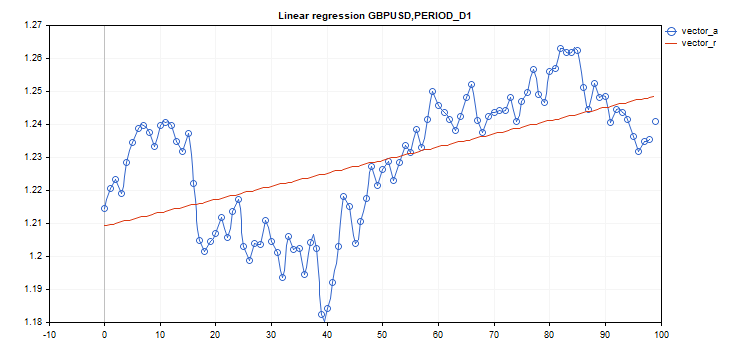

# LinearRegression

Calculate a vector/matrix with calculated linear regression values.

```
vector vector::LinearRegression();
 
matrix matrix::LinearRegression(
  ENUM_MATRIX_AXIS  axis=AXIS_NONE      // axis along which regression is calculated
   );

```

Parameters

axis

[in]  Specifying the axis along which the regression is calculated. [ENUM_MATRIX_AXIS](/en/docs/matrix/matrix_types/matrix_enumerations#enum_matrix_axis) enumeration value (AXIS_HORZ — horizontal axis, AXIS_VERT — vertical axis).

Return Value

Vector or matrix with calculated linear regression values.

Note

Linear regression is calculated using the standard regression equation: y (x) =  a * x + b, where a is the line slope, while b is its Y axis shift.



Example:

```
#include <Graphics\Graphic.mqh>
 
#define GRAPH_WIDTH  750
#define GRAPH_HEIGHT 350
 
//+------------------------------------------------------------------+
//| Script program start function                                    |
//+------------------------------------------------------------------+
void OnStart()
  {
   vector vector_a;
   vector_a.CopyRates(_Symbol,_Period,COPY_RATES_CLOSE,1,100);
   vector vector_r=vector_a.LinearRegression();
 
//--- switch off chart show
   ChartSetInteger(0,CHART_SHOW,false);
 
//--- arrays for drawing a graph
   double x[];
   double y1[];
   double y2[];
   ArrayResize(x,uint(vector_a.Size()));
   ArrayResize(y1,uint(vector_a.Size()));
   ArrayResize(y2,uint(vector_a.Size()));
   for(ulong i=0; i<vector_a.Size(); i++)
     {
      x[i]=(double)i;
      y1[i]=vector_a[i];
      y2[i]=vector_r[i];
     }
 
//--- graph title
   string title="Linear regression "+_Symbol+","+EnumToString(_Period);
 
   long   chart=0;
   string name="LinearRegression";
 
//--- create graph
   CGraphic graphic;
   graphic.Create(chart,name,0,0,0,GRAPH_WIDTH,GRAPH_HEIGHT);
   graphic.BackgroundMain(title);
   graphic.BackgroundMainSize(12);
   
//--- activation function graph
   CCurve *curvef=graphic.CurveAdd(x,y1,CURVE_POINTS_AND_LINES);
   curvef.Name("vector_a");
   curvef.LinesWidth(2);
   curvef.LinesSmooth(true);
   curvef.LinesSmoothTension(1);
   curvef.LinesSmoothStep(10);
 
//--- derivatives of activation function
   CCurve *curved=graphic.CurveAdd(x,y2,CURVE_LINES);
   curved.Name("vector_r");
   curved.LinesWidth(2);
   curved.LinesSmooth(true);
   curved.LinesSmoothTension(1);
   curved.LinesSmoothStep(10);
   graphic.CurvePlotAll();
   graphic.Update();
 
//--- endless loop to recognize pressed keyboard buttons
   while(!IsStopped())
     {
      //--- press escape button to quit program
      if(TerminalInfoInteger(TERMINAL_KEYSTATE_ESCAPE)!=0)
         break;
      //--- press PdDn to save graph picture
      if(TerminalInfoInteger(TERMINAL_KEYSTATE_PAGEDOWN)!=0)
        {
         string file_names[];
         if(FileSelectDialog("Save Picture",NULL,"All files (*.*)|*.*",FSD_WRITE_FILE,file_names,"LinearRegression.png")<1)
            continue;
         ChartScreenShot(0,file_names[0],GRAPH_WIDTH,GRAPH_HEIGHT);
        }
      Sleep(10);
     }
 
//--- clean up
   graphic.Destroy();
   ObjectDelete(chart,name);
   ChartSetInteger(0,CHART_SHOW,true);
  }

```

ENUM_MATRIX_AXIS

Enumeration for specifying the axis in all [statistical functions](/en/docs/matrix/matrix_statistics) for matrices.

| ID | Description |
| --- | --- |
| AXIS_NONE | The axis is not specified. Calculation is performed over all matrix elements, as if it were a vector (see the  Flat  method). |
| AXIS_HORZ | Horizontal axis |
| AXIS_VERT | Vertical axis |
