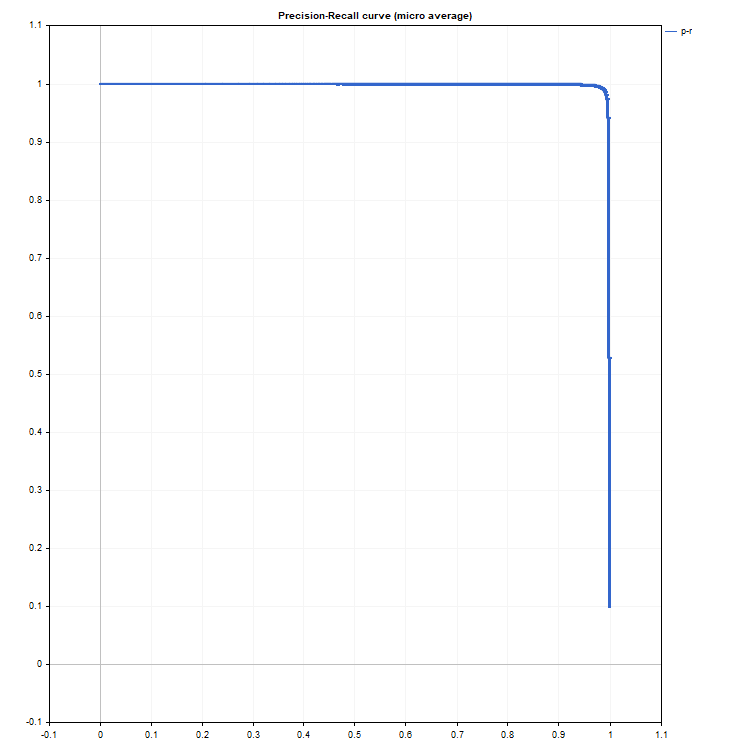
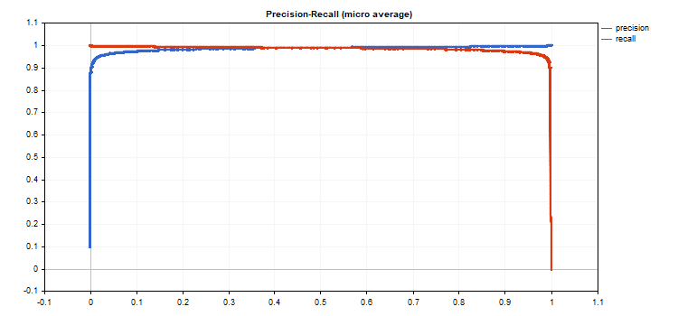

# PrecisionRecall

Compute values to construct a precision-recall curve. Similarly to [ClassificationScore](/en/docs/matrix/matrix_machine_learning/matrix_classificationscore), this method is applied to the vector of true values.

```
bool vector::PrecisionRecall(
   const matrix&                 pred_scores,   // matrix containing the probability distribution for each class
   const ENUM_ENUM_AVERAGE_MODE  mode           // averaging mode
   matrix&                       precision,     // calculated precision values for each threshold value
   matrix&                       recall,        // calculated recall values for each threshold value
   matrix&                       thresholds,    // threshold values sorted in descending order
   );

```

Parameters

pred_scores

[in]  A matrix containing a set of horizontal vectors with probabilities for each class. The number of matrix rows must correspond to the size of the vector of true values.

mode

[in]  Averaging mode from the [ENUM_AVERAGE_MODE](/en/docs/matrix/matrix_types/matrix_enumerations#enum_average_mode) enumeration. Only AVERAGE_NONE, AVERAGE_BINARY and AVERAGE_MICRO are used.

precision

[out]  A matrix with calculated precision curve values. If no averaging is applied (AVERAGE_NONE), the number of rows in the matrix corresponds to the number of model classes. The number of columns corresponds to the size of the vector of true values (or the number of rows in the probability distribution matrix pred_score). In the case of microaveraging, the number of rows in the matrix corresponds to the total number of threshold values, excluding duplicates.

recall

[out]  A matrix with calculated recall curve values.

threshold

[out]  Threshold matrix obtained by sorting the probability matrix

Note

See notes for the [ClassificationScore](/en/docs/matrix/matrix_machine_learning/matrix_classificationscore) method.

Example

An example of collecting statistics from the mnist.onnx model (99% accuracy).

```
//--- data for classification metrics
   vectorf y_true(images);
   vectorf y_pred(images);
   matrixf y_scores(images,10);
//--- input-output
   matrixf image(28,28);
   vectorf result(10);
 
//--- testing
   for(int test=0; test<images; test++)
     {
      image=test_data[test].image;
      if(!OnnxRun(model,ONNX_DEFAULT,image,result))
        {
         Print("OnnxRun error ",GetLastError());
         break;
        }
      result.Activation(result,AF_SOFTMAX);
      //--- collect data
      y_true[test]=(float)test_data[test].label;
      y_pred[test]=(float)result.ArgMax();
      y_scores.Row(result,test);
     }    }

```

[Accuracy calculation](/en/docs/matrix/matrix_machine_learning/matrix_classificationmetric)

```
   vectorf accuracy=y_pred.ClassificationMetric(y_true,CLASSIFICATION_ACCURACY);
   PrintFormat("accuracy=%f",accuracy[0]);
 
accuracy=0.989000

```

An example of plotting precision-recall graphs, where precision values are plotted on the y-axis and recall values are plotted on the x-axis. Also precision and recall graphs are plotted separately, with threshold values plotted on the x-axis

```
   if(y_true.PrecisionRecall(y_scores,AVERAGE_MICRO,mat_precision,mat_recall,mat_thres))
     {
      double precision[],recall[],thres[];
      ArrayResize(precision,mat_thres.Cols());
      ArrayResize(recall,mat_thres.Cols());
      ArrayResize(thres,mat_thres.Cols());
 
      for(uint i=0; i<thres.Size(); i++)
        {
         precision[i]=mat_precision[0][i];
         recall[i]=mat_recall[0][i];
         thres[i]=mat_thres[0][i];
        }
      thres[0]=thres[1]+0.001;
 
      PlotCurve("Precision-Recall curve (micro average)","p-r","",recall,precision);
      Plot2Curves("Precision-Recall (micro average)","precision","recall",thres,precision,recall);
     }

```

Resulting curves:




