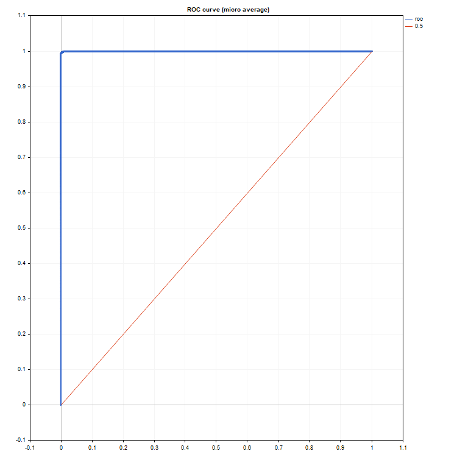
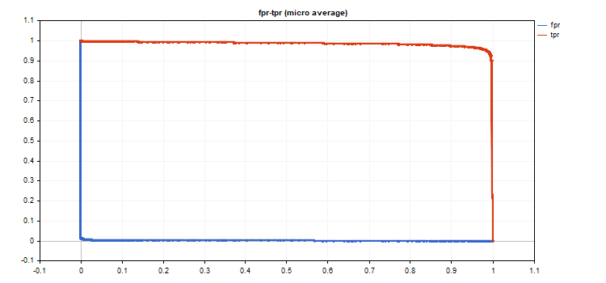

# ReceiverOperatingCharacteristic

Compute values to construct the Receiver Operating Characteristic (ROC) curve. Similarly to [ClassificationScore](/en/docs/matrix/matrix_machine_learning/matrix_classificationscore), this method is applied to the vector of true values.

```
bool vector::ReceiverOperatingCharacteristic(
   const matrix&                 pred_scores,   // matrix containing the probability distribution for each class
   const ENUM_ENUM_AVERAGE_MODE  mode           // averaging mode
   matrix&                       fpr,           // calculated false positive rate values for each threshold value
   matrix&                       tpr,           // calculated true positive rate values for each threshold value
   matrix&                       thresholds,    // threshold values sorted in descending order
   );

```

Parameters

pred_scores

[in]  A matrix containing a set of horizontal vectors with probabilities for each class. The number of matrix rows must correspond to the size of the vector of true values.

mode

[in]  Averaging mode from the [ENUM_AVERAGE_MODE](/en/docs/matrix/matrix_types/matrix_enumerations#enum_average_mode) enumeration. Only AVERAGE_NONE, AVERAGE_BINARY and AVERAGE_MICRO are used.

fpr

[out]  A matrix with calculated values of the false positive rate curve. If no averaging is applied (AVERAGE_NONE), the number of rows in the matrix corresponds to the number of model classes. The number of columns corresponds to the size of the vector of true values (or the number of rows in the probability distribution matrix pred_score). In the case of microaveraging, the number of rows in the matrix corresponds to the total number of threshold values, excluding duplicates.

tpr

[out]  A matrix with calculated values of the true positive rate curve.

threshold

[out]  Threshold matrix obtained by sorting the probability matrix

Note

See notes for the [ClassificationScore](/en/docs/matrix/matrix_machine_learning/matrix_classificationscore) method.

Example

An example of plotting ROC graphs, where tpr values are plotted on the y-axis and fpr values are plotted on the x-axis. Also fpr and tpr graphs are plotted separately, with threshold values plotted on the x-axis

```
   matrixf mat_thres;
   matrixf mat_fpr;
   matrixf mat_tpr;
 
   if(y_true.ReceiverOperatingCharacteristic(y_scores,AVERAGE_MICRO,mat_fpr,mat_tpr,mat_thres))
     {
      double fpr[],tpr[],thres[];
      ArrayResize(fpr,mat_thres.Cols());
      ArrayResize(tpr,mat_thres.Cols());
      ArrayResize(thres,mat_thres.Cols());
 
      for(uint i=0; i<fpr.Size(); i++)
        {
         fpr[i]=mat_fpr[0][i];
         tpr[i]=mat_tpr[0][i];
         thres[i]=mat_thres[0][i];
        }
      thres[0]=thres[1]+0.001;
 
      PlotCurve("ROC curve (micro average)","roc","0.5",fpr,tpr);
      Plot2Curves("fpr-tpr (micro average)","fpr","tpr",thres,fpr,tpr);
     }
    

```

Resulting curves:





The graph output code is simple and based on the <Graphics/Graphic.mqh> standard library.

The examples use the data of the mnist.onnx model. The code is presented in the [PrecisionRecall](/en/docs/matrix/matrix_machine_learning/matrix_precisionrecall) method description.

ROC AUC is close to ideal.

```
roc auc score micro = [0.99991]

```
