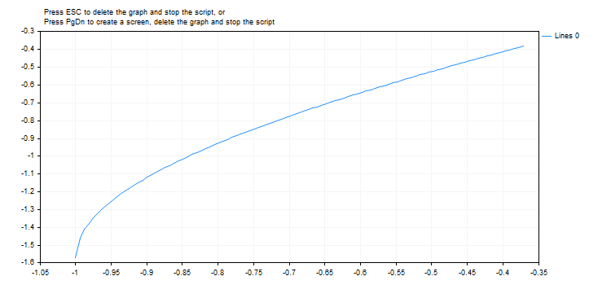

# MathArcsin

The function returns the arc sine of x within the range of -π/2 to π/2 radians.

```
double  MathArcsin(
   double  val      // -1<value<1
   );

```

Parameters

val

[in]   The val value between -1 and 1, the arc sine of which is to be calculated.

Return Value

Arc sine of the val number in radians within the range of -π/2 to π/2 radians. If val is less than -1 or more than 1, the function returns NaN (indeterminate value).

Note

Instead of the MathArcsin() function you can use asin().

Example:

```
#define GRAPH_WIDTH  750
#define GRAPH_HEIGHT 350
 
#include <Graphics\Graphic.mqh>
 
CGraphic ExtGraph;
//+------------------------------------------------------------------+
//| Script program start function                                    |
//+------------------------------------------------------------------+
void OnStart()
  {
   vector delta=vector::Full(101,2*M_PI/1000);
   delta[0]=-1;
//--- get 101 values from -1 to 2 pi with delta step
   vector X=delta.CumSum();
//--- calculate the sine value for each value of the X vector
   vector Y=MathArcsin(X);
 
//--- transfer the calculated values from vectors to arrays
   double x_array[],y_array[];
   X.Swap(x_array);
   Y.Swap(y_array);
 
//--- draw a graph of the calculated vector values
   CurvePlot(x_array,y_array,clrDodgerBlue);
 
//--- wait for pressing the Escape or PgDn keys to delete the graph (take a screenshot) and exit
   while(!IsStopped())
     {
      if(StopKeyPressed())
         break;
      Sleep(16);
     }
 
//--- clean up
   ExtGraph.Destroy();
  }
//+------------------------------------------------------------------+
//| When pressing ESC, return 'true'                                 |
//| When pressing PgDn, take a graph screenshot and return 'true'    |
//| Otherwise, return 'false'                                        |
//+------------------------------------------------------------------+
bool StopKeyPressed()
  {
//--- if ESC is pressed, return 'true'
   if(TerminalInfoInteger(TERMINAL_KEYSTATE_ESCAPE)!=0)
      return(true);
//--- if PgDn is pressed and a graph screenshot is successfully taken, return 'true'
   if(TerminalInfoInteger(TERMINAL_KEYSTATE_PAGEDOWN)!=0 && MakeAndSaveScreenshot(MQLInfoString(MQL_PROGRAM_NAME)+"_Screenshot"))
      return(true);
//--- return 'false' 
   return(false);
  }
//+------------------------------------------------------------------+
//| Create a graph object and draw a curve                           |
//+------------------------------------------------------------------+
void CurvePlot(double &x_array[], double &y_array[], const color colour)
  {
   ExtGraph.Create(ChartID(), "Graphic", 0, 0, 0, GRAPH_WIDTH, GRAPH_HEIGHT);
   ExtGraph.CurveAdd(x_array, y_array, ColorToARGB(colour), CURVE_LINES);
   ExtGraph.IndentUp(30);
   ExtGraph.CurvePlotAll();
   string text1="Press ESC to delete the graph and stop the script, or";
   string text2="Press PgDn to create a screen, delete the graph and stop the script";
   ExtGraph.TextAdd(54, 9, text1, ColorToARGB(clrBlack));
   ExtGraph.TextAdd(54,21, text2, ColorToARGB(clrBlack));
   ExtGraph.Update();
  }
//+------------------------------------------------------------------+
//| Take a screenshot and save the image to a file                   |
//+------------------------------------------------------------------+
bool MakeAndSaveScreenshot(const string file_name)
  {
   string file_names[];
   ResetLastError();
   int selected=FileSelectDialog("Save Picture", NULL, "All files (*.*)|*.*", FSD_WRITE_FILE, file_names, file_name+".png");
   if(selected<1)
     {
      if(selected<0)
         PrintFormat("%s: FileSelectDialog() function returned error %d", __FUNCTION__, GetLastError());
      return false;
     }
   
   bool res=false;
   if(ChartSetInteger(0,CHART_SHOW,false))
      res=ChartScreenShot(0, file_names[0], GRAPH_WIDTH, GRAPH_HEIGHT);
   ChartSetInteger(0,CHART_SHOW,true);
   return(res);
  }

```

Result:



See also

[Real types (double, float)](/en/docs/basis/types/double), [Statistics](/en/docs/standardlibrary/mathematics/stat), [Scientific Charts](/en/docs/standardlibrary/graphics), [Client Terminal Properties](/en/docs/constants/environment_state/terminalstatus)
